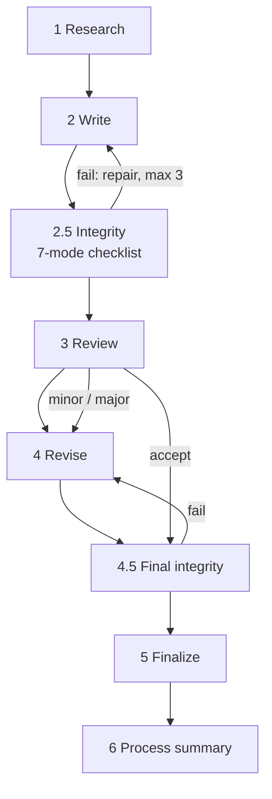

# Imbad0202/academic-research-skills：把人在环的学术写作、审稿与完整性闸产品化

| 字段 | 值 |
|---|---|
| GitHub | https://github.com/Imbad0202/academic-research-skills |
| License | CC BY-NC 4.0；不可将其 prompt/文案复制进商业 RH |
| Stars | 48,310（2026-09-16 快照） |
| GitHub 最后 push / 本地 HEAD | 2026-09-16 · `3c546bc` |
| 当前版本 | v3.22.0 |
| 产品类型 | **行文 / 审稿 / 人在环论文流程**；不是实验执行系统 |
| 分析证据 | README、`.claude/CLAUDE.md`、`docs/ARCHITECTURE.md`、`academic-pipeline/SKILL.md`、LICENSE、CHANGELOG 近期提交 |

## 1. 它到底是什么

ARS 是 Claude Code 插件形式的学术工作流套件：`deep-research`、`academic-paper`、`academic-paper-reviewer` 与 `academic-pipeline` 四个入口覆盖调研、写作、审稿、返修和终稿。它的鲜明立场不是“全自动替研究者做论文”，而是将人确认、完整性检查、审稿/再审和过程记录变成产品的一等路径。

它不是 RH 的替代品：ARS 以 prompt、Skill 与校验脚本为主；RH 以持久科研状态、MCP Tool 合同和证据 artifact 为主。但在**用户入口、流程可见性、写稿质量门和分发**上，ARS 是最强对照。

## 2. 运行时堆叠

- Agent loop：Claude Code 宿主；ARS 不自建模型循环或服务端。
- 能力载体：Skill、slash command、角色化 agent markdown、hook 和 Python 校验脚本。
- 状态：`Material Passport` 和 pipeline state/hand-off 物；可选把 FULL checkpoint 写成跨会话 reset boundary。
- 文献：Semantic Scholar 等 API 验证与用户 corpus 输入；不维护 RH 式 topic SQLite。
- 闸：用户 checkpoint、Stage 2.5 / 4.5 integrity、formatter refusal、可选 claim-faithfulness audit、CI contract/lint。

> 📘术语
> **Material Passport**：跨阶段携带的结构化材料护照。它保存语料、引用验证、风险和决策信息，使下一阶段不必只依赖聊天上下文。

## 3. 阶段机或 DAG

真实 ARS 还包括 3′ re-review、4′ re-revise 与两类 checkpoint：决策型 checkpoint 让用户选分支；完整性 checkpoint 先出机器报告、再由用户确认。

## 4. Tool / Skill / Agent 怎么切

- **Skill**：主产品单位。`academic-pipeline` 自己不完成实质工作，负责判阶段、派发 Skill、维护转换。
- **Agent**：每个 Skill 下的角色化 prompt，例如 `integrity_verification_agent`、审稿人、Devil’s Advocate。
- **Tool**：使用宿主工具/API，但没有 RH 公开 MCP Tool server。
- **合同元数据**：`data_access_level`、`task_type`、`depends_on`、mode、schema/lint 都写进分发物。

这个切法说明：ARS 很擅长“让 prompt workflow 看起来和维护起来像产品”，但不会替 RH 的 Tool/DB/服务信任边界。

## 5. 文献怎么来、是否入库、引用约束

- Deep research 使用多角色检索，且有 Semantic Scholar Tier-0 验证。
- 可从 `literature_corpus[]` 做 corpus-first，再用外部搜索补缺；有 rejection log 和 provenance 规则。
- v3.8 可开 `ARS_CLAIM_AUDIT=1`：将 citation anchor 与所属论断配对审查；高风险警告可令 formatter 拒绝输出。
- 没有 RH `paper_ingest`、topic pool 和跨 topic artifact 关系。

## 6. 实验 / 代码执行

**不跑实验。** 它允许 `experiment_provenance[]` 记录外部实验，并在 integrity 阶段检查“声明的实验与文本是否对齐”；不应把此记录能力误读为执行或验证实验真实性。

## 7. 写稿怎么做

这是 ARS 的主场：研究计划、outline、argument map、draft、bilingual abstract、格式化、引用合规、style calibration、对抗审稿、返修辅导和 process summary。它还在 reviewer 中采用 blind pre-commit / paper-visible 两阶段的结构，以降低“先看文章再倒推评价标准”的风险。

没有 RH EAG 的高质量范文形式迁移和 n-gram 重叠控制；它的优势是 workflow contract 与 human checkpoint。

## 8. 图怎么做

`visualization_agent` 产出/处理图，并有 VLM figure verification；它不等于 PaperBanana 的生成架构，也没有 RH 的实验定量 figure suite。其价值是图文/图表 fidelity 检查。

## 9. 和 RH 的相似点

- 都把人确认、审计、阶段转移和中间物当作正式流程。
- 都关心幻觉引用、伪造实验与过度自动化。
- 都依附 Claude Code，而不是重新制造聊天 UI。
- 都有写稿前后的检查与审稿循环。

## 10. 和 RH 的不同点

- RH 有 54 个公开 MCP Tool、SQLite topic/paper/claim/artifact 与 provenance；ARS 的状态主要是 passport/文件合同。
- RH 可以运行正式 experiment，Arena 只在明确 arena path 中替换 experiment；ARS 永远外置实验。
- RH 的出图按四条受控轨道分流；ARS 是写作流程中附属的图验证。
- ARS 的 CC BY-NC 限制复制方式；可以借鉴产品结构，不能复制 prompt 或措辞。

## 11. 优点 / 缺点

**优点**

- 30 秒插件安装、四个容易记忆的任务入口和多语言 README，产品首屏远优于 RH 当前平台化入口。
- `docs/ARCHITECTURE.md` 将流程、数据级别、skill 依赖、质量闸与模式汇成一张可读矩阵。
- 近期持续发版，并把 schema/manifest/skill inventory 漂移写进 CI。
- 具体标明完整性检查的覆盖边界，避免把“抽样检查”说成全部事实验证。

**缺点**

- 没有自己的实验/数据库/runtime，完整论文链依赖宿主和外部工具。
- Skill 数量、模式和长 prompt 同样可能增加选择成本。
- 商业复用受 CC BY-NC 限制。

## 12. RH 可学的 1–3 条

1. **给 RH 每个公开 Skill 统一补 frontmatter 合同**：输入、输出 artifact、data access、gate、依赖 Tool、耗时/费用量级；保持内容原创。
2. **做四任务公共入口**：research、paper、review、library/verification；它们只路由现有 Skill/Tool，不创建第二编排器。
3. **把“机器报告之后仍需要人确认”的 UX 固化**，尤其在 study spec 冻结、正式实验解释和终稿 commit 前。

## 13. 名字速查表

| 名字 | 先决概念 | 含义 |
|---|---|---|
| `academic-pipeline` | Skill | 只做检测阶段/派发/状态跟踪的顶层流程 Skill |
| `Material Passport` | artifact | 跨阶段材料、验证和决策的护照 |
| Stage 2.5 / 4.5 | integrity gate | 写作后、最终化前的完整性检查点 |
| `data_access_level` | contract metadata | Skill 接触数据敏感度的声明 |
| `claim_ref_alignment_audit_agent` | citation anchor | 审查一个引用是否支撑其挂接论断的角色 |
| formatter REFUSE | terminal policy | 阻断不满足特定完整性条件的输出规则 |
| `ARS_PASSPORT_RESET` | checkpoint | 允许 FULL checkpoint 成为跨会话恢复边界的可选开关 |

---

> 📌事实边界
> ARS 本身也明确区分设计动机、工具机制与已测有效性。本页同样不把其 gate 存在等同为已证明能提升论文质量。