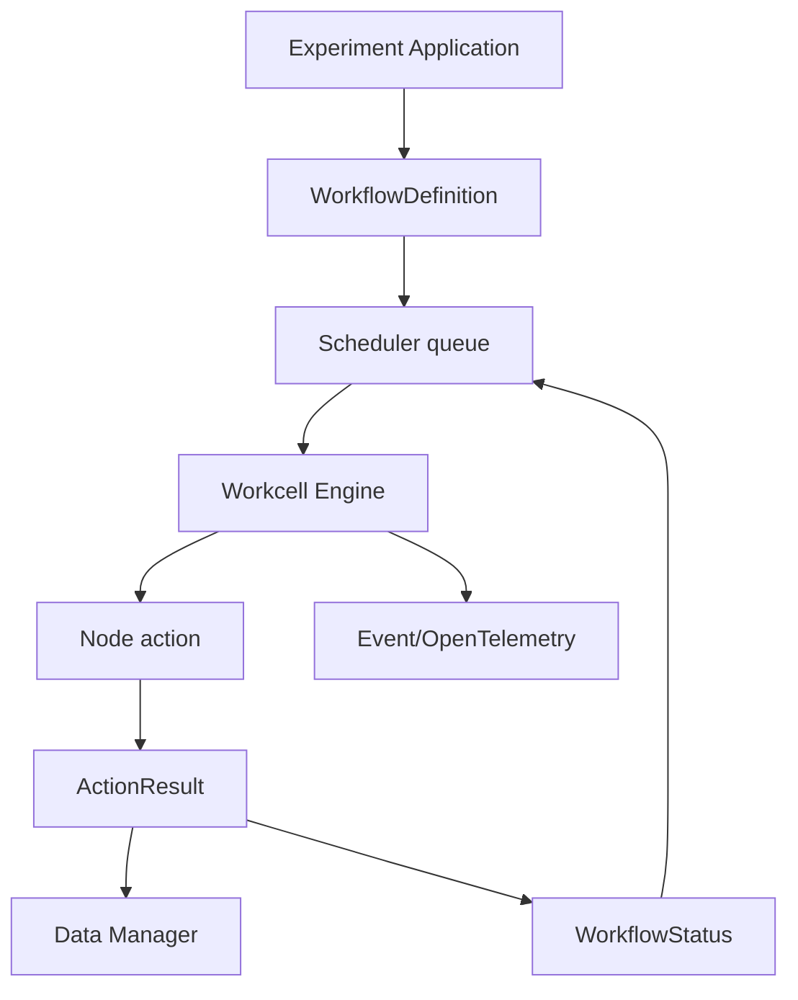

# MADSci：模块化自驱实验室的节点、工作流与实验管理底座

| 字段 | 值 |
|---|---|
| GitHub | https://github.com/AD-SDL/MADSci |
| License | 根 `LICENSE` 为 MIT；GitHub API 仍为 NOASSERTION |
| Stars | 84（2026-09-17 冻结快照） |
| 最后 push | 2026-09-16 |
| 分析提交 | `6b1ab6a70ce8b15af7aa8968479c90d9138753d0` |
| 快照日期 | 2026-09-17 |
| 产品类型 | 自驱实验室编排 |
| 分析证据 | `README.md`、`LICENSE`、`pyproject.toml`、`docs/guides/workflow_development.md`、`docs/guides/agent_skills.md`、`src/madsci_common/madsci/common/types/workflow_types.py`、`src/madsci_workcell_manager/madsci/workcell_manager/workcell_engine.py`、`src/madsci_experiment_application/madsci/experiment_application/experiment_application.py` |

本文用 📘 标注文档或源码中可直接定位的事实，🔶 标注由控制流推导的边界，💬 标注评价与借鉴建议。仓库动态元数据沿用候选清单，源码判断只绑定页面中的固定提交。

## 1. 它到底是什么

MADSci 是实验室自动化基础设施，不是单一 LLM Agent。README 拆出 Node 标准、Workflow、Experiment、Resource、Data、Event、Location 和 Observability，目标是连接仪器、机器人、资源和闭环实验。是否使用 LLM 进行决策不是其核心前提。

## 2. 运行时堆叠

多包 Python 项目支持 individual packages、Docker 和 local mode。Workcell Engine 从 state handler 读取队列和 scheduler，周期更新 nodes 并运行 steps；Workflow/WorkflowDefinition 使用 Pydantic 管理参数、steps、status、datapoint IDs、ownership 和时间戳。

## 3. 阶段机或 DAG

WorkflowDefinition→queue/scheduler→Engine→node action→ActionResult→DataPoint/WorkflowStatus；ExperimentApplication 负责启动、条件、pause/cancel/fail/end。

## 4. Tool / Skill / Agent 怎么切

组件包括 Node、Workcell、Experiment、Resource、Data、Event、Location 和 Squid。WorkflowDefinition 校验参数与 step key；Engine 管理 node lock、action request、重试、未知状态、文件/JSON 上传和 feed-forward。agent_skills.md 是给编码 Agent 的架构技能，并非科研运行时 MCP。

## 5. 文献怎么来、是否入库、引用约束

核心没有文献检索或引用库；Event/DataPoint/ownership 是运行 provenance，不自动形成 claim citation。

## 6. 实验 / 代码执行

代码提供 REST node action、workcell action、状态轮询、文件和 JSON datapoint、失败/暂停/取消路径。`monitor_action_progress` 按逐步增加且封顶的间隔查询 action；超出状态查询重试次数后转为 UNKNOWN。`finalize_step` 只在 SUCCEEDED 时推进，FAILED/CANCELLED/UNKNOWN 各有显式处理，这比只检查模型是否说完成更接近设备运行的真实需求。

`handle_data_and_files` 将返回的 JSON 和文件提交给 Data Manager，把工作流中原始数据替换为 datapoint ID；feed-forward 再根据步骤和标签取得数据，存在多条候选且未指定 label 时会拒绝歧义。这是可直接核对的产物交接机制。local mode 使用内存后端，数据 ephemeral；本次未连接具体仪器或闭环，也未验证进程中断、网络分区和设备故障后的恢复语义。

旧 ExperimentApplication 文件虽仍存在，但明确标记 deprecated，推荐按 Script、Notebook、TUI、Node 四种入口迁移。它的 manage_experiment 在异常时记录失败并重新抛出，正常退出时结束实验；这只能证明软件生命周期处理，不能证明物理设备上的操作已经安全回滚。

## 7. 写稿怎么做

不负责论文写作和图生产；事件与数据点可供下游报告消费。

## 8. 图怎么做

可观测性和 DataPoint 可支持下游时间线/结果图，但没有独立 figure suite。

## 9. 和 RH 的相似点

都关注跨步骤状态、工具执行、恢复和记录；MADSci 的 workflow、datapoint、event 和 ownership 可作为科研执行底座。

## 10. 和 RH 的不同点

MADSci 更靠近实验室基础设施，决策由 workflow/scheduler/node 代码驱动，LLM 不是必需；RH 还包含文献、证据和写作门。它记录 ownership 信息并不自动等于完整身份认证：README 把 Auth Manager 放在 roadmap 中，因此不能凭 ownership 字段宣称已经具备生产级多租户权限体系。设备接入、网络访问控制、操作授权与科学研究证据应分成不同验收层。

## 11. 优点 / 缺点

优点：模块和状态边界清楚，锁/重试/数据上传具体，支持 local/Docker。缺点：部署复杂，项目 beta，local 数据易失，旧 ExperimentApplication 已标记 deprecated。

## 12. RH 可学的 1–3 条

1. 将 Workflow step、ActionResult、DataPoint 和事件关联为研究 artifact。2. 借鉴资源锁和显式状态机。3. 将 pause/cancel/failure 纳入研究 gate。

## 13. 名字速查表

| 名字 | 先决概念 | 含义 |
|---|---|---|
| `Node` | instrument API | 仪器或模块接口 |
| `WorkflowDefinition` | steps | 工作流模板 |
| `Workflow` | runtime state | 一次运行实例 |
| `Engine` | scheduler | 调度并执行 step |
| `DataPoint` | result storage | JSON/文件结果 |
| `feed-forward` | dependency | 前步数据驱动后续参数 |

---

> 📌事实边界
> 本报告依据固定提交中的公开文档与实际查看的代码作静态分析。没有安装或执行被分析仓库，没有连接仪器、GPU 集群或收费模型 API。README/论文的能力和结果声明不等于本次复现；外部数据、模型权重、设备校准、部署稳定性以及科学结论的有效性均需另行验证。
