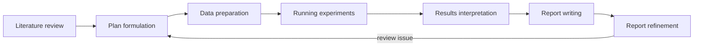

# SamuelSchmidgall/AgentLaboratory：角色化的文献—实验—LaTeX 三相工作流

| 字段 | 值 |
|---|---|
| GitHub | https://github.com/SamuelSchmidgall/AgentLaboratory |
| License | MIT |
| Stars | 约 5.8k（2026-09-16 快照） |
| GitHub 最后 push / 本地 HEAD | 2025-08-20 · `d9017d9` |
| 产品类型 | 端到端科研助理；论文流程有、证据闸弱 |
| 分析证据 | README、`ai_lab_repo.py`、`agents.py`、`tools.py`、`mlesolver.py`、`papersolver.py`、LICENSE |

## 1. 它到底是什么

AgentLaboratory 用 PhD student、postdoc、professor、ML engineer、software engineer 与 reviewers 等模拟角色，走文献综述、计划、数据准备、实验、结果解释、LaTeX 写作和返修。它是“把一个实验室的典型分工写成 agent role”这一类产品的代表。

## 2. 运行时堆叠

- `LaboratoryWorkflow.perform_research` 持有主循环。
- 全 workflow 用 `state_saves/Paper{i}.pkl` pickle 保存以便中断后恢复。
- `human_in_loop_flag` 决定每个 subtask 是否停给用户。
- `MLESolver` 负责实验代码/指标迭代，`PaperSolver` 负责 LaTeX/文字编辑。
- 状态是整对象 pickle，不是关系型研究数据库；这易上手，但版本迁移、查询与多用户隔离较弱。

> 📘术语
> **pickle checkpoint**：Python 将整个对象序列化到文件的恢复方式。优点是实现快；缺点是文件格式与代码版本强绑定，也不适合细粒度数据库查询。

## 3. 阶段机或 DAG

`LaboratoryWorkflow.phases` 明确列出四大段、七个 subtask。它比 README 上的“多 Agent 科研”更可执行，但没有 RH 的跨阶段 artifact/gate contract。

## 4. Tool / Skill / Agent 怎么切

- **Agent**：`PhDStudentAgent`、`PostdocAgent`、`ProfessorAgent`、`MLEngineerAgent`、`SWEngineerAgent`、`ReviewersAgent`。
- **Tools**：`ArxivSearch`、`SemanticScholarSearch`、`HFDataSearch`、`execute_code`。
- **Solver**：`MLESolver` / `PaperSolver` 在角色以外给代码、论文编辑一个搜索式动作层。
- **Skill/MCP**：无正式分发 Skill 或 MCP Tool 合同。

## 5. 文献怎么来、是否入库、引用约束

可在 arXiv 搜摘要、下载全文 PDF，亦可使用 AgentRxiv。文献并不进入类似 RH topic paper pool 的持久证据库；引用多在 `PaperSolver` 写稿时插入，缺 claim-level source relation。

## 6. 实验 / 代码执行

**真跑**本地 Python，`execute_code` 典型 timeout 是 600 秒。它没有默认容器隔离；若代码由 agent 产生，安全和依赖污染风险高于 RH 应有的受控 experiment workspace。

## 7. 写稿怎么做

`PaperSolver` 以 Replace/Edit/Arxiv 等命令编辑 LaTex，可选 `--compile-latex`。reviewer 推断和 `review_override` 可驱动返修。没有 EAG、重叠审查或 venue profile。

## 8. 图怎么做

主要来自实验/报告代码；有图相关清理/重绘线索，但不存在独立的科学插图/figure suite 生产合同。

## 9. 和 RH 的相似点

- 具有文献→计划→实验→报告的完整可理解顺序。
- 人可以在 subtask 介入。
- 实验与论文编辑由不同组件负责。
- 支持从 checkpoint 恢复。

## 10. 和 RH 的不同点

- agent role 和 pickle 是中心；RH 的中心是 Tool 合同、SQLite/artifact、gate 和 provenance。
- AgentLaboratory 没有强制证据链、图表 fidelity 和服务信任边界。
- RH 的 host/runtime 分离更适合不断升级 Claude Code/Codex；此仓绑定自己的 Python multi-agent 结构。

## 11. 优点 / 缺点

**优点**

- 阶段与职责对新用户非常直观。
- `human_in_loop_flag` 能在细粒度任务插入人审。
- MIT、可 LaTeX 编译、可以从 pickle resume。

**缺点**

- 2025-08 后未见活跃维护。
- `execute_code` 缺默认容器隔离。
- `review_override` 等控制更像 prompt/run 参数，不是证据推导出的 gate。
- 单文件/整对象状态难以支持可查询、多租户的科研记录。

## 12. RH 可学的 1–3 条

1. **在 RH checkpoint UI 展示比“大阶段”更细的用户决策卡**：literature、plan、data readiness、run, interpretation、write；背后仍映射同一六阶段。
2. **为微小 LaTeX 修改提供 `replace/edit/compile` 闭环**，作为 revision 的工具层，不代替 EAG/审稿闸。
3. **不引入 pickle 全状态模型或 AgentRxiv 社交库**；RH 应继续以 artifact/provenance 为权威状态。

## 13. 名字速查表

| 名字 | 先决概念 | 含义 |
|---|---|---|
| `LaboratoryWorkflow` | phase | 管理全流程和子任务的主对象 |
| `human_in_loop_flag` | checkpoint | 是否在对应子任务等待用户的配置 |
| `MLESolver` | experiment | 搜索式修改/运行 ML 代码的模块 |
| `PaperSolver` | LaTeX | 修改论文内容并可触发编译的模块 |
| `execute_code` | execution | 在本地进程执行候选代码的工具 |
| `state_saves/Paper{i}.pkl` | pickle | 恢复完整 workflow 对象的 checkpoint 文件 |
| AgentRxiv | shared papers | Agent 间上传/搜索论文的附属机制 |

---

> 📌事实边界
> 本页不因“有 reviewer agent”就认为该系统的论文审稿具有独立有效性。