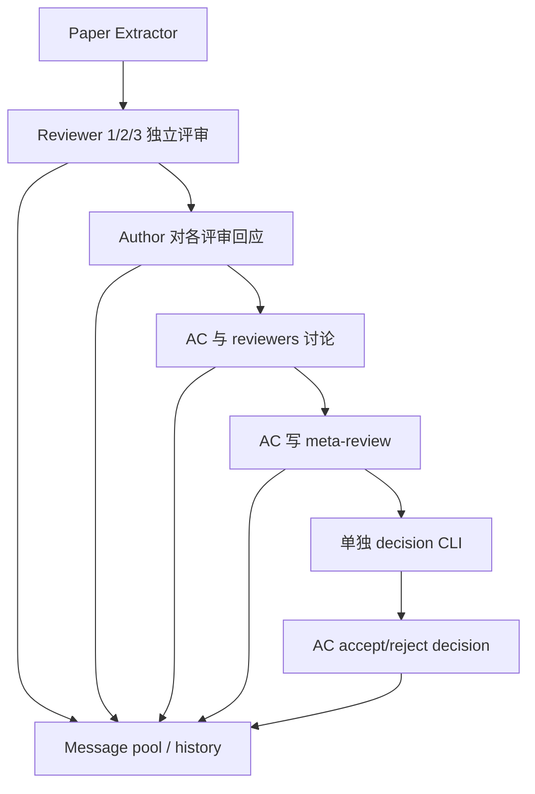

# Ahren09/AgentReview：用角色与可见消息模拟同行评审机制

| 字段 | 值 |
|---|---|
| GitHub | https://github.com/Ahren09/AgentReview |
| License | Apache-2.0，LICENSE 保留 ChatArena 版权说明 |
| Stars | 413（2026-09-17 快照） |
| GitHub 最后 push | 2026-05-10 |
| 分析 commit | `9ce5ec762eaba2d1cdff2f965ce11430b5be9361` |
| 产品类型 | 多 Agent 同行评审机制模拟与实验框架 |
| 分析方式 | 固定提交公开 README、环境、编排与消息源码静态阅读 |

本文用 📘 标注文档或源码中可直接定位的事实，🔶 标注由控制流推导的边界，💬 标注评价与借鉴建议。仓库动态元数据沿用候选清单，源码判断只绑定页面中的固定提交。

## 1. 它到底是什么

AgentReview 将审稿人、作者和领域主席建模为可配置的语言模型角色，用程序安排独立评审、作者回应、审稿讨论、meta-review 和最终决策。其研究对象首先是评审过程中的互动和偏差，而不是一个经过认证的自动审稿服务。README 把它与 EMNLP 2024 论文相连，并报告了生成文档数量、不同角色设定的决策变化等研究结果；本次没有重新运行这些实验。

它的价值在于能固定某些条件、改变另一些角色属性，观察模拟结果。比如 reviewer 的 commitment、intention 和 knowledgeability，作者是否匿名，以及 AC 的决策风格，都通过配置与角色描述改变。这是对一个合成社会过程的实验操控，并不意味着模型角色就等同于真实专家，其偏差大小也不能直接作为真实会议的因果估计。

## 2. 运行时堆叠

工程继承 ChatArena 的多角色对话结构。`PaperReviewArena` 从配置创建 Paper Extractor、Reviewer、Area Chair 或通用 Player，载入环境后按 speaking order 调用角色。`PaperReview` 环境保存 phase_index、当前论文 ID、实验设置、message_pool 和下一位发言者状态。

状态主要在消息池和环境对象中更新，`save_history` 可以导出 CSV 或 JSON，保留 agent_name、content、turn、timestamp、visible_to 和 msg_type，以及实验设置。README 给出 Python 3.10+、OpenAI/Azure OpenAI 和 Gradio 演示入口；固定依赖还包括 OpenReview、LlamaIndex、transformers、pandas 等。这里的 Arena 是该项目的对话框架对象，不是通用论文生产平台。

## 3. 阶段机或 DAG

README 描述五个评审阶段；源码额外把 paper extraction 编为 phase 0。`PaperReview.phases` 以角色名列表规定发言顺序，在 phase 4 完成 meta-review 后结束当前 review simulation，并提示运行 `run_paper_decision_cli.py` 进入 phase 5。因此公开流程不是所有阶段都由一次函数调用自动连续完成。最终决定还受到实验设定中的接收率等约束，需要与角色意见一起解释。

## 4. Tool / Skill / Agent 怎么切

**Agent** 是主要抽象：Reviewer、Author、Area Chair 以及负责抽取论文内容的角色。不同 role description 承载行为条件，`experiment_config.py` 注册 baseline 和多种干预设置。**Environment** 规定哪些角色何时行动、看见哪些消息、何时终止；**Arena** 负责将模型输出交给环境，并在无效动作过多时抛出 `TooManyInvalidActions`。

工具层并不是本项目的中心。它有论文处理、OpenReview 下载和模型 backend，但所读主链没有让 reviewer 自主执行实验代码或对外部事实进行强制核验的工具协议。没有发现对外分发的 Skill 或 MCP 合同。与工具型研究 agent 相比，它更强调角色提示与对话拓扑。

## 5. 文献怎么来、是否入库、引用约束

README 说明输入论文和真实评审来自 ICLR/OpenReview，并把数据 ZIP 放在外部下载位置；仓库有 OpenReview 下载和 submission processing 代码。`PaperProcessor` 将已获得的论文资料整理成角色可读取内容，评审环境再将论文和讨论放入消息池。

这不是通用文献搜索或证据入库流程。输入论文构成固定实验材料，生成 reviewer 不会因为说出了引用或技术判断就自动拥有来源证据。消息可见性控制能模拟独立评审和讨论，但不能保证评审事实正确、引文真实、或实验结论经过复算。使用者应把生成评论当作模拟输出，而不是可直接采信的专家意见。

## 6. 实验 / 代码执行

实验执行指的是多轮 API 调用、角色交互和结果统计。`PaperReviewArena.step` 获取下一位角色及其 observation，调用模型，然后检查动作是否有效；失败会重试，超过次数终止。源码也支持读取 baseline 缓存以复用部分讨论历史，从而改变后续角色条件。

README 报告覆盖 ICLR 2020–2023、523 篇抽样论文和数万份生成文档，并给出不同偏差条件下的变化。它们属于作者实验报告。本次没有下载外部完整数据、调用模型、重跑任何设定或核查统计推断。尤其是固定接收率与 prompt 施加的角色特征，会直接影响模拟结果，不能将输出差异简单写成现实评审者的心理规律。

## 7. 写稿怎么做

项目生成的文本是 review、rebuttal、reviewer–AC discussion、meta-review 和 decision。作者 agent 的回应属于模拟评审过程的一部分，并不是对原论文进行真实修订；没有看到将回应自动转换为 LaTeX 补丁、补实验或编译返稿的链路。

这一区别对工作流接入很重要：一段有说服力的 rebuttal 不代表作者已经完成相应修改。若把 AgentReview 用作写作前的演练，应保留“模拟意见”标签，将每项可操作建议转为独立任务，再由真实文档 diff 和实验记录确认落实。讨论达成共识也不能替代科学证据。

## 8. 图怎么做

仓库有 overview、review pipeline、评级分布、偏差条件评分等静态图片，以及 `review_content_analysis` 目录。README 用这些图展示作者研究的模拟行为；本次读取的是图路径与文档描述，没有复算绘图输入或确认所有图片能由固定提交一键再生。

适合从此框架导出的图是阶段间评分变化、角色设定的条件比较与消息可见性示意。它们描述评审模拟的行为，不应解释成论文真实质量提升或期刊接收概率。新实验图仍需保存抽样、模型、prompt、随机性、缓存复用和接收率配置。

## 9. 和 RH 的相似点

两者都可以将 reviewer、author response 和汇总意见作为结构化研究产物，并保留过程日志。AgentReview 的可见消息设计对 RH 的独立审查有参考意义：先产生独立意见，再允许交叉讨论，能明确区分独立证据与共识阶段的信息。

它也把阶段顺序写在程序里，而不是只在 prompt 中描述。角色输入、turn 与实验设置随 history 一起保存，使复核者能够理解某个决定是在什么信息条件下产生的。对研究平台而言，这比只保存最终一条“接受/拒绝”更可解释。

## 10. 和 RH 的不同点

AgentReview 的目标是评审机制模拟，RH 的比较范围包括研究证据、实验、写作和发布质量控制。前者的 reviewer role 是可操控实验变量，后者的质量闸需要可验证来源和产物。角色人数更多、讨论轮次更长，不必然提高事实正确性。

其状态核心是 message pool、phase_index 和实验 setting，而非 claim/evidence、artifact lineage 与跨阶段 gate。固定接收率适合特定模拟设计，却不适合作为真实稿件质量闸。可以借用独立意见与讨论的结构，但需要保留模拟与真实验证之间的边界。

## 11. 优点 / 缺点

**优点**：角色、阶段和 speaking order 很直观；可配置 traits 适合做受控实验；消息可见性与完整 history 有助于分析社会影响；baseline 缓存和 CLI 让重复实验有明确路径；许可证和基础框架来源清楚。

**局限**：真实审稿专业性与模型角色提示之间存在构念差距；缺少强制外部核实与实验复算；最终决策受人为接收率和 prompt 条件影响；外部数据包的当前可用性未验证；README 的百分比和生成数量没有在本次复核。对话一致不等于科学正确，也不能以模拟 reviewer 替代真实编辑决策。

## 12. RH 可学的 1–3 条

1. **独立审查与讨论分两阶段**，记录每个 reviewer 当时可见的信息，避免共识阶段抹掉原始分歧。
2. **保留 reviewer setting 与消息历史**，让模型、prompt、角色配置和缓存复用成为审查 artifact 的一部分。
3. **把回应与修订分离**：rebuttal 文本只说明作者回应，真实完成需要文档 diff、实验或证据回执。

## 13. 名字速查表

| 名字 | 先决概念 | 含义 |
|---|---|---|
| `PaperReviewArena` | 编排器 | 创建角色并驱动环境 step |
| `PaperReview` | 阶段环境 | 管理论文评审的 phase 与发言顺序 |
| `PaperReviewMessagePool` | 可见性 | 保存并筛选角色可见消息 |
| `Reviewer` | 角色代理 | 根据设定独立评审并参与讨论 |
| `AreaChair` | 汇总角色 | 组织讨论、meta-review 与决定 |
| `experiment_config.py` | 条件设计 | baseline 与角色 trait 实验设置 |
| `save_history` | 记录 | 导出 JSON/CSV 对话与 setting |
| `run_paper_decision_cli.py` | 第五阶段 | 单独运行最终决策流程 |

---

> 📌事实边界
> 本页仅查看固定提交公开 GitHub 文件，没有运行模拟、下载完整外部数据或复核 README 的决策变化数字。论文接收状态与实验发现按上游描述引用，不作为本页独立验证。核对入口为 [README.md](https://github.com/Ahren09/AgentReview/blob/9ce5ec762eaba2d1cdff2f965ce11430b5be9361/README.md)、[评审环境](https://github.com/Ahren09/AgentReview/blob/9ce5ec762eaba2d1cdff2f9651/agentreview/environments/paper_review.py)、[编排器](https://github.com/Ahren09/AgentReview/blob/9ce5ec762eaba2d1cdff2f965ce11430b5be9361/agentreview/paper_review_arena.py)。
