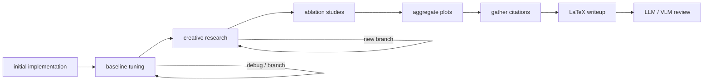

# SakanaAI/AI-Scientist-v2：把实验探索换成有预算的树搜索

| 字段 | 值 |
|---|---|
| GitHub | https://github.com/SakanaAI/AI-Scientist-v2 |
| License | The AI Scientist Source Code License v1.0 |
| Stars | 约 7.1k（2026-09-16 快照） |
| GitHub 最后 push / 本地 HEAD | 2025-12-19 · `96bd516` |
| 产品类型 | 端到端自主科研；实验探索优先于论文证据治理 |
| 分析证据 | README、`bfts_config.yaml`、`launch_scientist_bfts.py`、`ai_scientist/treesearch/agent_manager.py`、写稿/绘图入口 |

## 1. 它到底是什么

v2 试图减少 v1 对人工实验模板的依赖。它让实验管理 Agent 用 **BFTS（best-first tree search）** 展开候选实验，在实现、调参、创意研究和消融四个阶段探索；之后汇总图、补引用、写 LaTeX，并用 LLM/VLM 审稿。

> 📘术语
> **树搜索**：不是只沿一条“下一步”继续，而是保存多个候选分支，按当前价值选择哪一个先扩展。它能扩展探索覆盖，也会增加运行成本和执行风险。

## 2. 运行时堆叠

- `launch_scientist_bfts.py` 是顶层入口；`AgentManager` 管理树节点、阶段迁移与 checkpoint。
- `Journal` 保存节点日志；结果位于 `experiments/<timestamp>/`。
- `Interpreter` 用子进程执行 Python 文件，并设超时（源码默认可见 3600s）。
- `bfts_config.yaml` 配置各阶段最大迭代、调试深度与概率。
- 完成条件来自 LLM JSON（如 `is_complete`、`missing_criteria`），属于软评估，而非独立证据审计。

## 3. 阶段机或 DAG

四个实验阶段在 `AgentManager.main_stage_dict` 中定义。树搜索之后才进入图聚合和写稿，因此其真正核心仍是实验树。

## 4. Tool / Skill / Agent 怎么切

- `BaseTool` 与 `SemanticScholarSearchTool` 是内部工具抽象。
- `AgentManager`、parallel tree agent、`Interpreter` 是运行时角色。
- 没有 Claude Code Skill 包或面向外部客户端的 MCP Tool schema。
- `Stage` / `StageTransition` 表示实验阶段，而不是完整科研生产阶段。

## 5. 文献怎么来、是否入库、引用约束

Semantic Scholar 用于 ideation 与 writeup。`get_citation_addition` 多轮检索，并要求只添加 API 返回的 BibTeX；这是一个明确的反引用幻觉约束。仍没有 RH topic paper pool 或 claim-to-evidence 记录。

## 6. 实验 / 代码执行

**真跑。** `Interpreter` 启动子进程执行 `runfile.py`，实验分支被树搜索挑选和调试。README 推荐 Docker，但源码执行点是本地 REPL/子进程，因此服务化时仍需另补控制面、隔离和资源账本。

## 7. 写稿怎么做

通过 ICML / ICBINB 的空白 LaTeX 模板输出；`page_limit` 可设为 8 或 4。没有 EAG exemplar/reuse barrier，但“只从 API 返回 BibTeX 写 citation”是比 v1 更具体的引用约束。

## 8. 图怎么做

`aggregate_plots` 从 `.npy` 和 JSON 记录生成 `figures/`；其关键点是让模型产生**可执行聚合脚本**，而非直接从文本画一张结果图。之后有 `perform_imgs_cap_ref_review` 以 VLM 看图注/引用关系。

## 9. 和 RH 的相似点

- 实验与写稿被分开，先积累结果再撰写。
- 具有 citation、figure 和 review 入口，不只是代码搜索器。
- 有可恢复的实验日志与树形探索记录。

## 10. 和 RH 的不同点

- v2 以实验树替换主流程；RH 六阶段不会被树搜索改写，树只能是 experiment 内策略。
- 完成/缺项主要由模型自报；RH 要用可验证 artifact 和 gate。
- 没有持久证据数据库、EAG、四轨出图和多租户权限边界。
- 2025-12 后未见更新，运行和维护风险高。

## 11. 优点 / 缺点

**优点**

- 四段实验合同（初始实现、基线、创意、消融）十分清晰。
- API-only BibTeX 和 plot aggregation 是两个具体、可借鉴的质量措施。
- 保存探索分支，比只报告最终最佳结果更透明。

**缺点**

- README 自述在较开放条件下成功率低于 v1；一次实验成本也更高。
- LLM 自报的完成条件会受到提示/模型变化影响。
- 停更、非标准许可，且无发布级证据闸。

## 12. RH 可学的 1–3 条

1. **在 `experiment` 产物中记录四项子合同**：initial implementation、baseline、creative branch、ablation；只作为检查表，不替换 RH 生命周期。
2. **从记录数据生成可执行 result-figure aggregator**，由 `figure_suite_render` 复核；禁止 image model 生造数值图。
3. **用 provider 返回的结构化 metadata 作为 citation allowlist**，在 RH 的 citation 链继续保留来源与证据定位。

## 13. 名字速查表

| 名字 | 先决概念 | 含义 |
|---|---|---|
| BFTS | 树搜索 | best-first tree search，按价值扩展实验候选 |
| `AgentManager` | Stage | 管理实验树和阶段转换的主对象 |
| `Journal` | checkpoint | 保存树节点过程的日志对象 |
| `Interpreter` | 子进程 | 限时执行实验文件的执行器 |
| `missing_criteria` | 完成检查 | 模型指出尚缺哪些实验条件的字段 |
| `aggregate_plots` | 原始结果 | 从数组/JSON 生成统一图件的步骤 |
| `get_citation_addition` | metadata | 多轮向 S2 取 BibTeX 的写作辅助 |

---

> 📌事实边界
> 本页将树搜索描述为实验策略，不将其自动等价为科学有效性或论文可发表性。