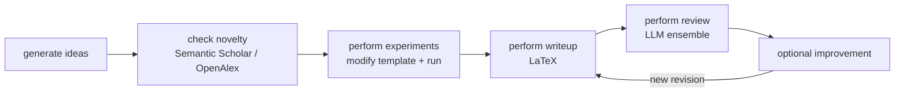

# SakanaAI/AI-Scientist：模板驱动的 idea→真跑→LaTeX→LLM 审稿原型

| 字段 | 值 |
|---|---|
| GitHub | https://github.com/SakanaAI/AI-Scientist |
| License | The AI Scientist Source Code License v1.0（非 OSI 通用开源许可） |
| Stars | 14,561（2026-09-16 快照） |
| GitHub 最后 push / 本地 HEAD | 2025-12-19 · `1de1dbc` |
| 产品类型 | 端到端自主 AI Scientist（**强依赖实验模板**） |
| 分析证据 | README、LICENSE、`launch_scientist.py`、git tree；本地为 sparse checkout，未将未落盘实现猜作已审源码 |

## 1. 它到底是什么

AI-Scientist 是“自动科学家”公共参照物：为一个预设实验模板生成 ideas，检查 novelty，修改实验代码并实际运行，自动生成 LaTeX 论文，再用 LLM 评审并可尝试改进。它展示了**能把论文产物自动串起来**的最小闭环，也暴露了“全自动生成”在实验真实性、环境安全和适用范围上的风险。

## 2. 运行时堆叠

- 入口 `launch_scientist.py` 的 `do_idea` 执行每个 idea 的全路径。
- 每个 idea 拷贝一份 `templates/` 工作目录，实验结果、图和 LaTeX 都落在该目录。
- Aider 充当编码执行助手；模型和文献搜索引擎可配置。
- 没有科研数据库、公共 Tool 合同或独立 artifact gate；失败分支主要由程序逻辑决定。

> 📘术语
> **实验模板**：预先提供的代码、数据处理、评估和论文骨架。Agent 在这个受限空间改动，比从空白仓写科学软件可靠，但结论的适用范围也被模板锁住。

## 3. 阶段机或 DAG

`do_idea` 在实验失败时不进入 writeup，这条“失败即不写论文”的程序分支是它最值得保留的科学纪律。

## 4. Tool / Skill / Agent 怎么切

没有 MCP / Skill 目录抽象。它以脚本函数和外部 Aider 组成运行时；`--engine` 选择 Semantic Scholar 或 OpenAlex。模型/编码器/文献客户端都嵌在完整流水线中。

## 5. 文献怎么来、是否入库、引用约束

使用 Semantic Scholar API 或 OpenAlex 做 novelty/citation 查询，可通过 `--engine` 切换。没有 topic paper pool；引用不会形成可跨任务复用的 claim–evidence 关系。README 允许跳过 novelty/citation 检查，故它是“可选控制”，非 RH 式默认强制 gate。

## 6. 实验 / 代码执行

**真跑 PyTorch 实验**，但 README 强烈提示用户自行容器化。Agent 修改 `experiment.py` / `plot.py` 后在本机环境执行；项目代码并不在默认路径上强制 Docker 沙箱。因此它不能被直接当成安全的多租户实验服务。

## 7. 写稿怎么做

使用模板内的 LaTeX（如 NanoGPT、2D Diffusion、Grokking）生成论文，后续运行多次 LLM review ensemble。未观察到 exemplar form、反抄袭重叠 gate、完整性审计或 venue profile。

## 8. 图怎么做

模板中的 `plot.py` 生成实验图；没有独立学术示意图生产线。图是否与正文/数据一致，主要依赖生成过程与 LLM review，非独立图表 fidelity gate。

## 9. 和 RH 的相似点

- 都将 idea、novelty、experiment、writeup、review 分为明确环节。
- 都认可真实实验失败时应阻止正式写作。
- 都有论文审阅后的修订概念。

## 10. 和 RH 的不同点

- AI-Scientist 自带强自动化脚本；RH 以可审计 Tool、阶段 gate 和人审为核心。
- AI-Scientist 将工作区当状态；RH 有持久 paper/claim/artifact 数据模型。
- RH 不能将未测的 Arena 结果作为正式结果；AI-Scientist 不具备这种双路径可区分合同。
- AI-Scientist 的许可与风险约束使其不宜直接复制或作为商业产品代码来源。

## 11. 优点 / 缺点

**优点**

- `do_idea` 让完整路径很容易理解、演示和复现。
- “实验失败不写稿”是正确的 fail-closed 产品行为。
- S2/OpenAlex 双检索引擎展示了文献供应商可替换性。

**缺点**

- 活跃度停在 2025-12；本地 checkout 还是 sparse，不能过度宣称实现细节。
- 成功依赖少数模板，不能推断到任意课题。
- 默认执行隔离要用户自行完成；不适合直接作为席位型服务。
- 没有文献/主张/图表的独立证据闸。

## 12. RH 可学的 1–3 条

1. **把“实验失败 → 禁止起草任何结果段”做成正式 write gate 的可审计条件**；RH 正式路径已有原则，补足可读回执即可。
2. **将检索引擎作为 `paper_search` 内部 provider 可替换项**，但继续由服务端保管 key，不能把 `--engine` 直接变成用户 key 暴露。
3. **在实验模板场景清楚展示适用范围**：让用户看到“该任务仅在何种冻结评估/数据条件下可复现”。

## 13. 名字速查表

| 名字 | 先决概念 | 含义 |
|---|---|---|
| `do_idea` | idea workspace | 单个想法的端到端调度函数 |
| `generate_ideas` | idea | 生成候选方向 |
| `check_idea_novelty` | 文献检索 | 用 S2/OpenAlex 估计已有工作重叠 |
| `perform_experiments` | 实验模板 | 让编码器修改并执行实验 |
| `perform_writeup` | LaTeX | 生成论文正文和编译材料 |
| `perform_review` | LLM ensemble | 多次模型审阅结果 |
| `--engine` | provider | 文献检索后端选择 |

---

> 📌事实边界
> 本页不把 README 的“autonomous scientist”口号等同于任何论文质量或实验真实性结论。