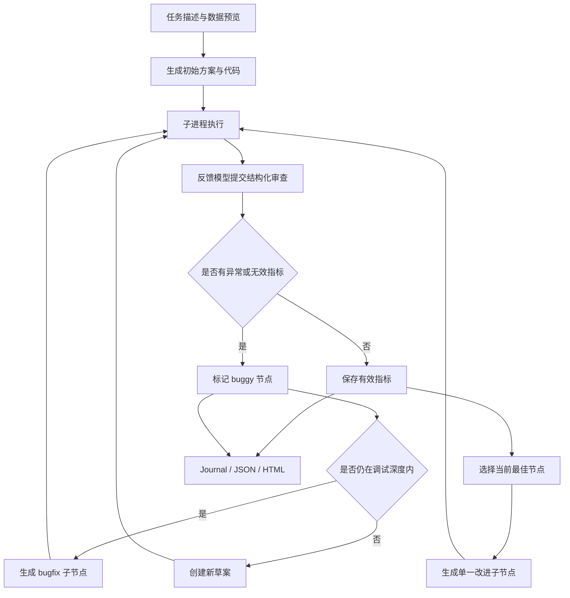

# WecoAI/aideml：在代码空间里进行带执行反馈的树搜索

| 字段 | 值 |
|---|---|
| GitHub | https://github.com/WecoAI/aideml |
| License | MIT |
| Stars | 1,528（2026-09-17 元数据快照） |
| GitHub 最后 push | 2026-09-03 |
| 分析 commit | `60b3978ddf65b71f86eb7c64506965048a1398cf` |
| 产品类型 | 由 Agent 生成、执行、评估和迭代机器学习代码的研发工具 |
| 直接证据 | `README.md`、`LICENSE`、`requirements.txt`、`setup.py`、`Dockerfile`、`Makefile`、`aide/agent.py`、`aide/interpreter.py`、`aide/journal.py`、`aide/run.py`、`aide/journal2report.py`、`aide/utils/config.py` |

## 1. 它到底是什么

aideml 是 AIDE 算法的开源参考实现，目标是在用户给出的数据目录、任务目标和评价指标上，让语言模型持续生成机器学习代码，并根据实际执行反馈选择更好的方案。README 将它描述为“机器学习工程 Agent”：每个 Python 解法成为搜索树中的一个节点，新的代码补丁生成子节点，验证指标用于指导搜索和淘汰。

从源码看，它不是一个泛化的科研论文系统，而是一个以**可执行代码解空间**为中心的 Agent。`aide.Experiment` 提供 Python 调用入口；`aide.run` 提供命令行入口；`Agent` 负责提出初始方案、改进方案或调试方案；`Interpreter` 在独立子进程中执行生成代码；`Journal` 保存节点、父子关系、执行输出、异常、分析和指标；`save_run` 把这些状态写成日志、配置、最佳代码和 HTML 树视图。

产品的核心闭环不是“生成一次代码”，而是“生成—运行—评价—选择—再生成”。它可以从自然语言任务描述中确定一个任务级评价方向，也可以通过配置覆盖最大化或最小化方向。最近的实现还把缺失指标、NaN 指标和执行异常统一视为坏节点，避免无效结果污染搜索排序。

README 的功能表述包括树搜索、HTML 可视化、Streamlit UI、多模型后端以及 MLE-bench 等外部研究关联；本次源码精读能确认的是核心 Python 包、配置、解释器、日志和后端适配层。README 中的竞赛奖牌比较和产品化效果属于公开说明或外部研究引用，不等于本快照的独立实验结论。

## 2. 运行时堆叠

aideml 的运行时可以分为六层。

第一层是入口层。`setup.py` 注册 `aide = aide.run:run` 的命令行入口，`aide/__init__.py` 暴露 `Experiment`、`Agent`、`Interpreter` 和 `Journal` 等常用对象。命令行参数通过 OmegaConf 与默认 YAML 合并；Python 调用则直接装载默认配置，再覆写数据目录、目标和评价说明。

第二层是任务与配置层。`aide/utils/config.py` 负责解析任务描述、生成实验名称、建立日志与工作空间、预处理输入数据，并将数据复制或链接到 Agent 工作区。默认配置设置 20 次迭代、5 折交叉验证提示、数据预览、代码模型、反馈模型、调试概率和最大调试深度。配置是行为合同的主要载体，而不是硬编码在一个大入口函数里。

第三层是模型调用层。`aide/backend` 根据模型名或环境配置选择不同的后端适配器。代码支持标准文本生成、结构化函数调用和 Anthropic 风格工具调用；重试由统一的指数退避包装器处理。Agent 生成方案与代码时使用代码模型，判断执行结果时使用反馈模型，生成最终报告时还可以使用单独的报告模型。

第四层是代码执行层。`Interpreter` 启动子进程，把生成的代码写成临时执行文件，用 `exec(compile(...))` 执行，并通过队列收集标准输出、标准错误、异常类型、异常信息、堆栈和执行耗时。它提供超时中断与强制终止逻辑，但本身不是完整的容器或权限沙箱。

第五层是搜索与状态层。`Agent` 依据 Journal 的节点状态选择初始草案、调试节点或当前最好节点；`Node` 保存一次方案及其全部反馈；`Journal` 维护节点列表、父子树、指标方向、最好节点和摘要。第六层是输出层，`save_run` 将 Journal 序列化为 JSON，将配置保存下来，生成 HTML 树视图，并写出最佳代码。

## 3. 阶段机或 DAG

aideml 的核心不是固定的线性阶段机，而是一个带三类动作的动态树搜索。节点没有父节点时属于 `draft`；父节点有 bug 时，子节点属于 `debug`；父节点有效时，子节点属于 `improve`。每个节点都可能拥有多个子节点，因而搜索结构是树而不是单链。

Agent 的搜索策略有明确顺序。首先，在初始草案数量不足时继续创建草案；默认 `num_drafts` 为 5。随后，以 `debug_prob` 的概率从可调试的坏叶节点中随机选择一个，调试深度不超过 `max_debug_depth`。如果没有进入调试分支，则从有效节点中选择当前最好节点进行贪心改进；如果没有有效节点，则继续创建新草案。

每一步实际上由“生成代码—执行—审查—追加 Journal”组成。`Journal` 的父子集合形成搜索树，`tree_export.py` 再把边、计划、代码、输出和分析导出为前端可以展示的结构。搜索树不是严格的科学实验 DAG：它保存代码演化关系，却没有内建假设、数据版本、统计重复和文献证据节点。

## 4. Tool / Skill / Agent 怎么切

**Agent** 是 `aide.agent.Agent`。它不是一个单一提示，而是包含三条生成路径：`_draft` 生成初始解法，`_improve` 针对有效父节点提出一个原子改进，`_debug` 根据异常输出修复坏代码。三条路径都要求模型先给简短自然语言计划，再给一个可执行代码块；`extract_code` 和 Black 格式化器负责把回答转换为 Python。

**Tool** 主要由后端函数调用规范、解释器和日志输出构成。`submit_review` 要求反馈模型返回 `is_bug`、摘要、数值指标和优化方向；`submit_task_metric` 要求模型为任务确定指标名称及其最大化或最小化方向。`Interpreter` 是执行工具，`tree_export` 是结果展示工具，后端适配器是模型调用工具。

**Skill** 不是独立目录或注册表。README 的“树搜索算法”和默认配置共同构成行为模板：初始化草案、选择节点、执行代码、用指标排序、递归调试或改进。用户可以通过配置调整步数、交叉验证提示、数据预览、模型和搜索概率，但源码没有一个类似技能包的公开装载合同。

**职责切分**比较直接：Agent 生成与选择，Interpreter 执行，Journal 记录，MetricValue 排序，backend 负责模型提供商兼容，config 负责实验准备，run 负责生命周期编排。这种按运行时责任分层的结构，比把全部逻辑放进一个 Agent prompt 更容易测试和替换。

## 5. 文献怎么来、是否入库、引用约束

aideml 核心流程不摄取论文，也不维护 topic-scoped paper pool。README 中列出了 AIDE 论文、MLE-bench、RE-Bench、AI Scientist-v2 等相关项目，并提供一个 BibTeX 引用块；这些属于项目文档和学术归属信息，不会在一次 AIDE 运行中转化为可查询文献记录。

任务运行时的主要输入是数据目录、目标描述和评价说明。Agent 的“Memory”来自 Journal 的既有方案、分析和验证指标，而不是论文数据库。`journal2report` 最终把实验摘要和任务描述交给报告模型生成 Markdown，却没有 claim-citation 对象、引用来源定位、文献证据强度或引文一致性检查。

因此它的引用约束是项目级而非结果级的：使用者应当引用 AIDE 论文，README 也给出推荐格式；但生成的机器学习报告不会自动知道某个代码决策对应哪篇工作。若将搜索结果用于科研论文，仍需要在 RH 或其他证据系统中补充论文摄取、主张拆分、来源定位和引用审计。

## 6. 实验 / 代码执行

aideml 的实验执行是真实执行，而不是只让模型描述一个可能的分数。`prep_agent_workspace` 建立 `input` 与 `working` 两类工作区，按照配置复制或链接数据，并可执行预处理。Agent 生成一个完整的 Python 程序后，`Interpreter.run` 将它送入独立子进程执行，收集输出和异常，再把结果交给反馈模型分析。

解释器的执行合同有几个具体特点：

1. 通过多进程隔离生成代码与主控制循环，主进程仍能监视执行时间。
2. 将代码运行环境的 `__name__` 设置为 `__main__`，使常规入口保护能够按脚本方式触发。
3. 通过队列区分状态事件与输出内容，避免用户输出恰好等于内部结束标记时破坏协议。
4. 超过配置的时间限制后先发送中断；若子进程仍不退出，再进行强制清理。
5. 异常会被归纳为类型、参数、堆栈和终端文本，作为后续调试提示的一部分。

反馈模型并不直接拥有排序权。它提交的指标先经过 `Agent.parse_exec_result` 检查；执行异常、模型标记 bug、缺少数值指标和 NaN 都会把节点标记为坏节点，并赋予 `WorstMetricValue`。有效节点使用 `MetricValue` 排序，Journal 以任务级方向为主，保留每个节点当时报告的方向，同时对冲突方向发出警告。

这里也存在边界。解释器是进程级执行器，不是默认具备网络、文件系统和资源配额隔离的安全沙箱；生成代码能否访问哪些资源，取决于运行环境和工作区权限。Dockerfile 提供非 root 容器运行方式，Makefile 提供挂载日志、工作区和示例数据的容器入口，但这些部署选项与核心 Interpreter 的安全语义并不等价。

## 7. 写稿怎么做

aideml 的写稿功能是一个轻量的实验总结步骤。`journal2report.py` 将有效节点的计划、代码、分析和验证指标拼成上下文，再调用报告模型，要求输出单个 Markdown 文档，内容包括 Introduction、Preprocessing、Modeling Methods、Results Discussion 和 Future Work 等部分。`run.py` 在实验迭代完成后将结果写入日志目录中的报告文件。

这条链的优点是能把树搜索中的多个方案和结果汇总起来，而不是只返回最后一段代码；缺点是它没有学术写作所需的证据分层。报告模型拿到的是 Journal 摘要和任务描述，不是经过文献绑定的 claim 集合，也没有引用配额、来源定位、数字一致性检查、章节模板门或投稿格式验证。

`Experiment.run` 的 Python API 则返回 `Solution`，包含最佳代码和有效指标，适合把代码优化结果嵌入其他应用。它不返回论文证据包，也不自动把失败节点、数据版本、运行环境摘要和模型调用元数据整理成发表级附录。因而 aideml 的写作层更准确地说是“实验报告生成器”，而非端到端科研写作系统。

## 8. 图怎么做

aideml 的主要图形产物是搜索树可视化。`tree_export.py` 从 Journal 的父子关系构造有向图，使用 igraph 生成布局，将每个节点的计划、代码、终端输出和反馈分析嵌入 HTML 模板。README 所说的 HTML visualizer 因而有明确源码依据：用户可以沿树查看不同解法及其输出。

但源码也揭示了一个重要限制：`cfg_to_tree_struct` 当前把 `metrics` 数组初始化为全零，树图导出结构虽然包含节点和分析文本，却没有把真实指标直接用于节点数值可视化。这意味着“能看完整解法树”与“图上准确表达指标前沿”是两件不同的事。真实指标仍保存在 Journal 和最佳节点选择逻辑中，而不是完整地进入当前图形数据结构。

README 还提到 Streamlit UI，以及生成最佳解法和实验日志等能力。源码中的核心保存函数确实会导出 `best_solution.py`、配置、Journal 和 HTML 树，但本次精读没有把 UI 的交互表现或浏览器端渲染作为独立实测结果。aideml 没有面向论文的示意图规划、定量图套件、视觉批评或图注证据绑定流程。

## 9. 和 RH 的相似点

- 都把长期任务拆成可保存的状态，而不是把一次聊天回答当成最终结果。
- 都强调真实执行反馈，允许后续步骤基于实验产物继续工作。
- 都保留过程信息：aideml 保存节点树、代码、输出、异常和指标；RH 保存 artifact、provenance、证据关系和阶段状态。
- 都支持模型角色分工：aideml 将代码生成、反馈审查和报告生成配置为不同阶段；RH 也将研究、审阅、写作和质量控制分开。
- 都将失败纳入控制逻辑：aideml 对坏节点调试或淘汰，RH 用失败 artifact、gate 和审阅结论阻止不合格产物继续流动。

这些相似点说明 aideml 对 RH 最有价值的部分是“可执行搜索与反馈记录”，而不是它的模型后端或 UI 形式。

## 10. 和 RH 的不同点

- aideml 的中心对象是代码解法树和验证指标；RH 的中心对象是研究主题、论文主张、证据、实验记录和发布产物。
- aideml 将任务描述直接交给代码 Agent，主要目标是优化一个用户定义的 ML 指标；RH 还需要处理文献范围、研究空白、方法论论证和稿件一致性。
- aideml 的 Journal 是应用内存储对象，保存运行树但不提供 topic 级文献库、claim-evidence 双向链接和来源审计。
- aideml 的反馈主要依赖模型读取执行输出后提交结构化判断；RH 的证据闸需要可定位的来源、artifact 和确定性检查共同参与。
- aideml 的报告生成是一次 Journal 总结；RH 的写作阶段需要章节证据配额、引用约束、审稿批评、修订和最终 bundle。
- aideml 的 HTML 树图是工程调试可视化；RH 还要区分方法示意图、定量结果图、图注事实边界和出版版式质量。
- aideml 提供多种模型后端适配器；RH 的重点不是再建一个模型路由层，而是围绕研究生命周期形成可审计的工作流合同。

因此，aideml 更接近 RH experiment 阶段可以借鉴的执行与搜索组件，而不是覆盖 RH 全链路的同类系统。

## 11. 优点 / 缺点

**优点**

1. 搜索树是清晰的工程抽象：每个节点都有代码、计划、父节点和真实执行反馈，改进关系可回溯。
2. 生成、执行、评估和保存职责分离，`Agent`、`Interpreter`、`Journal` 和配置模块可以分别测试。
3. 指标方向被提升到任务层处理，且对 NaN、缺失指标和异常有明确坏节点语义，减少排序被无效结果污染的风险。
4. 解释器处理了主入口、异常摘要、超时、中断和输出收集等实际运行问题，比简单调用 `exec` 更完整。
5. 通过后端适配器、配置文件和 Python API，使用者可以替换模型、实验步数、评估方向和运行方式。
6. Journal、最佳代码和 HTML 树同时保存，既能继续搜索，也能检查最终选择的代码。

**缺点**

1. 代码生成与反馈仍高度依赖模型遵守提示和正确报告指标；反馈结构化不等于反馈事实已经被独立验证。
2. 默认解释器不是完整安全沙箱，生成代码执行的权限和资源上限需要由外层部署补足。
3. 没有文献摄取、主张拆分、引用绑定和证据来源定位，无法独立支持学术论证。
4. Journal 保存了代码树，却没有内建数据版本、随机种子、环境依赖、重复试验和统计置信区间的统一合同。
5. HTML 树导出的指标数组当前为零值，搜索树结构可视化与真实指标可视化之间存在明显差距。
6. `journal2report` 只生成实验总结，不检查数字、代码、图表和文字之间的双向一致性。
7. 搜索策略偏向初始多草案、随机调试和当前最优改进，可能过早集中到局部解，也没有通用的探索多样性保证。

## 12. RH 可学的 1–3 条

1. **把代码实验节点设计成可复用的统一记录。** 借鉴 `Node` 的父子关系、计划、代码、终端输出、异常、耗时、分析和指标字段，为 RH 的 `experiment_result` 增加“候选分支—执行反馈—选择结果”的最小结构；这样失败实验也能被审计和复用。
2. **将任务级评价方向在实验开始时冻结。** aideml 先确定指标及其最大化或最小化方向，再把要求追加到后续代码生成上下文。RH 可以把研究目标、主要指标、统计方向和禁止替换的评价定义写入实验合同，避免每个候选方法自行改变目标。
3. **把调试分支和改进分支分开。** aideml 根据父节点是否有 bug 区分 `debug` 与 `improve`。RH 可以在实验 artifact 中区分“修复执行失败”“改进方法本身”“探索新候选”三种关系，从而避免把修复性变化误写成科学贡献。

这些做法可以嵌入 RH 现有的 experiment、artifact 和 provenance 层，不需要把 aideml 的完整运行时或后端适配器复制进 RH。

## 13. 名字速查表

| 名字 | 先决概念 | 含义 |
|---|---|---|
| `Experiment` | Python 入口 | 以数据目录、目标和评价说明创建一次 AIDE 实验 |
| `Agent` | 生成与选择 | 生成草案、改进有效节点或调试坏节点 |
| `Node` | 搜索树 | 保存一份代码、计划、父子关系、执行输出和指标 |
| `Journal` | 持久状态 | 管理全部节点、任务级指标方向、摘要和最佳节点 |
| `Interpreter` | 代码执行 | 在子进程中执行生成 Python、捕获输出并处理超时 |
| `MetricValue` | 排序 | 按任务方向比较有效指标，并把 NaN 归入无效值 |
| `WorstMetricValue` | 失败语义 | 表示 bug、异常、缺失或不可用指标的最差节点 |
| `submit_review` | 反馈工具 | 要求反馈模型返回 bug 状态、摘要、指标和方向 |
| `submit_task_metric` | 任务初始化 | 要求模型确定任务级指标名称与优化方向 |
| `journal2report` | 写作 | 把 Journal 摘要和任务描述生成实验 Markdown 报告 |
| `tree_export` | 可视化 | 把节点树、代码、输出和分析导出为 HTML |
| `save_run` | 运行产物 | 保存 Journal、配置、树图和当前最佳代码 |

> 📌事实边界：本页依据 `60b3978ddf65b71f86eb7c64506965048a1398cf` 的固定源码文件与 2026-09-17 项目元数据撰写。README 的产品定位、外部项目关联和使用说明已与源码实现区分；本次只做源码静态精读，没有运行 Agent、生成代码、执行机器学习训练或验证 README 中的性能比较。

###
