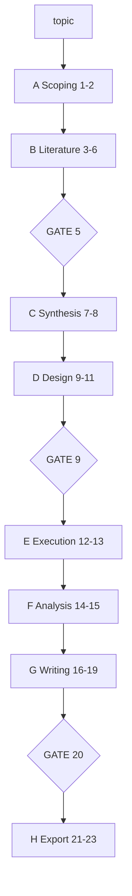

# AutoResearchClaw：23 阶段从 topic 到论文的自主与共驾流水线

| 项目 | 固定快照 |
|---|---|
| 候选编号 | 74 |
| 仓库 | [aiming-lab/AutoResearchClaw](https://github.com/aiming-lab/AutoResearchClaw) |
| 分类 / 层次 | 端到端科研 Agent；文献、实验、写作、编排 |
| 分析提交 | `be4ba4755bf1b52220f25e13b2293b5956590070` |
| 元数据快照 | 2026-09-17；Stars 14436，非近似值；最近推送 2026-08-19 |
| 默认分支 / 状态 | main；非 fork、未归档；候选 pending，分析 draft |
| 许可 | MIT；固定提交的根目录 `LICENSE` 已查阅 |
| 阅读方式 | 公开 README、Agent 配置、CLI/copilot 与示例配置；静态分析 |

本文用 📘 标注文档或源码中可直接定位的事实，🔶 标注由控制流推导的边界，💬 标注评价与借鉴建议。仓库动态元数据沿用候选清单，源码判断只绑定上面的固定提交。

## 1. 它到底是什么

📘 [根 README](https://github.com/aiming-lab/AutoResearchClaw/blob/be4ba4755bf1b52220f25e13b2293b5956590070/README.md) 将产品写成：输入研究想法，输出会议论文、bib、实验运行、图表与评审。可全自动，也可用 Co-Pilot 在关键点介入。[`RESEARCHCLAW_AGENTS.md`](https://github.com/aiming-lab/AutoResearchClaw/blob/be4ba4755bf1b52220f25e13b2293b5956590070/RESEARCHCLAW_AGENTS.md) 把流水线定义为 23 个 stage、8 个 phase。

📘 产物表列出 `paper_draft.md`、`paper.tex`、`references.bib`、`verification_report.json`、experiment runs、charts、reviews.md、evolution 与 deliverables。🔶 这些是约定输出文件名；本次静态阅读不能证明每次 `researchclaw run` 都会生成完整集合。

## 2. 运行时堆叠

📘 CLI 入口是 `researchclaw`（`researchclaw/cli.py`）。配置来自 `config.yaml`，模板为 `config.researchclaw.example.yaml`。实验模式包括 `simulated`、`sandbox`、`ssh_remote`。`.claude/skills/` 提供可加载技能，包括 literature-search、scientific-writing、hypothesis-formulation 等。

| 层 | 固定快照中的承载方式 | 边界 |
|---|---|---|
| 编排 | 23-stage pipeline + CoPilotController | 闸门可跳过 |
| 文献 | README 称 OpenAlex / Semantic Scholar / arXiv | 需外部服务 |
| 实验 | sandbox / SSH / 领域 specialist agent | simulated 不执行真代码 |
| 写作 | Markdown + 会议 LaTeX 模板 | 质量依赖后续 audit |
| 技能 | `.claude/skills/*/SKILL.md` | 提示包，不等于 artifact |

## 3. 阶段机或 DAG

📘 RESEARCHCLAW_AGENTS.md 给出 phase A–H：Scoping → Literature → Synthesis → Experiment Design → Execution → Analysis → Writing → Finalization。闸门在 stage 5、9、20。`--auto-approve` 可关闭人工批准。

📘 [`copilot/controller.py`](https://github.com/aiming-lab/AutoResearchClaw/blob/be4ba4755bf1b52220f25e13b2293b5956590070/researchclaw/copilot/controller.py) 的 `should_pause`：`ZERO_TOUCH` 不停；`AUTO_PILOT` 只在 gate 且 `pause_at_gates` 时停；Co-Pilot 可每步停。动作包括 approve、modify、retry、skip、branch、rollback。

🔶 `simulated` 模式由 LLM 生成合成结果，不能与 sandbox 真执行混称为同一证据等级。README 的 8 篇 showcase 是项目展示，不是本次复现。

## 4. Tool / Skill / Agent 怎么切

📘 主流程是 stage executor，不是单一聊天 Agent。领域执行可路由到 HEP ColliderAgent、biology COBRApy、statistics simulation 或通用 Docker。技能通过 `researchclaw skills install` 或放入 `.claude/skills/`。🔶 Skill 是提示/能力包；HITL 控制器才决定是否暂停。

## 5. 文献怎么来、是否入库、引用约束

📘 README 强调真实 bib，并有 `verification_report.json` 的四层引用核验（arXiv、CrossRef、DataCite、LLM）。🔶 核验报告存在只能说明流水线设计了检查步骤；本次未打开某次运行的 JSON，不能声称“无幻觉引用”已被独立证实。

## 6. 实验 / 代码执行

📘 sandbox 本地执行生成代码；SSH 可去远端 GPU；ARC-Bench 在 `experiments/arc_bench/`，含 55 个开放研究题。🔶 本次未跑 ARC-Bench、未进入 sandbox。`simulated` 明确是合成结果通道。

## 7. 写稿怎么做

📘 阶段 16–19 做大纲、草稿、多 Agent 评审与修订；阶段 20 质量闸后导出。🔶 “conference-ready” 是目标模板与检查清单，不是外部会议录用证明。

## 8. 图怎么做

📘 README 列出 `charts/`：条件对比图、误差线和置信区间。`researchclaw/experiment/visualize.py` 在 Agent 文档中被指为图表生成。🔶 图是否绑定实验 JSON，取决于具体 stage 实现；本次未执行可视化。

## 9. 和 RH 的相似点

1. 都把长科研任务拆成带闸门的阶段。
2. 都区分全自动与人工共驾。
3. 都把文献、实验、稿件和导出当成不同产物。

## 10. 和 RH 的不同点

RH 的权威对象是 topic/paper/claim/evidence。AutoResearchClaw 的权威对象是 run_dir 里的 stage 产物。它允许 simulated 结果进入后续写稿；RH 若采用同类通道必须降级标记。领域 specialist agent 是执行路由，不是统一证据模型。

## 11. 优点 / 缺点

**优点**

- 23 阶段与三处 GATE 在文档和控制器中一致。
- HITL 动作集合明确，便于对照 RH 的人工闸。
- 实验模式写进配置，而不是只写在 README。

**缺点**

- simulated 与 sandbox 若未在产物中标记，读者会高估证据。
- 外部检索与引用核验依赖网络服务。
- showcase 论文与 ARC-Bench 分数未被本次复现。

## 12. RH 可学的 1–3 条

1. **把暂停策略写成 mode，而不是散落 if。** ZERO_TOUCH / AUTO_PILOT / CO_PILOT 比口头“可人工介入”更可测。
2. **实验模式必须进入产物元数据。** simulated 结果不能与 sandbox 指标静默并列。
3. **闸门编号固定。** 文献筛选、实验设计和终稿质量分闸，避免一个 approve 放行全链路。

## 13. 名字速查表

| 名字 | 先决概念 | 含义 |
|---|---|---|
| 23 stages / 8 phases | 流水线 | 从 scoping 到 export |
| GATE 5/9/20 | 人工或自动批准 | 文献、实验设计、质量 |
| `simulated` / `sandbox` | 实验模式 | 合成 vs 真执行 |
| CoPilotController | HITL | 决定是否 pause |
| ARC-Bench | 评测集 | 55-topic 开放研究基准 |

> 📌事实边界：本页依据 `be4ba4755bf1b52220f25e13b2293b5956590070` 固定公开源码快照、2026-09-17 `data/candidates-staging.jsonl` 元数据和下列实际查看文件静态撰写（`README.md`、`LICENSE`、`RESEARCHCLAW_AGENTS.md`、`RESEARCHCLAW_CLAUDE.md`、`config.researchclaw.example.yaml`、`prompts.default.yaml`、`researchclaw/cli.py`、`researchclaw/agents/base.py`、`researchclaw/copilot/controller.py`、`researchclaw/assessor/scorer.py`、`.claude/skills/researchclaw/SKILL.md`）。没有把 README 的 showcase 论文、测试通过数或 ARC-Bench 分数当作本次实测；未调用未配置的模型/API，未运行 23 阶段流水线，未据此声称运行效果。
