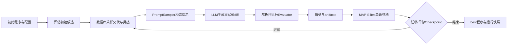

# algorithmicsuperintelligence/openevolve：面向程序演化的 LLM 代码搜索系统

| 字段 | 值 |
|---|---|
| GitHub | https://github.com/algorithmicsuperintelligence/openevolve |
| License | Apache-2.0（staging API 值；许可证正文见 `LICENSE`） |
| 分析 commit | `411fb59c886c18704caaffb611e17cf9e7d824d2` |
| 产品类型 | 算法发现与演化、程序评测和实验追踪 |
| 直接证据 | `README.md`, `LICENSE`, `pyproject.toml`, `openevolve/controller.py`, `openevolve/process_parallel.py`, `openevolve/database.py`, `openevolve/evaluator.py`, `openevolve/evaluation_result.py`, `openevolve/config.py`, `openevolve/llm/ensemble.py`, `openevolve/prompt/sampler.py`, `openevolve/evolution_trace.py`, `examples/function_minimization/evaluator.py`, `examples/function_minimization/initial_program.py`, `scripts/visualizer.py` |

本文用 📘 标注文档或源码中可直接定位的事实，🔶 标注由控制流推导的边界，💬 标注评价与借鉴建议。仓库动态元数据沿用候选清单，源码判断只绑定页面中的固定提交。

## 1. 它到底是什么

OpenEvolve 是一个把大语言模型接入程序演化循环的 Python 项目。用户提供初始程序、评测文件和 YAML 配置；系统让模型提出完整重写或 diff 修改，把生成代码交给评测函数，再按指标选择后代。它的基本对象不是抽象文本答案，而是带代码、父代、代数、指标、变更描述和可选 artifacts 的 `Program`。README 将其定位为 AlphaEvolve 的开源实现，并展示函数优化、GPU kernel、排序和符号回归等使用场景；这些展示说明项目方的覆盖范围，不等同于本固定快照上的本地成绩。

源码中的 `OpenEvolve` 控制器负责初始化日志、随机种子、提示采样器、模型 ensemble、数据库和 evaluator。`run` 先评估初始程序，再启动进程并行控制器，最后从数据库取出当前最佳程序并写入 `best` 目录。因而它更接近“可插入评测器的演化实验引擎”，而不是独立的科研问题求解器或论文写作系统。

## 2. 运行时堆叠

最外层是 CLI/API 与配置层：`pyproject.toml` 暴露 `openevolve-run`，`Config` 聚合 LLM、prompt、database、evaluator 和 trace 配置。模型层由 `LLMEnsemble` 管理；固定代码内置 OpenAI 适配，并在可导入时注册 Claude Code 适配，未注册的 provider 会回退到 OpenAI 实现。提示层的 `PromptSampler` 从模板构造系统消息和用户消息，并可插入历史程序、指标、特征坐标与执行 artifacts。

执行层包含进程池 worker、动态加载的评估文件和临时程序文件。worker 从数据库快照重建候选，生成模型响应，解析 diff 或完整重写，检查代码长度，再调用 evaluator。数据库层把程序放入岛屿和 MAP-Elites 特征网格，维护 archive、最佳程序、提示日志与 artifacts。追踪层可记录 prompt、LLM response、代码和父子关系；可视化脚本读取 checkpoint 的 `metadata.json` 与 `programs/*.json`，构造演化树。

## 3. 阶段机或 DAG

一次运行可概括为：初始代码加载 → 初始评测 → 选父代/灵感程序 → 构造提示 → LLM 生成 → 解析代码或 diff → 运行评测 → 保存指标和 artifacts → MAP-Elites 入格 → 迁移/早停/checkpoint → 选择最佳程序。级联评测时，stage 1 先运行，只有通过阈值才继续 stage 2，再按合并结果决定是否进入 stage 3。

这条路径有两个重要的边界。第一，评估函数是外部输入，项目只约定模块中存在 `evaluate`，并在配置开启时探测 `evaluate_stage1/2/3`。第二，进程并行传递的是数据库快照，结果完成后才回写主进程；并发候选并非在同一时刻共享一个可变数据库对象。

## 4. Tool / Skill / Agent 怎么切

项目没有一个独立注册的科研 Skill 目录。可见的职责切分是：LLM provider 负责生成文本；`PromptSampler` 负责把当前程序、历史候选、指标和 artifacts 组织为 prompt；worker 负责一次候选的生成与评估；`ProgramDatabase` 负责群体选择、网格占位和谱系；`Evaluator` 负责调用用户评测函数；visualizer 负责读取已有快照并展示。

因此“Agent”在这里主要是被调用的代码生成模型，而不是一个有工具权限治理、任务计划、文献检索和写作门控的自主研究 Agent。用户提供的 evaluator 可以在 Python 环境中导入和执行候选程序；`EvaluatorConfig` 提供 timeout、重试和级联开关，但源码中的 memory/cpu limit 字段注明尚未实现。运行时边界和安全隔离仍需由部署者补充。

## 5. 文献怎么来、是否入库、引用约束

固定源码没有论文检索器、引用数据库或证据定位结构。README 提供项目引用、博客和相关项目链接，配置与运行记录可以保存到 trace 或程序 JSON，但 `Program` 的核心字段是代码、指标、父子关系和 metadata，不是 paper、claim、source span 或 citation key。模型生成也没有在本仓库内自动完成文献核验。

这意味着它能把“某次演化使用了什么 prompt、代码和指标”保存下来，却不能单独回答一个研究主张对应哪一页文献、哪条数据来源或哪个统计检验。若把演化结果用于论文，引用、数据许可、实验协议和主张强度必须由上层工作流另行管理。README 中关于速度提升、SOTA 和确定性的叙述属于项目公开说明，不能在本记录中转写为固定 commit 的实测结论。

## 6. 实验 / 代码执行

`Evaluator` 动态导入评估文件，要求它暴露 `evaluate`，然后把候选代码写入临时文件，在 executor 中执行并施加 asyncio timeout。失败会重试；超时返回 timeout 指标；异常可形成 stderr、traceback、失败阶段和建议等 artifacts。级联模式将 stage 1/2/3 的数值指标合并，并把失败阶段保留在结果上下文中。启用 LLM feedback 时，还会另行调用 evaluator ensemble 并按权重把反馈指标并入结果。

函数最小化示例展示了具体评测契约：候选需提供 `run_search`，评测器重复运行十次，检查返回值、NaN/无穷、到已知近似极小点的距离和成功率，再计算 value、distance、reliability 与 combined score。`EvaluationResult` 允许指标之外带任意 artifacts。数据库再按原始特征值计算网格坐标；自定义维度不能由评估器预先写成 bin 编号。

本次只对固定公开源码做静态查看，没有安装依赖、没有配置模型端点、没有执行函数最小化、没有运行完整演化，也没有测量并行吞吐、收敛速度或候选质量。源码所描述的执行能力不应被写成此次复现结果。

## 7. 写稿怎么做

OpenEvolve 的“写入”主要是实验产物写入，而非论文起草。数据库可以将每个程序序列化到 `programs`，保存 prompt/response、metadata、指标和 artifacts；checkpoint 还写 `metadata.json`、最佳程序、最佳指标信息。`EvolutionTracer` 可按 JSON/JSONL/HDF5 配置记录演化轨迹，visualizer 则将已有记录转换为网页中的节点、边和程序详情。

这些产物适合支持结果复盘、候选比较和错误诊断，但没有章节结构、引用配额、审稿意见处理、术语注册或数字一致性门。一个程序的 `combined_score` 是 evaluator 定义的搜索适应度，不自动等于论文中的主要终点。若将日志转入论文，仍需明确数据集版本、随机种子、资源、评测协议和统计汇总。

## 8. 图怎么做

仓库提供演化可视化入口。`scripts/visualizer.py` 从最新 checkpoint 找到岛屿中的程序 JSON，读取 metrics、parent_id、metadata 与 artifacts，生成节点和边；还提供 Flask 页面、程序详情路由和静态导出。README 中的架构图和演化示例图属于项目文档资产，不能视为由本次运行自动生成的证据图。

源码没有统一的论文 figure plan、图注证据绑定、颜色无障碍检查或出版质量 gate。可视化主要回答“候选如何沿父子关系演化、各指标如何变化”，而不是自动绘制统计置信区间、数据流程或因果结论。使用者应把节点身份、指标定义和 checkpoint 号写在外部图注中，并保留原始 JSON 作为数据来源。

## 9. 和 RH 的相似点

两者都把长运行拆成可恢复的中间产物，并把过程状态与最终结果区分开。OpenEvolve 的 program JSON、父代关系、prompt、artifacts、checkpoint 和 trace，与 RH 中实验记录、artifact lineage、运行日志和可复核交付物有结构上的相似性。两者也都强调真实执行上下文，而不是只接受模型口头声称“已完成”。

在工程设计上，OpenEvolve 的绝对最佳追踪和 RH 的交付闸可以形成互补思路：探索状态保留多个候选，交付状态指向一个明确版本；失败仍保存上下文，便于定位是生成、解析、执行还是评测阶段出错。这种相似性是架构层观察，不表示两个系统的证据标准已经相同。

## 10. 和 RH 的不同点

OpenEvolve 优化的是用户定义程序评测器返回的分数，目标通常是代码性能、多目标质量或算法发现；RH 还要管理研究问题、文献来源、证据链接、统计分析、稿件章节和发布材料。OpenEvolve 的 MAP-Elites 特征坐标服务于群体多样性，RH 的 claim/evidence 关系服务于审计和主张约束，不能互相替代。

OpenEvolve 的 evaluator 可以运行任意项目特定逻辑，因而灵活但依赖部署者制定安全和数据边界；RH 的研究交付需要额外记录数据可用性、来源、版本、实验契约和写作质量。前者的“best program”是搜索状态，后者的“可交付结论”还必须通过证据、统计和稿件闸门。

## 11. 优点 / 缺点

优点是入口清楚，初始程序、评估文件和 YAML 即可组成循环；配置暴露岛屿数、特征维度、迁移频率、级联阈值、重试和 checkpoint；进程控制器把候选生成与评测并发化；数据库同时维护 archive 和绝对最佳，降低最佳解因网格替换而丢失的概率；artifacts 可以将错误上下文带入下一轮；固定种子、trace 和 checkpoint 为复盘提供基础。

缺点是模型输出解析、候选执行和外部服务仍可能失败，通用安全沙箱不是当前公开配置的完整能力；资源限制字段和 distributed 标注为未实现；并行快照可能增加序列化与上下文陈旧成本；MAP-Elites 的解释依赖 evaluator 返回合理的连续特征；LLM ensemble 的加权反馈不等于科学审稿。最终效果还取决于用户评测函数、模型和运行环境。

## 12. RH 可学的 1–3 条

1. 将候选代码、父代、指标、执行 artifacts、提示和迭代号作为不可分的实验记录，避免只保存最终数字。
2. 对昂贵评测采用分层 cascade：先做廉价的格式/健康检查，再做完整实验；每层返回结构化失败上下文，同时把“格式通过”和“科学结论成立”分开。
3. 借鉴 islands、archive 与 explicit best 的双层保护：探索阶段保留多样候选，交付阶段锁定明确版本，并允许从中间 checkpoint 恢复。

## 13. 名字速查表

`OpenEvolve`：主控制器；`Program`：候选程序记录；`Evaluator`：动态加载并执行用户评估器；`EvaluationResult`：指标与 artifacts 容器；`LLMEnsemble`：按权重选择或遍历模型；`PromptSampler`：构造系统/用户提示；`ProgramDatabase`：MAP-Elites、岛屿、archive 与最佳程序存储；`ProcessParallelController`：进程池调度；`feature_dimensions`：用于特征网格的原始指标名；`cascade_evaluation`：多阶段评测；`EvolutionTracer`：谱系追踪；`checkpoint`：可恢复运行快照；`visualizer.py`：checkpoint 诊断页面。

> 📌事实边界：本页依据 `411fb59c886c18704caaffb611e17cf9e7d824d2` 固定公开源码快照、2026-09-17 `data/candidates-staging.jsonl` 元数据和 `evidence.json` 所列实际查看文件静态撰写。README 的加速、SOTA、确定性和示例数字是项目方说明，不是本次复现实验结果；本次未安装依赖、未调用模型/API、未运行示例或完整演化、未产生候选成绩，也未验证跨机器确定性、隔离强度或资源上限。
