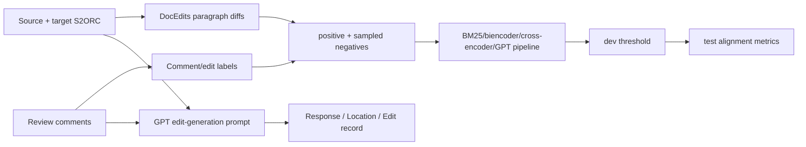

# allenai/aries：把评审意见对齐到论文修改的语料与基线

| 字段 | 值 |
|---|---|
| GitHub | https://github.com/allenai/aries |
| 分析提交 | `5691bae71a101225ed345d0ffc42e47609f03bbb` |
| 元数据快照 | 2026-09-17 |
| 代码许可 | Apache-2.0 |
| 审阅状态 | draft；固定提交静态阅读，未运行 |

## 1. 它到底是什么

ARIES 是 “A Corpus of Scientific Paper Edits Made in Response to Peer Reviews”，核心不是自动决定论文接收与否，而是把 review comment、原始/修订论文和具体段落修改联系起来。README 说明它提供 S2ORC 全文解析、comment-aligned edits、review comments、train/dev/test label，以及 GPT 生成的编辑结果。候选元数据将它归入 review-to-revision 的证据层。📘这里的 corpus 文件和论文结果属于上游发布物；本次只静态查看固定提交的 README、配置和脚本，没有下载 S2ORC、加载模型或重跑指标。

一个样本通常以 doc_id、source_pdf_id、target_pdf_id、review comment、上下文、positive edits 和 negative edits 组成。`DocEdits` 把 source/target S2ORC 段落差异组织为 paragraph edits；alignment 模型对“哪一个修改响应了这条意见”做排序/二分类。README 明确提醒 synthetic train/dev 的 negative ids 为空，因为低 recall 时同一文档的其他 edits 不能安全地当负例；这条数据语义限制比一个简单的正负分类标签更重要。🔶ARIES 的对齐成功不代表生成的修改在科学上正确，生成路线的候选文本也不代表作者采纳记录；语料中的真实 source/target 修改则来自既有版本差异。

## 2. 运行时堆叠

运行时是 Python 数据加载、S2ORC 文件系统/SQLite fetcher、Transformer 或 GPT 模型及评估器。`train_revision_alignment.py` 支持 cross encoder、biencoder、GPT、GPT full paper、BM25 和 precomputed 等 model type；前置 pipeline 模型是过滤器，最后一个模型调用 train。负样本数量、candidate_edit_type、最小字符数、hard negative strategy 和 seed 都进入 config/defaults。生成脚本使用 `Gpt3CacheClient`，按 token 估计把 body 限制在约 6×1024 tokens，并以 1024 max tokens 请求编辑。

## 3. 阶段机或 DAG

训练和评估的阶段机是：读取 comments、paper_edits、S2ORC source-target 对；按 label 文件生成正负候选；可选用同文档或跨文档 distractor；初始化 pipeline 中的过滤模型和最后一个可训练模型；在 dev 上找 optimal decision threshold；固定该阈值跑 test，并保存 inferences、metrics 和 by-review 输出。另一个 generation 脚本按 comment 构造 prompt，调用 GPT，解析 Response/Location/Edit。

## 4. Tool / Skill / Agent 怎么切

**Agent** 在此不是长期自主 reviewer，而是生成编辑文本时的 GPT 提示角色，以及训练/推理时的 aligner。**Tool** 主要是 S2ORC fetcher、文本 diff、候选采样和模型 pipeline；没有看到独立 MCP/Skill 注册层。**Dataset** 是最重要的环境边界：comment、context 和段落 id 决定模型能看到的证据。输出对齐器分数表示候选匹配程度，不等于一个具有权限的编辑器。

## 5. 文献怎么来、是否入库、引用约束

语料通过 README 的公开 S3 下载命令获取，包括 S2ORC 解析、两版论文 edits、review comments、作者回应和 alignment labels。source/target PDF id 可拼成 OpenReview PDF 地址，comment 由 `(doc_id, comment_id)` 标识；本次未下载这些外部完整数据。已查看脚本通过文件系统或 SQLite fetcher 读取本地 S2ORC，而不是在线搜索新的研究文献。

ARIES 的引用约束是数据对齐与来源标识：哪条 comment 对应哪篇论文、哪组 source/target 段落。它没有审核原论文参考文献的真实性，也没有要求生成的 Edit 逐项绑定实验记录。许可证还须分层理解：README 指明代码 Apache-2.0，数据集 ODC-BY 1.0；evidence.json 的 license 记录仓库代码许可，不把它扩展成论文 PDF 的再分发授权。

## 6. 实验 / 代码执行

实验/代码执行集中在 alignment 训练、候选负采样、推理和评估，而非运行被修改论文的实验代码。`do_model_eval` 在 dev 先取得 optimal threshold，再以 `devthresh` 名称用于后续 split；如果打开 `do_final_evaluation_on_train`，还会额外评估 train。生成脚本的 GPT 响应会因 API 变化波动，README 也建议优先使用发布的 generated_edits。故本页不把配置中的 seed、阈值或示例预测写成实测结果。

## 7. 写稿怎么做

生成脚本的 prompt 要模型先写 Response，再写 Location 和 Edit；parser 按这些标签把内容变成结构化记录。它允许在缺少额外实验/信息时使用 placeholder 或 reasonable guesses，这对数据集研究有用，但在真实返修中是明显的事实风险。ARIES 提供的是“从意见到可能编辑”的监督信号和基线，不是完整的 LaTeX patch、编译、实验回填或 response letter 工作流。

输出标签只负责组织文本，不能验证实验已经发生。尤其是配置明示可以补“合理猜测”，用于真实论文返修时必须将缺失信息转换为待核实/待实验项，而不能将生成的数值写成观测结果。

## 8. 图怎么做

README 的主展示是数据文件、编辑对齐和示例 diff，而不是一套动态图表生产器。适合从实际 metrics 生成 precision/recall/F1、按 review 或评论类型分组的对齐率、候选池大小和 hard-negative 对照。生成编辑的 BLEU 或人工分析也必须注明模型、cache、prompt 和 body 截断规则。不能把仓库里预先存在的 generated_edits 数量或论文报告数字当成当前代码运行所得。

## 9. 和 RH 的相似点

RH 与 ARIES 都关心审稿意见如何落到可追踪的修改 artifact。ARIES 的 `(doc_id, comment_id)`、source/target PDF id、source paragraph ids 和 target paragraph ids，为 RH 的 comment → evidence span → edit diff lineage 提供了很直接的参照。dev threshold 固定后评估 test 的做法，也对应把选择规则冻结在验证集而非事后调参。

## 10. 和 RH 的不同点

ARIES 的任务是段落编辑对齐/生成，RH 还需要判断意见是否被准确理解、实验是否真的完成、引用和声明是否更新以及最终稿是否可发布。ARIES 的 synthetic labels 和低 recall 负例假设限制了指标外推；GPT 生成的 response/edit 可能语义合理但没有证据。它也不验证修改后的论文能否编译、数字是否来自实验或是否保留作者意图。

## 11. 优点 / 缺点

**优点**：数据结构把 comment、context、source/target diff 和标签连起来；支持传统检索、双编码器、交叉编码器、GPT 等多种对齐基线；dev threshold 和 split 输出清晰；缓存有助于复现实验成本。**局限**：S2ORC/PDF 解析和段落对齐依赖数据质量；negative sampling 的假设在不同 split 不同；生成 prompt 允许猜测/placeholder；旧 GPT API 与现代模型行为不可直接类比；完整数据需额外下载，固定提交本身不包含所有大文件。

## 12. RH 可学的 1–3 条

💬以下是架构借鉴建议，不是该项目已实现的 RH 集成。

1. **把审稿意见绑定到 diff**：每条 comment 既保存上下文，也保存真实修改的 source/target span。
2. **冻结验证阈值**：先在 dev 选择阈值，再只用冻结值报告 test，避免按 test 调整。
3. **把生成建议标成候选**：任何 response/edit 都要经过证据、实验、编译和作者确认，不能直接写入终稿。

## 13. 名字速查表

| 名字 | 含义 |
|---|---|
| `DocEdits` | 从两版 S2ORC 论文构造 paragraph-level edits |
| `review_comments.jsonl` | 评审意见及上下文记录 |
| `paper_edits.jsonl` | 原始/修订 PDF id 与 edits 元数据 |
| `edit_labels_*.jsonl` | comment 到正/负 edit 的标注 |
| `BiencoderTransformerAligner` | 双编码器候选对齐基线 |
| `BM25Aligner` | lexical retrieval 对齐基线 |
| `MultiStageAligner` | 串联多个过滤/主模型的 pipeline |
| `Gpt3CacheClient` | 编辑生成的响应缓存客户端 |
| `parse_result_text` | 解析 Response/Location/Edit 标签 |

---

> 📌事实边界
> 本页依据上述固定提交的公开 README 与列明源码进行静态分析，没有安装运行项目、调用外部模型/服务、下载完整外部数据或独立重算 README/论文的规模与性能数字。流程图是源码/文档结构概括，不是运行轨迹；比较 RH 的内容属于架构分析，建议属于评述。快照日期来自候选清单，不表示本次运行了该日的服务。
> 核对来源：[README.md](https://github.com/allenai/aries/blob/5691bae71a101225ed345d0ffc42e47609f03bbb/README.md)、[scripts/generate_edits.py](https://github.com/allenai/aries/blob/5691bae71a101225ed345d0ffc42e47609f03bbb/scripts/generate_edits.py)、[scripts/train_revision_alignment.py](https://github.com/allenai/aries/blob/5691bae71a101225ed345d0ffc42e47609f03bbb/scripts/train_revision_alignment.py)、[data/configs/edit_generation_paper.json](https://github.com/allenai/aries/blob/5691bae71a101225ed345d0ffc42e47609f03bbb/data/configs/edit_generation_paper.json)、[aries/alignment/doc_edits.py](https://github.com/allenai/aries/blob/5691bae71a101225ed345d0ffc42e47609f03bbb/aries/alignment/doc_edits.py)。
