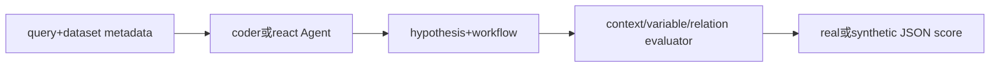

# allenai/discoverybench：DiscoveryBench 的公开源码合同

| 字段 | 值 |
|---|---|
| GitHub | https://github.com/allenai/discoverybench |
| License | 根 `LICENSE` 为 ODC Attribution（ODC-By）；GitHub API 仍为 NOASSERTION |
| 分析 commit | `c31fcf011e070f021a5f5b906896d0821f6880e8` |
| 产品类型 | 科研/机器学习 Agent benchmark 与执行评测 |
| 直接证据 | `README.md`, `LICENSE`, `requirements.txt`, `discovery_agent.py`, `discovery_eval.py`, `agents/coder_agent.py` |

本文用 📘 标注文档或源码中可直接定位的事实，🔶 标注由控制流推导的边界，💬 标注评价与借鉴建议。仓库动态元数据沿用候选清单，源码判断只绑定页面中的固定提交。

## 1. 它到底是什么

DiscoveryBench 是面向数据驱动发现的任务、Agent 和评测仓库。README 将每项任务表示为目标与一个或多个数据集，要求同时进行统计分析和语义推理；开放式假设与工作流通过分面评测进行比较。仓库提供 real 与 synthetic 两类 metadata、coder 与 react 两类 Agent 入口，以及单独的 discovery_eval.py。它关注从数据到假设的发现能力，不是完整科研写作或实验管理系统。

## 2. 运行时堆叠

discovery_agent.py 读取 query、metadata path、metadata type、model/API config 和可选 domain knowledge/workflow tags，实例化 coder 或 react Agent。agents/coder_agent.py 使用 LangChain 工具调用，允许 Agent 执行一次 Python 以回答查询；react 路径则提供迭代式工具交互。eval 目录包含数据元信息处理、假设分解和比较逻辑。模型适配覆盖 OpenAI、Anthropic、Together 和 Google。

## 3. 阶段机或 DAG

流程为 metadata 与数据准备→Agent 生成 hypothesis/workflow→discovery_eval 读取 gold/pred hypothesis/workflow→分别比较 context、variables、relations→写出 JSON 结果。

评测不只做字符串匹配，而是用规则和 LLM 问题比较上下文、变量集合和关系层级；源码静态确认这一设计，不代表本次运行了 evaluator。

## 4. Tool / Skill / Agent 怎么切

Agent 是 coder/react 实现，Tool 是 Python 执行与 LangChain 工具，metadata 是任务合同，eval 是评分层。README 的 `--add_domain_knowledge` 和 `--add_workflow_tags` 是 prompt 增强选项，不是独立 skill registry。一次 coder Agent 的系统提示明确只执行一次 Python，因此不能把它描述为任意长程实验环境。

## 5. 文献怎么来、是否入库、引用约束

metadata 包含 domain、workflow_tags、domain_knowledge、datasets、columns；README 说明 synthetic naming convention。任务与数据来源可追溯到其 metadata，但仓库没有论文入库、claim-evidence span 或引用审计。gold hypothesis/workflow 是评价参照，不自动成为论文引用。

## 6. 实验 / 代码执行

Agent 可执行 Python 读取当前目录数据并记录日志；evaluation 对 context、variables、relations 使用离散/JSON/层级比较，部分判断调用 LLM。源码支持 real/synth 两种 metadata，但未见统一资源预算、容器隔离或多次 seed 的完整合同。本次没有配置 API、执行数据分析或复核分数。

## 7. 写稿怎么做

仓库提供 Agent 日志和 JSON evaluation output，不提供论文章节生成。pred hypothesis/workflow 可以成为实验结果，但写入论文前需要保存 query、metadata、模型配置、完整日志和 evaluator 版本。

## 8. 图怎么做

README 资产包括背景 teaser 和项目结构图，评测代码不负责生成定量图或 publication figure。没有 figure plan、图注证据和视觉质量门。

## 9. 和 RH 的相似点

与 RH 都关心数据、问题、方法和结果的对应关系，都把中间假设/工作流作为可保存对象，并对输出进行结构化评价。DiscoveryBench 的 metadata 和多维 hypothesis 对比可启发 RH 将构念、变量和关系拆开存储。

## 10. 和 RH 的不同点

DiscoveryBench 以数据驱动假设相似性为 benchmark 目标，RH 还要求文献证据、实验执行、统计和稿件发布。其 LLM judge 的相似度分数不能等同于事实支持，单次 Python 执行也不能替代可复现研究。

## 11. 优点 / 缺点

优点：任务定义简洁，real/synth 分离，coder/react 对照明确，context/variable/relation 分维度评估。缺点：一次执行限制缩短了研究链，LLM 评估器可能引入偏差，hypothesis 与 workflow 质量不等同于实验验证，API 配置和数据外部依赖明显，README 榜单不是本次结果。

## 12. RH 可学的 1–3 条

1. 在 RH 中把假设拆成 context、variables、relations，便于检查范围和构念。
2. 把生成 hypothesis、分析 workflow、实测结果分别存 artifact。
3. 对 LLM judge 结果保留原始问题、答案和 evaluator 版本。

## 13. 名字速查表

`discovery_agent.py`：Agent CLI；`coder`：一次 Python 路径；`react`：迭代工具路径；`metadata`：数据说明；`gold_hypo`/`pred_hypo`：假设对；`context/var/rel`：三类比较维度。

补充核验：评测代码会把自然语言假设拆成 context、variables 和 relations，并对变量使用模糊匹配或集合重叠；这使开放答案可被结构化比较，但也意味着评测分数受到提示、元数据描述和 judge 模型的影响。源码没有显示本次独立运行的结果。

> 📌事实边界：本页依据 `c31fcf011e070f021a5f5b906896d0821f6880e8` 固定公开源码快照、2026-09-17 `data/candidates-staging.jsonl` 元数据和下列实际查看文件静态撰写（`README.md`、`LICENSE`、`requirements.txt`、`discovery_agent.py`、`discovery_eval.py`、`agents/coder_agent.py`、`agents/react_agent.py`、`eval/eval.py`、`eval/new_eval.py`、`discoverybench/README.md`）。没有把 README 的榜单、论文结果或运行说明当作本次实测；未调用未配置的模型/API，未运行完整 benchmark（除非明确另有说明），未据此声称运行效果。
