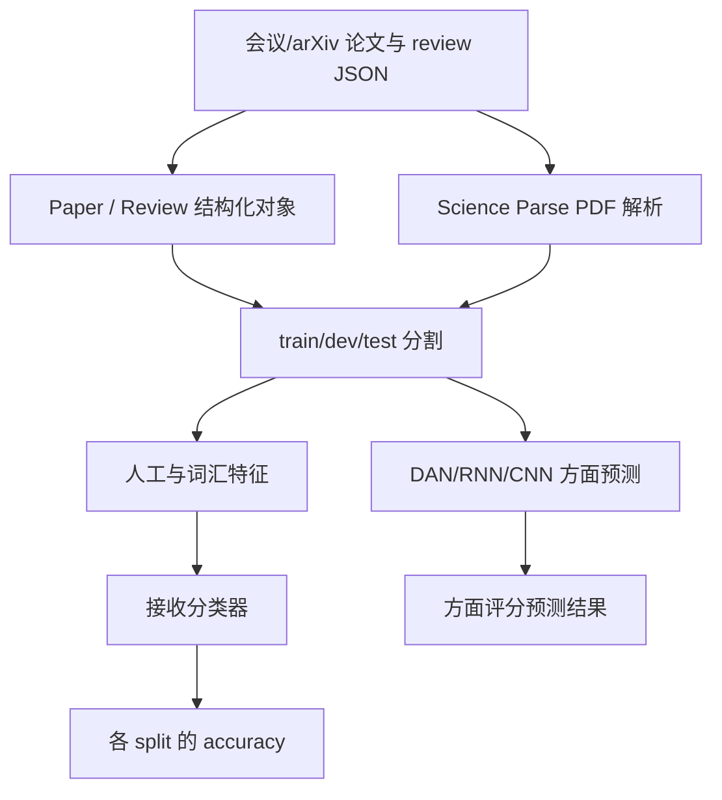

# allenai/PeerRead：把论文、评审意见和接收标签整理成可研究的数据资源

| 字段 | 值 |
|---|---|
| GitHub | https://github.com/allenai/PeerRead |
| License | 根仓库 API 为 NOASSERTION；已查看 ACL 2017 与 CoNLL 2016 子集的 CC-BY-4.0 许可 |
| Stars | 432（2026-09-17 快照） |
| GitHub 最后 push | 2025-12-09 |
| 分析 commit | `9bb37751781a900cee9e74ec3105997732c8e8e5` |
| 产品类型 | 同行评审数据集、结构化解析与传统 NLP 基线 |
| 分析方式 | 固定提交 README、数据模型、分类器及许可证静态阅读 |

本文用 📘 标注文档或源码中可直接定位的事实，🔶 标注由控制流推导的边界，💬 标注评价与借鉴建议。仓库动态元数据沿用候选清单，源码判断只绑定页面中的固定提交。

## 1. 它到底是什么

PeerRead 是论文草稿、同行评审和接收决定的数据资源及配套研究代码。README 将它关联到 NAACL 2018 的数据集论文，报告包含超过 14K 篇论文草稿及接收/拒绝标签，并为其中一部分提供超过 10K 条专家评审。数据按会议或 arXiv 类别组织，再分 train、dev、test。

它不是一个自动审稿 agent，也没有完整科研执行循环。核心价值在于让研究者能把论文文本、评审方面评分和最终决定放在统一结构中做 NLP 实验，例如预测论文是否被接收，或根据文本预测 clarity、originality 等评审维度。标签描述的是历史评审与会议决定，不是自然科学真值；预测这些标签不自动等价于判断论文是否正确、可复现或值得发表。

## 2. 运行时堆叠

`code/models/Paper.py` 与 `Review.py` 定义对象和 JSON 转换。Paper 包含标题、摘要、ID、reviews，以及可选作者、会议、accepted、score、scienceparse、关键词、提交日期和 arXiv 历史信息；Review 包含 comments、recommendation、clarity、replicability、soundness/correctness、originality 等可选维度。

数据预处理脚本把 PDF 与 review JSON 分割为 train/dev/test，并调用 Science Parse 生成解析结果。模型实验分 `accept_classify` 与 `aspect_predict`：前者产生词汇和人工特征后训练 scikit-learn 分类器，后者用 DAN、RNN、CNN 等模型预测方面分数。requirements 固定 TensorFlow 1.2、gensim 2.3 等旧依赖，复现环境需要按历史版本处理，不能从最后 push 时间推断其已经适配当前软件栈。

## 3. 阶段机或 DAG

这里的 DAG 是离线数据处理和训练评价，不是持续运行的 agent 状态机。仓库已经提供部分预处理数据，README 说明 NIPS 等部分因许可约束只给下载/处理指引。数据集 split 是实验协议的一部分；重新执行 prepare 随机划分可能与论文固定划分不同，因此复现者需要明确使用发布划分还是自行构造划分。

## 4. Tool / Skill / Agent 怎么切

PeerRead 没有在线 Tool/Skill/Agent 分工。它的主要组件是数据模型、解析器、特征提取器和分类器。`Paper` 聚合一篇论文与多条 review；`Review` 保存意见与方面评分；Science Parse 把 PDF 转为可用文本结构；`featurize.py` 将论文和评审转成向量。

`classify.py` 训练 LogisticRegression、SVC、MLP 与 AdaBoost 等候选模型，用五折交叉验证选择最佳分类器，再输出 train/dev/test accuracy。模型候选和标签是离线机器学习实验的元素，不是模拟审稿人的角色。所读固定提交没有 MCP 服务、宿主 Skill 或 LLM tool calling 协议。

## 5. 文献怎么来、是否入库、引用约束

数据来源包括会议评审流程、OpenReview、arXiv 和相关公开资料。README 强调 ACL/CoNLL 数据收集有作者和 reviewer opt-in，部分数据受许可限制而不直接放入仓库。目录本身就是静态语料库，按 venue/category 和 split 存储，不是带 topic、claim、evidence span 的研究数据库。

每篇论文的 parsed PDF 和 review JSON 有关联 ID，适合研究评审文本、文档内容与标签之间的关系；但没有引用存在性核验或主张支持约束。解析到参考文献、作者或 citation 特征，不表示其真实性已验证。数据再利用还需按子集许可证与伦理约定处理，尤其不能把仓库公开视为所有评审者身份和文本都可任意二次用途。

## 6. 实验 / 代码执行

acceptance classification 先运行 `featurize.py`，生成各 split 的向量，再由 `classify.py` 训练与比较候选分类器。源码打印类别分布、多数类基线、最佳交叉验证成绩及 train/dev/test accuracy。方面预测目录提供神经模型与数据辅助代码，README 给出模型和 aspect 参数。

这是实际训练代码路径，但本次没有运行 TensorFlow、下载预训练向量、启动 Science Parse 或复现论文结果。旧版依赖与当前 Python/scikit-learn 默认参数可能存在兼容问题，因此不能承诺开箱运行。更重要的是，即使分类 accuracy 很高，也可能学习会议偏好、写作风格、领域或时间差异，而不是科学可靠性。评价构念必须保持为“历史接收标签/评分预测”。

## 7. 写稿怎么做

PeerRead 提供研究数据、引用条目和实验代码，不生成新论文或评审稿。它没有 LaTeX 编辑、段落改写、审稿意见转修订或参考文献自动编排主链。评审 comments 是数据对象，不是系统在线生产的建议。

用于写作研究时，PeerRead 可以成为训练/测试集或观察性分析材料，但论文中应明确数据来源、会议年份、split、缺失字段和标签含义。不能因为模型预测了 clarity 或 acceptance 就声称它能修好稿件；从评分预测到可执行修改之间仍需独立任务定义和验证。

## 8. 图怎么做

该仓库重点是数据和模型实验，README 没有描述自动论文 figure suite。分类器输出和方面预测结果可供绘制混淆矩阵、标签分布或特征分析图，但本次没有运行或复核任何性能图。

对于该数据集，图表首先应说明覆盖：哪几个 venue、哪几年、多少有 review 的论文、哪些方面字段缺失。把不同会议的原始评分直接画到同一纵轴可能混淆尺度，accepted 与 reviewer recommendation 也应分开。这些是使用建议，不能写成上游已实现的可视化质量闸。

## 9. 和 RH 的相似点

两者都需要把论文与相关评审材料结构化，而不是只保存大段自然语言。PeerRead 的 Paper—Review 关系、可选字段和固定 split 对 RH 的研究资料导入具有参考意义。其数据许可证按子集区分，也提醒研究平台把来源和授权信息作为一等元数据。

它还提供了简单、可解释的基线，说明一个复杂的 LLM 审稿系统应与传统特征模型或多数类基线比较，而不能只展示生成文本。基线的作用是界定任务难度，不是评价整个科研工作流。

## 10. 和 RH 的不同点

PeerRead 是静态资源与离线学习代码，RH 的比较范围是有状态的研究工作流。它没有任务推进、人工决策、artifact lineage、引用核验、实验执行管理或发布 gate。PeerRead 的 accepted 和方面分数来自历史人评，RH 的证据闸则应围绕具体主张和证据作判断。

因此，PeerRead 更适合当评审研究的数据底座或模型测试集，而不是直接作为自动审稿器。将历史标签接入 RH 也必须保留观测数据的来源和构念限制，不能把它升级为科学正确性真值。

## 11. 优点 / 缺点

**优点**：数据模型清晰，论文与 review 可按 ID 关联；提供固定 train/dev/test 与传统基线；包含多个评审方面字段，支持比单一接收标签更细的研究；部分子集明确提供 CC-BY-4.0 许可；历史数据具有研究价值。

**局限**：字段和许可并非所有子集一致；历史会议标签具有偏好和时间依赖；旧 TensorFlow/gensim 环境增加复现成本；数据覆盖不能代表所有学科；本次未统计完整数据、未验证外部下载可用性、未复现性能。根目录 NOASSERTION 不是一个统一的开源授权，已查看子集许可证也不能自动覆盖全仓库。

## 12. RH 可学的 1–3 条

1. **把 paper、review、decision 与方面评分分开建模**，避免以接受标签代替质量真值。
2. **导入时保留 venue/year/split/license 和缺失字段**，让分析知道数据覆盖边界。
3. **给审稿相关模型提供简单基线**，用固定划分比较，而不是只凭生成意见的流畅度判断能力。

## 13. 名字速查表

| 名字 | 先决概念 | 含义 |
|---|---|---|
| `Paper` | 文档对象 | 标题、摘要、ID、reviews 与论文元数据 |
| `Review` | 评审对象 | comments、recommendation 与方面分数 |
| Science Parse | PDF 解析 | 将论文 PDF 转成结构化文本 |
| `featurize.py` | 特征工程 | 生成词汇和人工特征 |
| `classify.py` | 分类基线 | 选择并评价接收标签分类器 |
| `aspect_predict` | 方面预测 | DAN/RNN/CNN 的评审维度预测代码 |
| train/dev/test | 实验划分 | 训练、模型选择与测试数据集合 |
| accepted | 历史决定 | 会议接收标签，不是科学真实性标签 |

---

> 📌事实边界
> 本页仅阅读固定提交公开文件，未下载补充数据、未训练基线、未运行 Science Parse，也未确认 README 数量是否与每个目录当前内容完全一致。14K/10K 规模来自上游 README；许可只确认 ACL2017 与 CoNLL2016 子集为 CC-BY-4.0，不能据此推断所有代码和数据共享相同许可。核对入口为 [README](https://github.com/allenai/PeerRead/blob/9bb37751781a900cee9e74ec3105997732c8e8e5/README.md)、[Paper](https://github.com/allenai/PeerRead/blob/9bb37751781a900cee9e74ec3105997732c8e8e5/code/models/Paper.py) 和 [分类器](https://github.com/allenai/PeerRead/blob/9bb37751781a900cee9e74ec3105997732c8e8e5/code/accept_classify/classify.py)。
