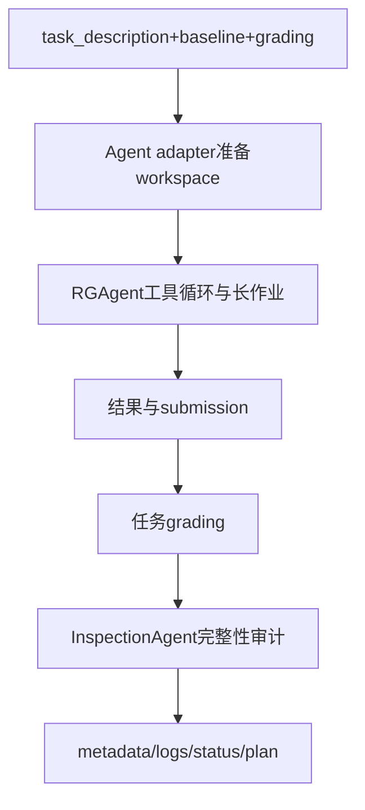

# Anikethh/ResearchGym：ResearchGym 的公开源码合同

| 字段 | 值 |
|---|---|
| GitHub | https://github.com/Anikethh/ResearchGym |
| License | NOASSERTION（GitHub API staging 值；公开树根目录未见 LICENSE 文件） |
| 分析 commit | `0adc08e93754b606d8a76055ed2f1c9574504312` |
| 产品类型 | 科研/机器学习 Agent benchmark 与执行评测 |
| 直接证据 | `README.md`, `pyproject.toml`, `run_agent.py`, `run_inspector.py`, `agents/rg_agent_adapter.py`, `agents/inspection_agent_adapter.py` |

本文用 📘 标注文档或源码中可直接定位的事实，🔶 标注由控制流推导的边界，💬 标注评价与借鉴建议。仓库动态元数据沿用候选清单，源码判断只绑定页面中的固定提交。

## 1. 它到底是什么

ResearchGym 是评估 LLM Agent 执行开放式 AI research task 的 benchmark。README 规定任务提供研究问题、裁剪后的代码仓库、数据、评价脚本和 baseline，Agent 需设计新方法、实现并运行实验，在 12–24 小时和固定 API budget 内超越 baseline。当前公开测试集含 continual learning、cross-modal retrieval、replay buffer、materials tokenization、time-series explanation 五项，强调研究决策而非代码补全。

## 2. 运行时堆叠

run_agent.py 选择 task、Agent adapter、runtime、model、时长和 GPU；RGAgent 基于 inspect_ai，提供 bash/python、文件读写、搜索、异步 job、可选 web search/browser、cost tracking 和 end_task。Adapter 负责准备 workspace 与启动命令；runtime 可在 uv 或 Docker 中执行。InspectionAgent 在运行后审计 grading script 修改、硬编码、数据泄漏、baseline 改写和 cherry-pick seed。

## 3. 阶段机或 DAG

流程为任务目录与 baseline→adapter 复制输入→uv/Docker 运行 Agent→代码/实验/结果→grade.sh 或任务 grader→InspectionAgent 审计→run artifacts。

README 明确提供 dry_run、resume、budget 和 basic_hours 参数；未运行不等于这些路径都在本机可用。

## 4. Tool / Skill / Agent 怎么切

RGAgent 是参考 Agent，InspectionAgent 是后置审计 Agent，adapter/runtime 是编排；工具按执行、文件、后台作业、web、控制分类。cost_tracker/cost_logger 保存 token/API 费用。任务中的 grade.sh 是科学结果评分边界，InspectionAgent 的 critical violation 包括任何 grade/evaluate 修改。

## 5. 文献怎么来、是否入库、引用约束

任务来源是 ACL/ICML/ICLR 论文，task_description 会写研究目标、实验设置、metric 和 baseline；RGAgent 可选 web/literature search，但仓库没有通用 paper pool、claim-evidence 或 citation checker。审计的是执行公平性而非引用真实性。

## 6. 实验 / 代码执行

Agent 可运行长时训练和异步作业，成本达到 RG_BUDGET_LIMIT 会停止；Docker 可提供生产运行，RL 任务可请求 GPU；Inspector 比较原始 task 与 run workspace 并输出 PASS/SUSPICIOUS/NEEDS_REVIEW。README 给出的分数/时长是项目说明，未在本次运行。

## 7. 写稿怎么做

运行产物包括 workspace、transcript、adapter/agent/exec logs、cost_summary、metadata、status、plan 和结果。没有自动论文生成或引用审查；实验报告需由外部系统完成。

## 8. 图怎么做

README/网站包含任务和架构图，RGAgent 工具会允许 Agent 自行产生 plot，但仓库没有统一科学 figure suite、图注绑定或出版 QA。

## 9. 和 RH 的相似点

与 RH 都重视开放式研究任务、长时执行、成本、实验产物、失败/审计和可恢复状态；InspectionAgent 对 grading integrity 和 leakage 的检查尤其接近 RH 的诚实闸。

## 10. 和 RH 的不同点

ResearchGym 以超越 baseline 的任务分数为核心，RH 还要求文献证据、研究论证、统计和稿件发布。Inspector 能发现作弊迹象，但不能证明科学结论、图表或引用准确。benchmark 任务是有限的裁剪仓库，不等于现实科研开放世界。

## 11. 优点 / 缺点

优点：研究任务比固定 coding benchmark 更开放；固定 budget/time、baseline、grade、resume、Docker/uv 和异步工具清楚；后置 Inspector 将作弊/泄漏列为独立闸。缺点：长时运行成本高，外部 Agent/模型和 GPU 依赖大，审计可能仍需人工，任务数有限，分数对 prompt、seed 和资源敏感，未提供 RH 式证据层。

## 12. RH 可学的 1–3 条

1. 将 Agent workspace、transcript、cost、status 和 inspection report 作为实验 lineage。
2. 把 grading integrity 与科学结果质量分开验收。
3. 对开放式实验报告同时保留 baseline、资源、seed 和所有失败尝试。

## 13. 名字速查表

`RGAgent`：参考科研 Agent；`InspectionAgent`：运行后完整性审计；`Adapter`：Agent 接入；`AgenticEnv`：运行环境；`start_async/check_async`：后台实验；`RG_BUDGET_LIMIT`：费用闸；`PASS/SUSPICIOUS/NEEDS_REVIEW`：审计裁决。

补充核验：RGAgent 文档明确将 web search/browser、async jobs、write/replace 和预算作为可配置工具，InspectionAgent 则把修改 grading、硬编码和泄漏列为红线。是否启用某工具取决于运行环境变量和 Agent provider，不能从参考文档推断每次运行都使用全部工具。

> 📌事实边界：本页依据 `0adc08e93754b606d8a76055ed2f1c9574504312` 固定公开源码快照、2026-09-17 `data/candidates-staging.jsonl` 元数据和下列实际查看文件静态撰写（`README.md`、`pyproject.toml`、`run_agent.py`、`run_inspector.py`、`agents/rg_agent_adapter.py`、`agents/inspection_agent_adapter.py`、`agents/RGAgent/README.md`、`agents/InspectionAgent/README.md`、`agents/RGAgent/cost_tracker.py`、`agents/RGAgent/_async_jobs.py`、`utils/logging.py`、`tasks/paper_task_mapping.txt`、`environment/runtime/uv_runner.py`、`environment/runtime/docker_runner.py`）。没有把 README 的榜单、论文结果或运行说明当作本次实测；未调用未配置的模型/API，未运行完整 benchmark（除非明确另有说明），未据此声称运行效果。
