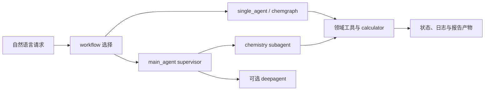

# argonne-lcf/ChemGraph：把计算化学工具接入可持久化 Agent 工作流

| 字段 | 值 |
|---|---|
| GitHub | https://github.com/argonne-lcf/ChemGraph |
| License | Apache-2.0 |
| Stars | 157（2026-09-17 冻结快照） |
| 最后 push | 2026-09-16 |
| 分析提交 | `ef9ef71efca14ccef598a9e0fbab5478039d0be8` |
| 快照日期 | 2026-09-17 |
| 产品类型 | 计算化学与材料 Agent framework |
| 分析证据 | `README.md`、`pyproject.toml`、`docs/workflows.md`、`src/chemgraph/graphs/main_agent.py`、`src/chemgraph/memory/durable.py`、`docs/mcp_servers.md`、`src/chemgraph/tools/report_tools.py` |

本文用 📘 标注文档或源码中可直接定位的事实，🔶 标注由控制流推导的边界，💬 标注评价与借鉴建议。仓库动态元数据沿用候选清单，源码判断只绑定页面中的固定提交。

## 1. 它到底是什么

ChemGraph 是面向计算化学与材料科学的领域 Agent framework。README 把它定位为把自然语言请求连接到分子构造、模拟、分析和报告工具，底层使用 LangGraph、ASE、RDKit 与 Model Context Protocol。它同时提供 CLI、Python API、Streamlit、MCP server 和可选 HPC/分布式执行，因此更准确的说法是“化学工具编排运行时”，不是单一的性质预测模型或自动论文作者。README 自己要求使用者复核输入、calculator settings、收敛、单位和科学结论，这也是能力边界的重要组成部分。

## 2. 运行时堆叠

pyproject.toml 列出 deepagents、LangGraph/LangChain、MCP、ASE、RDKit、pymatgen 等依赖，其中 Agent/MCP 栈有精确版本锁定，部分科学库采用版本下限或未限定版本，Parsl、Globus Compute、Academy、RAG、docking 和 XANES 属于可选 extra。CLI 负责模型、workflow、输出和报告选项；普通运行把日志、结构、JSON、轨迹、谱图和 HTML 报告放进 cg_logs。main_agent 通过 checkpoint 保存长期交互状态；durable.py 能识别内存、AsyncSqliteSaver 和外部 checkpointer。这里的持久化是会话与图状态恢复，不应扩大解释为跨项目 claim-evidence 数据库。

## 3. 阶段机或 DAG

公开 workflow 文档把 single_agent 作为通用入口，main_agent 作为带持久 checkpoint 的 supervisor，multi_agent 负责专业图间路由；另有 deep_agent、RAG、XANES、docking、gRASPA 和 python_relp。main_agent 源码默认注册 chemgraph 子 Agent，启用选项后再注册 deepagent，后者负责 workspace 探索、编辑、测试和数据分析。

箭头表示源码中可见的调用关系；产物存在不代表科学结论已经独立审计。

## 4. Tool / Skill / Agent 怎么切

single_agent 暴露分子查找、SMILES 转结构、ASE 计算、分析与报告工具；MCP 文档列出名称查找、3D 构造、ASE calculation 和结果提取。main_agent 用 middleware 注入 read_file 与 task，并校验 subagent 的名称、描述、invoke/ainvoke 接口和工具名冲突。deepagent 使用文件系统 backend 与 approval policy。MCP 是工具协议边界，不是科学知识标准；calculator、外部 executable、站点配置和凭据仍由部署者提供。

## 5. 文献怎么来、是否入库、引用约束

README 的 aspirin 示例可以调用 PubChem，RAG workflow 可以查询文本/PDF；可选 embedding 和数据源取决于配置。公开文件没有显示统一论文池、引用键、claim-level source relation、DOI 核验或跨项目文献入库。因此只能确认它能在任务中调用化学信息和文档检索，不能写成每个回答都具有可追溯文献证据。

## 6. 实验 / 代码执行

本地路径能用 ASE 的 EMT/MACE 等 calculator，文档还列 NWChem、ORCA、AIMNet2、TBLite/UMA；execution package 提供 local、Parsl、Ensemble Launcher 和 Globus Compute。python_relp 在进程内执行生成 Python，deepagent 的 shell 也可能访问 workspace 外主机路径；文档把这些列为安全风险。HPC 路径需要额外 allocation、endpoint、凭据和站点设置。本次只读检查未调用模型、calculator 或集群，不把“支持”写成成功运行。

## 7. 写稿怎么做

README 的 `--report` 选项和 report_tools.py 表明可以生成 HTML 报告，structured output 也可由 CLI 请求。main_agent prompt 要求综合子 Agent 结果并避免捏造科学结果。但公开合同没有 venue-specific manuscript schema、参考文献 parity、claim citation gate 或审稿修订闭环，因此 HTML 是运行报告产物，不是经同行评审的论文。

## 8. 图怎么做

工具会写 XYZ、JSON、trajectory、spectra 和 HTML report；UI 可选 py3Dmol、Plotly。公开证据没有独立 figure plan、面板覆盖矩阵或图表 fidelity 审计。结构和谱图可以来自计算，但图注、单位、误差和发表级视觉检查仍需下游流程。

## 9. 和 RH 的相似点

它和 RH 都把自然语言、专业工具、执行状态和研究产物连接起来，也都重视人工介入、checkpoint 和安全边界。ChemGraph 的 subagent 记录、MCP 工具和结果文件对 RH 的工具合同设计有参考价值。两者都不能把 Agent 输出自动视为科学结论。

## 10. 和 RH 的不同点

ChemGraph 的中心对象是 Agent graph、message state、checkpoint 和 workspace；RH 更强调跨阶段 artifact、evidence、gate 和 provenance。ChemGraph 没有公开强制要求每个结论绑定 source span、实验记录和证据版本。approval 是动作安全边界，并不等于科学正确性 gate；HPC、文件系统和外部二进制差异也留给部署方。

## 11. 优点 / 缺点

优点：领域工具覆盖广，CLI/Python/UI/MCP 入口齐全；workflow 文档把依赖和风险写清；main_agent 对子 Agent 接口和工具冲突有启动时校验；支持人工监督与持久 session。缺点：依赖栈较重且变化快；python_relp、deepagent shell 和 MCP 的权限面需要隔离；可选 HPC 路径不是零配置；公开文件未证明跨阶段引用、证据链与结果复现已经自动保证。

## 12. RH 可学的 1–3 条

1. 将领域工具拆成可检查的 workflow profile，并在 CLI 标注外部依赖与权限。2. 借鉴 main_agent 对 subagent 和工具接口的显式启动校验。3. 保持 session 状态与 workspace 文件分开，但把输入、版本、结果和证据关系提升为独立 artifact。

## 13. 名字速查表

| 名字 | 先决概念 | 含义 |
|---|---|---|
| `single_agent` | workflow | 默认化学工具路径 |
| `main_agent` | supervisor | 管理委派与综合的长期 Agent |
| `deepagent` | workspace | 文件、测试和数据分析子 Agent |
| `MCP server` | tool protocol | 暴露化学工具的协议服务 |
| `AsyncSqliteSaver` | checkpoint | 图状态的 SQLite 检查点后端 |
| `python_relp` | code execution | 在进程内执行 Python 的工作流 |

---

> 📌事实边界
> 本报告依据固定提交中的公开文档与实际查看的代码作静态分析。没有安装或执行被分析仓库，没有连接仪器、GPU 集群或收费模型 API。README/论文的能力和结果声明不等于本次复现；外部数据、模型权重、设备校准、部署稳定性以及科学结论的有效性均需另行验证。
