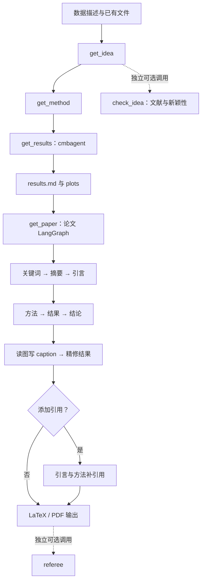

# Denario：双后端、文件驱动的模块化科研助手

- 仓库：https://github.com/AstroPilot-AI/Denario
- 固定提交：`be9d00856c96c0c1002427629b181606fb364995`
- 快照日期：2026-09-17
- 许可证：GPL-3.0；已核对固定提交的根 `LICENSE`，项目版权声明包含 version 3 or later 授权措辞。
- 审核状态：`draft`
- 分析方式：公开源码静态阅读，未运行科研流程。

本文用 📘 标注文档或源码中可直接定位的事实，🔶 标注由控制流推导的边界，💬 标注评价与借鉴建议。仓库动态元数据沿用候选清单，源码判断只绑定页面中的固定提交。

## 1. 它到底是什么

Denario 是一个将数据描述、研究想法、方法设计、计算分析和论文生成连接起来的 Python 科研助手。最准确的理解是：**它用一个较薄的项目外壳，组织两套 Agent 后端，并以 Markdown、图片和 LaTeX 文件衔接各阶段。**

固定提交的 `README.md` 将系统定位为使用 AG2、LangGraph，并以 cmbagent 作为研究分析后端的多 Agent 系统。源码中的 `Denario` 类则负责创建项目目录、读取环境密钥、恢复已有输入文件，以及暴露 `get_idea`、`get_method`、`get_results` 和 `get_paper`。`research_pilot` 把这些方法顺序串起来，构成默认端到端入口。

研究状态由 `denario/research.py` 的 Pydantic 模型保存，字段包括数据描述、想法、方法、结果、图路径和关键词。`denario/config.py` 为这些内容定义稳定文件名，如 `data_description.md`、`idea.md`、`methods.md` 和 `results.md`。用户也可以通过 setter 输入自己的文本或 Markdown 文件，从中间阶段接管流程。

因此，它的“端到端”主要表现为模块覆盖与文件传递，而不是所有科学判断已经由统一的质量闸门保证。仓库中的 GUI 入口依赖另一个 DenarioApp 项目；该外部项目的实现不属于这里固定提交的取证范围。

源码入口：[README.md](https://github.com/AstroPilot-AI/Denario/blob/be9d00856c96c0c1002427629b181606fb364995/README.md)、[denario/denario.py](https://github.com/AstroPilot-AI/Denario/blob/be9d00856c96c0c1002427629b181606fb364995/denario/denario.py)。

## 2. 运行时堆叠

`pyproject.toml` 声明项目版本为 1.0.1，Python 版本范围为 `>=3.12,<3.14`。主要依赖包括 LangGraph、LangChain 的 Google/Anthropic/OpenAI 适配器、cmbagent、PyMuPDF、Pillow 和 FutureHouse 客户端。`denario[app]` 是可选安装项，CLI 入口指向 `denario.cli:main`。

后端分工很明确：

| 层 | 实现与职责 |
|---|---|
| 用户入口 | `Denario` 类，管理项目目录、输入、生成方法和人工接管 |
| 状态 | `Research` 模型及 `input_files` 中的 Markdown |
| 快速研究路径 | `langgraph_agents`，生成想法、方法、文献检查与 referee 报告 |
| 深入研究路径 | `Idea`、`Method`、`Experiment` 调用外部 cmbagent |
| 论文路径 | `paper_agents` 的 LangGraph，分章节生成、插图、补引用 |
| 文档工具链 | XeLaTeX、BibTeX、PyMuPDF、图片处理 |
| 外部服务 | 模型提供商、Semantic Scholar、FutureHouse、Perplexity、arXiv |

`denario/llm.py` 用模型名、最大输出 token 和温度定义模型配置；各阶段可分别传入研究者、工程师、规划器、计划审阅者与格式化器模型。源码里的默认模型名只能说明该提交的接线方式，不能证明这些模型在快照日期仍能正常调用。

两个 LangGraph 构造器都使用 `MemorySaver`。这提供图执行时的内存检查点；跨进程恢复主要还要依赖落盘的项目输入与论文临时文件，不能把它描述成长期数据库式研究记忆。

## 3. 阶段机或 DAG

最外层是顺序过程：数据描述 → 想法 → 方法 → 结果 → 论文。想法与方法各有 `fast` 和 `cmbagent` 模式，默认使用 fast；结果阶段交给 cmbagent。新颖性检查与 referee 是独立方法，**默认 `research_pilot` 没有自动调用它们**。

快速图里有 maker、hater、methods、novelty、semantic_scholar、literature_summary 和 referee 等节点，入口根据任务类型分流。想法生成使用 maker/hater 循环；文献检查在 novelty 和 Semantic Scholar 之间迭代。论文图另有固定章节顺序，并在结果精修后按配置选择补引用或结束。

这里需要留意一个可定位的判断边界。`langgraph_agents/literature.py` 的 `novelty_decider` 在没有命中“not novel”分支时，会在模型返回 novel，**或者迭代数达到上限**时设置 `decision='novel'`。因此，达到检索预算也可能进入“新颖”终态；它不是“证据不足”的保守终态。本次只确认这段分支逻辑，没有执行它或测量误判率。

证据：[快速图](https://github.com/AstroPilot-AI/Denario/blob/be9d00856c96c0c1002427629b181606fb364995/denario/langgraph_agents/agents_graph.py)、[论文图](https://github.com/AstroPilot-AI/Denario/blob/be9d00856c96c0c1002427629b181606fb364995/denario/paper_agents/agents_graph.py)、[新颖性判断](https://github.com/AstroPilot-AI/Denario/blob/be9d00856c96c0c1002427629b181606fb364995/denario/langgraph_agents/literature.py)。

## 4. Tool / Skill / Agent 怎么切

Denario 的分工围绕 Python 类、图节点与角色 prompt 展开，而不是独立的 `SKILL.md` 注册机制。

`Idea` 把生成与批评分给 idea maker 和 idea hater，文档描述了五个候选、缩减为两个、再选择最佳想法的策略。`Method` 组合 planner 与 researcher；`Experiment` 默认让 engineer 实施分析，researcher 解释结果，另由规划、计划审阅、编排和格式化模型辅助。

工具能力与角色能力需要分开理解。Denario 自己直接实现了文件读写、引用 API 请求、图片编码、LaTeX 解析与编译；实验代码的具体执行与代理控制主要委托给外部 cmbagent。本仓库可以证明传入了什么任务和限制，不能代替对 cmbagent 内部沙箱或工具权限的核查。

实验 prompt 还给出了一个重要信息边界：工程师需要把研究者所需的定量信息打印到控制台，因为该工作流中的研究者不读取保存的数据文件；最终结果报告将传给论文写作者，其他上下文不会一并完整传递。这使报告汇总成为科学证据压缩的关键环节。

## 5. 文献怎么来、是否入库、引用约束

文献入口分为两类，不能混成同一个文献库。

第一类是想法检查。Semantic Scholar 节点请求标题、作者、年份、摘要、URL、论文 ID、外部标识和开放 PDF 信息，每次调用限制为 20 条。没有摘要的条目被跳过；保留的元数据写入文献日志与论文处理日志，并把简化文本交回新颖性判断节点。另一条 FutureHouse 路径提交 owl 任务，将回答写入 `literature.md`。

第二类是成稿后的补引文。`paper_agents/literature.py` 调用 Perplexity 的 `sonar-reasoning-pro`，要求保留原文并只添加 arXiv 引用，还设置 `search_domain_filter=["arxiv.org"]`。程序把返回的数字标记映射到链接，再请求 arXiv BibTeX，替换为 `\citep{}`。取不到有效 BibTeX key 的标记会在替换时被删去。

当前 `citations_node` 实际处理的是 Introduction 和 Methods，并非所有章节。它们并发补引文后，程序汇总 BibTeX、净化部分特殊字符、继续编译和清理文本。文献“入库”在这里主要意味着日志、Markdown 和 bibliography 文件落盘，而不是跨项目统一论文对象库。

引用存在、元数据获取成功、段落得到文献支持是三个不同问题。该源码可以确认前两类操作路径，但未见本次读取链路将每个论断绑定到原文证据跨度并作独立支持判定。检索失败、摘要不足和生成式推荐仍需人工复核。

## 6. 实验 / 代码执行

`Experiment.run_experiment` 调用 `cmbagent.planning_and_control_context_carryover`，传入数据描述、想法与方法 prompt、工作目录、模型配置、重启步骤、硬件约束和重试上限。默认参数包括最多 10 次尝试、6 个计划步骤，调用中还设定控制轮数上限 500。这些数字是程序配置，**不是完成过的实验数量或成功率**。

函数读取返回的 `chat_history` 与 `final_context`，从 researcher formatter 的回复中提取 Markdown 代码块作为结果，从 `displayed_images` 获取图路径。外层 `get_results` 将结果写入 `results.md`，清空旧 plots 目录，再移动本轮图片。因此该目录更像当前输出视图，而不是自动保留所有实验版本的不可变记录。

`hardware_constraints` 被原样作为文本传给后端；仅凭这个参数不能推断操作系统级 CPU/GPU 配额。Denario 的已读封装也没有独立验证随机种子、数据切分、评估器哈希或必需指标的统一契约。

`tests/full_paper.py` 是一个串起 API 的脚本，要求围绕谐振子生成数据、图和短论文。文件中没有独立数值断言或本次运行结果。它适合作为使用示例，不能当作该项目已通过科学正确性测试的依据。

## 7. 写稿怎么做

写稿以已有阶段材料为输入，由论文 LangGraph 依次生成关键词、标题和摘要，再生成 Introduction、Methods、Results、Conclusions。通用 `section_node` 负责模型调用、提取 LaTeX 块、可选反思、LaTeX 检查、去除多余包装、保存临时章节以及编译修复。

临时文件存在时，节点会读取缓存而不重新生成。这能缩短恢复路径，但缓存主要按文件是否存在判断；在已读节点中没有看到把每段缓存绑定到输入内容哈希的失效协议。因此修改方法或结果后，需要注意旧章节是否仍被复用。

`save_paper` 根据 Journal 预置组装整篇 LaTeX，支持 AAS、APS、ICML、JHEP、NeurIPS、PASJ 等样式。`fix_latex` 最多尝试三轮修复，利用编译错误让模型改写问题片段。

工程上存在“生成—编译—修复”的循环，但编译成功与科学审核是不同层级。整篇 `compile_latex` 会捕获部分编译错误、记录并继续后续步骤；不能只凭 `get_paper` 返回就断言所有版本均成功编译。referee 也是单独调用，而不是默认写稿的强制终局闸门。

## 8. 图怎么做

图的来源主要是实验阶段：工程师生成图片，cmbagent 返回已显示图路径，Denario 把这些图片放进项目 plots 目录。用户也可以通过 `set_plots` 提供自己的图片。

论文的 `plots_node` 是**读图、写 caption 与插图**，并不是从数值记录生成新统计图的绘图库。它对常见位图进行 base64 编码，对 PDF 读取第一页；逐张请求 caption，再按每批最多 7 张让模型把图融入 Results。若图片超过 25 张，代码用固定随机种子抽取 25 张。这样能控制上下文体积，但图的取舍不是根据主张覆盖度作出的。

插图后会检查图片文件名是否出现在文字中，再编译、精修 Results 和检查图引用。它能减少遗漏图片的格式问题，却不能证明坐标、单位、误差条或图像解释正确。

两个图构造器还可输出 LangGraph 的 Mermaid PNG，这是运行结构图，与实验结果图用途不同。本次没有运行绘图、查看生成论文或验证多模态 caption 质量。

## 9. 和 RH 的相似点

与 Research Harness 相比，Denario 在任务分解上有清楚的共同点：研究工作被拆为想法、方法、计算、写作等模块；每个模块有明确输入和产物；模型能力通过工具与编排连接，而不只停留在聊天建议。

两者都重视可恢复的中间材料，也都允许人工插入研究判断。Denario 的 setter 是很直接的人工接管接口；RH 的研究阶段与产物接口也服务于恢复、检查和继续工作。

文献检查、写作、图与 LaTeX 修复同样属于二者关注的环节。这些相似性是架构与产品任务层面的对照，不是能力排名，也不意味着二者具有相同的实证效果。

## 10. 和 RH 的不同点

Denario 的主轴是 `Research` 对象与固定文件协议；RH 的比较重点则是研究主题、可追踪产物、声明—证据关系和阶段门。Denario 文件可读、入口短，但在已读主链路中，阶段间没有统一的证据状态或基线指标验收契约。

其默认全流程把文献新颖性检查与 referee 留作可选方法。这样的接口方便用户裁剪任务，同时要求使用者自行决定何时进行科学检查；不能因为存在 `check_idea` 和 `referee` 方法，就认定默认流程已经执行了两者。

实验执行也有明显边界：Denario 委托 cmbagent，主要接收结果文本与图；RH 的对照重点是把实验记录、证据来源与论文主张作为可检查对象。论文环节则偏向直接生成和编译，而非先完成所有证据映射再形成交付包。

许可证也影响复用路径。Denario 根许可证为 GPL 系列，文本含 version 3 or later 授权说明；借鉴接口设计与复制实现需要分别评估，不能因为外部 cmbagent 采用另一种许可就替换 Denario 自身的许可结论。

## 11. 优点 / 缺点

**优点**

- 公开入口与阶段关系简单，使用者容易理解从数据描述到论文的路径。
- Markdown 文件可直接编辑，方便人工替换想法、方法或结果。
- fast 与 cmbagent 两类路径提供不同的编排复杂度。
- 论文节点已有章节缓存、图片接入、引文补全和 LaTeX 修复等实用细节。
- 角色分工及模型参数较明确，能定位规划、编码、解释和写作各由哪一层承担。

**局限与风险**

- 新颖性检查达到迭代上限时可被写成 novel，应区别于充分检索后获得的新颖性证据。
- 默认端到端入口没有强制调用文献检查或 referee。
- 实验结果向论文传递时依赖研究者汇总文本，证据细节可能在压缩中丢失。
- 编译、引文存在性与科学论断正确性没有统一成同一种验收。
- 外部 cmbagent、模型服务及 LaTeX 环境决定了相当部分运行行为；固定根仓库提交没有同时固定整个运行环境。
- 论文临时缓存按文件存在复用，修改上游材料时需要额外管理一致性。

这些结论来自固定版本代码，不是故障率测量或对所有可能部署方式的推断。

## 12. RH 可学的 1–3 条

1. **在严格的证据层之外提供简洁的阶段文件视图。** Denario 的数据、想法、方法和结果文件让人工接管很直接。RH 可以让每个阶段都有稳定、可读的摘要入口，同时保留原始证据与结构化状态。

2. **把不同执行深度写成显式接口。** fast 与 cmbagent 的分支让用户知道自己选择了哪条路径。RH 可借鉴这种显式性，将探索草稿与证据生产的成本、产物和验收标准分别展示。

3. **保持局部恢复，但为缓存绑定输入版本。** 按章节保存临时结果非常实用；RH 可在这种粒度上进一步记录输入摘要与依赖，避免旧章节在上游证据变化后被无条件复用。

## 13. 名字速查表

| 名字 | 含义 |
|---|---|
| `Denario` | 用户面对的项目与阶段编排类 |
| `Research` | 保存描述、想法、方法、结果、图路径和关键词的状态模型 |
| `Idea` | 使用 cmbagent 的想法生成封装 |
| `Method` | 使用 cmbagent 的方法生成封装 |
| `Experiment` | 委托规划控制、收集结果文本与图片的实验封装 |
| `build_lg_graph` | 快速想法、方法、文献和 referee 的图构造器 |
| `build_graph` | 论文写作图构造器 |
| `novelty_decider` | 决定继续检索或输出新颖性判断的节点 |
| `semantic_scholar` | 调用 Semantic Scholar 并写文献日志的节点 |
| `plots_node` | 读取已有图、生成 caption 并插入 Results |
| `citations_node` | 当前为 Introduction 与 Methods 补引用 |
| `MemorySaver` | LangGraph 的内存检查点 |
| `cmbagent` | 外部研究规划与分析执行后端 |
| `Journal` | 论文 LaTeX 样式选择 |
| `input_files` | 数据描述、阶段 Markdown 与图片输入目录 |

📌**事实边界**：本文通过 GitHub 固定提交树与 raw 文件读取，核对了 `be9d00856c96c0c1002427629b181606fb364995` 的 README、根许可证、配置、研究编排、文献、实验封装和论文代码，并核验下载文件的 Git blob 哈希。未安装或运行 Denario/cmbagent，未调用模型、Semantic Scholar、FutureHouse、Perplexity 或 arXiv 服务，未生成实验数据、图片或 PDF。README 中的获奖、论文发表、速度及效果说明属于上游陈述，本次没有独立复现；默认参数和示例脚本中的数字也不是本次实验结果。外部 DenarioApp、cmbagent 和示例论文仓库未作为该根提交的已读源码证据。
