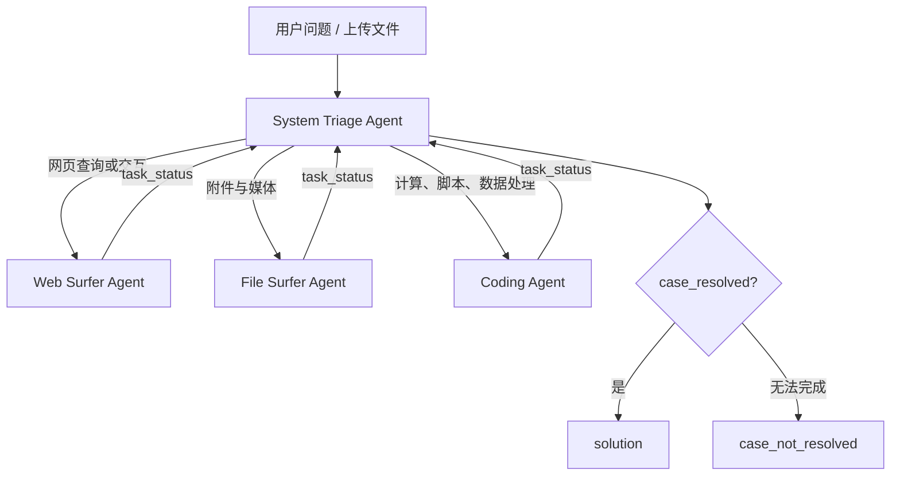

# HKUDS/Auto-Deep-Research：用分诊、多专长 Agent 与容器工具完成通用深度调查

| 字段 | 值 |
|---|---|
| GitHub | https://github.com/HKUDS/Auto-Deep-Research |
| License | 仓库未附 LICENSE；Python 包元数据标注 MIT |
| Stars | 1,742（2026-09-17 快照） |
| GitHub 最后 push / 分析 commit | 2025-10-16 · `9d671a3` |
| 产品类型 | 通用网页、文件与代码研究助手；不是学术论文生产流水线 |
| 分析证据 | CLI、MetaChain 循环、四类 Agent、浏览/文件/代码 Tool 与环境实现 |

## 1. 它到底是什么

Auto-Deep-Research 是 AutoAgent 框架裁出的一个通用深度调查产品。用户通过 `auto deep-research` 进入持续对话，System Triage Agent 判断当前子任务应交给 Web Surfer、File Surfer 还是 Coding Agent；专长 Agent 使用各自工具完成浏览、文件阅读或代码计算，再把状态交还分诊 Agent。最终由分诊 Agent 调用 `case_resolved` 或 `case_not_resolved` 结束一轮任务。

它解决的是“一个问题可能同时需要上网、读附件和写代码”的协作路由，而不是把研究课题推进到可投稿论文。README 将它定位为低成本 personal assistant，并展示多模型接入和 GAIA benchmark；源码中的默认 Agent 也围绕通用问题求解构建，没有学术领域专属的论文检索、证据图、实验协议、LaTeX 或终稿检查。

名称里的 Auto 主要体现在两点：第一，CLI 自动创建代码、网页与文件环境；第二，分诊 Agent 可以在三个专长 Agent 间反复转交，不要求用户手工选择每一步。用户仍可在 CLI 中用 `@Agent_Name` 指定入口，还可以上传文件，因此它同时保留直接控制。

## 2. 运行时堆叠

运行栈从外到内如下：

1. `setup.cfg` 把 `auto` 命令绑定到 `autoagent.cli:cli`；`deep-research` 子命令读取模型和容器配置。
2. CLI 创建 `DockerEnv`、`BrowserEnv` 与 `RequestsMarkdownBrowser`。代码执行位于容器工作区；网页工具操作浏览器；文件工具把本地文档转成可分页的 Markdown。
3. `get_system_triage_agent` 实例化分诊 Agent 及三个专长 Agent，并动态把 transfer function 加入各自工具列表。
4. `MetaChain.run` 维护消息历史、当前 active agent、context variables 和 tool call 循环。
5. LiteLLM 负责模型调用。代码既支持原生 function calling，也能把工具 schema 写入 prompt，再将文本形式的调用转换回结构化 tool call。
6. CLI 保存同一交互会话中的 messages，并将最终 `<solution>` 内容展示给用户。

`Agent` 数据模型很薄：name、model、instructions、functions、tool choice、parallel flag、examples、视觉回调和 agent team。工具执行结果用 `Result` 承载文本、下一 Agent、context variables 与可选 base64 图像。若 Tool 返回另一个 Agent，`MetaChain` 就把它设置为下一轮 active agent。

默认所有关键 Agent 都设 `tool_choice="required"` 且关闭 parallel tool calls。这保证模型必须采取工具动作或明确结束，降低“只凭模型记忆直接回答”的概率，也意味着长任务以串行工具轨迹为主。

## 3. 阶段机或 DAG

产品主路径是一个可循环的星形 handoff 图，而不是论文阶段机：

每个专长 Agent 完成分配的子任务后，只能通过 `transfer_back_to_triage_agent` 把详细状态交回。分诊 Agent可根据新状态继续派给另一个专长 Agent。例如，Web Surfer 下载 PDF 后返回，分诊再交 File Surfer；File Surfer发现需要计算时返回，分诊再交 Coding Agent。

仓库还包含通用 `EventEngineCls`：它能注册异步 event，让 event 监听一组父节点，以 `all` 或 `any` 条件触发，并发执行队列中的任务。但默认 `autoagent/workflows` 没有具体 workflow 文件，CLI 的 deep-research 路径也直接调用 `MetaChain.run`，并未使用该 event engine。因此，不能把框架里存在 DAG 原语写成产品已经实现一条深度研究 DAG。

## 4. Tool / Skill / Agent 怎么切

四个 Agent 的分工直接体现在源码中：

- **System Triage Agent**：只有结束函数和三个 transfer 函数。它不亲自浏览或运行代码，负责判断下一专长。
- **Web Surfer Agent**：拥有 click、滚动、前进后退、输入、等待、访问 URL、Bing 搜索和页面转 Markdown 工具，主要观察 accessibility tree。
- **File Surfer Agent**：打开本地文件，把 PDF、Office、音频等转换成可分页文本，支持页内查找，并通过 `visual_question_answering` 分析图片或视频。
- **Coding Agent**：查看目录和文件、创建或改写文件、执行命令、运行 Python，并能翻阅过长的终端输出。

工具是普通 Python callable。`function_to_json` 从函数签名和 docstring 生成 schema；`MetaChain.handle_tool_calls` 找到同名函数、注入 `context_variables`、执行并把结果追加为 tool message。Agent handoff 也复用同一机制：transfer function 返回包含 `agent` 的 `Result`，不需要另建调度协议。

这里没有 Claude Code Skill 包，也没有公共 MCP server。所谓 Agent team 是一个运行时字典和一组 transfer functions。注册器虽然支持 tool、agent、plugin 和 workflow 类型，当前产品只把固定四 Agent 暴露给 CLI。

## 5. 文献怎么来、是否入库、引用约束

默认文献路径是通用网页浏览：Web Surfer 用 Bing 搜索，打开结果页，读取 accessibility tree，必要时把当前页面转成 Markdown。若遇到 PDF，可下载到工作区，再让 File Surfer 解析、分页和查找。这个组合足以完成“搜索论文—打开 PDF—定位文本”的人工式流程。

它没有专门的 scholarly provider、论文 metadata 规范化或 citation manager。默认 Agent 工具表中不存在 DOI/arXiv ingest、BibTeX 导出、撤稿检查、引用去重或 claim-to-source link。仓库有 ChromaDB、RAG memory 和 `paper_memory.py` 等框架遗留组件，但默认 deep-research 的四 Agent 构造函数没有把 paper memory 或 RAG query 注册为工具，不能据此认为每次检索都会入库。

网页和文件内容作为消息或浏览器 viewport 继续参与当前会话；没有 topic paper pool，也没有跨会话可审计的 evidence object。最终 `case_resolved` 只要求把答案放进 `<solution>`，并未强制 inline citation、reference list 或来源覆盖率。因此，系统能找到与阅读论文，但引用忠实度取决于 Agent 当轮行为和最终文本，缺独立约束。

## 6. 实验 / 代码执行

Coding Agent 是产品中最接近“实验”的部分。它可以在 Docker 工作区创建 Python 文件、安装依赖、运行脚本、执行 shell 命令、查看错误并继续修改；prompt 还要求优先复用现有代码、写完后运行与调试。`run_python` 会确定脚本目录、构造 `PYTHONPATH` 并在容器中执行模块，长输出则写入临时文件供分页查看。

这种能力适合调查任务中的计算、数据转换、API 请求和小型验证，但没有科研实验的上层合同：没有冻结数据集、基线/方法矩阵、seed、指标方向、资源预算、结果记录 schema 或统计检验。运行输出主要回到 Tool message；程序生成的文件也没有自动登记成版本化 artifact。

容器把生成代码与主环境隔开，是比宿主直接执行更合理的默认值。另一方面，Coding Agent拥有通用 shell 和安装依赖的能力，仍需要镜像、网络、资源限制与工作区权限策略才能成为多租户服务。源码中的 prompt 边界不等同于系统级强制边界。

README 引用 GAIA 表现，仓库未提供一套对应的独立 benchmark test suite；本次审读没有执行模型、浏览器或容器环境，因此不把性能和成本宣传当作复现结果。

## 7. 写稿怎么做

默认写作产物是一次问答的 `<solution>`，由 CLI 提取后打印。分诊过程保留消息历史，专长 Agent 可以把网页、文件和计算结果汇总给分诊 Agent，但没有“研究计划—提纲—分节草稿—引用校验—统一润色—终稿”阶段。

Coding Agent可以创建任意文本文件，因而模型理论上能按用户要求写 Markdown；这只是通用文件写入能力。源码没有报告 schema、篇幅目标、section contract、LaTeX 模板、BibTeX、venue profile、稿件一致性检查或 PDF 编译。`case_resolved` 也只检查固定字符串和 `<solution>` 包装，不验证答案中的每个事实是否有来源。

它的优势是写作前可在 Web、File、Code 三种能力间来回收集材料；若上层为其提供结构化写作合同，它可以充当执行层。直接把最终聊天答案当论文稿，则会丢失来源、实验和版本治理。

## 8. 图怎么做

产品具备“看图”而非正式“出图”链。File Surfer 的 `visual_question_answering` 可读取图片；对视频，它按时间抽帧、提取音频、用 Whisper 转写，再把关键帧与转写一起交给多模态模型。网页工具的数据结构支持 screenshot，但 `to_web_obs` 在当前实现中把 screenshot 设为 `None`，所以 Web Surfer 默认主要依赖 accessibility tree，而不是持续接收页面截图。

Coding Agent安装依赖列表包含 matplotlib，也能写 Python 生成图文件；默认流程没有 figure plan、图种选择、实验数据映射、caption、panel provenance、视觉审查或出版格式导出。图片问答的输出是文字描述，不应视为论文图生成器。

## 9. 和 RH 的相似点

- 都把网页、文件和代码能力拆成可路由工具，而不是用一个超长 prompt 模拟全部能力。
- 都需要在长任务中保存上下文，并根据当前状态决定下一动作。
- Docker 工作区与 RH 对实验执行环境进行隔离的方向一致。
- Agent handoff 能表达“先搜索、再读文件、再计算”的跨能力链，类似 RH Skill 调用多个底层 Tool。
- 原生 function calling 与文本工具协议双路径，为不同模型接入提供了兼容层。

## 10. 和 RH 的不同点

- Auto-Deep-Research 以会话和 active agent 为核心；RH 以 topic、paper、claim、evidence、artifact、checkpoint 和 provenance 为核心。
- 它的分诊依据是 prompt 和当前消息；RH 的阶段转移还要满足可计算 gate。
- 它不区分“网页找到一篇论文”和“论文已经规范化 ingest 并成为可引用证据”。
- Coding Agent能运行任意任务代码，RH 的正式 experiment 需要预先定义研究协议、结果边界和版本依赖。
- Auto-Deep-Research 没有论文写作、figure suite、审稿、PDF 终检和 manuscript commit。
- RH 把 Agent runtime 交给宿主，以 MCP Tool 与 Skill 暴露能力；该项目自建 LiteLLM Agent loop 和 CLI。
- RH 面向可恢复、多课题、可审计工作流；该项目的默认状态主要留在当前消息和工作区文件中。

## 11. 优点 / 缺点

**优点**

- 分诊 + Web/File/Code 三专长的心智模型简单，职责在代码和 prompt 中都很清楚。
- Agent transfer 与普通 Tool 共用 `Result(agent=...)`，实现短、易追踪，没有额外调度框架。
- Docker、浏览器和文件浏览器三类环境分离，比所有动作直接落在宿主更稳妥。
- 对原生 function calling 和非 function-calling 模型都有适配，模型选择由 LiteLLM 抽象。
- File Surfer 能处理文档、图片、音频和视频，通用材料覆盖较宽。
- `tool_choice="required"` 让系统更倾向于实际调用环境，而非直接凭参数记忆作答。

**缺点**

- 产品名强调 deep research，但默认实现没有计划、证据、引用、报告和质量检查阶段。
- 通用 EventEngine 与 memory/RAG 模块没有接入默认 deep-research 路径，源码表面积大于实际产品主链。
- 最终完成由同一个模型选择 `case_resolved`，缺来源覆盖、证据充分性和结果可复现 gate。
- 工具返回以自由文本为主；跨 Agent 交接的 `task_status` 没有严格 schema，容易在长轨迹中丢细节。
- Coding Agent的通用命令能力需要更强的资源与网络政策才能安全服务化。
- 仓库没有 LICENSE 文件；`setup.cfg` 虽标注 MIT，公开复用前仍应由维护者补齐明确授权文本。
- README 中 Web GUI 和更多沙箱仍属计划项；当前产品主要是终端交互。
- 固定 commit 的最近更新停在 2025-10，且看不到与主链同等成熟的自动测试面。

## 12. RH 可学的 1–3 条

1. **采用“分诊视图”，不复制第二套编排器**：在 RH UI/Skill 入口根据当前 topic state 推荐 literature、file evidence、experiment/code 或 write 工具，并让所有动作仍落到同一 artifact/gate 状态机。
2. **把 Agent handoff 变成结构化交接包**：保留该项目简单的 transfer 体验，但返回 `subtask、sources、outputs、open_questions、recommended_next_tool`，并写入 provenance，避免只传一段 `task_status`。
3. **提供 function-calling compatibility adapter**：底层 MCP Tool schema保持唯一权威，根据宿主模型能力生成原生函数调用或受约束文本调用；同时用 parity test 保证两种表面调用同一实现。

## 13. 名字速查表

| 名字 | 先决概念 | 含义 |
|---|---|---|
| `auto deep-research` | CLI | 初始化环境并进入持续研究对话的命令 |
| `MetaChain` | agent loop | 调模型、执行 Tool、维护消息并切换 active agent |
| System Triage Agent | routing | 将当前子任务派给网页、文件或代码专长 |
| Web Surfer Agent | browser tools | 搜索、访问并通过 accessibility tree 操作网页 |
| File Surfer Agent | document tools | 解析本地文档、分页查找和处理多媒体 |
| Coding Agent | Docker execution | 创建文件、执行命令和运行 Python 的专长 Agent |
| `Result.agent` | handoff | Tool 返回下一 active agent 的切换字段 |
| `context_variables` | environment injection | 把 code、web、file 环境传给工具的运行时上下文 |
| `case_resolved` | terminal action | 用 `<solution>` 包装最终答案并结束工具循环 |
| `FN_CALL` | compatibility mode | 在原生函数调用和文本工具协议之间切换 |
| `EventEngineCls` | DAG primitive | 框架中的异步事件依赖引擎，默认主链未采用 |
| `visual_question_answering` | multimodal input | 对图片或抽帧视频进行内容问答的文件工具 |

---

> 📌事实边界
> 本页绑定 commit `9d671a334d22d58b34ea12af08994af393bbe685`。四 Agent 路由、Tool 列表、Docker/浏览器/文件环境和模型兼容路径均来自源码；GAIA 表现、成本优势与“开箱即用”属于上游陈述，本次未启动模型、浏览器、容器或外部服务。仓库未附许可证正文，包元数据中的 MIT 标注不足以替代完整授权文件。
