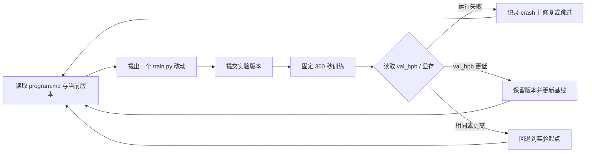

# karpathy/autoresearch：把单 GPU 训练变成可比较的自动实验循环

| 字段 | 值 |
|---|---|
| GitHub | https://github.com/karpathy/autoresearch |
| License | 未声明（GitHub API NOASSERTION） |
| Stars | 96,108（2026-09-17 元数据快照） |
| GitHub 最后 push | 2026-03-26 |
| 分析 commit | `228791fb499afffb54b46200aca536f79142f117` |
| 产品类型 | 单任务、单指标、单 GPU 的自动训练实验框架 |
| 直接证据 | `README.md`、`program.md`、`prepare.py`、`train.py`、`pyproject.toml`、`analysis.ipynb` |

## 1. 它到底是什么

autoresearch 不是一个把问题从文献一路写成论文的科研平台，而是一个极小的“实验控制面”。它把一个真实但受限的语言模型预训练任务固定成可反复比较的试验：数据、分词器、验证集、序列长度和评价函数由 `prepare.py` 规定；模型、优化器、批大小和训练循环集中在 `train.py`；给外部编码 Agent 的研究组织规则则放进 `program.md`。Agent 每轮提出一个代码改动，提交一个版本，运行固定时长的训练，读取验证指标，再决定保留还是回退。

README 的正面定位是“让 AI 自己做研究”，但源码边界更窄也更清楚：它优化的是一个预训练脚本在固定资源时限下的 `val_bpb`，不是科学问题的提出、文献综述、证据综合或论文发表。`program.md` 把这套约束写成面向 Agent 的操作协议：只改 `train.py`，不改固定评价和数据准备，实验结果写入 TSV，改善才沿当前分支前进。因而它的核心贡献是**把自动实验的自由度压缩到一个可审阅的文件和一个可比较的数值**，而非构造一个通用 Agent 平台。

这里需要区分两类信息。源码确实实现了固定 300 秒训练、固定验证数据和 BPB 计算；README 关于“过夜运行约百轮”是运行节奏的估算与产品叙事，并不是本次静态精读所验证的实验结果。仓库没有内置语言模型调用、任务队列或多 Agent 编排器，实际 Agent 由外部宿主依据 `program.md` 驱动。

## 2. 运行时堆叠

运行时可以分成四层。

第一层是项目依赖层：`pyproject.toml` 锁定 Python 3.10 以上、PyTorch 2.9.1、CUDA 相关 kernel、NumPy、Pandas、Parquet、分词与数据处理包；这体现的是单机 GPU 训练，而不是分布式调度。

第二层是数据与评价层：`prepare.py` 下载 Parquet 分片、训练 BPE 分词器，保存 tokenizer 和 token-byte 查找表，并提供 dataloader 与 `evaluate_bpb`。第三层是模型与优化层：`train.py` 定义 GPT、滑动窗口注意力、旋转位置编码、value embedding、Muon/AdamW 混合优化器和时间调度。第四层是外部实验控制层：Agent 修改文件、提交版本、启动训练、从标准输出提取 `val_bpb` 与显存等摘要，再将结果写入 `results.tsv`。

`prepare.py` 的固定常量构成可比性底座：上下文长度为 2048，训练时间预算为 300 秒，验证评估使用固定数量的 token，验证分片固定为最后一个分片，词表目标为 8192。dataloader 用 BOS 对齐文档，并用 best-fit 装箱填满每行，尽量避免 padding；`evaluate_bpb` 以 token 的字节长度作为权重，排除零字节 special token 后计算 bits per byte。这个指标设计让不同词表或分词细节的交叉比较比原始 token loss 更直接。

`train.py` 在启动时选择 CUDA 设备能力对应的 Flash Attention 3 kernel，编译模型和融合优化步骤。默认最终训练配置由 `DEPTH=8`、`ASPECT_RATIO=64`、`HEAD_DIM=128` 等常量推导，而不是通过 CLI 参数传入。代码中的 `torch.manual_seed(42)` 和 `torch.cuda.manual_seed(42)` 提供了固定随机种子，但 GPU kernel、编译和平台仍可能使逐位复现不成立。输出同时包含训练时长、峰值显存、MFU、token 数、步数、参数量和深度，足以让实验记录不只剩一个分数。

## 3. 阶段机或 DAG

它没有独立的状态机类，也没有保存为数据库的 DAG；实际控制结构是 Agent 依据版本和 TSV 结果形成的线性“保留/回退”实验链。每一轮内部仍有稳定顺序：先看当前版本，再改训练代码，提交版本，运行脚本，提取结果，记录结果；指标改善则保留，持平或变差则回到起点。崩溃被记录为 `crash`，修复明显错误后可重跑，难以修复则跳过。

这个循环的“节点”主要是提交版本和 `results.tsv` 行，而不是代码中的 Node 对象。`analysis.ipynb` 以 TSV 为输入，计算 KEEP、DISCARD、CRASH、运行最优曲线和每次改善幅度；它是事后分析层，不参与下一轮决策。README 所说的“研究 swarm”因此不能直接解读为仓库实现了多 Agent 图；仓库提供的是单文件实验协议和适合外部 Agent 执行的反馈接口。

## 4. Tool / Skill / Agent 怎么切

**Agent** 不在 Python 包内实现。`program.md` 是面向外部编码 Agent 的主要控制文本，规定启动准备、首次基线、实验循环、超时处理和停止条件。README 将它称作轻量 skill，这个说法准确地描述了提示与流程的作用，却不意味着仓库含有可安装的 Skill 注册机制。

**Tool** 主要是训练脚本本身以及外部宿主会调用的命令边界。`prepare.py` 是一次性数据准备与运行时工具，`train.py` 是被改写和执行的实验载体，`analysis.ipynb` 是结果分析工具。没有 MCP schema、工具权限表、调用审计或通用函数注册器。

**切分方式**是按“不可动的评价底座 / 可动的研究变量 / 外部决策协议”切开：准备脚本确保数据与分数稳定，训练脚本容纳架构和优化创新，Markdown 协议把人类意图转成 Agent 行为。这个切法的优点是边界非常窄，缺点是把分支管理、结果记录和权限隔离都交给宿主环境。

## 5. 文献怎么来、是否入库、引用约束

源码没有文献检索、PDF 摄取、论文索引、引用解析或 claim-evidence 结构。README 提到实现简化自 nanochat，`program.md` 也鼓励 Agent 阅读代码引用的论文并寻找新想法；这些是给外部研究者的阅读入口，不是运行时的文献管线。仓库不会因为某轮实验使用了某篇论文就建立论文记录，也不会检查代码改动是否真正对应所引用的理论。

因此，这里的“文献约束”是实验设计约束而非学术引用约束：每个想法应能转为 `train.py` 的一个可运行变更；变更必须在同一数据、同一评价函数和同一时间预算下接受反馈。它没有引用白名单、页码定位、断言支持关系或参考文献完整性门。若把它用于科研论文，论文中的来源、主张与实验解释仍需由独立证据流程补齐，不能把版本说明当作文献证据。

## 6. 实验 / 代码执行

**源码层面是真执行。** `train.py` 构造 GPT 模型，在 CUDA 上进行前向、反向和梯度累积，达到训练时间预算后退出，再调用固定的 `evaluate_bpb`。每轮训练不是模型自报结果，而是 Python 程序实际输出 `val_bpb`、峰值显存、token 数等字段。训练循环还在损失为 NaN 或爆炸时快速失败，避免把明显坏结果当作改进。

执行合同有几个重要限制。单轮默认单 NVIDIA GPU；默认设备批大小、总批大小和序列长度决定显存压力；Flash Attention 3 和 `torch.compile` 让硬件与软件栈成为结果的一部分；README 明确说跨平台运行会改变可比较性。`prepare.py` 的数据准备和分词器训练属于准备阶段，固定验证分片避免每轮更换验证集。`program.md` 要求先跑基线、再逐个改动、超时超过十分钟视为失败，并且结果 TSV 不进入代码提交。

单轮实验包含两种不同时间概念：训练本身以 300 秒为目标，启动、编译、数据装载和最终评估另行计入总时间。代码跳过最初若干步的编译影响，再依据稳态训练时间决定何时退出。这比简单规定“进程运行五分钟”更接近它想比较的训练吞吐，但也意味着首次运行和后续运行的启动成本并不完全相同。

本报告只做源码与公开元数据的静态精读，没有启动数据准备、没有运行训练，也没有把 README 的示例数值当作本项目在本快照上的实测结果。对“能否在特定机器上跑完”以及“某种架构是否真的改善 BPB”，本页不作额外验证。

## 7. 写稿怎么做

仓库没有论文写作阶段。实验记录包括提交短哈希、BPB、显存、状态和描述，`analysis.ipynb` 可以生成进展统计，但不会把实验自动组织成 Introduction、Methods、Results 或参考文献。`program.md` 的“读论文—提出想法—运行验证”服务于下一轮代码实验，不是写稿流程。

这使它非常适合回答一个窄问题：在固定预算下某个改动是否让训练指标变好；却不适合单独承担“为什么这个问题重要、与既有工作有何差异、结果能否外推”的论证。任何论文稿件都需要另行提供研究问题、方法定义、数据来源、统计不确定性、失败实验和引用证据。尤其是 KEEP 只表示在当前实验链上分数更优，不自动表示科学解释成立。

## 8. 图怎么做

图形能力集中在 `analysis.ipynb`。Notebook 读取 `results.tsv`，统计各状态数量，列出保留实验，绘制被丢弃点、保留点和 running best 阶梯线，并标注每次改善的描述，最后保存进展图。图的输入是实验日志，因而至少能追溯到具体试验行；它不是图像生成 Agent，也不提供方法架构图、结果图批评或出版版式检查。

README 中的 `progress.png` 是仓库展示资产，不能被误解为本快照新运行得到的结果。Notebook 的分析假设首个有效结果是基线、保留实验按时间累积，若日志缺列或没有 KEEP 行就会失效；这些是轻量分析脚本的输入前提。对于论文图，仍需将实验记录、统计方法、坐标单位和图注证据绑定起来。

## 9. 和 RH 的相似点

- 都把实验结果视为可供下一步决策的持久状态，而不是聊天中的一句“效果更好”。
- 都强调固定输入、明确指标和可追溯记录，允许沿一条长期任务链持续迭代。
- 都把生成动作与验证动作分开：autoresearch 由外部 Agent 改代码、由训练脚本给反馈；RH 也要求实验结果成为后续研究与写作的依据。
- 都承认失败结果有价值：`crash`、discard 或失败 artifact 能告诉后续步骤不要重复同一路径。

这些相似点集中在“实验可回放”而非产品边界。autoresearch 的窄范围正好可以作为 RH 实验执行合同的一个最小样例。

## 10. 和 RH 的不同点

- autoresearch 的中心对象是 `train.py` 的版本与单一 BPB；RH 的中心对象扩展到 topic、论文主张、证据、artifact、质量闸和发布包。
- autoresearch 把 Agent 运行时交给外部宿主，只提供 Markdown 协议；RH 有面向科研阶段、证据和写作质量的持久工作流。
- autoresearch 没有文献入库、claim-citation 关系、章节证据配额、稿件一致性检查或投稿 bundle。
- autoresearch 的推进条件是数值改善和代码可运行；RH 的阶段推进还需要满足证据、引用、图、审阅和来源边界等门槛。
- autoresearch 默认单 GPU、单脚本；RH 需要在不同研究主题、实验后端、写作阶段和发布格式之间协调状态。

所以它更像 RH experiment 阶段可嵌入的“窄执行策略”，而不是 RH 的替代品或完整子系统。

## 11. 优点 / 缺点

**优点**

1. 边界极清楚：固定准备与评价，只开放 `train.py`，实验差异容易审阅。
2. 反馈便宜且客观：每轮都有固定时长的真实训练和 `val_bpb`，不是只依赖 Agent 自评。
3. 记录格式足够小：TSV 直接保存分支、指标、显存和状态，Notebook 能快速观察优化前沿。
4. 训练脚本自包含，模型、优化器、调度、计时和最终汇总在一个文件中，适合研究单个变量的影响。

**缺点**

1. 单 GPU 和 CUDA kernel 依赖强，跨硬件的结果可比性有限，资源成本也高。
2. 线性保留/回退会丢失较多上下文；TSV 没有结构化父子实验、假设、证据和失败原因字段。
3. 没有自动检查数据泄漏、统计方差、重复试验或过拟合验证集，低 BPB 不等于稳健结论。
4. Agent、权限、队列和停止控制在仓库外，无法单靠仓库审计长期运行到底做了什么。
5. 没有论文、引用和图版质量层，结果要进入学术产出还需要完整的外部治理。

## 12. RH 可学的 1–3 条

1. **为 experiment artifact 提供最小固定合同。** 仿照 `val_bpb`、训练秒数、峰值显存、token 数和退出状态，统一记录命令、环境摘要、指标、资源和失败原因；这是比只存一段日志更有用的最小闭环。
2. **把可变研究面显式限界。** 在 RH 的具体实验任务中声明哪些文件、参数或数据处理可以改，哪些评价函数和验证集必须冻结，并将违规修改在 gate 中拒绝。
3. **保留实验前沿而不只保留最终赢家。** 将 keep、discard、crash 及其父实验关系写入 `experiment_result`，让论文讨论能够解释选择过程，也让后续 Agent 避免重复失败路径。

这三条应当落在 RH 既有 experiment、artifact 和 provenance 层，不需要复制一个外部 Agent runtime。

## 13. 名字速查表

| 名字 | 先决概念 | 含义 |
|---|---|---|
| `program.md` | 外部 Agent | 规定准备、实验循环、记录和保留策略的研究协议 |
| `prepare.py` | 数据与评价 | 下载分片、训练分词器、构造 dataloader 和固定 BPB 评价 |
| `train.py` | 可变实验面 | GPT 模型、MuonAdamW、训练循环和超参数所在的唯一主要改动文件 |
| `TIME_BUDGET` | 可比实验 | 训练阶段固定 300 秒的时间常量 |
| `MAX_SEQ_LEN` | 数据准备 | 固定为 2048 的上下文长度 |
| `val_bpb` | 评价指标 | validation bits per byte，数值越低越好 |
| `MuonAdamW` | 优化器 | 矩阵参数用 Muon、其他参数用 AdamW 的组合优化器 |
| `WINDOW_PATTERN` | 注意力 | 用 `S`/`L` 表示短/长上下文窗口的层模式，默认 `SSSL` |
| `results.tsv` | 实验日志 | 记录提交、分数、显存、状态和描述的未提交 TSV |
| `analysis.ipynb` | 事后分析 | 统计保留率、改善前沿和实验进展图的 Notebook |

> 📌事实边界：本页依据 `228791fb499afffb54b46200aca536f79142f117` 的固定源码文件与 2026-09-17 项目元数据撰写。源码事实与 README、`program.md` 的使用说明已分别表述；本次没有运行训练、准备数据或验证任何硬件上的指标，文中不把公开叙述当作本快照的实测结论。

###
