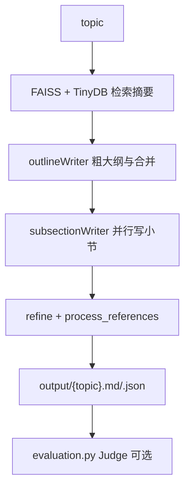

# AutoSurvey：从 arXiv 摘要库生成长综述的两阶段写作器

| 项目 | 固定快照 |
|---|---|
| 候选编号 | 97 |
| 仓库 | [AutoSurveys/AutoSurvey](https://github.com/AutoSurveys/AutoSurvey) |
| 分类 / 层次 | 自动综述生成；文献、检索、写作 |
| 分析提交 | `5e8f389f3d51b29bad16dc6ae75db3e8a45a3b65` |
| 元数据快照 | 2026-09-17；Stars 476，非近似值；最近推送 2025-02-07 |
| 默认分支 / 状态 | main；非 fork、未归档；候选 pending，分析 draft |
| 许可 | GitHub API 为 `NOASSERTION`；固定提交根目录无 LICENSE 文件；README 自称 MIT，不能据此升格 |
| 阅读方式 | 公开 README、main.py、evaluation.py、database 与三个 agents 文件；静态分析 |

本文用 📘 标注文档或源码中可直接定位的事实，🔶 标注由控制流推导的边界，💬 标注评价与借鉴建议。仓库动态元数据沿用候选清单，源码判断只绑定上面的固定提交。

## 1. 它到底是什么

📘 [根 README](https://github.com/AutoSurveys/AutoSurvey/blob/5e8f389f3d51b29bad16dc6ae75db3e8a45a3b65/README.md) 把 AutoSurvey 定义为自动写综合文献综述的框架，对应 NeurIPS 2024 论文 *AutoSurvey: Large Language Models Can Automatically Write Surveys*。入口是 `python main.py --topic ...`：给定主题后生成 Markdown 与 JSON。公开数据库声称含约 53 万篇 CS 类 arXiv 摘要；全文需另行联系作者。

🔶 README 中 8k–64k token 长度上的引用与内容质量分数是论文结果叙述，不是本次运行记录。仓库没有实验执行或投稿编译链。

## 2. 运行时堆叠

📘 [`main.py`](https://github.com/AutoSurveys/AutoSurvey/blob/5e8f389f3d51b29bad16dc6ae75db3e8a45a3b65/main.py) 构造 `database`，再依次调用 `outlineWriter.draft_outline` 与 `subsectionWriter.write`，把 refined 综述写入 `{topic}.md` 和 `{topic}.json`。[`src/database.py`](https://github.com/AutoSurveys/AutoSurvey/blob/5e8f389f3d51b29bad16dc6ae75db3e8a45a3b65/src/database.py) 用 SentenceTransformer（默认 `nomic-ai/nomic-embed-text-v1`）把嵌入放到 CUDA，TinyDB 读 `arxiv_paper_db.json` 的 `cs_paper_info` 表，FAISS 读标题与摘要两个索引。

| 层 | 固定快照中的承载方式 | 边界 |
|---|---|---|
| 检索 | TinyDB + 双 FAISS 索引 | 需解压 `database.zip` |
| 写作模型 | `APIModel` 调 chat completions | `--api_url` / `--api_key` |
| 大纲 | `outlineWriter` 分块、合并、改稿 | 默认 `outline_reference_num=1500` |
| 小节 | `subsectionWriter` 线程并行 | 默认 `rag_num=60`、`subsection_len=700` |
| 评价 | 独立的 `evaluation.py` + `Judge` | 不进入生成主路径 |

## 3. 阶段机或 DAG

📘 `outlineWriter.draft_outline`：按主题检索 → 摘要分块 → 粗大纲 → 合并 → 小节大纲 → 终稿编辑。`subsectionWriter.write` 按小节描述再检索，线程写各节，再 `refine_subsections`，最后 `process_references`。评价入口另读 JSON，用 Coverage / Structure / Relevance 打分，并算引用 recall/precision。

🔶 `main.py` 的 `write()` 辅助函数声明了 `refinement` 开关，但 `main()` 固定走 refining=True 的六元组返回。评价不是生成闸门。

## 4. Tool / Skill / Agent 怎么切

📘 三个 Python 类：`outlineWriter`、`subsectionWriter`、`Judge`。它们共享 `APIModel` 与 `database`，不是宿主 Skill。检索是本地向量库方法，不是 MCP。🔶 Agent 一词在此等于带提示词的写作模块。

## 5. 文献怎么来、是否入库、引用约束

📘 文献来自预构建的 CS arXiv 摘要库；`get_ids_from_query` 用 `search_query:` 前缀编码。写作时把 title/abs 拼进 prompt。`CHECK_CITATION_PROMPT` 与 `process_references` 处理引用串。Judge 的 `citation_quality` 另算召回与精度。可选 `paper_content.h5` 提供截断正文。🔶 这不是 DOI 级入库，也没有页码/span 闸。摘要 RAG 不能当成已读全文。公开库与作者持有的全文库是两条路径。

## 6. 实验 / 代码执行

📘 嵌入模型被 `to(cuda)`。`--gpu` 只传给 argparse，生成脚本本身不启动训练。🔶 本次未下载 53 万篇库、未加载 FAISS、未调用写作 API，因此不能复核论文图表分数。`get_paper_from_ids` 假定当前目录有 `paper_content.h5`。

## 7. 写稿怎么做

📘 产出是 Markdown 综述加 JSON 中的 `survey`/`reference`。默认 7 节、每小节约 700 token。小节写作可开 reflection。🔶 没有会议 LaTeX 模板、bib 文件核验或 PDF 编译。引用对齐依赖模型提示与后处理，不是独立文献对象。

## 8. 图怎么做

📘 README 含 overview 与 main_fig 论文插图。生成管道写的是文本综述。🔶 仓库不是论文 figure suite；不会为综述自动画方法对比图。

## 9. 和 RH 的相似点

1. 都把大纲与正文分成可单独调用的阶段。
2. 都用检索结果约束写作，而不是单次零文献生成。
3. 都把引用后处理写成显式步骤。

## 10. 和 RH 的不同点

RH 以 paper/claim/evidence 为权威对象，并区分检索、入库与引用闸。AutoSurvey 以本地摘要索引加生成 Markdown 为权威对象。它专做综述，不覆盖假设检验、实验记录或投稿包。许可证在 API 与 README 之间不一致。

## 11. 优点 / 缺点

**优点**

- 大纲分块合并再写小节，长文结构有代码路径。
- 检索、写作、评价三个入口分开，便于只跑其中一段。
- 引用检查提示与 Judge 的 Coverage/Structure/Relevance 标准写在源码里。

**缺点**

- 无 LICENSE 文件；README 自称 MIT 不能当作已核验证件。
- 嵌入硬绑 CUDA，本地复现门槛高。
- 公开库主要是摘要；全文是旁路文件。

💬 作为综述生成对照，它的价值在“先检索再分节写”，而不是端到端科研生产。把论文质量表抄进图谱会越界。

## 12. RH 可学的 1–3 条

1. **大纲检索量与小节 RAG 量分开设。** 1500 篇定结构、60 篇写一段，避免同一 top-k 既当目录又当证据。
2. **引用后处理独立于成文。** `process_references` 比把 `\cite` 留在模型输出里不管更可审计。
3. **评价脚本不要偷偷改生成物。** Judge 读已写 JSON，生成闸与质量闸分离。

## 13. 名字速查表

| 名字 | 先决概念 | 含义 |
|---|---|---|
| outlineWriter | 写作类 | 粗大纲 → 合并 → 小节大纲 |
| subsectionWriter | 写作类 | 并行写节并 refine |
| Judge | 评价类 | 1–5 分标准 + 引用质量 |
| TinyDB / FAISS | 本地库 | 摘要元数据与向量索引 |
| paper_content.h5 | 可选全文 | 按 id 截断读取 |

> 📌事实边界：本页依据 `5e8f389f3d51b29bad16dc6ae75db3e8a45a3b65` 固定公开源码快照、2026-09-17 `data/candidates-staging.jsonl` 元数据和下列实际查看文件静态撰写（`README.md`、`main.py`、`evaluation.py`、`requirements.txt`、`src/database.py`、`src/agents/outline_writer.py`、`src/agents/writer.py`、`src/agents/judge.py`）。没有把 README 的引用/内容质量分数或 53 万篇库规模当作本次实测；未调用未配置的模型/API，未加载数据库或嵌入模型，未据此声称运行效果。README 的 MIT 声明因缺少 LICENSE 文件，证据记录保持 `NOASSERTION`。
