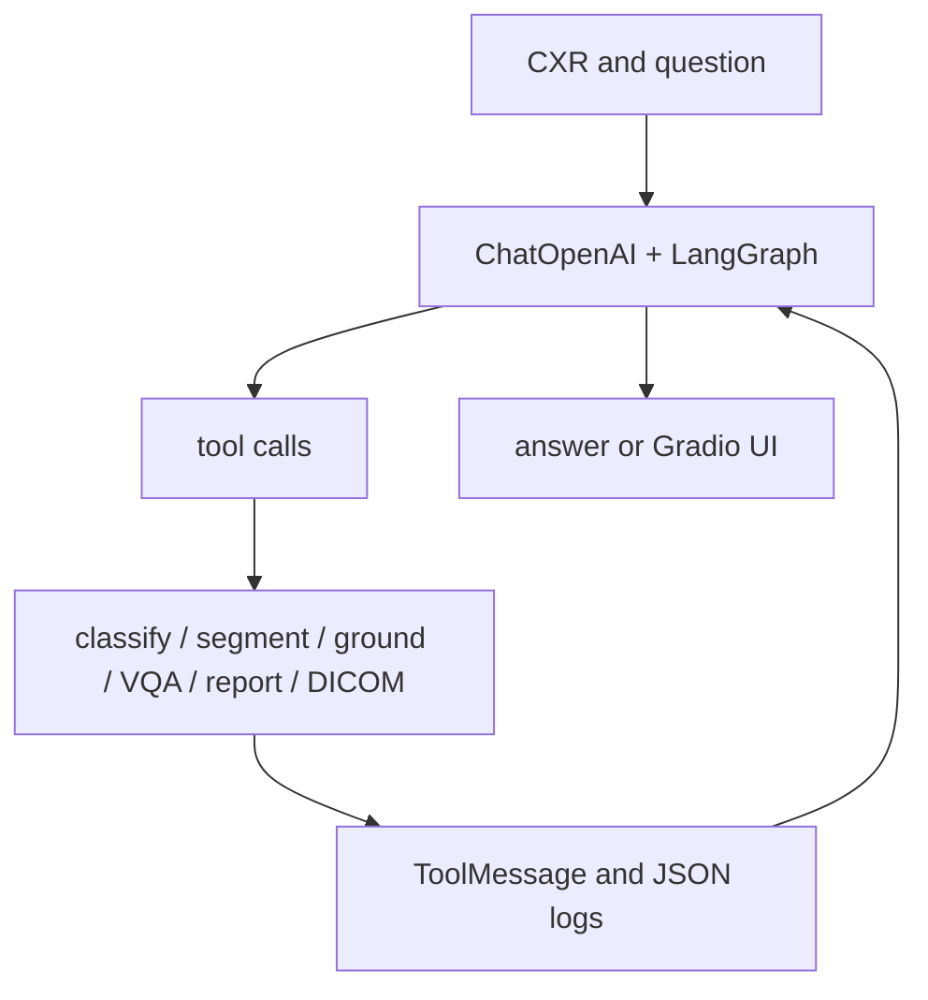

# bowang-lab/MedRAX：MedRAX——胸部 X 光多工具医学推理 Agent

| 字段 | 值 |
|---|---|
| GitHub | https://github.com/bowang-lab/MedRAX |
| License | Apache-2.0 |
| Stars | 1,230（2026-09-17 快照） |
| GitHub 仓库 pushed_at | 2025-10-31（仓库级动态元数据，不等于分析 commit 新增内容） |
| 分析 commit | `dae30e2f136ef0b2a40885a4c335386e9ffad052` |
| 产品类型 | **胸部 X 光多工具医学推理 Agent** |
| 分析证据 | README.md, main.py, medrax/agent/agent.py, medrax/tools/report_generation.py, medrax/tools/segmentation.py, medrax/docs/system_prompts.txt |

本文用 📘 标注文档或源码中可直接定位的事实，🔶 标注由控制流推导的边界，💬 标注评价与借鉴建议。仓库动态元数据沿用候选清单，源码判断只绑定页面中的固定提交。

## 1. 它到底是什么

MedRAX 是专注胸部 X 光的多工具视觉推理 Agent。它把 CXR 图像和自然语言问题交给 LangGraph Agent，再根据需要调用分类、分割、grounding、VQA、报告生成、DICOM 和可视化工具。它的专科范围比通用视觉聊天更窄，但模型输出依然是辅助分析，不应被本报告描述为已获得临床部署许可。

## 2. 运行时堆叠

`main.py::initialize_agent` 按 tools_to_use 实例化工具，把工具绑定到 ChatOpenAI，并用 MemorySaver 编译 process→execute_tools→process 图。权重从 Hugging Face 下载到 model_dir，部分工具支持 8-bit；device 默认 cuda。`ChestXRayReportGeneratorTool` 实际加载 findings 与 impression 两个 ViT-BERT VisionEncoderDecoder 模型，分别生成两段并返回 analysis_status metadata。

## 3. 阶段机或 DAG

Agent 的 process 节点在无 tool call 时结束；execute_tools 对未知名称返回 invalid tool 并继续，工具结果以 ToolMessage 回到模型。

## 4. Tool / Skill / Agent 怎么切

Agent 是 medrax.agent.Agent；tool 是 LangChain BaseTool 子类；工具选择由 `selected_tools` 白名单决定，若省略则初始化全部。system_prompts.txt 提供医学助手指令，MemorySaver 保存图状态，logs 保存 tool_calls JSON。源码提供工具选择而不是技能注册目录；新增能力需实现工具并加入初始化映射。

## 5. 文献怎么来、是否入库、引用约束

MedRAX README 主要讨论 ChestAgentBench 与 CXR 案例，而不是文献检索。系统工具里可能有报告模型和影像模型，但所读主入口没有 paper ingest、PubMed 引用或逐结论 citation contract。模型训练数据名称出现在工具实现说明中，不代表输入影像的临床证据已经链接到输出。

## 6. 实验 / 代码执行

代码会真正加载视觉模型、处理图像并执行生成/分割/分类；report generator 对输入 JPG/PNG 做 RGB 预处理，按模型 encoder size 插值，并在 inference_mode 下生成 findings/impression。模型权重、CUDA、OpenAI API key 和大型数据集构成实际前提。README 的 2500 queries、675 cases、SOTA 是项目论文声明，本次未执行 benchmark，也未做临床准确性/安全性验证。

## 7. 写稿怎么做

输出是工具结果和 Gradio 对话，report generator 给出 FINDINGS/IMPRESSION 文本。未见论文章节、引用 bibliography、临床报告签名或投稿终稿流程。自动报告即使语法完整，也不等于放射科医生审核。

## 8. 图怎么做

工具可能生成分割、grounding 或医学可视化，README 的 demo GIF 也只展示产品交互。所读代码没有统一的出版级 figure suite、图像事实核验或把病灶框/掩膜与正文句子双向绑定的 gate。

## 9. 和 RH 的相似点

与 RH 相似的是工具白名单、状态图、调用日志和模型/工具分层；每个 tool call 能记录 name、args、content、timestamp，便于后续接入 evidence。选择性初始化也体现了资源和任务范围控制。

## 10. 和 RH 的不同点

RH 的证据和写作 gate 要求来源、患者隐私、数据划分、模型版本与 claim 全部可审计；MedRAX Agent 只确保工具调用循环可继续。临床输出不能仅凭“analysis_status=completed”赋予正确性；LangGraph 的完成状态是程序状态，不是医学验证。

## 11. 优点 / 缺点

**优点**：工具模块化，选择性初始化和量化选项适合资源管理；状态图短且易理解；日志包含工具调用；报告工具明确 findings/impression 双输出。

**局限**：权重多、部署重；部分权重须手动获取；工具错误作为文本返回；未知 tool 仍可能进入模型循环；临床 benchmark、SOTA 和产品化说法未在本任务验证。

## 12. RH 可学的 1–3 条

1. 将模型权重、影像预处理、工具版本和病例标识纳入 run evidence。
2. 将工具生成的发现、定位和印象分开绑定来源，并把未确定/失败状态传到写作 gate。
3. 在任何临床叙述前增加专家复核、隐私策略和外部基准复现记录。

## 13. 名字速查表

| 名字 | 先决概念 | 含义 |
|---|---|---|
| `Agent` | LangGraph state | process 与 execute_tools 状态机 |
| `selected_tools` | resource budget | 初始化时启用的工具白名单 |
| `ChestXRayReportGeneratorTool` | image-to-text | findings/impression 报告模型 |
| `ToolMessage` | observation | 工具结果回传消息 |
| `MemorySaver` | checkpoint | LangGraph 会话状态保存 |
| ChestAgentBench | evaluation | README 宣称的 CXR 复杂问答集 |

---

> 📌事实边界
> 本页只使用冻结 commit 的公开 GitHub 文档和源码；未运行模型、训练、工具、远程 API 或领域实验。README 数字和论文结果仅作为作者声明，未升级为独立复现。性能、临床/化学/物理有效性、商业许可、数据新鲜度和完整部署状态均需额外核验。
