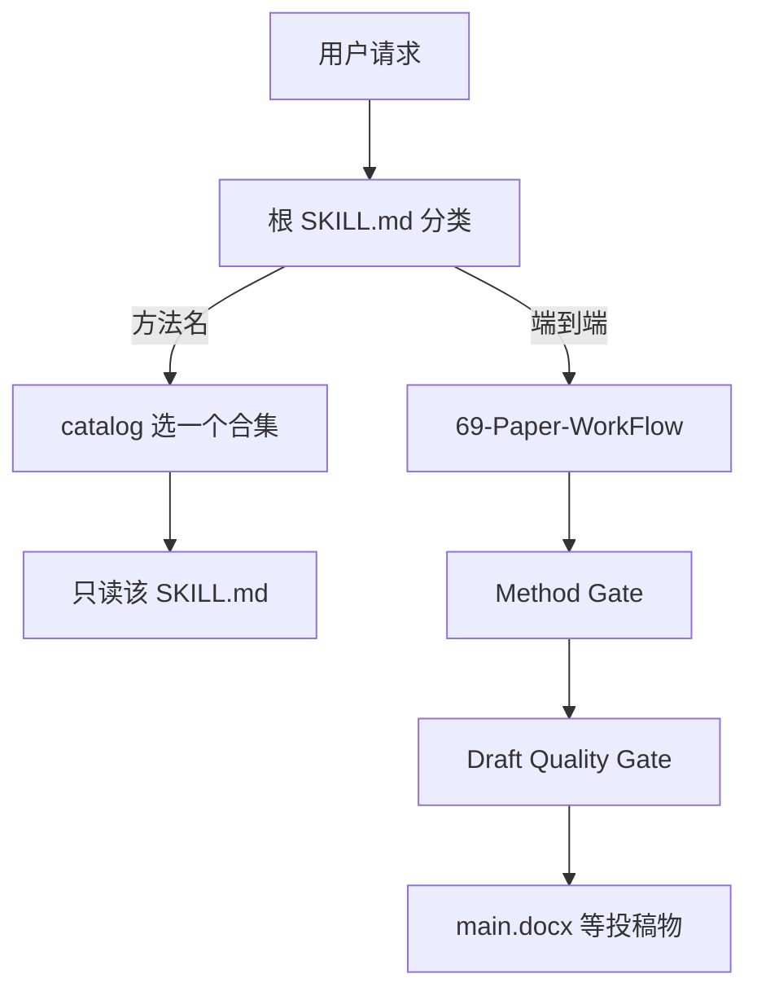

# AERS：用根路由器收纳千余实证研究技能的目录

| 项目 | 固定快照 |
|---|---|
| 候选编号 | 99 |
| 仓库 | [brycewang-stanford/Auto-Empirical-Research-Skills](https://github.com/brycewang-stanford/Auto-Empirical-Research-Skills) |
| 分类 / 层次 | 实证研究技能；技能、方法、实验、写作 |
| 分析提交 | `3b009a43ceacb9959654528b14075f88778118b6` |
| 元数据快照 | 2026-09-17；Stars 3829，非近似值；最近推送 2026-09-14 |
| 默认分支 / 状态 | main；非 fork、未归档；候选 pending，分析 draft |
| 许可 | 根 `LICENSE` 为 CC BY-SA 4.0；GitHub API 仍为 `NOASSERTION`，二者一并记录 |
| 阅读方式 | 公开 README、LICENSE、根 SKILL.md、agents 说明与 catalog；静态分析 |

本文用 📘 标注文档或源码中可直接定位的事实，🔶 标注由控制流推导的边界，💬 标注评价与借鉴建议。仓库动态元数据沿用候选清单，源码判断只绑定上面的固定提交。

## 1. 它到底是什么

📘 [根 README](https://github.com/brycewang-stanford/Auto-Empirical-Research-Skills/blob/3b009a43ceacb9959654528b14075f88778118b6/README.md) 将 AERS 定位为实证研究技能大全，中文为默认入口，声明 Stanford REAP × CoPaper.AI。根 [`SKILL.md`](https://github.com/brycewang-stanford/Auto-Empirical-Research-Skills/blob/3b009a43ceacb9959654528b14075f88778118b6/SKILL.md) 写明：把整个仓库装成一个技能时，它是**路由器**，目录含 **1,096 个技能、76 个合集**，禁止一次读完。

📘 信任面表格列出 19 个数值 benchmark、42/217 条 eval 场景/量表、9 个能区分对错的双 fixture。🏁 `aers-score` 宣称用同一评分器重算，而不是提交者自报。🔶 这些数字是仓库自述，本次未重跑评分器。

## 2. 运行时堆叠

📘 `agents/` 不是内部子代理，而是各 IDE/CLI 的部署清单，一律指向根路由器。推荐安装是注册仓库根，而不是把 1000+ 个 `SKILL.md` 全部注册进宿主。`catalog/skills.json` 提供 `path`、`name`、`description`、`qualified_name`；更大的 `skills-enriched.json` 含 tags、quality_score、license、commercial_use。

| 层 | 固定快照中的承载方式 | 边界 |
|---|---|---|
| 路由 | 根 SKILL.md | 按阶段/方法选一个子技能 |
| 合集 | `skills/<collection>/` | 69-Paper-WorkFlow 是 git 子模块 |
| 目录 | catalog JSON | 文件大约 1MB，要求查询不要整读 |
| 评测 | `benchmark/`、`eval-harness/` | 自述 rigor，非本次实测 |
| 宿主 | Claude Code / Codex 等 | 扁平同名会碰撞 |

## 3. 阶段机或 DAG

📘 端到端触发句（如“从选题到投稿”）路由到 `skills/69-Paper-WorkFlow/`。编排器在 Stage 3 后有 Method Gate、Stage 7 后有 Draft Quality Gate；`manuscript.format = markdown` 时 Stage 9 组装 `09_submission/main.docx`。单点任务（只跑 DiD、只写审稿意见）不应进编排器。

🔶 阶段数字来自路由器说明，不是本页展开的编排器源码。子模块若未 init，文件夹会空，文档要求回退到 `skills/00*` 旗舰分析技能。

## 4. Tool / Skill / Agent 怎么切

📘 Skill 是 vendored 合集中的 `SKILL.md`。根技能只做路由。`agents/` YAML 适配外部 runtime。47 个裸 `name` 跨合集重复（如 `data-analysis`），要用 `qualified_name`（`<collection>::<name>`）消歧。🔶 这不是带 tool registry 的运行时；工具在各子技能的 scripts/references 里。

## 5. 文献怎么来、是否入库、引用约束

📘 路由器把文献综述指向若干合集（literature-review、PRISMA、OpenAlex、citation-checker）。🔶 AERS 本身是技能目录，不维护统一 DOI 库。引用检查是否执行取决于选中的子技能。

## 6. 实验 / 代码执行

📘 旗舰分析技能覆盖 StatsPAI / Python / Stata / R；因果识别表把 DiD、IV、RDD、SCM 等指到具体合集。`eval-harness/fixtures` 含 pass/fail 双文本。🔶 本次未安装任何合集、未跑 benchmark、未生成 docx，不能把 19 个数值任务当成已复现。

## 7. 写稿怎么做

📘 完整 Word 稿由 Paper-WorkFlow Stage 9 组装。另有 Markdown/LaTeX→docx 转换技能、AER 合集、de-AIGC 与中文 SSCI 润色合集。🔶 写作质量在子技能内部，本仓库根层不实现统一 LaTeX 闸。

## 8. 图怎么做

📘 旗舰分析技能强调表格与图的 exhibits，再交给写作技能。🔶 没有全库统一的论文 figure 生成器。

## 9. 和 RH 的相似点

1. 都强调不要把全部能力一次性塞进上下文。
2. 都把端到端编排与单点方法调用分开。
3. 都用机器可读目录（catalog / manifest）做路由。

## 10. 和 RH 的不同点

RH 运行自己的阶段机与证据对象。AERS 把方法知识外包成上千个第三方技能，权威对象是路由器加 catalog。许可证是 CC BY-SA 4.0（ShareAlike），与许多 Apache/MIT 科研仓库不同；API 未识别这一事实仍要保留。

## 11. 优点 / 缺点

**优点**

- 根路由 + qualified_name 明确承认规模和重名。
- 合集按因果识别策略分入口，对实证研究者可检索。
- 自带 catalog 校验 workflow 与 eval-harness 目录。

**缺点**

- GitHub API 许可证字段空白，公开页必须同时写文件正文。
- 子模块与 1000+ 技能使完整克隆和安全审查成本高。
- 信任面数字未被本次复现。

💬 它更像“实证方法技能的发行版”，而不是单一科研 Agent。借鉴点是路由，不是把 1096 个文件当一套已验证流水线。

## 12. RH 可学的 1–3 条

1. **大规模技能必须有路由器，禁止全量加载。**
2. **用全局唯一 qualified_name 处理扁平宿主的重名。**
3. **评测夹具成对出现（pass/fail）才能声称“能区分对错”。**

## 13. 名字速查表

| 名字 | 先决概念 | 含义 |
|---|---|---|
| AERS | 本仓库 | Auto-Empirical Research Skills |
| 根 SKILL.md | 路由器 | 按阶段选一个子技能 |
| qualified_name | catalog 字段 | `合集::技能名` |
| Paper-WorkFlow | 子模块编排器 | 两道硬闸 + docx 组装 |
| aers-score | 评分入口 | 宣称统一重算外部榜 |

> 📌事实边界：本页依据 `3b009a43ceacb9959654528b14075f88778118b6` 固定公开源码快照、2026-09-17 `data/candidates-staging.jsonl` 元数据和下列实际查看文件静态撰写（`README.md`、`LICENSE`、`SKILL.md`、`CITATION.cff`、`INSTALL.md`、`agents/README.md`、`catalog/skills.json`）。没有把 1,096 技能、19 个 benchmark 或 security badge 当作本次实测；未调用未配置的模型/API，未安装合集或跑 eval-harness，未据此声称运行效果。证据中的许可证取自已查阅的根 LICENSE（CC BY-SA 4.0），同时保留 GitHub API `NOASSERTION`。
