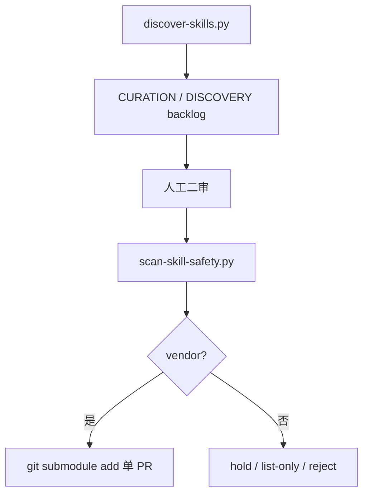

# Auto-Research-Skills：带子模块与安全扫描的科研技能中枢

| 项目 | 固定快照 |
|---|---|
| 候选编号 | 100 |
| 仓库 | [brycewang-stanford/Auto-Research-Skills](https://github.com/brycewang-stanford/Auto-Research-Skills) |
| 分类 / 层次 | 科研技能目录；技能、文献、方法 |
| 分析提交 | `db945bf1aea106face2c4f48351efb60b22c7dc3` |
| 元数据快照 | 2026-09-17；Stars 162，非近似值；最近推送 2026-09-14 |
| 默认分支 / 状态 | main；非 fork、未归档；候选 pending，分析 draft |
| 许可 | CC0-1.0；固定提交根目录 `LICENSE` 已查阅 |
| 阅读方式 | 公开 README、CURATION.md、发现/安全脚本与 catalog；静态分析 |

本文用 📘 标注文档或源码中可直接定位的事实，🔶 标注由控制流推导的边界，💬 标注评价与借鉴建议。仓库动态元数据沿用候选清单，源码判断只绑定上面的固定提交。

## 1. 它到底是什么

📘 [根 README](https://github.com/brycewang-stanford/Auto-Research-Skills/blob/db945bf1aea106face2c4f48351efb60b22c7dc3/README.md) 把仓库定义为自动化研究技能与智能体的精选中枢：skills / systems / benchmarks / lists 四个目录，以 git 子模块浅克隆收录。页面宣称 **3,433 个 skills、87 个仓库**。`./setup.sh` 负责顶层与嵌套子模块。权威清单在“已收录仓库”节；未标记 🧩 的表项只是候选或相邻参考。

🔶 3,433 是 catalog 计数，不是本次克隆后的文件枚举。不建议把全部 `skills/` 一次性装进同一 agent profile，README 指向 `catalog/collisions.json`。

## 2. 运行时堆叠

📘 本仓库几乎不运行研究循环。它提供：子模块检出、[`scripts/discover-skills.py`](https://github.com/brycewang-stanford/Auto-Research-Skills/blob/db945bf1aea106face2c4f48351efb60b22c7dc3/scripts/discover-skills.py) 用 GitHub Search 发现候选、[`scripts/scan-skill-safety.py`](https://github.com/brycewang-stanford/Auto-Research-Skills/blob/db945bf1aea106face2c4f48351efb60b22c7dc3/scripts/scan-skill-safety.py) 做离线启发式安全扫描、`tools/build_catalog.py` 建目录。发现脚本明确**不会**改 `.gitmodules`。

| 层 | 固定快照中的承载方式 | 边界 |
|---|---|---|
| 收录 | git 子模块 | setup.sh 二次 init 嵌套模块 |
| 发现 | GitHub Search API | 需要网络与可选 token |
| 安全 | 启发式正则扫描 | 文档自陈不能证明安全 |
| 目录 | catalog/skills.json | 由 build 脚本生成 |
| 策展 | CURATION.md | 人工二审队列 |

## 3. 阶段机或 DAG

📘 [`CURATION.md`](https://github.com/brycewang-stanford/Auto-Research-Skills/blob/db945bf1aea106face2c4f48351efb60b22c7dc3/CURATION.md) 把生命周期写成：发现 → 记入 backlog → 二审（许可证、安全扫描、重叠）→ 单项目 PR vendoring。默认门槛含明确许可证、维护、文档、大约 100+ stars；填空白可例外。不确定项目先留在 CURATION，不直接 submodule add。

🔶 这是策展 DAG，不是论文生产 DAG。扫描器按文件语境（SKILL.md vs README 示例）降权，仍可能误报。

## 4. Tool / Skill / Agent 怎么切

📘 被收录的上游仓库才提供 Skill/Agent。本中枢的脚本是维护者工具：发现、扫描、建目录。🔶 克隆本仓库不会自动得到一个可跑的研究 Agent；还要 init 子模块并按需安装，且要处理重名。

## 5. 文献怎么来、是否入库、引用约束

📘 文献能力来自被 vendoring 的上游（如 zotero-mcp、arxiv 类技能）。中枢自己用 GitHub 搜索找**技能仓库**，不是找论文。🔶 没有统一引用闸。CURATION 记录过无许可证仍被收录的例外，并要求按保留版权处理。

## 6. 实验 / 代码执行

📘 `scan-skill-safety.py` 离线跑；`discover-skills.py` 访问 GitHub API。研究实验在子模块各自的系统里。🔶 本次未执行 setup.sh、未跑扫描器、未调用 GitHub Search，不能验证 3,433 这个实时计数。

## 7. 写稿怎么做

📘 写稿技能存在于被收录的学术技能集中。本仓库 README 只做分类导览。🔶 中枢不实现论文模板或编译闸。

## 8. 图怎么做

📘 无统一出图栈。🔶 封面图与徽章是文档装饰。

## 9. 和 RH 的相似点

1. 都把第三方能力当供应链，而不是默认可执行文本。
2. 都区分发现、人工审核与正式收录。
3. 都用机器可读 catalog 避免纯 README 表格漂移。

## 10. 和 RH 的不同点

RH 生产带证据的研究工件。Auto-Research-Skills 生产技能中枢与策展记录。CC0 覆盖的是中枢自身，不自动覆盖全部子模块许可证。它与 99 号 AERS 同作者谱系，但一个是实证技能发行版，一个是跨仓库索引。

## 11. 优点 / 缺点

**优点**

- 发现脚本与 vendoring 严格分开。
- 安全扫描区分可执行指令与示例文档。
- collisions 警告写进 README，避免同名技能静默覆盖。

**缺点**

- 完整检出依赖大量子模块，失败点多。
- 启发式扫描不能当安全证明。
- 计数与 stars 会漂，必须以 analyzed_commit 为准。

💬 对图谱，这个项目说明“技能生态的目录层”长什么样：策展、碰撞、供应链扫描，而不是又一条 idea-to-paper 主链。

## 12. RH 可学的 1–3 条

1. **发现自动化，收录仍要单 PR 二审。** 搜索脚本不得自己改 gitmodules。
2. **扫描结果按文件语境加权。** README 里的 `curl | bash` 与 SKILL.md 里的不是同一风险。
3. **先发布碰撞表，再允许组合安装。** 扁平宿主下同名即未定义行为。

## 13. 名字速查表

| 名字 | 先决概念 | 含义 |
|---|---|---|
| setup.sh | 检出入口 | 顶层 + 嵌套子模块 |
| CURATION.md | 策展合同 | 门槛、例外、二审队列 |
| discover-skills.py | 维护脚本 | GitHub 搜索候选 |
| scan-skill-safety.py | 维护脚本 | 离线启发式扫描 |
| collisions.json | catalog | 跨集合同名技能 |

> 📌事实边界：本页依据 `db945bf1aea106face2c4f48351efb60b22c7dc3` 固定公开源码快照、2026-09-17 `data/candidates-staging.jsonl` 元数据和下列实际查看文件静态撰写（`README.md`、`LICENSE`、`CURATION.md`、`AGENTS.md`、`catalog/README.md`、`catalog/skills.json`、`scripts/discover-skills.py`、`scripts/scan-skill-safety.py`、`tools/build_catalog.py`）。没有把 3,433 技能、87 仓库或子模块内上游 README 数字当作本次实测；未调用未配置的模型/API，未执行 setup.sh 或安全扫描，未据此声称运行效果。
