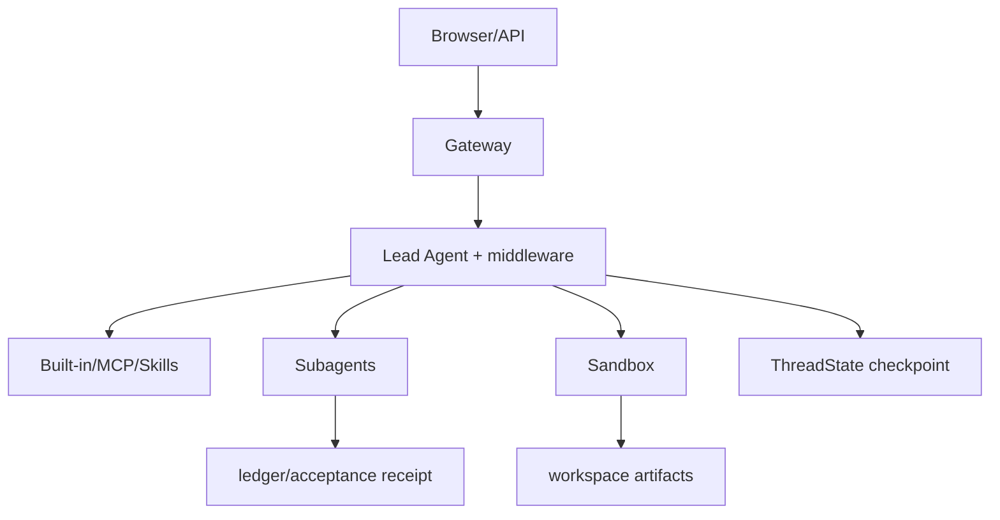

# bytedance/deer-flow：带工作区、沙箱和子 Agent 的宿主级研究编排

| 字段 | 值 |
|---|---|
| GitHub | https://github.com/bytedance/deer-flow |
| License | MIT |
| Stars | 82541（2026-09-17 快照） |
| GitHub 最后 push | 2026-09-16 |
| 分析 commit | `0efdf8e7d8d2c4f976abd2f4c05fd012e6c317c4` |
| 生命周期 | GitHub 候选冻结记录为未归档；固定提交用于本页源码分析 |
| 产品类型 | 宿主级 super-agent / deep-research 工作流 |
| 分析证据 | 固定提交中的 README、许可证、配置与核心实现 |

本文用 📘 标注文档或源码中可直接定位的事实，🔶 标注由控制流推导的边界，💬 标注评价与借鉴建议。仓库动态元数据沿用候选清单，源码判断只绑定页面中的固定提交。

## 1. 它到底是什么

deer-flow 是一个以 Gateway 为入口、LangGraph 为内嵌运行时的多 Agent 应用。它把线程、文件上传、项目文档、技能、MCP、沙箱、子 Agent、checkpoint 和 artifact 统一到一个工作区生命周期中。 本文把仓库作为一个公开源码快照来分析：README 的产品定位、命令和 benchmark 数字属于项目文档；代码路径用于确认控制流、数据结构和边界。没有把 stars、README 宣称的准确率、SOTA 或部署体验转换成独立结论。

源码中最值得关注的是：请求进入 thread/run 后，Gateway 固定项目上下文并组装 lead agent。middleware 初始化 thread data、上传、sandbox、摘要、标题、todo、图像和澄清能力。lead agent 调用内置、配置、MCP 或 subagent 工具；子任务有 max_turns、timeout、并发/总量上限。delegation ledger 保存状态、结果摘要、sha256、引用和 acceptance verdict；线程 checkpoint 通过 reducer 合并消息、artifacts 和状态。 这决定了它应在 RH 产品地图中被看作“宿主级 super-agent / deep-research 工作流”，而不是泛化地称为自动科研系统。

## 2. 运行时堆叠

运行时可拆成以下层：

- **入口与配置**：由仓库提供的 CLI、脚本、Next.js/API 或配置文件接收任务和参数。
- **Agent/编排**：Nginx 统一前端与 Gateway；FastAPI Gateway 提供 LangGraph兼容 runs/threads、MCP、skills、uploads 和 artifacts API；lead agent 由 middleware chain 与 LangGraph agent 组成；ThreadState 扩展 messages、sandbox、artifacts、todos、delegations、skill_context 等字段；Local/Aio/远端 provider 承担沙箱；子 Agent 通过 registry、executor 和报告合同运行。
- **工具与环境**：工具调用连接搜索、文件、浏览器、向量库、解释器或沙箱；工具是否真的隔离取决于配置和外部服务。
- **状态与产物**：本项目保存的状态形式包括缓存、队列、日志、数据库、PaperNode、retrieval result、文件或 grade；它们不自动等同于 RH artifact。

这种分层让替换模型和工具变得容易，但也将“接口存在”和“证据可信”分开。源码可以证明一个函数会生成/保存某种对象，不能单凭存在证明对象内容正确。

## 3. 阶段机或 DAG

核心控制流如下。

请求进入 thread/run 后，Gateway 固定项目上下文并组装 lead agent。middleware 初始化 thread data、上传、sandbox、摘要、标题、todo、图像和澄清能力。lead agent 调用内置、配置、MCP 或 subagent 工具；子任务有 max_turns、timeout、并发/总量上限。delegation ledger 保存状态、结果摘要、sha256、引用和 acceptance verdict；线程 checkpoint 通过 reducer 合并消息、artifacts 和状态。 阶段之间通常由消息、列表、队列、结构化对象或日志连接；是否能跨进程恢复，取决于具体实现，而不是 Mermaid 图本身。需要特别区分循环的两种含义：一种是有限的 max_depth/max_rounds/max_iter/max_steps 或 expand_layers；另一种是模型自主决定继续。源码中的上限能限制预算，但不能保证每次运行都走完所有阶段，也不能保证模型输出符合提示。

## 4. Tool / Skill / Agent 怎么切

该仓库的 Agent 边界是：主 Agent 接收任务并决定下一步；子 Agent/worker（若有）承担局部任务；tool 是可调用的搜索、抓取、文件、浏览器、代码或数据接口；skill（若有）主要是提示/能力包，不等于可审计的执行 artifact。具体来说，Nginx 统一前端与 Gateway；FastAPI Gateway 提供 LangGraph兼容 runs/threads、MCP、skills、uploads 和 artifacts API；lead agent 由 middleware chain 与 LangGraph agent 组成；ThreadState 扩展 messages、sandbox、artifacts、todos、delegations、skill_context 等字段；Local/Aio/远端 provider 承担沙箱；子 Agent 通过 registry、executor 和报告合同运行。

工具调用的返回通常被转成文本、结构化响应或日志，再回到模型上下文。优点是扩展快，缺点是不同工具的来源、版本、错误和副作用可能没有统一合同。对于 RH，接入时不应只映射函数名，还要记录输入、输出、外部资源、权限、失败原因和可复核句柄。

## 5. 文献怎么来、是否入库、引用约束

文献/来源链是：支持 web_search/web_fetch、GitHub 等配置工具、MCP server 和技能包。public/deep-research skill 规定多角度搜索、抓取全文、迭代补缺；这属于宿主提示与工具约定，不是学术文献入库。

这条链路能支持“找到或读取来源”，但通常不能直接支持 claim-level evidence。源码未显示统一的 DOI/版本/页码/span/主张/支持强度对象，也没有在最终文字生成前做逐句 entailment gate。若项目有 URL、reference、arxiv_id、PaperNode 或 RetrievalResult，它们仍主要是检索和展示元数据。

因此，报告中的来源约束应写成：系统会按提示或数据结构保留来源；不能写成“每条结论都已验证”。在 RH 中，建议将这些中间来源摄取为 paper/source，再显式链接 claim 和 evidence span。

## 6. 实验 / 代码执行

工程上，sandbox 可以执行命令、读写文件和保存输出，适合承载代码任务；但仓库的通用 deep research 流程没有科学实验指标 registry、数据版本和统计审计。论文复现仍需要下游实验合同。

**事实边界**：本次只读了公开仓库固定提交，没有安装依赖、配置 API key、下载模型/数据、启动外部服务或运行 benchmark。因而不能确认运行时性能、成本、并发稳定性、沙箱隔离、模型质量、检索召回或 README 中的结果。源码里的测试/评估函数可以说明“如何评”，不能说明“本次已评”。

若将它用于科研执行，还需要补齐数据版本、代码提交、环境镜像、资源上限、随机种子、指标定义、原始输出和失败记录，并把每次执行绑定到不可变 artifact。

## 7. 写稿怎么做

写作输出取决于项目类型：宿主级 super-agent / deep-research 工作流 的最终产物通常是 Markdown、报告字符串、聊天消息、结构化 Report、检索回答或 grade JSON。请求进入 thread/run 后，Gateway 固定项目上下文并组装 lead agent。middleware 初始化 thread data、上传、sandbox、摘要、标题、todo、图像和澄清能力。lead agent 调用内置、配置、MCP 或 subagent 工具；子任务有 max_turns、timeout、并发/总量上限。delegation ledger 保存状态、结果摘要、sha256、引用和 acceptance verdict；线程 checkpoint 通过 reducer 合并消息、artifacts 和状态。

若有报告器，它往往把多个阶段的摘要合并为可读文本；引用可能是 URL、reference id、source 字段或 rubric 记录。这里没有看到 RH 意义上的章节草稿、参考文献数据库、claim/evidence 互证、LaTeX/PDF 编译和提交版本闸门。因此“能生成报告”不应被扩写成“能生成可投稿论文”。

## 8. 图怎么做

固定提交中的图能力应按数据来源区分。项目可能包含 README 架构图、UI 进度事件、流程 Mermaid、benchmark 绘图脚本或报告 Markdown，但这与从实验记录生成可发表定量图不同。deer-flow 是一个以 Gateway 为入口、LangGraph 为内嵌运行时的多 Agent 应用。它把线程、文件上传、项目文档、技能、MCP、沙箱、子 Agent、checkpoint 和 artifact 统一到一个工作区生命周期中。

本报告不把仓库 README 的截图、曲线或分数表重绘成独立实验结果。若下游要出图，必须先声明数据源、统计单位、误差定义、样本量、面板与图注主张；对于架构图，则需把实际节点、权限边界和失败路径与源码对齐。

## 9. 和 RH 的相似点

1. 都把长任务拆成可委派步骤，并用 checkpoint / ThreadState 跨轮次恢复。
2. 都把沙箱执行与主编排分开，避免模型直接碰宿主机。
3. 都给委派结果留回执：deer-flow 的 delegation ledger 记 sha256 与 acceptance，接近 RH 把中间产物当证据对象。

## 10. 和 RH 的不同点

RH 的权威对象是 topic/claim/evidence。deer-flow 的权威对象是 LangGraph lead agent、Gateway、sandbox 与 ThreadState。搜索与抓取产出网页/文件，不是论文对象；ledger 证明“某次委派被接受”，不证明引用 span 或实验指标 lineage。最终产物是研究线程报告，不是带 venue 闸的稿件。

## 11. 优点 / 缺点

**优点**

- Gateway + LangGraph 把入口、编排、沙箱分层。
- delegation ledger 用哈希和 acceptance 约束子任务回传。
- ThreadState checkpoint 让长线程可恢复。

**缺点**

- 网页研究不等于文献入库。
- sandbox 存在不等于科学实验 registry。
- README 的产品体验未被本次复现。

💬 对照价值在“委派回执怎么落盘”，不在端到端科研生产。

## 12. RH 可学的 1–3 条

1. **给每次委派写 sha256 + acceptance，而不是只贴子 Agent 摘要。**
2. **把 checkpoint 做成 ThreadState，恢复时带上未完成步骤。**
3. **沙箱失败要回写 ledger，不要只在聊天里说“出错了”。**

## 13. 名字速查表

| 名字 | 先决概念 | 含义 |
|---|---|---|
| Gateway | 入口 | 接收任务并转交 lead agent |
| LangGraph lead agent | 编排 | 决定搜索/委派/综合 |
| sandbox | 执行隔离 | 代码/抓取运行处 |
| delegation ledger | 回执 | sha256 / acceptance |
| ThreadState | 检查点 | 长线程恢复对象 |

> 📌事实边界：本页绑定固定提交（`0efdf8e7d8d2c4f976abd2f4c05fd012e6c317c4`），快照日期 2026-09-17。未部署 Gateway，未调用搜索/沙箱，未把 README 演示当作本次实测。
