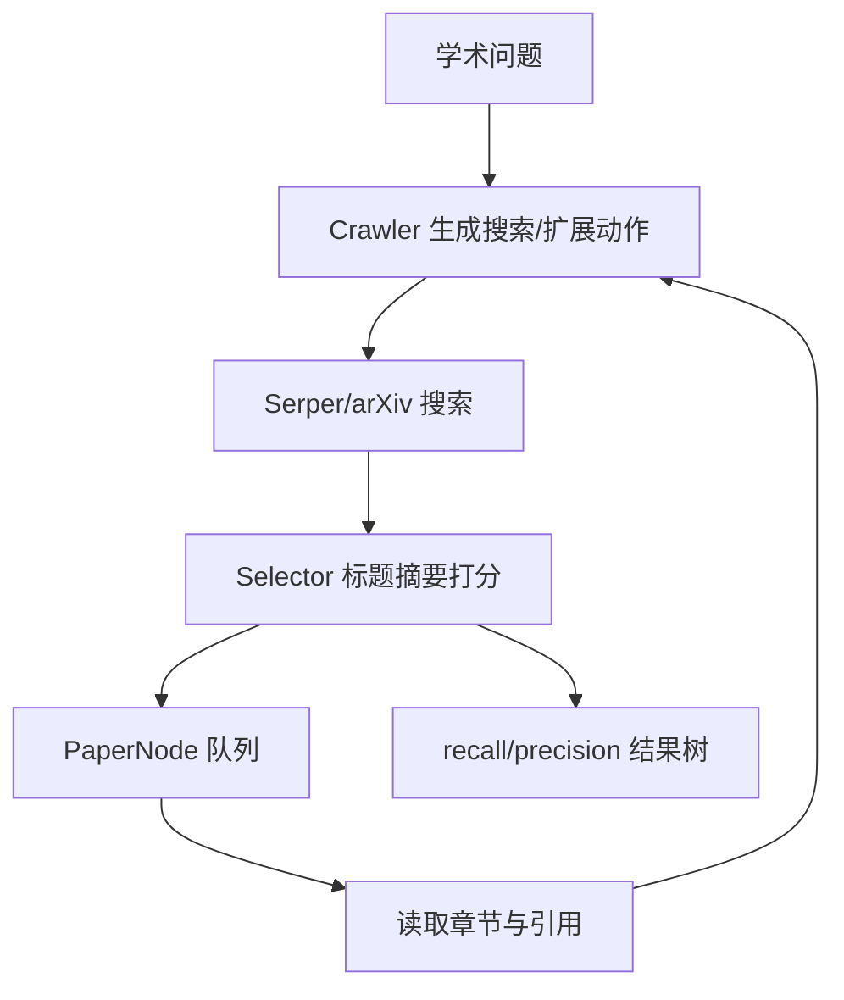

# bytedance/pasa：Crawler—Selector 双 Agent 学术论文检索

| 字段 | 值 |
|---|---|
| GitHub | https://github.com/bytedance/pasa |
| License | Apache-2.0 |
| Stars | 1658（2026-09-17 快照） |
| GitHub 最后 push | 2025-05-27 |
| 分析 commit | `2aaa6a9b1e48d24a2b7e21e8551f863dad9eeb84` |
| 生命周期 | GitHub 候选冻结记录为未归档；固定提交用于本页源码分析 |
| 产品类型 | 学术论文搜索 Agent |
| 分析证据 | 固定提交中的 README、许可证、配置与核心实现 |

本文用 📘 标注文档或源码中可直接定位的事实，🔶 标注由控制流推导的边界，💬 标注评价与借鉴建议。仓库动态元数据沿用候选清单，源码判断只绑定页面中的固定提交。

## 1. 它到底是什么

PaSa 将学术检索拆成 Crawler 与 Selector。Crawler 从用户问题生成搜索词、搜索 arXiv、读取论文章节并沿引用扩展；Selector 对标题和摘要打相关性分数，结果以 PaperNode 树保存。 本文把仓库作为一个公开源码快照来分析：README 的产品定位、命令和 benchmark 数字属于项目文档；代码路径用于确认控制流、数据结构和边界。没有把 stars、README 宣称的准确率、SOTA 或部署体验转换成独立结论。

源码中最值得关注的是：PaperAgent.search 让 crawler 生成 Search]...[/] 片段并并发搜论文；selector 对论文标题/摘要返回 True token 概率，超过 0.5 进入 recall_papers 和队列。expand 按 select_score 排序，crawler 决定阅读哪些章节，解析章节引用，再由 selector 筛选并挂入 child 树；run 先 search 后按 expand_layers 循环。 这决定了它应在 RH 产品地图中被看作“学术论文搜索 Agent”，而不是泛化地称为自动科研系统。

## 2. 运行时堆叠

运行时可拆成以下层：

- **入口与配置**：由仓库提供的 CLI、脚本、Next.js/API 或配置文件接收任务和参数。
- **Agent/编排**：run_paper_agent.py 加载两个 Hugging Face Transformers 模型和 JSONL 查询；PaperAgent 管理查询、队列、层数和线程；utils.py 通过 Serper 搜 arXiv、arXiv/ar5iv 取内容、BeautifulSoup 解析章节与引用；PaperNode 保存标题、arxiv_id、depth、child、sections、source、select_score；metrics.py 对结果树计算 recall/precision。
- **工具与环境**：工具调用连接搜索、文件、浏览器、向量库、解释器或沙箱；工具是否真的隔离取决于配置和外部服务。
- **状态与产物**：本项目保存的状态形式包括缓存、队列、日志、数据库、PaperNode、retrieval result、文件或 grade；它们不自动等同于 RH artifact。

这种分层让替换模型和工具变得容易，但也将“接口存在”和“证据可信”分开。源码可以证明一个函数会生成/保存某种对象，不能单凭存在证明对象内容正确。

## 3. 阶段机或 DAG

核心控制流如下。

PaperAgent.search 让 crawler 生成 Search]...[/] 片段并并发搜论文；selector 对论文标题/摘要返回 True token 概率，超过 0.5 进入 recall_papers 和队列。expand 按 select_score 排序，crawler 决定阅读哪些章节，解析章节引用，再由 selector 筛选并挂入 child 树；run 先 search 后按 expand_layers 循环。 阶段之间通常由消息、列表、队列、结构化对象或日志连接；是否能跨进程恢复，取决于具体实现，而不是 Mermaid 图本身。需要特别区分循环的两种含义：一种是有限的 max_depth/max_rounds/max_iter/max_steps 或 expand_layers；另一种是模型自主决定继续。源码中的上限能限制预算，但不能保证每次运行都走完所有阶段，也不能保证模型输出符合提示。

## 4. Tool / Skill / Agent 怎么切

该仓库的 Agent 边界是：主 Agent 接收任务并决定下一步；子 Agent/worker（若有）承担局部任务；tool 是可调用的搜索、抓取、文件、浏览器、代码或数据接口；skill（若有）主要是提示/能力包，不等于可审计的执行 artifact。具体来说，run_paper_agent.py 加载两个 Hugging Face Transformers 模型和 JSONL 查询；PaperAgent 管理查询、队列、层数和线程；utils.py 通过 Serper 搜 arXiv、arXiv/ar5iv 取内容、BeautifulSoup 解析章节与引用；PaperNode 保存标题、arxiv_id、depth、child、sections、source、select_score；metrics.py 对结果树计算 recall/precision。

工具调用的返回通常被转成文本、结构化响应或日志，再回到模型上下文。优点是扩展快，缺点是不同工具的来源、版本、错误和副作用可能没有统一合同。对于 RH，接入时不应只映射函数名，还要记录输入、输出、外部资源、权限、失败原因和可复核句柄。

## 5. 文献怎么来、是否入库、引用约束

文献/来源链是：主要是 Serper Google Search 的 arXiv结果、arXiv 元数据/全文和引用网络；本地 paper_database 为训练/运行准备的数据文件。源码没有通用论文库 claim/evidence 图，也没有把段落 span 与最终回答绑定。

这条链路能支持“找到或读取来源”，但通常不能直接支持 claim-level evidence。源码未显示统一的 DOI/版本/页码/span/主张/支持强度对象，也没有在最终文字生成前做逐句 entailment gate。若项目有 URL、reference、arxiv_id、PaperNode 或 RetrievalResult，它们仍主要是检索和展示元数据。

因此，报告中的来源约束应写成：系统会按提示或数据结构保留来源；不能写成“每条结论都已验证”。在 RH 中，建议将这些中间来源摄取为 paper/source，再显式链接 claim 和 evidence span。

## 6. 实验 / 代码执行

工程上，README报告 AutoScholarQuery、RealScholarQuery 与 recall@20/50/100 等结果，并给出 SFT/PPO 命令。这些是项目自述；metrics.py确实实现集合层面的 crawler recall、selector precision/recall 和 top-k recall，但本次未下载数据、模型或调用搜索。

**事实边界**：本次只读了公开仓库固定提交，没有安装依赖、配置 API key、下载模型/数据、启动外部服务或运行 benchmark。因而不能确认运行时性能、成本、并发稳定性、沙箱隔离、模型质量、检索召回或 README 中的结果。源码里的测试/评估函数可以说明“如何评”，不能说明“本次已评”。

若将它用于科研执行，还需要补齐数据版本、代码提交、环境镜像、资源上限、随机种子、指标定义、原始输出和失败记录，并把每次执行绑定到不可变 artifact。

## 7. 写稿怎么做

写作输出取决于项目类型：学术论文搜索 Agent 的最终产物通常是 Markdown、报告字符串、聊天消息、结构化 Report、检索回答或 grade JSON。PaperAgent.search 让 crawler 生成 Search]...[/] 片段并并发搜论文；selector 对论文标题/摘要返回 True token 概率，超过 0.5 进入 recall_papers 和队列。expand 按 select_score 排序，crawler 决定阅读哪些章节，解析章节引用，再由 selector 筛选并挂入 child 树；run 先 search 后按 expand_layers 循环。

若有报告器，它往往把多个阶段的摘要合并为可读文本；引用可能是 URL、reference id、source 字段或 rubric 记录。这里没有看到 RH 意义上的章节草稿、参考文献数据库、claim/evidence 互证、LaTeX/PDF 编译和提交版本闸门。因此“能生成报告”不应被扩写成“能生成可投稿论文”。

## 8. 图怎么做

固定提交中的图能力应按数据来源区分。项目可能包含 README 架构图、UI 进度事件、流程 Mermaid、benchmark 绘图脚本或报告 Markdown，但这与从实验记录生成可发表定量图不同。PaSa 将学术检索拆成 Crawler 与 Selector。Crawler 从用户问题生成搜索词、搜索 arXiv、读取论文章节并沿引用扩展；Selector 对标题和摘要打相关性分数，结果以 PaperNode 树保存。

本报告不把仓库 README 的截图、曲线或分数表重绘成独立实验结果。若下游要出图，必须先声明数据源、统计单位、误差定义、样本量、面板与图注主张；对于架构图，则需把实际节点、权限边界和失败路径与源码对齐。

## 9. 和 RH 的相似点

1. 都把文献检索做成可扩展树，而不是一次 SERP 列表。
2. 都给节点打分后再决定是否展开，而不是无界爬取。
3. 都把 recall/precision 类指标当作检索合同的一部分，而不是只看“找到了多少链接”。

## 10. 和 RH 的不同点

RH 入库后还要 claim/span 与引用闸。PaSa 的权威对象是 PaperNode 树：Crawler 扩层，Selector 按 select_score>0.5 过滤，expand_layers 控制深度。Serper + arXiv 是搜索后端，不是统一论文池。树节点保存检索结构，不等于证据对象；本次未复现论文中的检索分数。

## 11. 优点 / 缺点

**优点**

- PaperNode 把父子扩展关系显式化。
- select_score 阈值让展开可停。
- Crawler/Selector 分工清楚。

**缺点**

- 高分节点仍可能是摘要级相关，不是 span 级支持。
- 依赖外部搜索 API。
- 论文表格数字不是本次实测。

💬 可学的是“检索树 + 阈值停”，不是把 PaSa 分数写进图谱。

## 12. RH 可学的 1–3 条

1. **用树而不是扁平 URL 列表保存扩展历史。** 便于看哪一层引入噪声。
2. **把 select_score 阈值写成硬停，而不是提示里的“请筛选”。**
3. **Crawler 与 Selector 分角色。** 扩层和过滤不要挤在同一个 prompt。

## 13. 名字速查表

| 名字 | 先决概念 | 含义 |
|---|---|---|
| PaperNode | 检索树节点 | 一篇候选及其子扩展 |
| Crawler | 扩层 | 按 query 生长树 |
| Selector | 过滤 | select_score>0.5 |
| expand_layers | 预算 | 树深度上限 |
| Serper / arXiv | 搜索后端 | 网页与预印本 |

> 📌事实边界：本页绑定固定提交（`2aaa6a9b1e48d24a2b7e21e8551f863dad9eeb84`），快照日期 2026-09-17。未调用 Serper/arXiv，未复现论文 recall/precision，未把 PaperNode 树当作已核验文献库。
