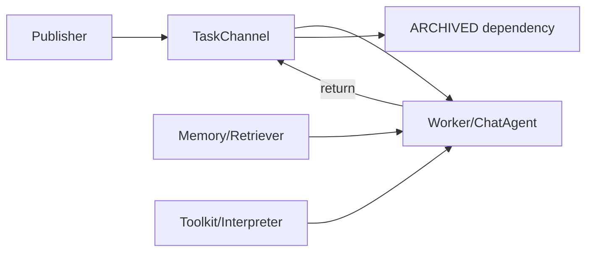

# camel-ai/camel：面向大规模多 Agent 的通用研究框架

| 字段 | 值 |
|---|---|
| GitHub | https://github.com/camel-ai/camel |
| License | Apache-2.0 |
| Stars | 17726（2026-09-17 快照） |
| GitHub 最后 push | 2026-09-14 |
| 分析 commit | `8c791b7b9cf7deab56cb5a92818c34499af9097f` |
| 生命周期 | GitHub 候选冻结记录为未归档；固定提交用于本页源码分析 |
| 产品类型 | 多 Agent 科研基础设施 |
| 分析证据 | 固定提交中的 README、许可证、配置与核心实现 |

本文用 📘 标注文档或源码中可直接定位的事实，🔶 标注由控制流推导的边界，💬 标注评价与借鉴建议。仓库动态元数据沿用候选清单，源码判断只绑定页面中的固定提交。

## 1. 它到底是什么

CAMEL 是通用 multi-agent framework 与社区生态，不是端到端论文生产产品。固定提交包含角色对话、Workforce 任务分发、记忆/检索、工具包、代码解释器、ArXiv工具和大量 benchmark/示例。 本文把仓库作为一个公开源码快照来分析：README 的产品定位、命令和 benchmark 数字属于项目文档；代码路径用于确认控制流、数据结构和边界。没有把 stars、README 宣称的准确率、SOTA 或部署体验转换成独立结论。

源码中最值得关注的是：Workforce 将 Task 包成 Packet，状态在 SENT/PROCESSING/RETURNED/ARCHIVED 间变换。publisher 发布任务或依赖，assignee 原子领取，worker 执行并 return，依赖可 archive 后被其他任务引用。RolePlaying 则是角色消息循环。具体应用需自行组装 Agent、任务、工具和存储。 这决定了它应在 RH 产品地图中被看作“多 Agent 科研基础设施”，而不是泛化地称为自动科研系统。

## 2. 运行时堆叠

运行时可拆成以下层：

- **入口与配置**：由仓库提供的 CLI、脚本、Next.js/API 或配置文件接收任务和参数。
- **Agent/编排**：ChatAgent/RolePlaying 提供 Agent 与角色协作；Workforce 由 worker、TaskChannel、事件、workflow memory 和 callback 组成；TaskChannel 用 condition、task/status索引和 assignee/publisher 队列实现异步任务流；memories 提供 chat history、vector DB 和 long-term 组合；retrievers 支持 BM25、向量和 rerank；toolkits 承担搜索、ArXiv、代码执行等能力。
- **工具与环境**：工具调用连接搜索、文件、浏览器、向量库、解释器或沙箱；工具是否真的隔离取决于配置和外部服务。
- **状态与产物**：本项目保存的状态形式包括缓存、队列、日志、数据库、PaperNode、retrieval result、文件或 grade；它们不自动等同于 RH artifact。

这种分层让替换模型和工具变得容易，但也将“接口存在”和“证据可信”分开。源码可以证明一个函数会生成/保存某种对象，不能单凭存在证明对象内容正确。

## 3. 阶段机或 DAG

核心控制流如下。

Workforce 将 Task 包成 Packet，状态在 SENT/PROCESSING/RETURNED/ARCHIVED 间变换。publisher 发布任务或依赖，assignee 原子领取，worker 执行并 return，依赖可 archive 后被其他任务引用。RolePlaying 则是角色消息循环。具体应用需自行组装 Agent、任务、工具和存储。 阶段之间通常由消息、列表、队列、结构化对象或日志连接；是否能跨进程恢复，取决于具体实现，而不是 Mermaid 图本身。需要特别区分循环的两种含义：一种是有限的 max_depth/max_rounds/max_iter/max_steps 或 expand_layers；另一种是模型自主决定继续。源码中的上限能限制预算，但不能保证每次运行都走完所有阶段，也不能保证模型输出符合提示。

## 4. Tool / Skill / Agent 怎么切

该仓库的 Agent 边界是：主 Agent 接收任务并决定下一步；子 Agent/worker（若有）承担局部任务；tool 是可调用的搜索、抓取、文件、浏览器、代码或数据接口；skill（若有）主要是提示/能力包，不等于可审计的执行 artifact。具体来说，ChatAgent/RolePlaying 提供 Agent 与角色协作；Workforce 由 worker、TaskChannel、事件、workflow memory 和 callback 组成；TaskChannel 用 condition、task/status索引和 assignee/publisher 队列实现异步任务流；memories 提供 chat history、vector DB 和 long-term 组合；retrievers 支持 BM25、向量和 rerank；toolkits 承担搜索、ArXiv、代码执行等能力。

工具调用的返回通常被转成文本、结构化响应或日志，再回到模型上下文。优点是扩展快，缺点是不同工具的来源、版本、错误和副作用可能没有统一合同。对于 RH，接入时不应只映射函数名，还要记录输入、输出、外部资源、权限、失败原因和可复核句柄。

## 5. 文献怎么来、是否入库、引用约束

文献/来源链是：ArxivToolkit 可搜索 arXiv、返回元数据并尝试用 arxiv2text 抽全文，也可下载 PDF；retriever 可从本地/向量存储取上下文。它们是工具和检索能力，不自动形成带 claim/span/support status 的论文证据图。

这条链路能支持“找到或读取来源”，但通常不能直接支持 claim-level evidence。源码未显示统一的 DOI/版本/页码/span/主张/支持强度对象，也没有在最终文字生成前做逐句 entailment gate。若项目有 URL、reference、arxiv_id、PaperNode 或 RetrievalResult，它们仍主要是检索和展示元数据。

因此，报告中的来源约束应写成：系统会按提示或数据结构保留来源；不能写成“每条结论都已验证”。在 RH 中，建议将这些中间来源摄取为 paper/source，再显式链接 claim 和 evidence span。

## 6. 实验 / 代码执行

工程上，CodeExecutionToolkit 支持 internal_python、Jupyter、Docker、subprocess、E2B 和 microsandbox；本地 execution 默认需要确认，具体隔离取决于选择的 interpreter。CAMEL有 benchmark 与数据生成生态，但当前源码审阅未运行任何任务。

**事实边界**：本次只读了公开仓库固定提交，没有安装依赖、配置 API key、下载模型/数据、启动外部服务或运行 benchmark。因而不能确认运行时性能、成本、并发稳定性、沙箱隔离、模型质量、检索召回或 README 中的结果。源码里的测试/评估函数可以说明“如何评”，不能说明“本次已评”。

若将它用于科研执行，还需要补齐数据版本、代码提交、环境镜像、资源上限、随机种子、指标定义、原始输出和失败记录，并把每次执行绑定到不可变 artifact。

## 7. 写稿怎么做

写作输出取决于项目类型：多 Agent 科研基础设施 的最终产物通常是 Markdown、报告字符串、聊天消息、结构化 Report、检索回答或 grade JSON。Workforce 将 Task 包成 Packet，状态在 SENT/PROCESSING/RETURNED/ARCHIVED 间变换。publisher 发布任务或依赖，assignee 原子领取，worker 执行并 return，依赖可 archive 后被其他任务引用。RolePlaying 则是角色消息循环。具体应用需自行组装 Agent、任务、工具和存储。

若有报告器，它往往把多个阶段的摘要合并为可读文本；引用可能是 URL、reference id、source 字段或 rubric 记录。这里没有看到 RH 意义上的章节草稿、参考文献数据库、claim/evidence 互证、LaTeX/PDF 编译和提交版本闸门。因此“能生成报告”不应被扩写成“能生成可投稿论文”。

## 8. 图怎么做

固定提交中的图能力应按数据来源区分。项目可能包含 README 架构图、UI 进度事件、流程 Mermaid、benchmark 绘图脚本或报告 Markdown，但这与从实验记录生成可发表定量图不同。CAMEL 是通用 multi-agent framework 与社区生态，不是端到端论文生产产品。固定提交包含角色对话、Workforce 任务分发、记忆/检索、工具包、代码解释器、ArXiv工具和大量 benchmark/示例。

本报告不把仓库 README 的截图、曲线或分数表重绘成独立实验结果。若下游要出图，必须先声明数据源、统计单位、误差定义、样本量、面板与图注主张；对于架构图，则需把实际节点、权限边界和失败路径与源码对齐。

## 9. 和 RH 的相似点

1. 都把多 Agent 协作做成有状态的任务包，而不是无界群聊。
2. 都提供文献与代码工具（ArxivToolkit、多种 code interpreter），并允许替换模型。
3. 都需要给 Packet 一个明确终态，否则长任务无法验收。

## 10. 和 RH 的不同点

RH 的 Packet 等价物是 artifact + gate。CAMEL Workforce 的 Packet 状态是 SENT / PROCESSING / RETURNED / ARCHIVED，权威对象是会话与工具调用，不是 claim-evidence。ArxivToolkit 返回检索文本；code interpreter 有多种后端，隔离级别取决于部署。框架覆盖聊天、workforce、rag、解释器，品类比科研生产宽。

## 11. 优点 / 缺点

**优点**

- Packet 四态让委派可追踪。
- Toolkit 分层，Arxiv 与解释器可插拔。
- 作为通用多 Agent 框架，例子多、接口稳定。

**缺点**

- 通用框架不等于科研闸门。
- 工具返回值默认进对话，不一定进证据库。
- 本次未跑 Workforce 或解释器。

💬 对照点是 Packet 生命周期，不是“CAMEL 能写论文”。

## 12. RH 可学的 1–3 条

1. **给每个委派包规定 SENT→PROCESSING→RETURNED→ARCHIVED，禁止无终态。**
2. **把 ArxivToolkit 结果在适配层升级为 paper 对象，而不是只把摘要贴进聊天。**
3. **code interpreter 后端写进运行配置。** 同一函数名可能对应完全不同的隔离级别。

## 13. 名字速查表

| 名字 | 先决概念 | 含义 |
|---|---|---|
| Workforce | 多 Agent 编排 | 分发 Packet |
| Packet | 任务包 | SENT/PROCESSING/RETURNED/ARCHIVED |
| ArxivToolkit | 文献工具 | 检索预印本 |
| code interpreter | 执行 | 多种后端 |
| Society / ChatAgent | 会话角色 | 通用对话 Agent |

> 📌事实边界：本页绑定固定提交（`8c791b7b9cf7deab56cb5a92818c34499af9097f`），快照日期 2026-09-17。未运行 Workforce，未调用 arXiv 或解释器，未把示例 notebook 当作本次实测。
