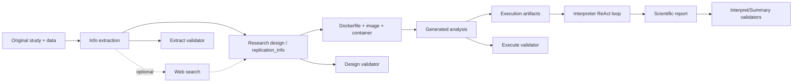

# CenterForOpenScience/llm-benchmarking：面向复制研究的 Agent 基准流水线

| 字段 | 值 |
|---|---|
| GitHub | https://github.com/CenterForOpenScience/llm-benchmarking |
| 分析提交 | `fb6a804fd710764f3ad3c8b84e1323c2804c4776` |
| 元数据快照 | 2026-09-17 |
| 代码许可 | Apache-2.0 |
| 审阅状态 | draft；固定提交静态阅读，未运行 |

## 1. 它到底是什么

这是 Center for Open Science 的 LLM Benchmarking 项目，在固定提交的公开 README 中以 ReplicatorBench 为主要可见组成。它试图把科学研究生命周期拆成信息抽取、研究设计、代码执行、统计解释和验证，而不是只评估一个聊天回答。README 同时提到 replication、peer review 和 research design；本次实际阅读的 `replicatorbench` 文档和源码重点落在复制研究的 Extract → Design → Execute → Interpret 流程。📘README 将 Docker、LLM-as-judge、专家标注 ground truth 等列为能力描述，但本次没有运行完整管线、校验专家标注或复核预印本数字。

它更像一个“研究任务执行编排器 + 评估套件”，而不是一套固定科学分析方法。`core/agent.py` 的 Agent 维护消息、模型、工具和 session state，`run_react_loop` 反复请求模型、执行 action、回传 tool output，并在识别 JSON Answer 后结束。`generator/orchestrator_tool.py` 则把 replication_info 转成两步计划：prepare-env 和 container 运行分析脚本。🔶这使得框架能承载多种研究，但也意味着最终结果质量取决于输入研究规格、代码、容器依赖、模型和 evaluator rubric。

## 2. 运行时堆叠

运行时依赖 OpenAI 客户端、文件读取工具、pandas/numpy 等数据包和 Docker。`orchestrator_generate_dockerfile` 依据 `docker_specs` 生成基础镜像、系统包、R/Python 包和非 root runner；`orchestrator_run_container` 挂载 study、replication_data 和 artifacts，并允许调用者传入内存、CPU、只读和禁网选项。代码还会探测 entry file、执行 R/Python/Bash 并记录 stdout、stderr、exit code、artifacts。默认配置是否真的启用所有安全选项，要看调用参数，不能从“支持 sandbox”简化为“默认完全隔离”。

## 3. 阶段机或 DAG

主链是四个可单独执行的阶段，外加可选检索与独立验证：从原始论文/数据提取结构化信息，必要时进行 web search，生成 replication_info 和分析脚本，放进容器执行，再让 interpreter 读取结果并生成解释。Makefile 把 `extract-stage1`、`web-search`、`design-easy`、`execute-easy`、`interpret-easy` 以及各阶段 evaluate 命令串起来。某一阶段的 JSON 和日志会成为下阶段的输入，研究者可以只跑单阶段而不必总是全量运行。

## 4. Tool / Skill / Agent 怎么切

**Agent** 是通用 ReAct loop：模型可以提出多个 tool calls，框架执行 known_actions 并把结果作为 tool messages。**Tool** 包括文件/数据读写、数据分析、研究设计和容器编排函数；**Skill** 没有在已查看文件中形成独立 marketplace，而是由模块和 prompt/template 组合。**Environment** 主要是 study_path、session_state、Docker workspace 和 artifact 目录。Agent 的 `max_turns` 默认 50，token 统计和 checkpoint_stats 被写入 metadata，便于观察耗时和调用量。

## 5. 文献怎么来、是否入库、引用约束

初始证据是研究者提供的 original study、数据和人工参考材料。`replicatorbench/README.md` 单列 web-search 阶段，用于根据原论文寻找复制研究所需的数据资源；Makefile 也提供独立入口，但 `pipeline-easy` 的依赖列表只包含 extract/design/execute/interpret，并未自动包含 web-search。

已读 `core/tools.py` 的 PDF helper 对 15 页以内文本直接返回，对更长 PDF 分块摘要；HTML reader 可把嵌入图片保存为文件并转成 Markdown。摘要是派生上下文，不能替代原文的精确证据跨度。当前所读链路以 study 文件夹和 JSON 为主要载体，没有显示持久的全局论文池或“每条解释必须绑定文献页码”的强制引用闸。根 README 链接 [ReplicatorBench 预印本](https://arxiv.org/abs/2602.11354)，论文内容本次未另行全文审阅。

## 6. 实验 / 代码执行

代码执行不是一句“生成代码”就结束：规划器从 replication_info 选择入口文件和语言；Dockerfile 可能安装 R/Python 依赖；container helper 在工作目录执行脚本；输出被限制在约 20,000 token，过长时截断并提示重写日志。interpreter 还会自动发现 txt/docx/log 文件，`read_log` 对过长日志分块，让模型逐块摘要后再综合。执行结果的可信度仍需要 validator 比较统计输出和参考结果，不能因为进了 Docker 就视为复现成功。

容器运行函数默认 `read_only=False`、`network_disabled=False`，CPU/内存限额也是可选项，study 和 artifact 以 rw 挂载。执行步骤的 `ok` 由退出码等执行状态产生；core loop 解析出最终 JSON 后记录的 Success 也只是工作流状态，都不能单独表示原研究结论已被复制。

## 7. 写稿怎么做

写稿产物是 interpreter 的科学解释报告、阶段 JSON 和日志，而不是自动生成后直接投稿的论文。`run_react_loop` 的最终 Answer 需要符合 JSON 解析路径，随后 `save_output` 保存阶段结果。Makefile 的 evaluate-interpret 和 evaluate-summary 对这些结果做单独验证。📘这种“先保留结构化中间产物，再生成解释”的路径适合接入写作；但报告中的因果或科学结论仍应引用原论文、数据和执行日志，不应将 LLM 的 prose 当作新实验。

## 8. 图怎么做

公开 README/Makefile 没有把图表作为独立生产层；框架更直接地保存执行输出、CSV/数据描述、metadata 和 interpretation JSON。可以在不改变证据边界的前提下，依据真实 execution artifacts 绘制原始/复制统计量比较、阶段耗时与 token、缺失字段覆盖率等图。不能用一个“复制成功”饼图遮住哪些代码、数据、指标或环境没有匹配。图的每个数值应能回指 study_path 中的结果和 validator 版本。

## 9. 和 RH 的相似点

RH 与该项目都重视从问题到执行再到解释的分阶段合同，也都需要保留模型调用、工具结果、代码版本和最终 artifact。ReplicatorBench 的 `replication_info.json`、Docker execution_result 和 metadata 可对应 RH 的任务绑定、运行记录和产物 lineage；validator 分成 extract/design/execute/interpret 也对应多道证据闸。它展示了一个有用原则：解释阶段不应吞掉执行阶段的原始 stdout、stderr 和退出码。

## 10. 和 RH 的不同点

该项目的核心评价对象是 replication pipeline 的阶段质量；RH 还要处理广泛文献、claim/evidence 链、稿件版本、审稿闸和发布材料。ReplicatorBench 的 LLM-as-judge 依据 ground truth 给分，不能等同于真实统计审计或同行评审。Docker container 是可执行边界，但挂载和网络开关须逐次检查；同时“生成 replication plan”不等于已经取得原始数据许可或完成成功复制。

## 11. 优点 / 缺点

**优点**：阶段职责和 Makefile 命令清晰；设计、执行、解释之间有显式文件合同；容器计划能探测语言和 entry；长日志有截断/分块策略；metadata 记录 token、turn 和 checkpoint。**局限**：外部 Docker、数据、依赖和 API 都是运行前提；默认 fallback base image 可能掩盖规格缺失；LLM 规划器可生成不存在或不合适的入口；LLM-as-judge 与人工 rubric 的一致性需要独立验证；当前快照的 README 标注 ongoing，不能假设每个目录都已同等成熟。

## 12. RH 可学的 1–3 条

💬以下是架构借鉴建议，不是该项目已实现的 RH 集成。

1. **执行与解释解耦**：先保存可重放的命令、返回码、环境和 artifact，再允许模型写解释。
2. **把每阶段的成功标准显式化**：提取、设计、执行、解释各自有 gate，避免最终报告替代前置证据。
3. **让资源边界可审计**：记录 Docker 镜像、挂载、CPU/内存、网络、模型、token 和日志截断状态。

## 13. 名字速查表

| 名字 | 含义 |
|---|---|
| `Agent` | 带消息和工具的模型客户端封装 |
| `run_react_loop` | 处理 Thought、tool call、观察和 JSON Answer 的循环 |
| `ExecutionPlan` | prepare-env 与 container 步骤的数据结构 |
| `orchestrator_generate_dockerfile` | 从研究规格生成 Dockerfile |
| `orchestrator_execute_entry` | 在容器中运行计划入口并保存执行结果 |
| `replication_info.json` | 复制研究设计和代码/环境规格 |
| `interpret` | 读取结果并输出科学解释的阶段 |
| `validator` | 各阶段的 LLM/规则评估 CLI |

---

> 📌事实边界
> 本页依据上述固定提交的公开 README 与列明源码进行静态分析，没有安装运行项目、调用外部模型/服务、下载完整外部数据或独立重算 README/论文的规模与性能数字。流程图是源码/文档结构概括，不是运行轨迹；比较 RH 的内容属于架构分析，建议属于评述。快照日期来自候选清单，不表示本次运行了该日的服务。
> 核对来源：[README.md](https://github.com/CenterForOpenScience/llm-benchmarking/blob/fb6a804fd710764f3ad3c8b84e1323c2804c4776/README.md)、[replicatorbench/README.md](https://github.com/CenterForOpenScience/llm-benchmarking/blob/fb6a804fd710764f3ad3c8b84e1323c2804c4776/replicatorbench/README.md)、[replicatorbench/Makefile](https://github.com/CenterForOpenScience/llm-benchmarking/blob/fb6a804fd710764f3ad3c8b84e1323c2804c4776/replicatorbench/Makefile)、[replicatorbench/core/agent.py](https://github.com/CenterForOpenScience/llm-benchmarking/blob/fb6a804fd710764f3ad3c8b84e1323c2804c4776/replicatorbench/core/agent.py)、[replicatorbench/generator/orchestrator_tool.py](https://github.com/CenterForOpenScience/llm-benchmarking/blob/fb6a804fd710764f3ad3c8b84e1323c2804c4776/replicatorbench/generator/orchestrator_tool.py)、[replicatorbench/interpreter/agent.py](https://github.com/CenterForOpenScience/llm-benchmarking/blob/fb6a804fd710764f3ad3c8b84e1323c2804c4776/replicatorbench/interpreter/agent.py)、[replicatorbench/validator/README.md](https://github.com/CenterForOpenScience/llm-benchmarking/blob/fb6a804fd710764f3ad3c8b84e1323c2804c4776/replicatorbench/validator/README.md)、[replicatorbench/core/tools.py](https://github.com/CenterForOpenScience/llm-benchmarking/blob/fb6a804fd710764f3ad3c8b84e1323c2804c4776/replicatorbench/core/tools.py)。
