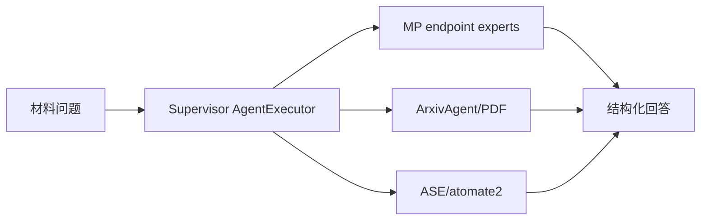

# LLaMP：以 Materials Project 为锚点的层级材料知识 RAG Agent

| 字段 | 值 |
|---|---|
| GitHub | https://github.com/chiang-yuan/llamp |
| License | 根 `LICENSE` 为 LBNL/UC 定制 BSD-3 风格声明；GitHub API 仍为 NOASSERTION |
| Stars | 100（2026-09-17 冻结快照） |
| 最后 push | 2025-11-11 |
| 分析提交 | `77991f07afb501e05d943026ed2e30c9d0b4921c` |
| 快照日期 | 2026-09-17 |
| 产品类型 | 材料信息学检索与仿真 Agent |
| 分析证据 | `README.md`、`LICENSE`、`api/pyproject.toml`、`api/src/llamp/mp/agents.py`、`api/src/llamp/mp/tools.py`、`api/src/llamp/arxiv/agents.py`、`api/src/llamp/ase/tools.py`、`api/src/llamp/atomate2/tools.py`、`api/src/llamp/sse.py` |

本文用 📘 标注文档或源码中可直接定位的事实，🔶 标注由控制流推导的边界，💬 标注评价与借鉴建议。仓库动态元数据沿用候选清单，源码判断只绑定页面中的固定提交。

## 1. 它到底是什么

README 将 LLaMP 定位为访问 Materials Project 的多模态 RAG framework。MPAgent 子类按 summary、structure、thermo、elasticity、magnetism、dielectric、piezoelectric、electronic 和 synthesis endpoint 拆分；另外有 arXiv/PDF、ASE Nose–Hoover MD 与 atomate2/MLFF/VASP 工具。它的核心是受工具 schema 约束的材料知识检索和计算调用，而不是独立材料模型。

## 2. 运行时堆叠

API 以 LangChain AgentExecutor 组织 JSON ReAct，流式服务提供 health、key 校验、agent_stream 和 chat。README 将模拟依赖作为可选安装介绍，但冻结 `api/pyproject.toml` 已把 atomate2 分支和 ASE 的 Git 依赖列入核心 dependencies；安装时应以该提交清单为准。Docker 可启动 web interface。`sse.py` 使用 Redis pub/sub 传输模型事件，并用 RedisChatMessageHistory 保存 chat_id 对应的对话，因此它有对话记忆，而不是完全无状态服务；这仍不同于跨项目科研 artifact 库。

结构展示也是短期服务状态：`MaterialsStructureVis` 把材料 ID 对应结构写入 Redis，并设置 3600 秒过期，再向对话频道发送结构 ID；`/api/structures/{material_id}` 从缓存返回结构。此实现适合交互演示，但如果需要长期追溯某次答案依据的晶体结构，还需另行保存结构快照、MP 查询条件和获取时间。

## 3. 阶段机或 DAG

MP 专家、ArxivAgent 和 ASE/atomate2 是并列工具分支。

这是代码结构，不代表结果已独立审计。

## 4. Tool / Skill / Agent 怎么切

MP tools 按 endpoint 分出 Summary、Structure、Thermo、Elasticity、Magnetism、Dielectric、Piezoelectric、Electronic、Synthesis。NoseHooverMD 使用 MACE-MP/ASE NPT；atomate2 工具可 local run 或 FireWorks submit，MLFFMD/MLFFElastic/VASP 返回任务结果或 workflow display。

## 5. 文献怎么来、是否入库、引用约束

ArxivAgent 提供 arXiv 查询和 PDF loader，prompt 明确提醒 preprint 可能未同行评审，并要求读论文时加载 PDF。`load_pdf_from_url` 虽然接收 query/top_k，当前实现却直接对全部 pages 执行 map-reduce summary；相关 Chroma 检索代码处于注释状态，不能将签名中的 top_k 描述为已经生效的相关段落筛选。实现没有统一 DOI、页码、claim source 或论文池；MP 数据 endpoint 也不等于引用证据。

Web 服务实际注册的是 MP 专家以及普通 arXiv、Wikipedia 工具；仓库中另有 ArxivAgent 与模拟工具实现，不代表它们都自动出现在默认 Web 入口。图示表达仓库级组件关系，实际部署需要检查入口装载的工具列表。

## 6. 实验 / 代码执行

代码包含真实执行入口，但依赖 MP key、MACE、VASP/FireWorks 等外部环境；本次未调用这些服务，不声称运行复现。失败多以字符串返回，未见统一 failure artifact。

## 7. 写稿怎么做

工具输出被压缩为简洁回答，ArxivAgent 有 map-reduce summary，Synthesis callback 可结构化 recipe。没有完整论文写作、引用管理或 review workflow。

## 8. 图怎么做

StructureVis 可保存结构供 frontend 显示，MD 写 extxyz/log/json；没有独立 figure suite 或发表级图表审计。

## 9. 和 RH 的相似点

都把自然语言、专业工具和结果总结连接起来，并通过专家化工具减少任意参数。

## 10. 和 RH 的不同点

LLaMP 中心是数据库和计算工具 Agent，RH 中心是跨阶段 artifact、evidence、gate、provenance；没有证据表就不应将服务回答当作可引用结论。

## 11. 优点 / 缺点

优点：endpoint 拆分细，schema prompt 明确，检索与计算兼顾，支持 local/FireWorks。缺点：依赖多，PDF retriever 细节不完整，临时输出与外部队列的 provenance 弱，远程数据版本和密钥影响复现。

许可需按正文判断：GitHub API 在冻结候选中给出 NOASSERTION，但 `LICENSE` 实际含三个再分发条件、免责声明及 Enhancements 的额外授权条款。本报告记作 BSD-3-Clause-like custom copyright notice，是文本性质说明，不把它当作经过正式认定的标准 SPDX BSD-3-Clause。再分发者应保留完整原文。

## 12. RH 可学的 1–3 条

1. 按 endpoint 注册科学工具并严守 schema。2. 统一记录结构、工具版本、队列和输出 artifact。3. 为 PDF 摘要保留页码/段落 source span。

## 13. 名字速查表

| 名字 | 先决概念 | 含义 |
|---|---|---|
| `MPAgent` | ReAct | MP 工具 Agent 基类 |
| `ArxivAgent` | PDF retrieval | arXiv 查询与 PDF 摘要 |
| `NoseHooverMD` | ASE/MACE | NPT 分子动力学工具 |
| `MLFFMD` | atomate2 | 机器学习力场工作流 |
| `FireWorks` | scheduler | 队列提交分支 |

---

> 📌事实边界
> 本报告依据固定提交中的公开文档与实际查看的代码作静态分析。没有安装或执行被分析仓库，没有连接仪器、GPU 集群或收费模型 API。README/论文的能力和结果声明不等于本次复现；外部数据、模型权重、设备校准、部署稳定性以及科学结论的有效性均需另行验证。
