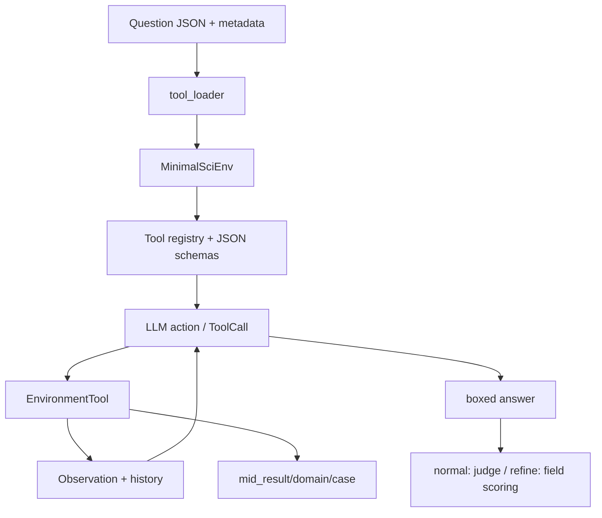

# CMarsRover/SciAgentGYM：多步科学工具调用环境与基准

| 字段 | 值 |
|---|---|
| GitHub | https://github.com/CMarsRover/SciAgentGYM |
| 分析提交 | `e9dbbea4369d67694e38bf8be67bedbcaf9e9300` |
| 元数据快照 | 2026-09-17 |
| 代码许可 | Apache-2.0 |
| 审阅状态 | draft；固定提交静态阅读，未运行 |

## 1. 它到底是什么

SciAgentGYM 是把多步科学工具使用放进可执行环境的 benchmark。README 将目标定义为：面对物理、化学、材料、生命科学等问题，模型需要按顺序调用专业工具，而不是只生成一段自然语言答案。项目元数据把它归入科学工具调用，固定提交的 README 将工具包、文件系统、数据库和 Python interpreter 作为环境的四个组成部分，并给出 1,780+ 工具、259 个任务和 1,134 个子问题等说明。📘这些规模数字是上游 README 的声明；本次没有遍历全部工具包或重跑完整数据集，因此不把它们写成独立盘点结果。

它的最小可用抽象是 `MinimalSciEnv`：环境持有工具字典和 step 计数，`ToolCall` 携带 id、name、arguments，`step` 根据名称找到 `EnvironmentTool` 并调用。工具类用 `track_history` 记录调用参数和观察结果，普通函数也能通过 `GenericFunctionTool` 包装进同一接口。项目的“gym”更多是任务执行协议和评估壳，而不是一个已经完整实现的通用 RL 算法库。🔶因此 README 中的“可用于 agent 训练/评估”不能自动推导出某个 RL 训练结果或跨环境泛化结论。

## 2. 运行时堆叠

运行时由 `gym/env.py`、`gym/tool.py`、`gym/toolbox.py` 和 `gym/core/tool_loader.py` 组成。Toolbox 用类装饰器注册工具；环境可以按名称加载已注册类，也可以从任务内的 function map 生成 `GenericFunctionTool`。`EnvironmentTool.__call__` 捕获普通异常并返回 Observation，同时保留 fatal terminal error 的传播路径。`EnvironmentFileSystem` 提供 json、pickle、txt 三种中间结果格式和按领域/案例的目录方法。README 还描述数据库和 Python interpreter，但具体工具是否需要这些依赖由各工具实现决定。

## 3. 阶段机或 DAG

每个案例先从数据集记录中读取问题、gold answer、工具协议和元数据，推荐入口 `prepare_env_from_query` 按 subject/topic 推断目录，加载该子领域全部工具并注册；另有按任务 `usage_tool_protocol` 与函数映射构造环境的路径。模型提出 function-call 风格的动作，工具返回 Observation；普通模式提取 `\boxed{}` 后请求 judge 判定；refine 模式可以输出结构化答案，再做递归字段比较。中间结果可以通过环境文件系统按 domain/case_id 保存。该管理器实际上是全局单例，case_id 可选；目录组织能力不能直接等同于完整跨任务隔离。

## 4. Tool / Skill / Agent 怎么切

**Tool** 是一等公民：工具有 name、description、arguments、use，并可被 function calling schema 描述。**Environment** 负责工具查找、step 和文件系统；**Agent** 在 README 架构中是多模型客户端，但当前阅读到的核心环境并不强制一种规划算法。**Skill** 没有另设技能包注册机制，科学能力以 `toolkits/` 中的 Python 工具和注册类呈现。Toolbox 是注册表，不是权限系统；工具能做什么仍取决于具体实现和宿主环境。

## 5. 文献怎么来、是否入库、引用约束

任务来自 README 指定的多模态/纯文本 JSON 数据文件，包含问题、gold answer、subject/topic、参考步骤、预期工具和 refined versions。这里的知识获取主要是科学工具所访问的数据库或题目附件，README 点名 PubChem 和本地分子数据库；这与通用论文搜索、全文入库和引用验证是不同层次。

项目论文入口为 [arXiv:2602.12984](https://arxiv.org/abs/2602.12984)。已查看的环境和评估源码没有为工具每个结果建立 DOI/页码/证据跨度的引用合同。若工具返回一个分子属性、谱图或材料参数，使用者仍需记录数据库版本、查询条件和单位，不能仅凭模型最终答案正确就宣称其外部引用可靠。

## 6. 实验 / 代码执行

评估器支持从文本中稳健提取嵌套括号的 `\boxed{}`，另提供结构化答案的字典、列表和叶子值递归比较。数值比较包含精确、两位小数、相对/绝对容差；手工比较失败时会调用配置的 judge model 做二次语义判断。对于 pass@k，代码扫描 trace JSON，统计 `best_is_correct`。这套设计把最终答案准确率和轨迹记录连接起来，但 LLM judge 本身会引入额外模型、提示和服务变量。没有运行 `gym/test_querys.py` 或任何外部科学工具。

## 7. 写稿怎么做

写作不是本项目的主产物。一次任务可以留下 tool history、Observation、中间 JSON 和 trace，评估脚本可以形成分数或汇总文件；README 还提供论文引用信息。但源码和 README 没有显示将每个科学问题的工具轨迹自动写成完整论文段落、参考文献或可编译稿件的流程。接入研究写作时，应把答案和中间产物作为“实验记录”，不要直接把模型的自然语言解释当作经过专家审阅的科学结论。

## 8. 图怎么做

README 展示工具分布 treemap、工具聚类图和环境示意图。它们适合说明覆盖面与架构，不等于评估结果图。若要对记录出图，可用任务/领域的工具调用长度、成功率、错误类型、答案分数和中间 artifact 数做单轴图或小 multiples；需要固定任务 split、模型、是否启用工具和 judge 版本。README 的 1,780+、领域 Python 文件数量和任务数量在这里仅作产品范围说明，未由本次运行复核。

`simple_test_query` 的工具返回处理还会识别 filename 或图片路径、编码文件并保存在消息载荷中，因此图也可能是科学工具的中间产物，而不只是 README 的宣传图。此分支的存在不保证每种模型都正确接收了图像；本次没有验证多模态上传效果。

## 9. 和 RH 的相似点

RH 与 SciAgentGYM 都强调把一个研究问题转成可执行、可记录的步骤，并保留中间结果而不是只保存最后一句答案。`ToolCall`、Observation、history 和 case_id 可以映射到 RH 的 execution trace 与 artifact lineage；工具 schema 的显式参数也有助于在研究记录中重放一次调用。递归字段评分和 segment score 则提供了比单个总分更细的 coverage 视角。

## 10. 和 RH 的不同点

SciAgentGYM 的边界是“科学问题的多步工具使用和答案评估”，它不负责文献真实性、研究主张证据链、论文审稿或发布决策。其 LLM judge 允许语义等价判断，但这不是人工或外部数据库核验。README 说任务在 isolated instance 中运行，公开代码展示了独立环境对象和按案例的路径设计；不过本页没有做容器级隔离审计，也没有将“有工具”解释成“工具结果必然正确”。

## 11. 优点 / 缺点

**优点**：ToolCall/EnvironmentTool/Observation 形成低门槛执行合同；注册表和 function schema 便于扩展；中间结果文件系统有明确的领域和 case 维度；评估器对嵌套答案、数值容差和 trace 汇总考虑较完整。**局限**：工具数量与数据规模依赖上游清单；某些工具可能需要本地数据库、图片或大型科学依赖；答案评估的二次 LLM 判断增加不可控因素；环境基类的 `done` 默认保持 false，复杂终止协议需由上层补充；本次未运行安装脚本和 benchmark。 `requirements.txt` 明确采用不锁版本的包名清单，便于安装，但固定源码提交仍不足以冻结科学计算环境。

## 12. RH 可学的 1–3 条

💬以下是架构借鉴建议，不是该项目已实现的 RH 集成。

1. **让工具调用成为结构化 artifact**：保存工具名、输入 schema、返回 Observation、异常和中间文件引用。
2. **把“工具可用”与“结果可信”分层**：评估既看调用轨迹是否完成，也看输出与独立 gold/复核器是否一致。
3. **按 case 隔离文件和上下文**：将 domain、case_id、随机种子、工具版本写入执行目录，避免跨题污染。

## 13. 名字速查表

| 名字 | 含义 |
|---|---|
| `MinimalSciEnv` | 注册工具并提供 reset/step 的最小科学环境 |
| `ToolCall` | 工具调用 id、名称和参数的数据结构 |
| `EnvironmentTool` | 带调用历史和异常包装的工具抽象基类 |
| `GenericFunctionTool` | 把普通 Python 函数包装成环境工具 |
| `Toolbox` | 工具类的注册和按名实例化入口 |
| `EnvironmentFileSystem` | 按领域/案例保存和读取中间结果 |
| `extract_boxed_answer` | 从模型文本提取最终答案 |
| `calculate_answer_score` | 递归字段匹配与容差评分 |

---

> 📌事实边界
> 本页依据上述固定提交的公开 README 与列明源码进行静态分析，没有安装运行项目、调用外部模型/服务、下载完整外部数据或独立重算 README/论文的规模与性能数字。流程图是源码/文档结构概括，不是运行轨迹；比较 RH 的内容属于架构分析，建议属于评述。快照日期来自候选清单，不表示本次运行了该日的服务。
> 核对来源：[README.md](https://github.com/CMarsRover/SciAgentGYM/blob/e9dbbea4369d67694e38bf8be67bedbcaf9e9300/README.md)、[gym/env.py](https://github.com/CMarsRover/SciAgentGYM/blob/e9dbbea4369d67694e38bf8be67bedbcaf9e9300/gym/env.py)、[gym/tool.py](https://github.com/CMarsRover/SciAgentGYM/blob/e9dbbea4369d67694e38bf8be67bedbcaf9e9300/gym/tool.py)、[gym/toolbox.py](https://github.com/CMarsRover/SciAgentGYM/blob/e9dbbea4369d67694e38bf8be67bedbcaf9e9300/gym/toolbox.py)、[gym/core/environment_fs.py](https://github.com/CMarsRover/SciAgentGYM/blob/e9dbbea4369d67694e38bf8be67bedbcaf9e9300/gym/core/environment_fs.py)、[gym/core/evaluator.py](https://github.com/CMarsRover/SciAgentGYM/blob/e9dbbea4369d67694e38bf8be67bedbcaf9e9300/gym/core/evaluator.py)、[gym/core/tool_loader.py](https://github.com/CMarsRover/SciAgentGYM/blob/e9dbbea4369d67694e38bf8be67bedbcaf9e9300/gym/core/tool_loader.py)、[gym/test_executor.py](https://github.com/CMarsRover/SciAgentGYM/blob/e9dbbea4369d67694e38bf8be67bedbcaf9e9300/gym/test_executor.py)。
