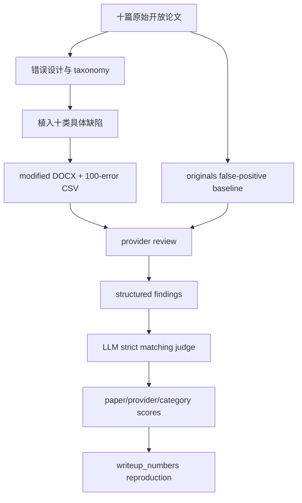

# Dawes-Institute/ai-peer-review-benchmark：用植入错误测量 AI 审稿的检出边界

| 字段 | 值 |
|---|---|
| GitHub | https://github.com/Dawes-Institute/ai-peer-review-benchmark |
| License | 根 `LICENSE` 为 MIT（代码与文档）；论文材料按仓库说明为 CC-BY 4.0；GitHub API 仍为 NOASSERTION |
| Stars | 8（2026-09-17 快照） |
| GitHub 最后 push | 2026-08-09 |
| 分析 commit | `3d9188343eebd4312d3bfbde6822cfa4eaf32fb4` |
| 产品类型 | AI 同行评审可靠性基准、错误注入数据与评分工具 |
| 分析方式 | 固定提交的公开 README、基准代码与错误清单静态阅读 |

本文用 📘 标注文档或源码中可直接定位的事实，🔶 标注由控制流推导的边界，💬 标注评价与借鉴建议。仓库动态元数据沿用候选清单，源码判断只绑定页面中的固定提交。

## 1. 它到底是什么

这个仓库把“AI reviewer 是否真的找到了论文问题”变成了一个有已知答案的检测任务。项目从十篇开放获取的心理学论文出发，每篇植入十个已知的方法学或统计错误，合计 100 个错误；同时保留未修改原文，供误报基线使用。修改稿带有水印和警告，不能与原论文混用。

错误不是单一类型。README 介绍了十类、62 个子类的 taxonomy，植入覆盖其中 50 个子类，并将类别与复现失败相关的经验依据联系起来。评测对象可以是 API 模型，也可以是 Refine.ink、Reviewer3 等商业工具。这个设计的重点是具体缺陷检出，而非让模型给一篇论文写一份看起来完整的总评。由于真值公开、样本只有十篇论文，得到的分数适合说明该基准上的能力边界，不是现实审稿召回率的无条件估计。

## 2. 运行时堆叠

`benchmark/run_reviews.py` 是运行入口，读取十篇 modified 或 originals 文稿，调用 provider，保存每篇的结构化 `ReviewOutput`。`benchmark/providers/` 为 Anthropic、OpenAI、Gemini、flatfile 以及商业工具提供适配器；Pydantic 模型约束论文 ID、provider、问题列表、描述、引用片段、位置和 token usage。

`docx_extract.py` 从 DOCX 抽取文本并移除修改稿水印，使被测系统看到的内容与设计目标一致。`matching.py` 读取 CSV 真值，将每个 reviewer finding 交给严格的 LLM judge 匹配；`score_reviews.py` 汇总每篇检测数、漏检数、finding 总量与各错误匹配。`writeup_numbers.py` 从存储结果重建写作中的数字，报告脚本和 `reports/` 是运行产物，而不是数据库式的跨项目证据仓。

## 3. 阶段机或 DAG

这不是 agent 自主修改论文的工作流，而是“准备受控输入—运行多个审稿器—匹配已知错误—汇总结果”的 benchmark DAG。`run_reviews.py` 支持 provider、单篇论文、skip-existing、dry-run、originals、open-prompt 和 run-id 等实验变体。`score_reviews.py` 对已有 review JSON 逐篇评分，缺失结果不会被凭空视为零分，而是只处理实际存在的文件；使用者汇总时需注意覆盖情况。

## 4. Tool / Skill / Agent 怎么切

**Provider** 是中心扩展点。每个 provider 实现 `review_paper`、结果路径与显示名称，统一输出 `ReviewOutput`。模型的 finding 结构包括 category、subcategory、description、quote、location 和 severity。项目没有把多个角色组成长期协作 agent；主要是一个被不同 provider 调用的审稿系统。

**Judge** 是评分层的 LLM，读取当前论文十个真值错误和单条 finding，要求只输出错误编号或 `none`。它与被测 reviewer 分开。**Tool** 还包括 DOCX 抽取、语义匹配、报表和绘图脚本。固定提交没有面向 Claude Code 的 Skill 或 MCP 服务合同；provider 适配是 Python 内部协议。

## 5. 文献怎么来、是否入库、引用约束

数据源是十篇公开心理学论文，`candidate_papers_for_error_insertion.md` 记录来源、OSF 链接和许可证；原文及修改稿放在仓库数据目录。该项目不是文献搜索器，也没有把论文加入可查询的 paper pool。它把原始文本作为实验材料，把修改记录和原文/修改片段写入 `error_insertions.csv`，因此每个基准错误都有可追溯的变更证据。

评测 judge 的任务是匹配发现与植入缺陷，而不是核查 reviewer 引用的论文是否存在或是否支持主张。公开真值还产生污染问题：README 提醒，发布后的模型可能在训练数据中见过这些论文和错误。因而未来模型分数应说明训练时间与污染可能性，不能把公开真值下的检出率当作永久排行榜。

## 6. 实验 / 代码执行

运行评测时 provider 接收从 DOCX 抽取的全文，返回结构化 findings；每个 provider 每篇论文一个 JSON。评分器先用 `get_paper_errors` 取该篇十条错误，再批量并发调用 judge。严格 judge 要求 finding 指认植入的具体缺陷，例如指出“缺失的稳健性检查”，而不是泛泛讨论 robustness；随后采用一条错误由第一个匹配 finding 认领的一对一策略，生成 detected、missed 和 total findings。

README 报告 GPT-5.5 high reasoning 单系统 71/100、14 种配置并集 93/100，并称七个所有系统都漏掉的错误均属 omission。`writeup_numbers.py` 用保存的结果重建这些数字；本次只读源码，未调用 provider、未复跑 judge，也未审计存储结果文件。分数受 prompt、模型版本、judge、真值公开和错误设计影响，不能写成现实期刊的准确率。

## 7. 写稿怎么做

基准仓库本身有 `benchmark/EVAL_WRITEUP.md` 和数字重建脚本，用于生成 benchmark 分析文字与 CSV 报表；它不负责把审稿意见转成 LaTeX 修改。`raw_response` 和结构化 finding 可供研究者进一步分析，但没有“意见—修订 diff—复审通过”的闭环。

若接入写作流程，一条 finding 只能作为待核查问题。作者需要回到原文和真实数据确认缺陷，再记录修改或解释；judge 匹配成功表示模型找到了已植入问题，不表示该模型能提出有效修复，更不表示论文已达到发表标准。

## 8. 图怎么做

`plot_cost_coverage.py` 和报表脚本支持把成本、覆盖率及 provider 结果做成分析图；README 的结果表还按错误类型讨论检出差异。图的分母应明确是 100 个植入错误，或某一层级的错误子集；“coverage”也需要区分单系统命中与配置并集。

本次没有运行绘图脚本或查看其输出图形，因此只确认代码存在，不能断言当前快照已经生成某套投稿级图组。接入 RH 时，图表应绑定 provider、run-id、prompt、论文版本和 judge 版本，避免把不同实验变体混成一条曲线。

## 9. 和 RH 的相似点

两者都重视证据边界和结构化评价。Dawes 基准将 original snippet、modified snippet、错误类别、难度与 description 固定在 CSV 中，令“模型是否发现具体问题”可被回放；RH 也需要把主张、证据片段和审查结论分离保存。

它还把评审生成与评分匹配拆开，并提供 originals、open prompt、run-id 等控制变量。这种做法可迁移到 RH 的审查闸：先产生意见，再按明确规则评估其对应的证据或缺陷，而不是用审稿文本的流畅度代替事实核验。

## 10. 和 RH 的不同点

Dawes 评测拥有预先植入的 100 条 ground truth，RH 的真实研究稿件通常没有一份完整的错误清单。前者可计算 recall，后者要先确定某项问题是否成立、证据是否充分以及是否需要作者补实验。Dawes judge 的匹配目标是具体错误编号，不是论文整体 soundness。

其输入材料、结果目录和 judge cache 都是 benchmark 级文件，未显示跨阶段、多租户 artifact lineage。公开真值导致 contamination，且十篇心理学论文不能代表所有学科。故它适合作为 RH 的 reviewer 检测切片或回归测试，不应替换发布前的证据闸和领域审稿。

## 11. 优点 / 缺点

**优点**：错误有原文/修改文对照，真值可审计；保留 originals 便于误报实验；taxonomy、难度和类别支持分层分析；provider 结构统一，API 与商业工具可并列；严格 judge 明确拒绝“同主题但非同一缺陷”的宽松匹配；数字重建脚本提高报告可复核性。

**局限**：真值公开带来训练污染；错误是人工植入，遗漏型与现实审稿分布未必相同；LLM judge 可能引入第二层误差；一对一“首个 finding 获胜”会影响重复发现的计数；样本规模与领域范围有限；本次未运行任何 provider，README 的 headline 结果未独立确认。

## 12. RH 可学的 1–3 条

1. **为审稿意见建立具体缺陷匹配合同**：主题相关不等于指认同一问题，匹配应保留证据片段与理由。
2. **同时跑 modified 与 originals**，分别估计检出率和误报行为。
3. **让每个报告数字都有重建脚本**，并绑定模型、prompt、run-id、judge 和输入版本。

## 13. 名字速查表

| 名字 | 先决概念 | 含义 |
|---|---|---|
| `IssueFinding` | 结构化意见 | provider 输出的类别、描述、引用和位置 |
| `GroundTruthError` | 植入真值 | CSV 中的一条已知论文错误 |
| `match_findings_to_errors_async` | 严格匹配 | 用 judge 将 finding 对应到具体错误 |
| `run_reviews.py` | 运行入口 | 对 modified/original 论文调用 providers |
| `score_reviews.py` | 评分入口 | 汇总 detected、missed 和 findings |
| `writeup_numbers.py` | 数字复建 | 从存储结果重算写作中的统计数字 |
| `run-id` | 重复实验 | 标记 reliability run 的结果变体 |
| `originals` | 误报基线 | 使用未修改论文运行 provider |

---

> 📌事实边界
> 本页只读固定 commit 的公开 GitHub 文件，未调用任何 reviewer provider、未运行 LLM judge、未复核仓库结果目录或重绘图表。README 中的 71/100、93/100 和 omission 结论属于上游已报告结果；本页仅确认其代码与数据合同。代码/文档 MIT 与论文材料 CC-BY 4.0 的区分来自仓库 LICENSE 和 README，使用时仍应按具体文件核对。
