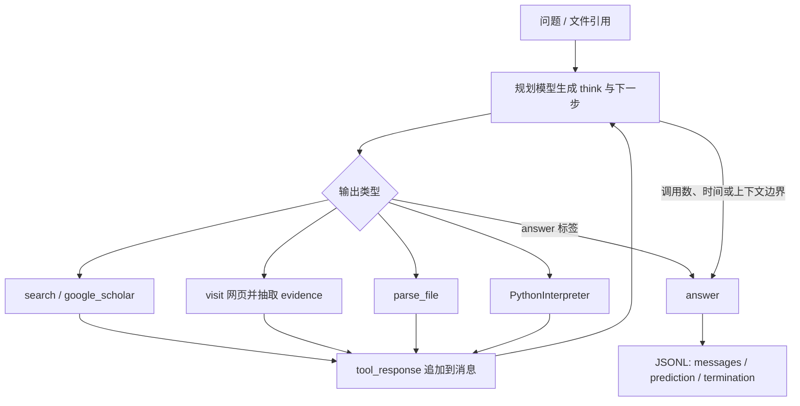

# Alibaba-NLP/DeepResearch：以开放权重模型和 ReAct 工具循环完成长程信息检索

| 字段 | 值 |
|---|---|
| GitHub | https://github.com/Alibaba-NLP/DeepResearch |
| License | Apache-2.0 |
| Stars | 19,950（2026-09-17 快照） |
| GitHub 最后 push / 分析 commit | 2026-02-27 · `f72f75d` |
| 产品类型 | 长程信息检索模型与推理工具链；不是端到端论文生产系统 |
| 分析证据 | README、FAQ、顶层 ReAct Agent、五类工具实现与并行评测入口 |

## 1. 它到底是什么

DeepResearch 的核心不是一个把“选题—实验—论文”全部包办的科研平台，而是一个面向**长程、开放域信息搜寻**训练的 Agent 模型及其推理工具链。仓库主角 Tongyi DeepResearch 是一个 30.5B 总参数、每个 token 激活约 3.3B 参数的 MoE 模型，公开配置给出 128K 上下文；随仓代码展示它如何在一道问题上反复选择搜索、访问网页、查询 Google Scholar、解析文件或执行 Python，最后返回答案。

这一定义很重要：项目名里的 Research 更接近“deep information seeking”，不是学术项目治理。顶层可运行路径接收 JSON/JSONL 问题集，保存每题的完整消息轨迹、预测和终止原因，适合跑 HLE、BrowseComp、FRAMES、SimpleQA 等检索问答基准。它可以回答学术问题，也有 Scholar 工具，但没有研究课题、论文池、论断、实验记录、稿件版本等一整套学术生产对象。

仓库还汇集 WebDancer、WebSailor、WebResearcher、WebWeaver、ReSum、ParallelMuse、NestBrowse 等 WebAgent 系列工作。它们提供训练数据、上下文压缩、动态提纲或并行搜索等不同研究方向；顶层开源推理入口仍是单 Agent ReAct 循环。FAQ 明确说明 IterResearch 风格的 Heavy Mode 尚未完整开源，因此分析时应把公开可读的 ReAct 路径与完整产品能力分开。

## 2. 运行时堆叠

公开推理链可以分成五层：

1. `run_react_infer.sh` 启动模型服务与批处理入口，模型权重通常由 vLLM/SGLang 一类 OpenAI-compatible 服务承载。
2. `run_multi_react.py` 读取 JSON 或 JSONL，按问题和 rollout 组织任务，以线程池并发调用 `MultiTurnReactAgent`，并把结果追加写成 JSONL。
3. `MultiTurnReactAgent` 使用 OpenAI-compatible Chat Completions 客户端访问规划模型；代码预置八个规划端口，并按问题做粘性、轮询式分配。
4. 五个 `BaseTool` 实例构成固定工具表：`search`、`visit`、`google_scholar`、`parse_file`、`PythonInterpreter`。
5. Serper、Jina Reader、摘要模型、SandboxFusion 和文件解析器分别承担搜索、网页正文读取与压缩、代码执行和多格式文档处理。

每次 Agent run 默认最多允许 100 次模型调用，并有约 150 分钟墙钟上限。消息累计超过约 110K token 时，控制器会要求模型停止调用工具并基于已有上下文生成最终答案。正常终止依赖模型输出 `<answer>...</answer>`；输出还会记录 `termination`，区分正常回答、调用次数耗尽、上下文上限和超时。

批处理侧默认每题做三个 rollout，可配置 worker 数、数据切片和采样参数。它通过读取既有输出中已经成功处理的问题来续跑。这是一种实用的评测恢复机制，但恢复单位是“某问题是否已有结果行”，不是可查询的研究状态数据库。

## 3. 阶段机或 DAG

顶层公开实现是动态 ReAct 环，而不是预先固定的研究 DAG：

控制器不先生成一份正式检索计划，也不强制“分解问题—收集证据—交叉验证—写报告”逐阶段过闸。模型可以连续搜索、直接读某页、算一个中间量，或在已有信息足够时结束。优点是适配问题类型广；代价是覆盖率、来源多样性和何时停止主要由模型轨迹决定。

系列仓中的 WebWeaver 提供动态 outline 与 search/write 分工，ParallelMuse 探索多 rollout 聚合，ReSum 研究长轨迹压缩，但这些不是顶层 `MultiTurnReactAgent` 自动串起的生产 DAG。理解仓库时，应把“研究家族中的方法集合”和“当前顶层入口实际执行的控制流”分开。

## 4. Tool / Skill / Agent 怎么切

该实现以**一个 Agent、五个进程内 Tool**为主：

- `MultiTurnReactAgent` 是唯一直接面对问题的规划者。每轮模型输出 XML 包裹的 `tool_call` 或 `answer`。
- `search` 批量接受多个 query，调用通用网页搜索并返回标题、链接、日期、来源和摘要片段。
- `google_scholar` 使用单独的 Scholar 搜索入口，返回论文标题、出版信息、年份、被引信息、摘要片段以及可得的 PDF URL。
- `visit` 先获取网页正文，再让摘要模型围绕当前 goal 生成 `rational`、`evidence`、`summary` 三个字段。
- `parse_file` 处理 PDF、Office 文档、文本、表格、压缩包、音视频等用户材料。
- `PythonInterpreter` 将代码提交给独立的 SandboxFusion endpoint，并回传 stdout、stderr 和超时信息。

工具路由由静态 `TOOL_MAP` 完成；传给 Agent 构造器的 `function_list` 并不负责建立新的能力集合。系统 prompt 中的函数签名与 Python 类需要同步维护，缺少更强的 manifest parity 检查。

这里没有可安装的 Skill 包，也没有作为公共协议暴露的 MCP Tool server。工具对象属于 Qwen-Agent 运行时；Agent 和 Tool 的输入输出以 prompt/XML/字符串连接，未形成 RH 那种持久 artifact 合同。

## 5. 文献怎么来、是否入库、引用约束

学术材料主要有两条路径。第一条是 `google_scholar`：它把一个或多个查询发送到 Scholar 搜索服务，取回标题、出版信息、年份、被引次数、snippet 和可能存在的 PDF 地址。第二条是通用 `search → visit`：先找到网页或论文页面，再围绕具体 goal 抽取较长 evidence 和摘要。用户还可以通过 `parse_file` 直接提供 PDF 等材料。

这些材料只作为当前对话中的 tool response 进入消息历史。系统没有正式的 paper ingest、去重后的 paper pool、DOI/arXiv canonical record，也没有把“一个论断”连接到“论文页码或原文 span”的关系表。Scholar 结果中的 metadata 有助于发现文献，但 snippet 不是全文证据；`visit` 返回的 `evidence` 是摘要模型从页面中抽取的文本，也未附带可机器校验的字符位置。

顶层系统 prompt 要求综合可信、多样来源，却没有定义最终答案的统一引用格式、citation allowlist 或每个句子的 source binding。因此，它擅长把材料送进推理上下文，不等于已经提供学术引用完整性。若把它嵌入论文流程，上层仍需补来源身份解析、正文定位、引用去重和 claim-level evidence gate。

## 6. 实验 / 代码执行

`PythonInterpreter` 能运行模型生成的 Python，用于计算、数据变换、验证数值或处理检索所得内容。执行通过 SandboxFusion endpoint 完成，单次调用有 timeout，并能在多个 endpoint 间尝试。这比直接在宿主 shell 执行代码有更清楚的隔离方向。

但它不是科研实验编排器：没有 study specification、数据集版本、基线矩阵、随机种子、资源预算、指标 schema、实验结果注册或消融要求。Agent 可以临时写代码求解一个问答任务，运行结果只回到消息轨迹中。它也不会自动把一次计算升级为可复现的实验 artifact。

仓库带有基准评测脚本和问题集入口，README 列出多个 benchmark 结果；本次固定 commit 审读确认了批处理、rollout、结果落盘和官方评测入口的存在，没有重跑模型权重、外部搜索和排行榜。因此，公开分数属于上游报告结果，不应写成独立复现实验结论。

## 7. 写稿怎么做

顶层 ReAct Agent 的写作目标是**一道问题的最终回答**。系统只要求答案被 `<answer>` 标签包住，没有论文 section schema、长报告 outline、目标期刊模板、LaTeX/BibTeX 编译、页数检查或稿件版本管理。页面抽取阶段会生成 evidence 与 summary，但它们是供最终回答消费的中间字符串，不是单独保存、可复审的写作证据包。

WebAgent 家族中的 WebWeaver 展示了“先搜索形成动态提纲，再按 outline 写长文”的方法方向，这说明团队关注开放式 deep research 的结构化写作。然而，该能力与顶层 Tongyi ReAct 推理不是同一个默认入口，不能把系列子项目的所有功能合并描述为一次命令可得的论文生产链。

对 RH 而言，DeepResearch 更适合作为一个强搜索/推理执行器：由 RH 提供问题分解、证据对象和写作约束，再让模型完成局部检索或证据综合，而不是让一条自由 ReAct 轨迹直接成为正式稿。

## 8. 图怎么做

主路径没有论文图生成器。`parse_file` 可以读取多种文档和媒体，系列仓中的多模态 WebWatcher 也涉及图像搜索与视觉问答，但顶层五工具 ReAct 路径输出的是文本答案和轨迹，不会规划论文 figure suite，也没有根据实验记录确定性渲染定量图。

Python 沙箱理论上可以执行绘图代码，但当前工具返回重点是 stdout/stderr，缺少图文件登记、caption、panel-to-record mapping 和视觉质量审查。仓库 README 与各子项目中的 PNG/PDF 是项目说明和 benchmark 图，不代表最终用户请求会得到带 provenance 的论文图。

## 9. 和 RH 的相似点

- 都把搜索、读取来源、文件解析和计算作为 Agent 可调用能力，而不是把所有知识寄托于模型参数。
- 都承认长任务需要明确的调用次数、超时、上下文和失败终止边界。
- DeepResearch 保存完整消息与工具轨迹，RH 保存 provenance；两者都比只保留最终回答更便于复盘。
- Scholar 与网页访问可以为 RH 的文献发现和补证据阶段提供执行器参考。
- 多 query 输入、并行 rollout 和按问题续跑都适合大规模信息任务。

## 10. 和 RH 的不同点

- DeepResearch 是模型及其问答推理 harness；RH 是 topic、paper、claim、evidence、experiment、artifact 和 manuscript 的科研生命周期控制面。
- DeepResearch 的控制流由模型逐轮自由选择工具；RH 通过阶段、gate、artifact 和人工决定约束何时能进入下一阶段。
- DeepResearch 的来源主要留在消息文本中；RH 要把来源、论断、证据 span 和版本依赖持久化。
- DeepResearch 的 Python 用于任务内计算；RH 的 experiment 需要研究协议、结果登记、资源边界和后续图表映射。
- DeepResearch 没有公共 Skill/MCP 服务合同、多租户权限边界或稿件原子版本提交。
- RH 的目标包括论文写作、审稿、图、PDF 和最终 bundle；DeepResearch 顶层目标是生成检索问答答案。

## 11. 优点 / 缺点

**优点**

- 开放权重模型与公开 ReAct 代码一起提供，便于区分模型能力和外围工具能力。
- 工具集合覆盖网页、学术搜索、本地材料和计算，且函数签名直接、容易追踪。
- 对调用次数、总时长、上下文长度、工具超时和服务重试均有显式边界。
- 批处理支持数据切片、并发、多个 rollout、断点续跑，并保留完整轨迹和终止原因。
- `visit` 把页面读取与围绕 goal 的 evidence extraction 分开，比只把搜索 snippet 塞给模型更扎实。

**缺点**

- Heavy Mode 尚未完整公开，顶层开源实现不能代表公开材料所述的全部测试时扩展能力。
- 系统 prompt、工具 schema 和工具类存在多处平行定义，容易发生入口与实现漂移。
- Scholar/search/visit 结果没有进入规范化文献库，也缺 citation-to-claim 强绑定。
- 停止、覆盖充分性和来源交叉验证主要由同一个模型判断，缺独立 gate。
- 默认路径依赖多个外围服务和模型 endpoint，完整复现不只需要下载权重。
- 它可以生成深度答案，却没有实验治理、论文模板、版本提交和 publication bundle。

## 12. RH 可学的 1–3 条

1. **给每次长程检索建立显式执行预算**：把模型调用数、墙钟时间、上下文阈值、工具失败次数和终止原因放进 RH provenance，并在超限时生成“已有证据与缺口”artifact，而不是只报失败。
2. **采用 goal-conditioned page extraction**：文献或网页全文进入写作前，先输出“原文 evidence + 面向当前子问题的 summary”，同时保留 URL、页面定位和提取器版本；该层可增强 `paperindex`，不另建平行文献库。
3. **把多 rollout 用在检索覆盖而非结论投票**：同一 research question 可生成互补 query/来源集合，再由 RH 的 evidence gate 合并、去重和检查冲突，避免把多个模型答案的多数票误作事实验证。

## 13. 名字速查表

| 名字 | 先决概念 | 含义 |
|---|---|---|
| Tongyi DeepResearch-30B-A3B | MoE | 30.5B 总参数、约 3.3B 激活参数的长程信息检索模型 |
| `MultiTurnReactAgent` | ReAct | 在推理、工具调用和观察之间循环的顶层 Agent |
| `TOOL_MAP` | Tool registry | 将五个固定工具名映射到 Python 实例 |
| `search` | web retrieval | 批量执行通用网页搜索并返回结果片段 |
| `google_scholar` | scholarly discovery | 返回论文 metadata、snippet 和可得 PDF 地址 |
| `visit` | goal-conditioned extraction | 读取网页并抽取 evidence 与 summary |
| `parse_file` | document parsing | 处理 PDF、Office、表格、压缩包和媒体文件 |
| `PythonInterpreter` | sandbox | 通过 SandboxFusion 执行临时 Python |
| rollout | test-time sampling | 对同一问题重复运行一条完整 Agent 轨迹 |
| Heavy Mode | test-time scaling | IterResearch 风格的增强推理模式，当前未完整开源 |
| WebWeaver | dynamic outline | 系列项目中将网页证据组织成长文提纲的方法 |

---

> 📌事实边界
> 本页结论绑定 commit `f72f75d8c3eb842f2bbbab096a12206ff66e270f` 的源码和公开配置。模型参数、工具调用路径、预算与落盘行为来自实现；benchmark 成绩、训练效果和 Heavy Mode 能力属于上游公开陈述，本次未做权重推理、外部检索或排行榜复现。
