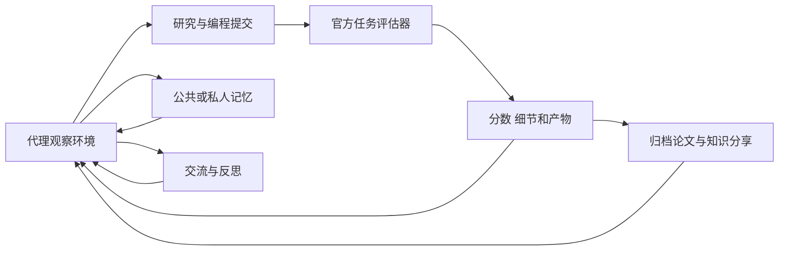

# Station：可评分任务中的开放式多代理科研环境

> 固定快照：[dualverse-ai/station](https://github.com/dualverse-ai/station/tree/782088e561998bf357d95a838a0566a8229425d9)；commit `782088e561998bf357d95a838a0566a8229425d9`；snapshot `2026-09-17`；候选许可证元数据 `Apache-2.0`；审阅状态 `draft`。

## 1. 它到底是什么

📘 `dualverse-ai/station` 将多代理科研组织成一个持续运行的小型环境。代理可以研究任务、访问不同功能空间、保存记忆、交流、提交代码和编写归档论文；环境负责推进时间、执行评估、保存状态与展示结果。README 推荐任务满足可清晰评分和快速迭代两个条件，说明它的“开放世界”并不意味着没有任务边界。

固定 README 展示 v2.0.0，列举数学构造和其他科学任务进展。关于十二个数学任务、若干新发现以及具体数学下界，都是项目方新闻与论文主张；本次没有阅读全部证明、运行构造或做独立新颖性核验，因此不将这些数字作为本报告复现结果。

## 2. 运行时堆叠

README 给出 Python 3.11、可编辑安装、模型供应商 API 与 OpenAI Codex CLI 的使用路径。控制台通过 Flask 与 nginx 相关部署配置提供界面；状态主要留在 station_data 的 YAML、文本和运行产物中，备份按 tick 保存。代码通过 provider 类对接不同模型，研究编码器使用宿主 Codex 配置。

资源设置可指定 CPU、GPU、单评估超时和并行工作数，多实例还用共享资源登记文件协调占用。这是运行管理机制，不是隔离证明。README 明确警告研究中心和编码器生成的程序会在本地机器执行，推荐隔离节点；本次没有启动部署、使用模型凭证或运行生成程序。

## 3. 阶段机或 DAG

Station 不是固定的“文献→实验→论文”单向流水线。`station.py` 引入 Lobby、ResearchCenter、ReflectionChamber、PublicMemory、PrivateMemory、Archive、Mail、AdminCounter 等房间模块，代理根据上下文进行行动，环境按 tick 推进并处理评估和通知。每个研究提交又有自己的尝试与终态。

README 的 multistart 允许分支探索后选择路径，也说明初始化和停滞分支默认关闭；不能把论文使用的旧模型名册、分支数和当前默认部署混为一谈。恢复某个 tick 相当于从历史状态继续分支，但不等于新分支复现了相同的模型输出。

## 4. Tool / Skill / Agent 怎么切

Agent 是有对话、身份和记忆的研究参与者，Room 是其行动接口与规则场所，Research Coder 是将研究请求落实为代码的执行角色，Evaluator 是对提交产生规范分数的独立计算组件。反思、公共记忆与归档文稿在环境中具有不同作用，不应把所有文本都当成同一类“研究证据”。

在已读文件中，环境注册具体房间类并调用研究评估管理器；并没有看到类似通用 SKILL.md 目录成为唯一能力边界。对照其他科研代理框架时，更适合把它理解成环境 API 与角色交互，而不是简单统计工具数量。任务规则与官方评分器决定什么算有效提交。

## 5. 文献怎么来、是否入库、引用约束

README 明确提供 Archive Papers 浏览和代理间交流，并允许人通过更新研究任务说明传入相关工作。归档论文可以记录中间理论、方法解释和非最佳分数的观察，价值不限于排行榜第一。这是内部知识积累与共享机制，不应误称已验证的外部学术论文数据库。

当前已读入口和存储代码没有展示统一 DOI 注册、全文去重或逐句引用支持检查，本文不为其补造一个不存在于证据范围内的系统性检索流程。外部文献访问如何实现应继续阅读具体房间与工具模块。内部 Archive 内容还需标明是代理产出，不能因为“论文”这个名字就当作独立同行评议证据。

## 6. 实验 / 代码执行

README 将任务定义拆为研究说明和 `evaluators/evaluator.py`。有的任务调用提交函数并验证返回对象，有的运行命令后解析输出。已读圆装填例子要求 construct_packing，返回 32 个圆心和半径；评分器检查形状、有限数值、半径为正、所有圆位于单位方形且互不重叠，通过后以半径和评分，并保存配置。

🔶 该例子的 `validate_submission_code` 直接返回 True，它不是代码安全检查器；强约束发生在返回构造的数学检验处。EvaluationManager 保存 latest attempt、primary_score、details、progress records、error 和 artifacts，并把终态与编码者报告分离。这提供明确评价路径，但评分器实现正确性、算力隔离和跨任务有效性仍需各自验证。

## 7. 写稿怎么做

Archive 是代理存储研究叙述和中间思想的空间，另有自动归档评估器与 surveyor 的入口。README 鼓励阅读非最高得分的归档稿，因为它们可能提供有价值的解释、理论和探索记录。对一个长期研究环境，这种机制避免只留下最后一项最优数字。

然而归档稿不自动等于期刊终稿。已读证据未覆盖通用 LaTeX 编译、引用一致性和投稿包冻结的完整实现，本报告不声称平台已经自动处理所有出版要求。环境内的归档评价与外部科学同行评议也应分开：前者服务后续代理使用，后者决定结论是否足以公开发表。

## 8. 图怎么做

README 有仪表台和对话界面截图，还链接构造 notebook。当前已读圆装填 evaluator 保存 npz 数值配置，说明几何结果可以作为后续绘图的机器可读输入；该文件本身没有负责制作论文图。

因此能确认的是环境保留可视化素材所需的结果位置和展示界面，不能从截图推导出统一科学制图、VLM 审图或图注证据门。正式图应由保存的构造和指标重绘，并核对是否与被评分的提交一致。本文 Mermaid 是环境行为概括，没有运行 notebook、评估或图像生成。

## 9. 和 RH 的相似点

两者都需要把研究目标、执行环境、结果与人类干预相连，并保留长任务状态。Station 的任务规格与评估器分离、尝试记录和结果产物，与 RH 的实验合同、质量检查和研究谱系有共通设计意图。通过控制台向代理传入人工意见，也说明自治不必排除人类指导。

双方都应避免用叙述代替执行：一个返回的分数要来自明确评估，一个结论要能找到相应结果。此处相似性是可核验工作流的原则，并非声称 Station 的分数与 RH 的证据门拥有相同科学含义。

## 10. 和 RH 的不同点

Station 以长期环境和多代理交互为中心，允许研究路线在房间和记忆之间展开；RH 的主题级工作流更明确地围绕文献、主张、实验、写作和交付阶段组织资产。Station 的强项是多条路线同时试探任务空间，RH 更重视一项研究任务沿证据链推进。

可评分、快迭代的要求使 Station 很适合程序构造或优化任务，但对慢速湿实验、长期临床结局和无法立即量化价值的问题，环境评分不足以直接替代科学判断。跨任务迁移时首先要定义评估器的有效性，而不是只增加代理或运行时间。

## 11. 优点 / 缺点

优点是把研究社会性、私人和公共记忆、反思、代码实验与归档整合；任务评价有明确函数或命令入口；attempt 与最终结果分开保存；控制台支持观察、指导、求助和历史分支；Apache-2.0 许可支持工程复用。

局限是长期运行和多模型并行的费用不可忽略，分支探索提高资源消耗；评价依赖任务评分器，最佳分数不一定等于科学解释；生成程序在本地执行需要额外隔离；内部论文和模型反馈可能强化共同偏差；作者发布的数学发现仍需证明、优先权和独立重跑核查。

## 12. RH 可学的 1–3 条

1. 💬 **给任务配独立评分入口。** 研究代码和评估函数分开，保存原始返回对象与验证失败原因，让分数不是模型宣告。
2. **保留有价值的中间研究。** 失败构造、分析解释和非最优方法可以进入受标记的知识资产，避免排行榜抹掉探索信息。
3. **人类提问与干预分通道。** 分支聊天可以帮助了解过程，而正式任务指令才改变主运行；这种区分减少观察行为意外影响实验。

## 13. 名字速查表

| 名称 | 角色 |
|---|---|
| Station | 多代理科研环境和时间推进器 |
| tick | 环境推进的离散时间单位 |
| ResearchCenter | 研究任务与提交入口 |
| Research Coder | 落实任务的编码执行角色 |
| EvaluationManager | 尝试、终态、分数和产物管理 |
| Archive | 内部研究稿和知识保存空间 |
| ReflectionChamber | 代理反思的功能场所 |
| multistart | 多分支启动或停滞探索机制 |
| construct_packing | 所读圆装填任务的提交函数合同 |
| research_storage | 研究存储分配与归属标记辅助模块 |

**固定提交证据入口**

- [README.md](https://github.com/dualverse-ai/station/blob/782088e561998bf357d95a838a0566a8229425d9/README.md)
- [LICENSE](https://github.com/dualverse-ai/station/blob/782088e561998bf357d95a838a0566a8229425d9/LICENSE)
- [station/station.py](https://github.com/dualverse-ai/station/blob/782088e561998bf357d95a838a0566a8229425d9/station/station.py)
- [station/research_storage.py](https://github.com/dualverse-ai/station/blob/782088e561998bf357d95a838a0566a8229425d9/station/research_storage.py)
- [station/eval_research/evaluation_manager.py](https://github.com/dualverse-ai/station/blob/782088e561998bf357d95a838a0566a8229425d9/station/eval_research/evaluation_manager.py)
- [example/research_alpha_evolve/circle_n32/research/evaluators/evaluator.py](https://github.com/dualverse-ai/station/blob/782088e561998bf357d95a838a0566a8229425d9/example/research_alpha_evolve/circle_n32/research/evaluators/evaluator.py)

📌事实边界：本报告基于上述固定提交的 README、文档及关键源码实际查看，源码为所列文件的关键路径抽样；缓存字节经 Git blob 哈希核验，README 与公开固定 URL 对照一致。未安装项目依赖、启动服务或宿主代理、调用模型、执行实验或 GPU 任务、运行基准、编译论文、生成图像或发布内容。README、论文链接及示例中的性能数字均属作者报告，未做独立复现；RH 对比仅为公开职责与机制分析，不是性能或科学质量排名。
