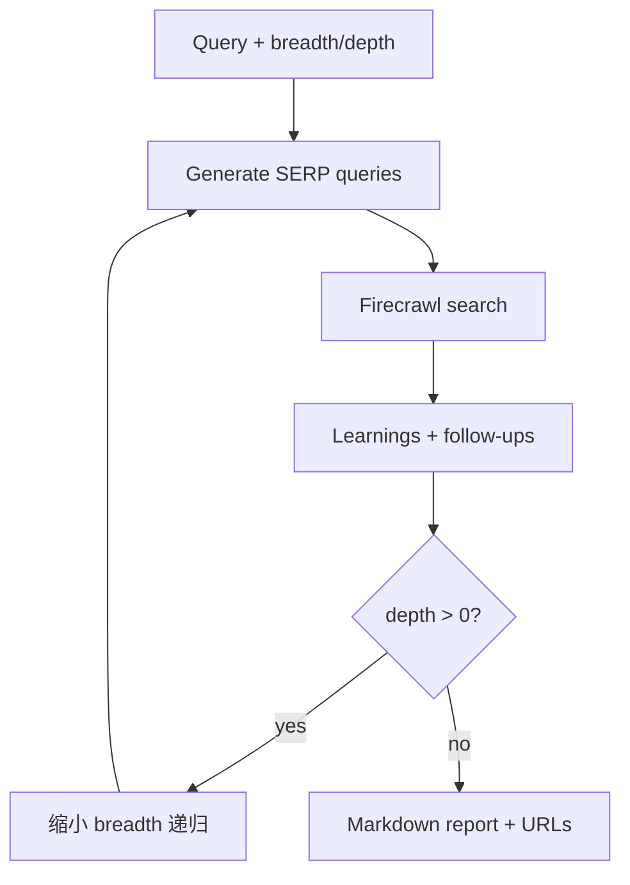

# dzhng/deep-research：用 breadth/depth 控制的轻量递归网页研究

| 字段 | 值 |
|---|---|
| GitHub | https://github.com/dzhng/deep-research |
| License | MIT |
| Stars | 19682（2026-09-17 快照） |
| GitHub 最后 push | 2026-04-11 |
| 分析 commit | `1f8f3e285bbc23e80b98a66a64effab9069f3ad4` |
| 生命周期 | GitHub 候选冻结记录为未归档；固定提交用于本页源码分析 |
| 产品类型 | 轻量深度研究与报告生成 |
| 分析证据 | 固定提交中的 README、许可证、配置与核心实现 |

本文用 📘 标注文档或源码中可直接定位的事实，🔶 标注由控制流推导的边界，💬 标注评价与借鉴建议。仓库动态元数据沿用候选清单，源码判断只绑定页面中的固定提交。

## 1. 它到底是什么

deep-research刻意保持小型实现：用 Firecrawl 搜索/抓取，用结构化 LLM 生成 SERP query、learnings 和 follow-up questions，再以 breadth、depth 和并发限制递归探索，最后写 Markdown 报告或短答案。 本文把仓库作为一个公开源码快照来分析：README 的产品定位、命令和 benchmark 数字属于项目文档；代码路径用于确认控制流、数据结构和边界。没有把 stars、README 宣称的准确率、SOTA 或部署体验转换成独立结论。

源码中最值得关注的是：run.ts 询问问题、breadth/depth、报告/答案模式，并为报告先生成 follow-up questions。deepResearch 每层生成最多 breadth 个 SERP queries，Firecrawl 并发搜索，processSerpResult 产出 learnings 和后续问题；depth>0 时 breadth 取 ceil(breadth/2) 递归，结果去重后写报告，并追加 visited URLs。 这决定了它应在 RH 产品地图中被看作“轻量深度研究与报告生成”，而不是泛化地称为自动科研系统。

## 2. 运行时堆叠

运行时可拆成以下层：

- **入口与配置**：由仓库提供的 CLI、脚本、Next.js/API 或配置文件接收任务和参数。
- **Agent/编排**：TypeScript/Node；deep-research.ts 定义 generateSerpQueries、processSerpResult、writeFinalReport/Answer 和 deepResearch；AI SDK + Zod 保证对象输出；Firecrawl SearchResponse 提供 markdown；p-limit 控制并发；providers.ts 可选 OpenAI、Fireworks DeepSeek R1 或自定义 OpenAI兼容模型，并用 tiktoken 递归裁剪上下文。
- **工具与环境**：工具调用连接搜索、文件、浏览器、向量库、解释器或沙箱；工具是否真的隔离取决于配置和外部服务。
- **状态与产物**：本项目保存的状态形式包括缓存、队列、日志、数据库、PaperNode、retrieval result、文件或 grade；它们不自动等同于 RH artifact。

这种分层让替换模型和工具变得容易，但也将“接口存在”和“证据可信”分开。源码可以证明一个函数会生成/保存某种对象，不能单凭存在证明对象内容正确。

## 3. 阶段机或 DAG

核心控制流如下。

run.ts 询问问题、breadth/depth、报告/答案模式，并为报告先生成 follow-up questions。deepResearch 每层生成最多 breadth 个 SERP queries，Firecrawl 并发搜索，processSerpResult 产出 learnings 和后续问题；depth>0 时 breadth 取 ceil(breadth/2) 递归，结果去重后写报告，并追加 visited URLs。 阶段之间通常由消息、列表、队列、结构化对象或日志连接；是否能跨进程恢复，取决于具体实现，而不是 Mermaid 图本身。需要特别区分循环的两种含义：一种是有限的 max_depth/max_rounds/max_iter/max_steps 或 expand_layers；另一种是模型自主决定继续。源码中的上限能限制预算，但不能保证每次运行都走完所有阶段，也不能保证模型输出符合提示。

## 4. Tool / Skill / Agent 怎么切

该仓库的 Agent 边界是：主 Agent 接收任务并决定下一步；子 Agent/worker（若有）承担局部任务；tool 是可调用的搜索、抓取、文件、浏览器、代码或数据接口；skill（若有）主要是提示/能力包，不等于可审计的执行 artifact。具体来说，TypeScript/Node；deep-research.ts 定义 generateSerpQueries、processSerpResult、writeFinalReport/Answer 和 deepResearch；AI SDK + Zod 保证对象输出；Firecrawl SearchResponse 提供 markdown；p-limit 控制并发；providers.ts 可选 OpenAI、Fireworks DeepSeek R1 或自定义 OpenAI兼容模型，并用 tiktoken 递归裁剪上下文。

工具调用的返回通常被转成文本、结构化响应或日志，再回到模型上下文。优点是扩展快，缺点是不同工具的来源、版本、错误和副作用可能没有统一合同。对于 RH，接入时不应只映射函数名，还要记录输入、输出、外部资源、权限、失败原因和可复核句柄。

## 5. 文献怎么来、是否入库、引用约束

文献/来源链是：Firecrawl 搜索结果和网页 markdown；visitedUrls 只保存 URL 集合，learnings 是 LLM 综合文本。源码没有论文摄取、来源段落、主张级支持关系或引用校验。

这条链路能支持“找到或读取来源”，但通常不能直接支持 claim-level evidence。源码未显示统一的 DOI/版本/页码/span/主张/支持强度对象，也没有在最终文字生成前做逐句 entailment gate。若项目有 URL、reference、arxiv_id、PaperNode 或 RetrievalResult，它们仍主要是检索和展示元数据。

因此，报告中的来源约束应写成：系统会按提示或数据结构保留来源；不能写成“每条结论都已验证”。在 RH 中，建议将这些中间来源摄取为 paper/source，再显式链接 claim 和 evidence span。

## 6. 实验 / 代码执行

工程上，仓库是网页研究应用，没有科学代码执行、实验日志或指标 registry。README 的推荐参数、模型和运行方式是使用说明；本次没有配置 Firecrawl/OpenAI，也没有运行搜索或报告生成。

**事实边界**：本次只读了公开仓库固定提交，没有安装依赖、配置 API key、下载模型/数据、启动外部服务或运行 benchmark。因而不能确认运行时性能、成本、并发稳定性、沙箱隔离、模型质量、检索召回或 README 中的结果。源码里的测试/评估函数可以说明“如何评”，不能说明“本次已评”。

若将它用于科研执行，还需要补齐数据版本、代码提交、环境镜像、资源上限、随机种子、指标定义、原始输出和失败记录，并把每次执行绑定到不可变 artifact。

## 7. 写稿怎么做

写作输出取决于项目类型：轻量深度研究与报告生成 的最终产物通常是 Markdown、报告字符串、聊天消息、结构化 Report、检索回答或 grade JSON。run.ts 询问问题、breadth/depth、报告/答案模式，并为报告先生成 follow-up questions。deepResearch 每层生成最多 breadth 个 SERP queries，Firecrawl 并发搜索，processSerpResult 产出 learnings 和后续问题；depth>0 时 breadth 取 ceil(breadth/2) 递归，结果去重后写报告，并追加 visited URLs。

若有报告器，它往往把多个阶段的摘要合并为可读文本；引用可能是 URL、reference id、source 字段或 rubric 记录。这里没有看到 RH 意义上的章节草稿、参考文献数据库、claim/evidence 互证、LaTeX/PDF 编译和提交版本闸门。因此“能生成报告”不应被扩写成“能生成可投稿论文”。

## 8. 图怎么做

固定提交中的图能力应按数据来源区分。项目可能包含 README 架构图、UI 进度事件、流程 Mermaid、benchmark 绘图脚本或报告 Markdown，但这与从实验记录生成可发表定量图不同。deep-research刻意保持小型实现：用 Firecrawl 搜索/抓取，用结构化 LLM 生成 SERP query、learnings 和 follow-up questions，再以 breadth、depth 和并发限制递归探索，最后写 Markdown 报告或短答案。

本报告不把仓库 README 的截图、曲线或分数表重绘成独立实验结果。若下游要出图，必须先声明数据源、统计单位、误差定义、样本量、面板与图注主张；对于架构图，则需把实际节点、权限边界和失败路径与源码对齐。

## 9. 和 RH 的相似点

1. 都用显式预算控制探索：这里是 breadth 与 depth，而不是一次搜完。
2. 都把中间结果去重后再交给下一层（visitedUrls + learnings）。
3. 都区分长报告与短答案两种出口，避免同一函数既要写稿又要问答。

## 10. 和 RH 的不同点

RH 的中间对象是 paper/claim。dzhng/deep-research 的中间对象是 SERP query、Firecrawl markdown、LLM 综合出的 learnings 和 follow-up questions。visitedUrls 只是 URL 集合；learnings 没有 DOI/span。depth>0 时 breadth 取 ceil(breadth/2) 递归，停在深度预算，不在证据覆盖。没有实验执行或稿件闸。

## 11. 优点 / 缺点

**优点**

- 实现小，breadth/depth/并发一眼能看完。
- Zod 约束 SERP query 与 learnings 结构。
- 报告末尾追加 visitedUrls，来源至少可点开。

**缺点**

- learnings 是模型综述，不是引用句。
- 无论文对象、无实验、无图表合同。
- Firecrawl/模型可用性未在本次验证。

💬 可学的是递归预算怎么收缩，不是把高 star 当质量证明。

## 12. RH 可学的 1–3 条

1. **探索预算用两个正交旋钮：breadth 控制同层宽度，depth 控制递归层数。**
2. **每深入一层就缩小 breadth。** 避免叶子层爆炸。
3. **visitedUrls 与 learnings 分开存。** URL 集合不能冒充已核验引用。

## 13. 名字速查表

| 名字 | 先决概念 | 含义 |
|---|---|---|
| generateSerpQueries | 查询生成 | 每层最多 breadth 条 |
| processSerpResult | 综合 | 产出 learnings / follow-ups |
| visitedUrls | 去重 | 已访问 URL 集合 |
| breadth / depth | 预算 | 宽度与递归深度 |
| writeFinalReport | 出口 | Markdown 报告或短答案 |

> 📌事实边界：本页绑定固定提交 `1f8f3e285bbc23e80b98a66a64effab9069f3ad4`，快照日期 2026-09-17。未配置 Firecrawl/OpenAI，未运行搜索或报告生成。
