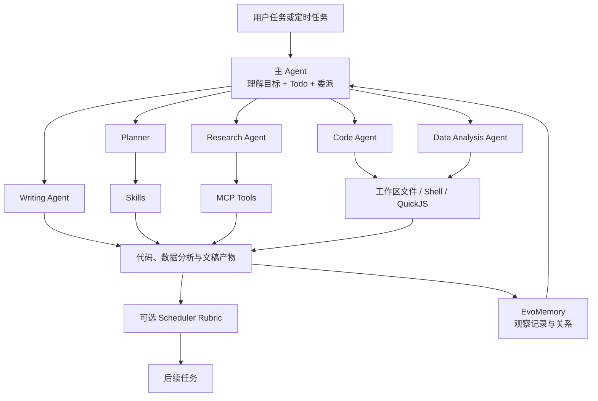

# EvoScientist/EvoScientist：以多代理、技能、记忆和执行后端承载科研任务

| 字段 | 值 |
|---|---|
| GitHub | https://github.com/EvoScientist/EvoScientist |
| License | Apache-2.0 |
| Stars | 4,896（2026-09-17 快照） |
| 分析 commit | `418abca4f40a4080604834536342492dfd8bdf3e` |
| 产品类型 | 可扩展科研 Agent 运行时与工作台 |
| 核心能力 | 主 Agent、同步/异步子 Agent、Skills、MCP、代码执行和长期记忆 |

## 1. 它到底是什么

EvoScientist 更准确的定位是“面向科研工作的 Agent 运行时”，而不是一条写死的论文生产流水线。它把主 Agent、专业子 Agent、可安装 Skills、MCP 工具、多模型路由、工作区文件、代码执行、异步任务和长期记忆装进同一个应用，使用户可以在 CLI、TUI、WebUI 或无人值守任务中组织研究工作。

README 用 `intake → plan → execute → evaluate → write → verify` 概括科研流程，并将系统描述为多 Agent、self-evolving memory、AutoSkills 和多渠道科研助手。固定提交的源码能够直接证明的是这些流程所需的基础设施：`create_cli_agent()` 组装 DeepAgents/LangGraph 图；配置文件定义 planner、research、code、data-analysis、writing、debug 和 scheduler 等角色；CompositeBackend 分流工作区、Skills 和 Memories；中间件处理模型选择、工具错误、上下文溢出、Todo、调度、记忆和后台执行。

它没有在核心 Python 控制流里硬编码“先检索多少篇论文，再运行哪类实验，再写哪几个论文小节”。具体科研步骤主要由系统提示、子 Agent 配置、Skill 和可接入工具决定。因此，同一运行时既可以承担文献调研，也可以改代码、分析数据、写报告或执行定时任务；科研严谨度则取决于所装能力包、数据来源和外层验收合同。

## 2. 运行时堆叠

EvoScientist 的运行时可以分为六层：

1. **Agent 图层**：以 `create_deep_agent` 构造主图和子图，底层依赖 DeepAgents、LangChain 与 LangGraph。主 Agent 负责任务理解、Todo 和委派，子 Agent 根据专业描述获得不同的工具、Skills 和系统提示。
2. **模型层**：模型注册表以静态数据维护 provider、短名和模型 ID，也支持兼容 OpenAI/Anthropic 接口及动态发现本地模型。模型缓存按 model/provider 组合失效，中间件还可以执行 fallback。
3. **中间件层**：包括 provider 错误归一化、工具历史修复、可配置模型、上下文编辑、模型 fallback、上下文溢出映射、工具错误处理、Todo、工具选择、QuickJS、调度、运行时上下文、记忆检索、记忆生命周期、用户询问和后台执行。
4. **后端层**：默认工作区负责文件和 shell；`/skills/` 映射到项目、用户和内置能力的合并视图；`/memories/` 映射到受约束的记忆目录。不同子 Agent 可以获得只读或限制删除的后端。
5. **异步层**：`AsyncRuntime` 在专用线程中持有长期 asyncio event loop，提供同步桥接、异步调用、后台 spawn、取消、settlement 和 shutdown。远程子 Agent 可作为可部署 LangGraph 图运行。
6. **交互与部署层**：项目提供命令行入口，并在 README 中展示 TUI、WebUI、headless、部署和消息渠道。它们共享同一 Agent 组装逻辑，而不是各自实现一套科研引擎。

`pyproject.toml` 要求 Python 3.11 以上，并依赖 QuickJS、SQLite checkpointer、MCP adapters、Textual 以及多个模型 provider 适配器。这个技术栈的重点是“统一挂载并安全调用能力”，而非绑定某一个科研领域。

## 3. 阶段机或 DAG

这张图表示可组合运行路径，不代表每个请求都必须经过全部节点。主 Agent 可以直接调用工具，也可以同步委派子 Agent；标记为 async 的子 Agent 会被替换为部署图引用，在独立线程或服务图中运行。Scheduler 则是一种无人值守入口，一次接收一个定时任务，并按指令决定是否生成文件或调用工具。

因此，EvoScientist 的“阶段机”位于任务计划和 Agent 决策层，而不是固定 Python 枚举。它更像动态 DAG：节点和边由当前任务、模型决策、可用 Skills、MCP 路由及权限共同确定。这带来较高的适配性，也意味着科学流程的一致性需要由 Skill、prompt 或外层工作流继续约束。

## 4. Tool / Skill / Agent 怎么切

EvoScientist 对三者的区分相对清晰：

- **Tool** 是一次可调用的原子动作，例如思考、搜索、读写文件、执行命令、管理异步任务或调用 MCP 服务。工具有参数合同，适合完成可观察的操作。
- **Skill** 是以 Markdown 和 frontmatter 描述的能力包，负责告诉 Agent 某类任务应遵循什么步骤、使用哪些工具以及怎样组织输出。项目内置 Skill 可与项目级、用户级 Skill 合并，同名时高优先级层覆盖低优先级层。
- **Agent** 持有模型、系统提示、工具、Skill、后端和上下文。主 Agent 负责统筹，planner、research、code、data-analysis、writing 等子 Agent承担较窄职责。
- **MCP** 为 Tool 的外部接入协议。配置可以限定某个服务器暴露哪些工具，并通过 `expose_to` 将其路由给 main 或指定子 Agent。
- **Expert Agent** 可以作为扩展能力加入团队；异步 Agent 则使用独立图执行，适合耗时分析和后台任务。

源码还明确区分同步与异步安全模型。同步主图可以通过 interrupt 让用户批准 `execute`、后台执行、定时任务和删除操作；远程异步子图无法直接弹出父界面的批准，因此 writing 和 data-analysis 等受保护子图使用更严格的命令保护和删除限制。这说明 Agent 的差异不只是角色名称，也会落实到后端权限。

## 5. 文献怎么来、是否入库、引用约束

EvoScientist 本身不绑定单一文献提供方。基础工具可以在存在相应配置时提供搜索，Research Agent 还可使用 MCP 或 Skill 接入学术搜索、网页检索、PDF 处理和其他外部能力。这种方式的优势是提供方可替换，文献工作流也可以通过能力包升级。

长期记忆不是论文数据库。`memory/observations/store.py` 将观察记录保存为带 YAML frontmatter 的 Markdown 文件，区分 semantic、procedural 和 episodic 三类，并支持 global/project scope。观察 ID 由内容确定性派生，重复记录可以命中同一 ID；记录之间还能标记 complements、contradicts 和 supersedes。搜索结果按文本匹配和排名返回，解析结果带缓存。

这套记忆适合保存“项目中学到了什么”“某种操作怎样执行”“上次任务发生了什么”，但没有把 Paper、DOI、版本、Claim、Evidence Span 和 Citation Key 建成第一类关系。核心代码也没有统一的引用配额、逐句来源检查或参考文献双向一致性闸。某个写作 Skill 可以要求引用，某个 MCP 工具也可以返回文献元数据，但这些约束取决于具体能力包，不能由运行时存在本身推出。

因此，EvoScientist 的文献能力属于可插拔采集和代理协作层；是否形成可审计的论文证据链，要看实际安装的检索、摄取和写作合同。

## 6. 实验 / 代码执行

代码执行是 EvoScientist 的强项之一，而且分成两个不同层次。

**Shell 工作区执行**由自定义 sandbox backend 承担。命令在工作区中运行，具备超时、输出截断、取消和进程树终止。验证逻辑会阻止路径越界、部分特权命令、灾难性删除以及把不可信输出直接管道送入解释器或网络程序；命令审批策略可以返回 approve、reject 或 prompt。用户显式选择更宽权限模式时，文件范围会放宽，但关键危险模式仍有专门检查。

**QuickJS code interpreter**用于算法、小规模 JavaScript 计算和批量编排。其 PTC allowlist 主要包含记忆检索、文件读取、目录查询和异步任务管理，不把 shell、文件写入、文件编辑或动态 MCP 工具直接交给解释器。这样可以让模型并行读取和汇总多个结果，同时避免把高影响操作混入同一个轻量计算环境。

异步 data-analysis 和 writing 图使用 guarded backend，危险命令会直接返回可操作的拒绝原因，删除请求也会交回 orchestrator。Scheduler 还能配置一个独立 grader，仅通过列目录和读文件检查交付清单，并在不通过时把反馈带回执行任务。

这些机制证明系统能够运行代码和管理长任务，但它没有统一的实验登记实体：数据版本、随机种子、资源预算、指标定义、重复次数、观测结果和失败原因仍需要由项目文件或 Skill 约定。执行成功也只代表命令完成，不代表实验设计或科学结论成立。

## 7. 写稿怎么做

写作可以由主 Agent 直接完成，也可以委派给 writing 子 Agent。写作 Agent 可读取工作区中的分析、代码和已有文本，调用 Skills 获得特定文体或工作流，并把结果写回文件。Research、data-analysis 和 writing Agent 共享同一任务上下文时，可以形成“先搜集—再分析—再成稿”的动态协作。

结构化 Skill 是其主要写作扩展点。一个 Skill 可以规定报告章节、引用格式、检查步骤和最终文件，因此 EvoScientist 不必把每种论文模板写进主程序。Scheduler 的 rubric grader 还能对无人值守交付做文件级复核，失败时给出反馈并重试。

固定提交的核心运行时没有统一的论文 Section schema、引用数量闸、目标期刊格式合同、LaTeX 编译闸或 PDF 版本提交规则。Writing Agent 生成什么，取决于任务说明、可见材料和加载的 Skill。Rubric grader 能检查“文件是否存在、是否满足清单”，但只读文件的独立模型评价不能自动验证引用是否支持主张，也不能确认实验数字来自真实记录。

EvoScientist 因此适合作为写作执行宿主：它解决角色、工具、上下文、文件和异步任务怎样协作；正式论文生产仍应为其提供明确的证据和发布合同。

## 8. 图怎么做

EvoScientist 可以通过代码执行、数据分析 Agent、安装的绘图 Skill 或外部 MCP 工具生成图片。对于常规数据任务，Agent 可编写脚本读取表格并输出统计图；对于概念图，也可以借助专用图像工具或能力包。工作区后端允许图像与代码、数据和文稿一起保存。

核心运行时没有专门的 Figure Plan、Panel Contract、数据记录到图形元素的映射或图注证据检查。也就是说，它具备“做图所需的通用手脚”，但没有在底层强制区分概念示意图、实验结果图和生成式插图。

在科研场景中，定量图应由记录化数据确定性渲染，并保留生成脚本；架构图应明确哪些部件已经实现；生成式图片则应限定为说明性素材。这样的边界更适合写入科研 Skill 或外层工作流，而不是依赖通用 Agent 自行判断。

## 9. 和 RH 的相似点

- 两者都采用工具化能力，而不是把全部逻辑塞进一个超长提示词。
- 两者都支持 MCP，并允许不同 Agent 获得不同工具集合。
- 两者都承认长任务需要异步执行、恢复、取消和显式生命周期管理。
- Skills 在两者中都承担高层工作流说明，Tool 则承担稳定、可验证的原子操作。
- EvoMemory 的观察记录和 RH 的 artifact/provenance 都试图让后续任务继承历史，而不是每轮从空白上下文开始。
- 两者都设置人工审批或 gate，避免高影响动作仅由模型自行决定。
- 两者都可由多个模型 provider 支撑，不把科学工作流绑定到单一模型名称。

工程上最相近的是“运行时负责组合，领域能力负责合同”。EvoScientist 展示了较完整的桌面 Agent 运行栈，RH 则把更多精力放在科研对象和可审计阶段上。

## 10. 和 RH 的不同点

- EvoScientist 是通用科研 Agent 宿主；RH 是带 topic、paper、claim、evidence、artifact 和 gate 的科研生产系统。
- EvoScientist 的核心状态是 LangGraph 会话、工作区文件和 observation memory；RH 的核心状态是可查询、可建立依赖和可判定阶段准备度的研究记录。
- EvoScientist 的科研流程主要由 Agent 决策、YAML 配置和 Skill 形成；RH 将关键阶段及其进入条件固化为工具合同。
- EvoMemory 记录可复用观察和关系，但不会自动成为文献证据；RH 明确区分记忆、来源、主张和支持关系。
- EvoScientist 对模型、UI、渠道和本地执行覆盖更广；RH 对文献摄取、证据链接、实验边界、稿件审查和发布版本的语义更深。
- EvoScientist 的 Scheduler grader 是通用交付检查；RH gate 还要求特定研究工件、来源覆盖和 lineage。
- EvoScientist 可以自由生成多种工作区产物；RH 的正式输出需要经过 artifact 记录、质量检查和版本提交。

两者适合形成上下层关系：EvoScientist 类运行时负责稳定承载 Agent，RH 类领域工具负责告诉 Agent 哪些科研事实可以写、何时允许进入下一阶段。

## 11. 优点 / 缺点

**优点**

- 主 Agent、子 Agent、Tool、Skill、MCP、Backend 和 Middleware 的职责分层清楚，扩展点多而不必重写核心图。
- MCP 工具可以按服务器筛选并路由到指定 Agent，减少所有角色共享全部权限的情况。
- `AsyncRuntime` 明确拥有 event loop 和任务生命周期，兼顾同步 UI、异步工具和后台任务，取消与关闭行为也有专门处理。
- Shell 与 QuickJS 分层，轻量计算不会自然获得写文件和命令执行权限。
- 工作区、Skills 和 Memories 通过虚拟路由分离；记忆写入还要求经过结构化工具，降低随意覆盖观察库的概率。
- observation 使用确定性 ID、去重、作用域和关系标签，比把全部经验累积在一份自由文本中更易检索。
- Apache-2.0 许可、多 provider 和多入口有利于作为通用科研工作台部署。

**缺点**

- 科研语义大多由 prompt 和 Skill 承担；若能力包没有规定证据链，运行时不会自动补出 paper/claim/evidence 关系。
- 动态 Agent DAG 灵活，但相同任务可能因模型、工具可用性和委派选择产生不同路径，复现需要额外记录实际调用和环境。
- 文件式 observation 适合个人与项目记忆，在跨项目统计、细粒度权限和大规模关系查询上不如正式数据库。
- 多模型 fallback 提高可用性，也会引入行为漂移；科学任务需要记录最终使用的模型和工具版本。
- Scheduler rubric 主要检查交付物，不能代替方法学、统计学或领域专家验证。
- 权限放宽模式适合高级用户，但运行外部生成代码时仍需要清晰的信任边界和隔离环境。
- “self-evolving”从源码可确认的部分主要是记忆、关系和 Skills 基础设施；它不等同于科研方法已经通过自动演化获得更高科学有效性。

## 12. RH 可学的 1–3 条

1. **复用 owned async runtime 的生命周期模式。** 为同步宿主、异步 MCP、后台实验和远程子图提供同一套 submit、cancel、settle 和 shutdown 语义，避免每个工具各自维护 event loop。
2. **把工具路由与 Agent 权限放进同一配置。** 允许 MCP server 的工具按名称过滤，并分别暴露给主 Agent、写作 Agent 或数据 Agent；RH 可在现有 Tool 合同之上增加最小权限视图，而不复制另一套执行引擎。
3. **将 observation memory 作为检索前置层。** 用确定性 ID、project/global scope 以及 complements、contradicts、supersedes 关系保存操作经验和阶段摘要，再通过 provenance 链接回正式 artifact。记忆负责提示，正式证据仍由 RH 数据模型裁定。

这些能力适合回流 RH 的宿主与运行层，同时保留 RH 对论文、主张、实验和发布的领域闸。

## 13. 名字速查表

| 名字 | 含义 |
|---|---|
| `create_cli_agent` | 组装模型、工具、后端、中间件和子 Agent 的主入口 |
| DeepAgents | 提供 Agent、文件后端和子 Agent 组合能力的底层框架 |
| LangGraph | 承载可恢复 Agent 图、子图和部署图 |
| Main Agent | 理解任务、维护 Todo、调用工具并委派专业角色 |
| Async Subagent | 作为独立 LangGraph 图运行的后台专业 Agent |
| Skill | 用 Markdown/frontmatter 封装的可安装工作流说明 |
| `skill_manager` | 搜索、安装或管理 Skill 的工具入口 |
| MCP routing | 将外部工具按服务器、名称和目标 Agent 过滤分发 |
| CompositeBackend | 将工作区、Skills 和 Memories 映射到不同文件后端 |
| `CustomSandboxBackend` | 提供路径约束、命令检查、超时和取消的 shell 后端 |
| QuickJS | 用于受限计算和批量工具编排的 JavaScript 解释环境 |
| `AsyncRuntime` | 在专用线程持有 event loop 并管理后台任务生命周期 |
| EvoMemory | 以结构化 Markdown observations 保存长期记忆的机制 |
| observation | 带类型、作用域、来源和关系的可检索记忆记录 |
| scheduler | 无人值守执行单个定时任务的 Agent 图 |
| rubric grader | 只读检查交付物并返回通过/修改意见的可选评估器 |

---

> 📌事实边界  
> 本页以固定 commit 的 README、依赖声明和核心运行时源码为依据。源码能够直接证明多 Agent 组装、MCP 路由、Skills、工作区执行、异步生命周期和 observation memory；README 中的榜单、奖项、技能数量及整体科研效果属于项目方陈述。运行时具备科研任务所需的通用能力，并不自动证明具体文献、实验结果、引用或论文结论有效。
