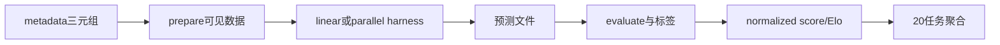

# facebookresearch/airs-bench：AIRS-Bench 的公开源码合同

| 字段 | 值 |
|---|---|
| GitHub | https://github.com/facebookresearch/airs-bench |
| License | CC BY-NC（固定提交 `LICENSE`；GitHub API staging 值为 NOASSERTION） |
| 分析 commit | `18e4f1d501069cf7d7e2740d81c2ca748c56a6a1` |
| 产品类型 | 科研/机器学习 Agent benchmark 与执行评测 |
| 直接证据 | `README.md`, `LICENSE`, `pyproject.toml`, `airsbench/tasks/rad/TextualSimilaritySickSpearmanCorrelation/metadata.yaml`, `airsbench/tasks/rad/TextualSimilaritySickSpearmanCorrelation/prepare.py`, `airsbench/tasks/rad/TextualSimilaritySickSpearmanCorrelation/evaluate.py` |

本文用 📘 标注文档或源码中可直接定位的事实，🔶 标注由控制流推导的边界，💬 标注评价与借鉴建议。仓库动态元数据沿用候选清单，源码判断只绑定页面中的固定提交。

## 1. 它到底是什么

AIRS-Bench 是面向机器学习研究科学 Agent 的任务套件。每个任务用 problem、dataset、metric 三元组描述，并保存文献中的 SOTA 参考值；公开 README 说明套件含 20 项任务，覆盖 NLP、代码、数学、生化建模和时间序列等领域。它把任务定义和评分标准化，并为 aira-dojo/RAD 与 MLGym 提供两种规格，不是通用论文写作系统。

## 2. 运行时堆叠

任务目录通常含 metadata.yaml、project_description.md、prepare.py、evaluate.py、evaluate_prepare.py 和可选 utils.py。metadata 写入输入列、训练/测试 split、metric、SOTA、worst/optimal 值；prepare 从共享数据构造 Agent 可见数据，evaluate_prepare 构造带标签的评价输入，evaluate 只读取预测并计算指标。converter_rad_mlgym_enhanced.py 负责发现任务、运行准备脚本和转成 MLGym 配置。

## 3. 阶段机或 DAG

执行链是 metadata→prepare→外部 scaffold→预测文件→evaluate→跨任务 normalized score/valid submission/Elo。公开示例的 SICK 任务将句子对交给 Agent，evaluate 用 Spearman correlation 计算预测与标签的相似度。

One-shot 只尝试一次，Greedy 采用树式 best-first search，MLGym 使用 ReAct 路径；这些执行器来自外部框架。

## 4. Tool / Skill / Agent 怎么切

AIRS-Bench 本身主要提供任务文件、数据准备和评分脚本；Agent/scaffold/harness 从 aira-dojo 或 MLGym 接入。Skill 是可执行任务合同而非插件目录。metadata 与 converter 负责把同一问题适配多个 harness。

## 5. 文献怎么来、是否入库、引用约束

metadata 的 SOTA 字段包含论文标题、URL、年份和 venue，例如 CoSENT 与 SICK 数据集论文。它没有 topic paper pool、claim-evidence 链或引用一致性检查；SOTA 只是归一化参照点。发表结果仍需保留论文版本、数据、seed 和预测文件。

## 6. 实验 / 代码执行

prepare 会从 HuggingFace datasets 加载并裁剪数据，evaluate 读取 test labels、检查行数并返回任务 metric；README 建议多 seed 并报告平均 normalized score、valid submission rate 和 Elo。依赖 conda、datasets、外部 harness，未下载、未运行或重算 leaderboard。

## 7. 写稿怎么做

仓库不生成论文，只提供任务描述、日志与指标。README leaderboard 可被上层转成表格，但没有章节模板、引用配额、数字校验或审稿流程。

## 8. 图怎么做

README 和 notebooks 提供任务概览、类别分布、指标摘要及 SOTA map；它们是 benchmark 展示资产，没有 figure plan、图注证据绑定或出版质量审计。

## 9. 和 RH 的相似点

与 RH 都把任务、数据、指标和执行产物分层，允许多个执行器消费同一合同，也都需要保存失败和资源条件。AIRS 的 metadata/prepare/evaluate 可映射到 RH 的 experiment contract、data artifact、result artifact。

## 10. 和 RH 的不同点

AIRS 目标是跨任务 benchmark 分数，RH 还需研究问题、文献证据、统计推断、稿件和发布。normalized score 不等于科学结论，外部 harness 轨迹也不等于 claim citation。

## 11. 优点 / 缺点

优点是任务格式统一、输入和标签隔离、metric/SOTA/worst/optimal 明确、可转换到多个 harness。缺点是聚合分数依赖最差观测和文献 SOTA，跨任务解释需谨慎；外部数据和框架依赖重；许可为 CC BY-NC；排行榜不是本次实测。

## 12. RH 可学的 1–3 条

1. 用 problem–dataset–metric 三元组冻结 RH 实验目标。
2. 采用 prepare/evaluate 双脚本隔离输入和标签，并保留 checksum。
3. 对同一研究问题比较不同 scaffold，同时报告资源和 seed。

## 13. 名字速查表

`metadata.yaml`：任务合同；`project_description.md`：Agent 提示；`prepare.py`：构造可见数据；`evaluate_prepare.py`：准备评分数据；`evaluate.py`：指标；`rad`：并行规格；`mlgym`：线性规格；`normalized score`：跨任务分数。

补充核验：任务样例的 prepare 明确只将句子字段和训练标签、测试句子写入 Agent 挂载目录，evaluate 再从带标签目录读取真值。这个隔离能说明评分脚本设计，但不能单独证明所有 20 项任务都具有相同的数据泄漏性质；其他任务仍需逐项查看。

> 📌事实边界：本页依据 `18e4f1d501069cf7d7e2740d81c2ca748c56a6a1` 固定公开源码快照、2026-09-17 `data/candidates-staging.jsonl` 元数据和下列实际查看文件静态撰写（`README.md`、`LICENSE`、`pyproject.toml`、`airsbench/tasks/rad/TextualSimilaritySickSpearmanCorrelation/metadata.yaml`、`airsbench/tasks/rad/TextualSimilaritySickSpearmanCorrelation/prepare.py`、`airsbench/tasks/rad/TextualSimilaritySickSpearmanCorrelation/evaluate.py`、`scripts/converter_rad_mlgym_enhanced.py`、`datasets/hf_datasets.csv`）。没有把 README 的榜单、论文结果或运行说明当作本次实测；未调用未配置的模型/API，未运行完整 benchmark（除非明确另有说明），未据此声称运行效果。
