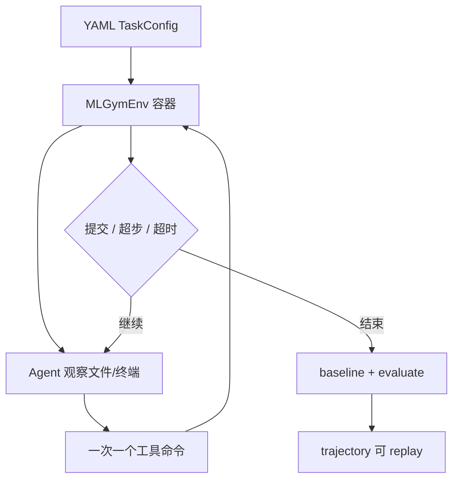

# facebookresearch/MLGym：MLGym 的公开源码合同

| 字段 | 值 |
|---|---|
| GitHub | https://github.com/facebookresearch/MLGym |
| License | 根 `LICENSE` 为 CC BY-NC 4.0；GitHub API 仍为 NOASSERTION |
| 分析 commit | `9d40c1b5035202018cd7091fb4e83a9c68b377c0` |
| 产品类型 | 科研/机器学习 Agent benchmark 与执行评测 |
| 直接证据 | `README.md`, `LICENSE`, `pyproject.toml`, `run.py`, `run_replay.py`, `mlgym/environment/env.py` |

本文用 📘 标注文档或源码中可直接定位的事实，🔶 标注由控制流推导的边界，💬 标注评价与借鉴建议。仓库动态元数据沿用候选清单，源码判断只绑定页面中的固定提交。

## 1. 它到底是什么

Meta 与 UCSB 发布的 Gym 风格机器学习研究 Agent 环境。README 将 MLGym-Bench 描述为包含 13 个开放式任务的实验性 benchmark，要求 Agent 提出想法、处理数据、实现方法、训练模型、运行实验、分析并迭代。它是受控执行环境和轨迹评测框架，不是文献证据库或端到端论文生产系统。

## 2. 运行时堆叠

配置层由 EnvironmentArguments、TaskConfig 和 DatasetConfig 组成，声明镜像、容器、步数、seed、timeout、数据集、baseline、评价脚本和可选 memory。MLGymEnv 管理 Docker/Podman 容器、文件和命令；agent/base.py 与 backend 负责模型循环；tools 目录实现 state/search/edit/validate/submit；run_replay.py 和 Streamlit visualizer 读取轨迹。

## 3. 阶段机或 DAG

一个 episode 从 YAML 任务加载开始，环境建立容器和工作区，Agent 逐步观察文件/终端并发送一个工具命令，环境执行并返回反馈，直到提交、超步数或超时；Task 再调用 baseline 和 evaluate，trajectory 被保存并可重播。

## 4. Tool / Skill / Agent 怎么切

Agent 是模型循环和历史处理，Tool 是命令解析与 shell/Python 脚本，Environment 是 Gym 与容器，Task 是数据和评价合同，Memory 是可选任务文件。default.yaml 的 prompt 要求一次一个命令、先看 baseline、用 validate 再 submit。literature_search 与 memory_write 是可选工具，不是 Skill registry。

## 5. 文献怎么来、是否入库、引用约束

tools/literature_search.py 查询 Semantic Scholar 的标题、摘要和开放 PDF URL；memory_write.py 将文本嵌入和标签写入 JSON。源码没有 topic、paper、claim、evidence span 或 citation audit；检索到的论文是否被正确使用取决于 Agent 轨迹。

## 6. 实验 / 代码执行

命令在 Docker/Podman 容器中真实运行，环境有短动作、长训练和无输出 timeout，任务可声明 baseline 和 evaluation。README 给出 GPU 启动示例和 cost limit；trajectory 保存观察、命令和返回。未启动容器、未调用模型、未运行 benchmark。

## 7. 写稿怎么做

MLGym 产生 trajectory、日志、提交和任务分数，不提供章节化论文、引文绑定或数字一致性检查。trajectory visualizer 适合调试与复盘；若上层汇成研究报告，需另行保存数据、baseline、metric 和资源条件。

## 8. 图怎么做

图形产物主要是 trajectory visualizer 和 README 流程图，任务内 Agent 也可能生成图。仓库没有统一 figure plan、图注来源或出版质量门，因此不能把 visualizer 当成科研绘图系统。

## 9. 和 RH 的相似点

它与 RH 都强调长期状态、真实工具执行、失败反馈和可恢复日志；TaskConfig/baseline/trajectory 可对应 RH 的实验合同、结果 artifact 与 provenance。replay 思路也适合关键实验的复核。

## 10. 和 RH 的不同点

MLGym 以 episode/task 解决表现为中心，RH 以研究主题、证据、实验解释和发布为中心。MLGym memory 不是可审计文献库，tool output 不自动成为 claim，baseline/evaluate 也不承担统计或稿件质量责任。

## 11. 优点 / 缺点

优点是容器、任务配置、timeout、cost、baseline 和 replay 形成清楚工程闭环；工具协议便于观察。缺点是项目明确处于快速开发状态，Docker/GPU 依赖重，memory JSON 不是证据系统，部分配置标为 TODO，轨迹不能自动证明没有泄漏或结论正确。

## 12. RH 可学的 1–3 条

1. 用 episode trajectory 保存每次观察、工具调用、退出原因和资源。
2. 在实验开始冻结 baseline、metric、timeout 和数据。
3. 对关键实验保留 replay，但把 replay 通过与科学结论验证分开。

## 13. 名字速查表

`MLGymEnv`：任务环境；`EnvironmentArguments`：容器与资源配置；`TaskConfig`：任务合同；`AbstractMLTask`：任务基类；`tools/validate.sh`：提交前检查；`run_replay.py`：重播轨迹；`memory_write.py`：可选文本记忆。

补充核验：配置对象中有若干标注为当前未使用或待实现的选项，故报告只把实际源码路径写成已确认能力。README 的 Docker、Podman、GPU、Streamlit 和模型示例是运行指引；没有在本机启动这些依赖，也没有把示例命令转述成成功运行结论。

> 📌事实边界：本页依据 `9d40c1b5035202018cd7091fb4e83a9c68b377c0` 固定公开源码快照、2026-09-17 `data/candidates-staging.jsonl` 元数据和下列实际查看文件静态撰写（`README.md`、`LICENSE`、`pyproject.toml`、`run.py`、`run_replay.py`、`mlgym/environment/env.py`、`mlgym/environment/tasks.py`、`mlgym/agent/base.py`、`mlgym/tools/tools.py`、`tools/literature_search.py`、`tools/memory_write.py`、`configs/agents/default.yaml`、`configs/tasks/battleOfSexes.yaml`）。没有把 README 的榜单、论文结果或运行说明当作本次实测；未调用未配置的模型/API，未运行完整 benchmark（除非明确另有说明），未据此声称运行效果。
