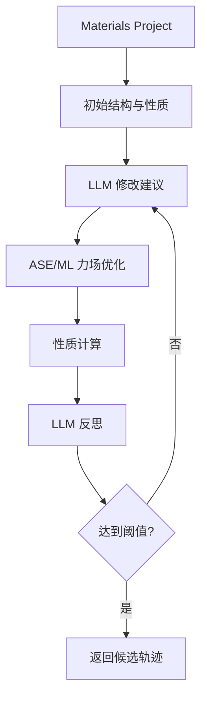

# LLMatDesign：让 LLM 迭代材料结构修改与性质目标

| 字段 | 值 |
|---|---|
| GitHub | https://github.com/Fung-Lab/LLMatDesign |
| License | MIT |
| Stars | 24（2026-09-17 冻结快照） |
| 最后 push | 2024-10-23 |
| 分析提交 | `4532054e6037ea78beed269808b786d981bc1eca` |
| 快照日期 | 2026-09-17 |
| 产品类型 | 自主材料发现 |
| 分析证据 | `README.md`、`setup.py`、`llmatdesign/core/agent.py`、`llmatdesign/core/discover.py`、`llmatdesign/modules/structure_optimization.py`、`llmatdesign/modules/llms.py` |

本文用 📘 标注文档或源码中可直接定位的事实，🔶 标注由控制流推导的边界，💬 标注评价与借鉴建议。仓库动态元数据沿用候选清单，源码判断只绑定页面中的固定提交。

## 1. 它到底是什么

LLMatDesign 是把大语言模型用于材料结构搜索的轻量研究代码。Agent 从 Materials Project 按化学式查询结构和性质，调用 MatDeepLearn 力场优化结构，计算 band gap 或 formation energy，再让 LLM 建议 substitute、exchange、add、remove 并反思迭代。它是“材料数据库 + LLM 修改建议 + ML 计算器”的研究原型，不是实验室控制器。

## 2. 运行时堆叠

Agent 可选配置 forcefield、band-gap、formation-energy calculator，默认输出 ./outputs；report 方法为空实现。依赖 MP API、ASE、pymatgen、MatDeepLearn，setup.py 只提供最小 package 安装。三个 calculator 的配置职责不同：力场用于优化几何，性质模型用于优化后直接计算；未提供相应配置时对象为 None，调用方必须处理缺失能力。

`llmatdesign/modules/llms.py` 的 AskLLM 统一了 GPT 与 Gemini 的 ask 接口，内部仍是两套客户端。模型名来自有限映射，部分为历史 preview/version 名称；代码存在这些标识并不能证明上游今天仍提供相应服务。调用温度等参数在封装中设置，完整对话历史则由 discover 的 prompt 拼接，而不是由框架数据库自动维护。

## 3. 阶段机或 DAG

discover 循环为：初始 MP 结构/性质→LLM 修改→结构优化→重新计算→reflection→阈值判断。

## 4. Tool / Skill / Agent 怎么切

工具包括 query_materials_project、StructureOptimizer 和 perform_modification。支持 property 白名单，多文档选择最低 formation energy；FIRE 最多 500 steps，fmax=0.001，可选放松晶胞。LLM 输出通过 ast.literal_eval 解析，这避免直接 eval 任意 Python，但并不提供完整动作 schema 校验。

修改语义值得逐项核对：substitute 会替换所有匹配元素，exchange 交换两类元素，remove 删除全部匹配元素，而非默认只改一个原子；add 会增加一个随机位置。名为 random_3d_point_within_cell 的函数采用随机线性组合，其第三个系数可能因前两个之和超过 1 而为负，所以不能仅凭函数名声称均匀采样或严格保证点在目标晶胞内。这是静态源码可见的输入几何边界，实际优化效果没有在本次测试。

## 5. 文献怎么来、是否入库、引用约束

知识入口是 Materials Project API，不是论文检索；未见 DOI/PDF/source span/引用元数据。MP 属性不能替代支持该属性的论文证据。

## 6. 实验 / 代码执行

包含实际 MP 查询、ASE 优化和 ML calculator 路径，但需 API key、配置和对应计算资源；本次未执行搜索，不能声称找到材料。`discover_bandgap` 默认上限为 50 次迭代，达到相对目标阈值就返回，未达到则带全部历史返回 False；允许失败结束是明确的控制逻辑。

`is_within_threshold` 默认阈值为 10%，公式以目标绝对值作分母，目标为零时需要额外处理。源码中的 `device='cuda:0'` 局部赋值没有传进该函数的 calculator 构造，不能把它当作已落实的设备选择机制。FIRE 结束后代码返回结构和耗时，但优化步骤结束、代理模型目标命中、物理稳定性、合成可行性是不同层次，应分别记录，不能合并为一个 success 标志。

## 7. 写稿怎么做

report 未实现；discover 返回 success、建议、结构、数值和反思列表，不是论文写作或出版流程。

## 8. 图怎么做

没有独立 figure generator；结构和轨迹可由 ASE 下游处理。

## 9. 和 RH 的相似点

优点是搜索轨迹透明，每轮保留建议、结构、数值和 reflection。

## 10. 和 RH 的不同点

相比大型平台，它缺少独立权限层、服务编排、artifact lineage、文献工作流和实物实验闭环。已经实现的是结构修改与代理模型计算的反馈环；科学主张若超出这个环节，还需要实验或高精度计算提供独立证据。

## 11. 优点 / 缺点

优点：目标明确、修改操作有限、MP 与 calculator 组合清楚；discover 保留建议、结构、性质和反思，便于人工追查搜索过程。缺点：report 空实现，外部依赖多，模型名和环境需重新确认；随机添加和数据库多记录选择策略影响可复现性；没有统一持久化与崩溃恢复；阈值判定与模型预测不能替代独立实验验证。

## 12. RH 可学的 1–3 条

1. 将每轮轨迹变成结构化 artifact。2. 为修改 schema 做严格验证。3. 记录 MP 时间、calculator、随机种子、收敛状态。

## 13. 名字速查表

| 名字 | 先决概念 | 含义 |
|---|---|---|
| `Agent` | LLM + calculators | 材料查询和计算核心类 |
| `query_materials_project` | MP API | 获取结构/性质 |
| `perform_modification` | structure edit | 替换、交换、增删原子 |
| `StructureOptimizer` | ASE FIRE | 力场结构优化 |
| `discover_bandgap` | iterative search | 以 band gap 目标迭代 |

---

> 📌事实边界
> 本报告依据固定提交中的公开文档与实际查看的代码作静态分析。没有安装或执行被分析仓库，没有连接仪器、GPU 集群或收费模型 API。README/论文的能力和结果声明不等于本次复现；外部数据、模型权重、设备校准、部署稳定性以及科学结论的有效性均需另行验证。
