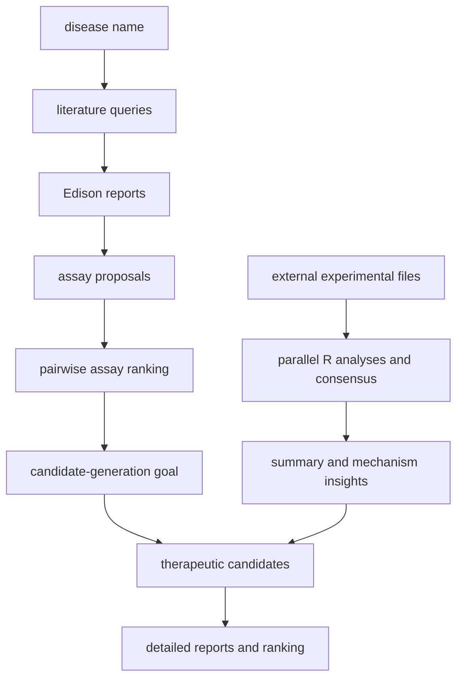

# Future-House/robin：Robin——面向科学发现的多 Agent 研究流水线

| 字段 | 值 |
|---|---|
| GitHub | https://github.com/Future-House/robin |
| License | Apache-2.0 |
| Stars | 710（2026-09-17 快照） |
| GitHub 仓库 pushed_at | 2026-04-21（仓库级动态元数据，不等于分析 commit 新增内容） |
| 分析 commit | `4a5cce310f3bc7663a67117db88af43b84733ffe` |
| 产品类型 | **面向科学发现的多 Agent 研究流水线** |
| 分析证据 | README.md, robin/configuration.py, robin/assays.py, robin/candidates.py, robin/analyses.py, robin/prompts.py |

本文用 📘 标注文档或源码中可直接定位的事实，🔶 标注由控制流推导的边界，💬 标注评价与借鉴建议。仓库动态元数据沿用候选清单，源码判断只绑定页面中的固定提交。

## 1. 它到底是什么

Robin 是以疾病名称为起点，先选择可研究的实验 assay，再提出治疗候选、补充文献依据并排序的研究编排程序。主要用户入口是 notebook，也可以直接调用 experimental_assay、therapeutic_candidates、data_analysis。它把假设设计、检索和实验反馈结合得较明确，但公开仓库依赖 Edison 的远程代理；仓库代码并不等于文献检索和数据分析服务的全部实现。

## 2. 运行时堆叠

Python 3.12+、Pydantic 配置、lmi/LiteLLM 模型调用、EdisonClient、pandas、choix 和异步文件操作组成主堆栈。`RobinConfiguration` 管疾病、候选数量、模型和代理设置；Prompts 对插值字段做校验。运行目录以疾病和时间命名，文献报告、假设文本、排名 CSV 分目录保存。README 给 Docker/Jupyter 部署途径；这是安装说明，不表示本次已部署或验证服务可用。

## 3. 阶段机或 DAG

主路径先定测量系统再提出干预候选；实验反馈需要外部文件输入，图中不假定程序实际操作实验仪器。

## 4. Tool / Skill / Agent 怎么切

本地 agent 职责由 assays、candidates、analyses 模块和对应 prompts 划分，远程代理由 Edison job name 选择。`call_platform` 收集查询结果供本地模型综合，工具并非 MCP 注册树。assay 提议解析 JSON 数组，candidate 提议解析 CANDIDATE START/END 与字段，analysis 解释则按分隔符拆出四段。格式校验与科学证据校验是不同层次，文本符合格式不意味着候选真实有效。

## 5. 文献怎么来、是否入库、引用约束

文献来自 Edison 平台代理返回的报告。`assays.py` 与 `candidates.py` 都直接 await call_platform，并把报告保存到各自 literature_reviews 目录后拼接给 LLM。README 对平台权限的表述不能被读作“无平台即可本地完成全部文献链”；源码显示初始方案生成亦用 EdisonClient。公开仓库可观察查询、结果和引用文本流向，无法从本地代码完整审计远程 paper selection、全文获取和引用忠实度。

## 6. 实验 / 代码执行

`assays.py` 通过 LLM 两两比较，再用 `choix.ilsr_pairwise(..., alpha=0.1)` 得到 strength_score，选择排名靠前 assay。这个 score 是比较模型的潜在排序参数，不是实验效应量。`analyses.py` 对外部数据构建五条并行 R 分析轨迹，再进行 consensus；StepConfig 设置 max_steps 和 timeout，输出 flow_results/consensus_results CSV。代码中输入目录含具体实验路径，适配新项目需核对。实验本身由外部获得，程序只是处理已提供数据。

## 7. 写稿怎么做

写作输出是 assay/candidate 的详细假设报告、摘要、检索综述与数据解释。候选机制、已知证据和试验建议主要由 prompts 规定；它们有助于研究立项，而非整篇期刊论文生产。没有在主入口看到 LaTeX 文稿、文内引用键闭集、venue 模板、全文一致性闸或原子论文版本提交。

## 8. 图怎么做

`analyses.py` 提示到 Edison trajectory 查看火山图，说明特定远程分析可能产生图；本地仍要以实际返回文件为证据。候选排名 CSV 可以支持定量图，但仓库主阶段不提供独立论文 figure suite 合同。不能因 console 打印了图链接，就推断当前任务已经有经审查的图像。

## 9. 和 RH 的相似点

Robin 与 RH 都把检索、方案选择、分析结果和后续方案分开；按阶段落盘报告和 CSV 有利于溯源。Prompts 检查预期变量，能避免遗漏疾病或实验洞见等上下文；实验结果返回候选生成也提供了可追踪反馈接口。

## 10. 和 RH 的不同点

RH 的阶段闸要求证据状态与 artifact 依赖，Robin 的阶段主要由 Python 调用顺序及文本解析决定。排序器选出第一名并不会自动证明其新颖性、可行性或临床效用。关键远程服务不在本仓冻结范围内，目录式产物也不等同于带 hash/依赖失效的稿件版本图。

## 11. 优点 / 缺点

**优点**：先选 assay 再选候选使任务更具体；详细报告与成对排名分开；数据分析明确需要输入文件；异常解析与空结果部分有显式处理。

**局限**：Edison 额度、网络、权限及远程版本影响可重复性；强依赖模型生成的分隔格式；排序采样及模型偏好会影响 strength_score；R 分析含研究案例特定目录。examples 的完整运行输出只说明仓库提供了样例，不证明任意疾病能成功发现干预。

## 12. RH 可学的 1–3 条

1. 借鉴“assay 可测量性先于候选排序”，将读出指标和实验约束登记成 proposal contract。
2. 将 pairwise score 标成模型选择依据，禁止混入效应量/真实结果列。
3. 对远程代理保存任务 ID、请求、响应和文件摘要，并将外部实验文件明确关联至结果 artifact。

## 13. 名字速查表

| 名字 | 先决概念 | 含义 |
|---|---|---|
| `experimental_assay` | disease | 生成并选择实验 assay |
| `therapeutic_candidates` | assay goal | 提出治疗候选并生成报告 |
| `data_analysis` | external files | 调用远程分析和共识步骤 |
| EdisonClient | remote service | 文献与分析平台代理客户端 |
| `strength_score` | pairwise comparisons | choix 排名潜在参数 |
| `experimental_insights` | feedback | 传入下一轮候选生成的解释字典 |

---

> 📌事实边界
> 本页只使用上方冻结 commit 的公开 GitHub 文档和源码。未运行模型、检索服务、领域计算或湿实验；README 的效果、规模及论文实验结论仅按作者声明处理。流程图解释源码机制，既不是运行日志，也不是结果验证。所读代码以外的线上平台、权重、数据许可和真实部署状态无法在本次确认。
