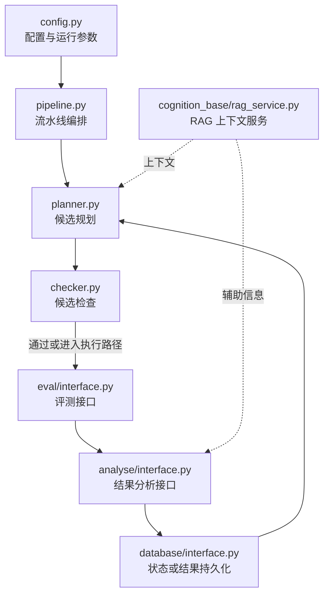

本文用 📘 标注文档或源码中可直接定位的事实，🔶 标注由控制流推导的边界，💬 标注评价与借鉴建议。仓库动态元数据沿用候选清单，源码判断只绑定页面中的固定提交。

## 1. 它到底是什么

ASI-Arch 是 GitHub 仓库 `GAIR-NLP/ASI-Arch` 中的一个面向模型架构自动发现的研究系统候选。候选清单把它归入“模型架构自动发现”，并用“方法、代码、实验、评测、编排”五个层次描述其覆盖面。这个定位比“一个模型”更准确：从固定证据文件的命名看，它关心的不是只提供一个已经训练好的网络，而是把候选方法或架构的提出、实现、检查、评估和分析连成可迭代的流水线。

在本图谱的语境里，ASI-Arch 可以理解为一个窄域的算法发现工作台。`pipeline/pipeline.py` 是明显的流水线入口候选，`pipeline/evolve/model/planner.py` 和 `pipeline/evolve/model/checker.py` 则显示出“提出候选—检查候选”的核心分工；`pipeline/eval/interface.py` 与 `pipeline/analyse/interface.py` 分别提供评测和分析侧的边界。这里的“架构”是对固定源码路径的结构化解读，不等于声称上游已经通过某个公开基准证明了自动发现效果。

固定快照绑定到 commit `3113c51b04a1d4a7520a3b0238c6a08d3194d58f`，快照日期为 2026-09-17。候选元数据显示仓库约有 1,187 stars，默认分支为 `main`，GitHub API 识别的许可证为 Apache-2.0；许可证文本在候选记录中仍标为待核验。因而本报告讨论的是这个 commit 对应的公开结构，而不是仓库后来可能发生的变化。

## 2. 运行时堆叠

可以把它的运行时堆叠分成六层。第一层是配置和依赖：`requirements.txt` 表示项目有显式 Python 依赖清单，`pipeline/config.py` 表示流水线参数被单独组织。固定证据没有锁定 Python 版本、具体框架版本、模型供应商或硬件要求，所以这些细节不能从本报告中推定。

第二层是编排入口，即 `pipeline/pipeline.py`。它应该承担把演化、执行、评测和分析接起来的职责；“应该”是由文件位置和命名得出的架构阅读，而不是一次运行追踪得到的调用图。第三层是演化模块：`pipeline/evolve/interface.py` 代表模块边界，`pipeline/evolve/model/planner.py` 与 `pipeline/evolve/model/checker.py` 代表候选生成和候选检查的模型侧角色。第四层是实验反馈，包括 `pipeline/eval/interface.py` 的评测接口和 `pipeline/analyse/interface.py` 的分析接口。第五层是持久化或状态访问，由 `pipeline/database/interface.py` 暗示数据库层边界。第六层是认知上下文，`cognition_base/rag_service.py` 表明仓库中存在一个 RAG service 文件。

因此，较稳妥的堆叠图是“配置 → 流水线 → 候选演化 → 评测/分析 → 数据库”，RAG 位于为候选或分析提供上下文的旁路位置。不能据此断言它一定使用某个向量数据库、某个检索协议、某种消息队列，或一定支持常驻服务。固定证据里没有容器编排文件、部署说明或服务启动记录可供本报告确认。

## 3. 阶段机或 DAG

从结构上看，ASI-Arch 更像一个带反馈边的 DAG，而不是一次性线性脚本。一次候选尝试至少可以被拆成：读取配置、生成或规划候选、进行检查、执行评测、分析结果、保存状态。分析结果再反馈给演化模块，形成下一轮候选。`interface.py` 文件的存在说明这些阶段之间至少有意设置了可替换边界，但固定文件清单不足以确认每个接口是抽象基类、协议、函数集合还是适配器。

图中的虚线不是已验证的调用关系，而是根据文件名对可能的上下文依赖所作的保守表达。尤其不能把“checker 通过”解释成结果正确，也不能把数据库回边解释成一定存在自动循环。若要把这张图升级为真实运行时 DAG，需要在目标 commit 上读取接口实现、追踪入口调用，并在隔离环境执行一轮最小流程；本次固定事实不包含这些步骤。

## 4. Tool / Skill / Agent 怎么切

证据清单没有名为 `tools/`、`skills/` 或 `agents/` 的上游目录，也没有单独的工具注册表。因此，不宜把 ASI-Arch 套成一个已经明确采用 Tool / Skill / Agent 三分法的系统。较稳妥的切法是按职责而不是按上游术语重建：`planner` 是候选提出职责，`checker` 是候选约束或静态检查职责，`eval` 是实验评测边界，`analyse` 是反馈解释边界，`database` 是状态读写边界，`rag_service` 是上下文获取边界。

若把它映射到 Agent 术语，规划器可以被视为 Agent 的决策面，评测和分析接口是外部反馈面，数据库是记忆面；但这只是便于和其他科研编排系统比较的分析标签。固定证据没有证明 planner 一定由大语言模型驱动，也没有证明 checker 是另一个独立 Agent。`pipeline/evolve/model/` 中的 `model` 可以表示模型实现或数据模型，不能仅凭目录名断言其含义。

在 Tool 层面，评测、分析、数据库和 RAG service 更接近可被编排器调用的能力；在 Skill 层面，固定证据没有发现面向自然语言的技能包、技能说明或技能权限边界。因此 ASI-Arch 的切分重点似乎是算法发现循环中的模块接口，而不是面向通用科研任务的工具协议。

## 5. 文献怎么来、是否入库、引用约束

固定证据清单没有论文检索器、参考文献解析器、BibTeX 文件、citation 管理器或 literature 目录。`cognition_base/rag_service.py` 只能证明有一个名为 RAG service 的源码文件，不能证明它接入学术数据库，也不能证明其中存有经过筛选的论文。RAG 可以服务于代码、实验记录、提示上下文或其他知识源，来源类型必须以实现和配置为准。

因此，关于“文献怎么来”，目前只能给出否定边界：在固定来源中没有足够事实说明它从何处发现文献、是否支持 DOI 或 arXiv、是否保存全文、是否进行去重或版本管理。关于“是否入库”，`pipeline/database/interface.py` 说明系统可能有通用状态或结果持久化边界，但不能把它等同于文献库；没有证据表明论文对象、证据片段和引用关系会被写入数据库。

同样没有发现引用约束，例如每个主张必须绑定来源、引用必须能回溯到页码、生成文本不得超出证据边界等。若它产生研究报告，引用规范是否由上游实现仍属未知。对 RH 而言，这一空白很关键：检索、入库、证据链接和引用闸门不能因为存在 RAG 文件就自动成立。

## 6. 实验 / 代码执行

候选描述把“代码、实验、评测”列为覆盖层，证据清单也包含 `pipeline/eval/interface.py` 与 `pipeline/analyse/interface.py`。这足以支持这样的架构判断：实验反馈是设计中的重要边界，系统至少试图把评测和分析从演化模块中分离出来。`pipeline/pipeline.py` 则可能负责启动或编排候选流程；但没有运行日志、数据集、结果表、基线配置或实验产物随固定证据一起提供。

所以本报告不把“支持代码执行”写成已经执行过代码，也不把“有 eval 接口”写成已经获得性能提升。能确认的最小流程是接口层面的：候选需要经过某种 checker，再进入评测接口，分析接口为下一步演化提供可能的反馈。不能确认的内容包括执行沙箱是否存在、是否允许网络、是否限制文件系统、是否有超时和资源配额、失败是否重试、结果是否可复现，以及实验是否真的调用 GPU。

对一个自动架构发现系统，真正重要的实验契约还应包括候选代码的安全边界、随机种子、数据划分、预算、基线和停止条件。固定证据文件名没有提供这些契约，因此它们应该被列为审查项，而不是被默认为系统能力。尤其是评测接口并不等于 benchmark：没有观测到 benchmark 数据、报告数字或对照实验，就不能做效果排名。

## 7. 写稿怎么做

固定来源没有写作模块、报告模板、Markdown 生成器、LaTeX 模板或结果到文字的接口。`pipeline/analyse/interface.py` 可能输出结构化分析，但“分析”不必然等于论文写作。也没有证据表明 planner 会撰写摘要、讨论和方法章节，或能够把实验数字自动填入可审计的文稿。

因此，ASI-Arch 在本图谱中应被看作算法发现和实验反馈系统，而不是完整的论文生产线。若它确实会生成文本，当前也只能把那看作待核实的外围能力：需要查找实际的 prompt、模板、输出目录和调用链，才能判断生成文本是否保留实验 provenance、是否区分观察结果与假设、是否支持人工修改。

这一区分也影响对它的评价。架构候选的提出可以很自动化，但论文写作还需要主张、证据、引用和版本关系。没有固定证据证明这些对象被明确建模，就不能说它具有 RH 那样的写作质量门禁。

## 8. 图怎么做

在固定证据清单中没有 figure、plot、visualization、绘图模板或图表导出接口。`analyse/interface.py` 可能返回用于分析的数值或结构，但没有证据显示它会生成 PNG、SVG、PDF，或维护图注、数据源和面板级 provenance。因此，上文 Mermaid 仅是本报告为解释文件关系而绘制的架构示意，不是 ASI-Arch 上游产物。

如果未来核验到绘图能力，至少应区分三种东西：实验过程可视化、结果统计图和系统架构图。它们的数据来源、误差表达和可复现方式不同。当前没有任何固定结果可以支持诸如“自动生成发表级图”“自动选择图形类型”或“图与代码自动绑定”等判断。

对科研工作流来说，图也不只是渲染问题。一个可审计的图需要知道使用了哪一轮实验、哪些样本、哪个指标和哪条代码路径。现有证据只给出分析接口和数据库接口的名字，尚不足以证明这些字段会随图一起保存。

## 9. 和 RH 的相似点

第一，二者都可以被放在“把科研活动拆成可编排阶段”的框架中理解。ASI-Arch 的固定路径把演化、评测、分析和数据库分成接口；RH 关注文献、证据、实验规划、论文写作和质量门禁。两者都不是单个问答提示，而是试图把多个科研动作连接起来。

第二，二者都重视中间状态。ASI-Arch 有数据库接口，RH 也需要把论文、主张、证据、实验和稿件作为可追踪对象。这里只能说抽象层面相似，不能说两者的数据模型兼容。

第三，二者都有反馈闭环的潜在形态。ASI-Arch 通过评测和分析把反馈送回候选演化；RH 则可以通过证据检查、实验结果和写作质量门禁回到规划阶段。共同点在于反馈不应只停留在最终输出，而应影响下一轮决策。

这些相似点是架构层比较，不是效果比较。固定来源没有显示 ASI-Arch 与 RH 共享代码、服务、模型或数据。

## 10. 和 RH 的不同点

最重要的差异是范围。ASI-Arch 的候选定位是窄域的模型架构自动发现，核心对象是候选算法或架构及其评测反馈；RH 是面向更完整科研生产链的工作流，关注文献获取、证据绑定、实验规划、论文写作和质量门禁。前者可以在一个研究问题内不断搜索候选，后者要管理从问题到可交付研究产物的跨阶段关系。

第二个差异是证据类型。ASI-Arch 的固定清单主要暴露 pipeline、evolve、eval、analyse、database 和 RAG service；没有看到论文、主张、引用或文稿对象。RH 的工作对象则明确包含这些研究交付所需的证据和文稿关系。因而 ASI-Arch 的数据库接口更可能围绕搜索过程和实验状态，而 RH 需要回答“哪条主张由哪份来源、哪次实验支持”。

第三个差异是治理边界。现有证据不显示 ASI-Arch 有公开的文献引用约束、写作一致性检查、图表证据审计或提交前质量闸门。RH 的特色正是在这些边界上组织可检查的中间产物。ASI-Arch 也许更轻、更专注，但不能替代完整科研生产治理。

## 11. 优点 / 缺点

优点有三项。其一，问题边界清楚：围绕架构候选的提出、检查、评测和分析组织模块，避免一开始就把所有科研环节混在一个 Agent 中。其二，文件名显示出接口意识，`evolve`、`eval`、`analyse` 和 `database` 的边界有利于替换实现、插入记录或单独测试。其三，规划器与检查器分开是一个有价值的控制点；候选先经过约束，再进入评测，理论上比直接运行任意生成代码更容易加入安全和资源治理。

缺点也很明确。第一，固定证据不足以证明接口契约、失败处理和资源限制，模块化外观不等于可复现性。第二，系统定位偏窄，文献检索、证据链接、引用和论文写作没有被确认纳入主循环。第三，RAG 文件的存在可能让读者高估知识来源能力；在没有数据源、索引策略和 provenance 的情况下，不能把它当成审计过的文献基础。第四，没有公开实验记录和 benchmark 结果，无法判断搜索效率、候选质量或相对基线的收益。最后，若候选代码由模型生成，checker 的强度、沙箱隔离和停止条件会直接决定系统是否可用，而这些目前都未被固定事实覆盖。

## 12. RH 可学的 1–3 条

**一是把“规划—检查—评测—分析”做成显式可替换边界。** RH 在规划实验或写作任务时，可以借鉴 ASI-Arch 的窄闭环，把计划的合法性、资源预算和证据要求放在执行前检查，而不是等结果出来再补救。每个边界都应留下输入、输出和失败原因。

**二是保留候选搜索的反馈回路，但把反馈绑定到证据。** ASI-Arch 的潜在回边适合探索多个方法候选；RH 可以要求每轮反馈同时记录数据版本、代码版本、指标定义、基线和证据链接，使“下一轮更好”不只是模型的主观判断。

**三是把 RAG 作为上下文适配器，而不是事实来源本身。** `rag_service.py` 所暗示的服务边界可以启发 RH 将检索实现与主张、来源和引用约束分离。检索结果只有在进入证据对象、通过来源和引用检查后，才应影响可交付稿件；这样既保留检索灵活性，也避免把未审计上下文当成结论。

## 13. 名字速查表

| 项目 | 固定信息 |
|---|---|
| 展示名 | ASI-Arch |
| GitHub 仓库 | `GAIR-NLP/ASI-Arch` |
| 地址 | `https://github.com/GAIR-NLP/ASI-Arch` |
| 图谱类别 | 模型架构自动发现 |
| 候选层次 | 方法、代码、实验、评测、编排 |
| 固定 commit | `3113c51b04a1d4a7520a3b0238c6a08d3194d58f` |
| 默认分支 | `main` |
| 快照日期 | 2026-09-17 |
| 候选选择序号 | 79 |
| GitHub stars 快照 | 1,187，非近似值 |
| GitHub API 许可证 | Apache-2.0 |
| 许可证文本状态 | 候选记录标为待核验 |
| 主要证据路径 | `README.md`、`LICENSE`、`requirements.txt` |
| 流水线相关路径 | `pipeline/pipeline.py`、`pipeline/config.py` |
| 演化相关路径 | `pipeline/evolve/interface.py`、`pipeline/evolve/model/planner.py`、`pipeline/evolve/model/checker.py` |
| 评测与分析路径 | `pipeline/eval/interface.py`、`pipeline/analyse/interface.py` |
| 状态与上下文路径 | `pipeline/database/interface.py`、`cognition_base/rag_service.py` |
| 本文判断方式 | 固定源码路径和公开元数据的架构解读，不等同于运行验证 |

> 📌事实边界：本报告绑定 `GAIR-NLP/ASI-Arch` 的固定 commit `3113c51b04a1d4a7520a3b0238c6a08d3194d58f` 与证据清单；未运行任何依赖（安装或执行）、服务、模型、GPU 任务或 benchmarks，也未执行性能基准、代码实验或结果复核。
