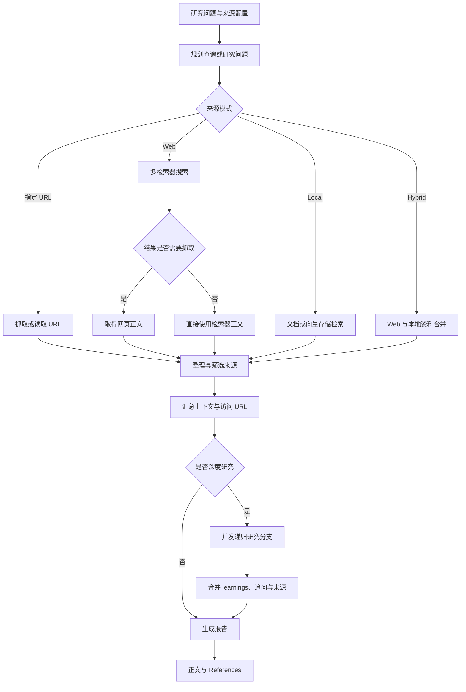

# assafelovic/gpt-researcher：可配置检索、递归调研与带来源报告生成器

| 字段 | 值 |
|---|---|
| GitHub | https://github.com/assafelovic/gpt-researcher |
| License | Apache-2.0；固定提交的 `pyproject.toml` 另含 MIT 元数据，存在许可证标注不一致 |
| Stars | 29,485（2026-09-17 快照） |
| GitHub 最后 push | 2026-08-27 |
| 分析 commit | `6f998577d547b1e54ec662dac63583aa11e3b84b` |
| 产品类型 | 通用深度研究与检索 Agent；重点覆盖资料获取、上下文整理和报告生成 |
| 分析证据 | README、许可证与包元数据、主 Agent、研究编排、递归研究、来源策展、报告生成及引用后处理源码 |

## 1. 它到底是什么

GPT Researcher 是一个围绕“提出问题—规划检索—取得网页或本地资料—筛选上下文—生成带来源报告”构建的 Python 研究 Agent。核心入口 `GPTResearcher` 接收查询、报告类型、报告格式、资料来源、指定 URL、领域限制、本地文档、向量存储和 MCP 配置，再组装检索、抓取、来源策展、深度研究与写作组件。它既可以作为 Python 对象调用，也由 README 描述为可接前端、服务接口、容器和多 Agent 示例的通用研究后端。

其核心能力不是某一垂直学科的论文数据库，而是把不同来源统一成可供语言模型写作的上下文。`report_source` 可选择 Web、本地资料或混合来源；调用方还能直接给出网页地址、文档对象或向量存储。普通路径由 `ResearchConductor` 处理，深度研究路径由 `DeepResearchSkill` 递归扩展问题，最终交给 `ReportGenerator` 生成正文。

需要区分三层事实。第一层是固定提交源码可见的机制，例如异步检索、URL 去重、MCP 策略、空上下文拒写和参考链接追加。第二层是 README 的产品宣称，包括大约数分钟完成研究、成本估计、导出格式、前端体验和“客观、可靠”等效果描述。第三层是运行效果：本次没有连接模型、搜索、抓取、向量存储或图像服务，因此没有独立验证搜索覆盖率、报告正确率、时延、成本和导出质量。

## 2. 运行时堆叠

- **入口与配置层**：`GPTResearcher` 保存查询、报告类型、来源模式、语气、URL、文档、向量存储和 MCP 参数，并通过 `Config` 解析模型、检索器、抓取器与限制项。
- **研究编排层**：`ResearchConductor` 生成或接收子查询，选择 URL、本地资料、Web、混合、Azure、LangChain 文档或向量存储路径，再汇总上下文。
- **资料取得层**：retriever 先返回搜索结果；需要正文的结果再交给抓取器。固定提交新增的 `requires_scraping` 语义用来区分“只返回链接或摘要”与“已经返回可用正文”的检索器，减少不必要的再次抓取。
- **上下文与来源层**：`ContextManager`、`BrowserManager` 和 `SourceCurator` 分别参与上下文处理、网页访问和来源筛选；`visited_urls` 在同一研究过程中记录已访问 URL。
- **写作层**：`ReportGenerator` 根据报告类型选择提示模板，接收研究上下文、已有章节、外部上下文和候选图片，再生成 Markdown 报告。
- **深度研究层**：`DeepResearchSkill` 维护 breadth、depth、并发上限、learnings、follow-up questions、citations 与访问 URL，可为分支创建新的 `GPTResearcher`。
- **扩展层**：MCP 可按 `disabled`、`fast` 或 `deep` 策略参与研究；`deep_agents` 则提供 chief editor 与 researcher 分工的另一条多 Agent 示例路径。
- **观测层**：对象保存总成本和分步骤成本，README 还说明可接 LangSmith、Monocle 等观测设施；这些外部观测效果不属于本次运行验证范围。

源码中的 `Memory` 是研究执行所用组件，不能据此推断存在持久化的论文、主张、证据和版本数据库。核心状态主要由当前对象中的上下文、URL 集合、图片、子主题和费用信息组成。

## 3. 阶段机或 DAG

这不是一张固定不变的单一路径图。指定 URL 可以绕过搜索，本地文档不必经过网页抓取，MCP 的 `fast` 策略可针对原查询执行一次并缓存结果，`deep` 策略则可进入各子查询。深度研究还会在 breadth 与 depth 允许的范围内继续生成搜索问题，并用 semaphore 限制并发。

流程中的关键停机条件主要来自配置深度、广度、并发与可用上下文，而不是科研意义上的证据充分性裁决。普通报告生成前有一项明确保护：当上下文为空时，`ReportGenerator` 返回无法生成可靠、有来源报告的说明，而不是继续凭空撰写。

## 4. Tool / Skill / Agent 怎么切

GPT Researcher 的命名分层与 RH 不完全相同：

- **Agent**：`GPTResearcher` 是主门面，持有研究状态并暴露 `conduct_research()`、`write_report()`、`quick_search()`、`get_source_urls()` 和 `get_costs()` 等接口。
- **研究组件**：`ResearchConductor` 负责普通研究工作流；`ReportGenerator` 负责写作；`SourceCurator` 负责对候选来源做模型辅助筛选。
- **Skill**：`DeepResearchSkill` 是源码中的递归研究能力，围绕研究计划、查询生成、结果加工和递归分支组织执行。这里的 Skill 是项目内部 Python 类，不是跨宿主分发的标准技能包。
- **Retriever / Scraper**：retriever 负责搜索或直接返回内容，scraper 负责读取需要进一步抓取的 URL。`requires_scraping` 明确了二者交接合同。
- **MCP Tool**：配置的 MCP server 可以提供额外工具。`disabled` 完全关闭；`fast` 对主问题执行一次；`deep` 允许子查询分别调用。实现还会避免直接 Tavily 与 Tavily MCP 的明显重复。
- **多 Agent 示例**：`deep_agents/agent.py` 中的 chief editor 会快速搜索、建立待办、向 researcher 子 Agent 分派章节、读取结果并组织最终报告。它是附加实现，不能代表所有 `GPTResearcher` 调用都经过 chief editor。

这种切法的优点是单 Agent API 易嵌入，而 retriever、scraper、writer 和 MCP 仍可替换。代价是“Skill”“Agent”“动作函数”主要由项目自身约定，缺少统一的跨流程 artifact 类型和持久化输入输出合同。

## 5. 文献怎么来、是否入库、引用约束

资料入口较宽：

1. 检索器可根据查询返回 URL、摘要或正文；
2. 调用方可直接提供 `source_urls` 和 `document_urls`；
3. local 模式可使用本地文档、LangChain documents 或向量存储；
4. hybrid 模式合并 Web 与本地资料；
5. MCP 工具可补充特定来源；
6. `query_domains` 可限定检索域，排除域也可在抓取前过滤。

`ResearchConductor` 会并发处理子查询，并借助 `visited_urls` 避免在当前研究中重复处理相同 URL。固定提交中的 retriever 合同值得注意：结果若已包含可用正文，可直接进入上下文；仅有链接或短预览时才进入抓取步骤。抓取动作还会收集网页图片 URL，并对失败条目做容错处理。

`SourceCurator` 要求模型从相关性、可信度、时效性、客观性和量化价值等角度筛选候选来源。模型输出经 JSON 解析或修复；响应不可用时退回原始来源。因而它是模型辅助排序，不是独立的来源真实性认证。

引用主要受提示词和 URL 后处理约束。报告提示要求正文使用链接、为实质性陈述提供引用，并生成 References；`add_references()` 会把 `visited_urls` 排序后追加成确定性的链接列表。深度研究还维护 learning 到 source URL 的引用映射。不过，URL 被访问或列入 References，并不自动证明它支持报告中的每一句话。源码没有持久化的 claim—source—span 关系、页码定位、相互矛盾证据状态或逐项引用闸门，也没有把取得的资料注册为可跨任务查询的正式论文库。

## 6. 实验 / 代码执行

核心包面向资料研究与报告生成，没有内置的实验设计、代码沙箱、数据版本、运行队列、指标登记、随机种子、资源预算或结果复核工作流。`conduct_research()` 中的“research”主要指搜索、抓取和上下文整理，不应等同于执行科学实验。

MCP 理论上可以接入外部代码或数据工具，多 Agent 路径也可以把任务交给其他执行器，但这只表明存在扩展接口。固定提交中的核心流程没有为外部执行结果规定统一的 experiment record，也没有强制把命令、环境、输入摘要、输出指标和失败状态保存为可审计 artifact。

因此它适合回答资料型问题、生成市场或技术调研、形成研究综述初稿；若用于实证论文，仍需要外部系统承担实验执行、资源隔离、结果注册和“正文数字只能来自已登记记录”的约束。

## 7. 写稿怎么做

`ReportGenerator.write_report()` 接收研究上下文、已有标题、已经写出的相关内容、外部上下文和自定义提示，再由 `generate_report()` 根据 report type 选择模板。源码中的提示族覆盖普通研究报告、资源报告、提纲、子主题报告、深度研究报告、摘要、引言和结论等形式。

写作链有几项具体工程保护：

- 上下文为空时拒绝生成看似有来源的报告；
- 生成失败后可使用简化消息再次尝试；
- 已生成的候选图片可转换成 Markdown 图片条目并进入写作提示；
- 子主题写作可接收其他章节，降低明显重复；
- 引言和结论有独立动作；
- References 可根据访问 URL 统一追加。

`deep_agents` 示例进一步把长报告拆成章节：chief editor 规划待办，researcher 分别研究，随后汇总章节并要求只保留一个去重后的 References 区域。这适合长文并行，但仍以模型输出和提示约束为主。固定源码没有显示正式的稿件版本谱系、目标期刊格式闸、引用双向检查、文字重叠检查或 PDF 提交质量门。

README 还宣称支持 PDF、Word 等输出及 Web 界面；这些属于项目文档描述，本次没有实际生成或检查对应文件。

## 8. 图怎么做

抓取层会收集网页中的图片 URL，主 Agent 也初始化 `ImageGenerator`。报告生成动作可把候选图整理成 `` 形式，并提示写作模型在适合位置引用。README 另有 AI inline images 相关说明。这说明图像可以成为报告素材或生成式插图，但固定提交中没有看到完整的科学制图合同。

尤其需要区分三类图：

- 来源网页中的现有图片；
- 根据文字提示生成的说明性图片；
- 从实验记录确定性渲染的定量结果图。

该项目主要覆盖前两类入口，没有给第三类定义数据表到面板、误差线、单位、样本量和图注主张的强制映射。它也没有全稿 figure suite 的角色规划、跨图一致性检查或图像证据边界。因而图片功能适合丰富通用报告，不足以单独保证论文结果图可复核。

## 9. 和 RH 的相似点

- 都把复杂研究请求拆成多个阶段，而不是只进行一次模型问答。
- 都允许接入多种来源和外部工具，并在编排层控制调用。
- 都关注来源、引用和最终长报告，而不是只返回搜索结果列表。
- 都存在并行执行：GPT Researcher 并发处理子查询，深度研究还并发扩展研究分支。
- 都承认上下文长度与费用需要管理；GPT Researcher 可裁剪上下文并记录成本。
- 都能把“检索”“来源处理”“写作”分给不同组件，具备继续服务化的基础。
- MCP 支持使它可以作为更大 Agent 宿主中的研究能力，而不必把所有外部集成都写入核心类。

## 10. 和 RH 的不同点

GPT Researcher 的中心对象是一次查询及其运行时上下文；RH 的中心是可恢复的 topic，以及 papers、claims、evidence、artifacts、provenance 和 gate。前者优化“怎样尽快搜集资料并写出报告”，后者还要回答“哪份证据支撑哪个主张、哪个版本消耗了哪些上游产物、当前阶段是否允许推进”。

具体差异包括：

- `visited_urls` 是当前研究去重集合，不是论文摄取与证据版本库。
- 来源策展依赖模型判断，RH 还要求结构化证据链接和支持状态。
- 深度研究的递归状态是 learnings、问题、URL 和上下文；RH 的工作流状态包含持久 checkpoint、决定和 artifact lineage。
- GPT Researcher 没有正式实验合同；RH 将实验记录、图表和稿件主张放进同一证据边界。
- GPT Researcher 的引用要求主要来自 prompt 与 References 后处理；RH 可在写作后运行一致性和引用纪律检查。
- 图像在 GPT Researcher 中是报告素材；RH 区分方法示意图、生成式图片和由记录驱动的结果图。
- 多 Agent chief editor 路径自行组织章节；RH 更强调宿主 Agent 可以替换，而公共 Tool 合同和持久状态保持稳定。

两者因而更适合组合而非互相替代：GPT Researcher 的检索与上下文获取可作为前端能力，RH 则保存可复用证据并控制科研生产阶段。

## 11. 优点 / 缺点

**优点**

- Web、指定 URL、本地文档、向量存储、混合来源和 MCP 共用一个主入口，覆盖面广。
- retriever 与 scraper 的职责边界清楚，`requires_scraping` 能避免对已取得正文重复抓取。
- 异步子查询、递归 breadth/depth 和并发限制兼顾调研广度与资源控制。
- 空上下文拒写是有价值的可靠性保护，优于在没有资料时继续生成完整报告。
- `visited_urls`、来源列表、成本统计和 References 为调用方提供了基本可观察性。
- 普通单 Agent API 与 `deep_agents` 长文协作示例同时存在，便于从简单集成逐步扩展。
- 固定提交的 `LICENSE` 提供 Apache 2.0 授权文本。

**缺点**

- 引用链以 URL 和提示词为主，缺少 claim-level evidence relation 与证据片段审计。
- `SourceCurator` 的质量判断仍由模型完成，解析失败时退回原列表，不能视作来源认证门。
- 核心状态没有形成可跨任务查询的研究数据库，难以原生支持长期课题和版本谱系。
- 没有受控实验执行、结果登记和定量图表合同，产品边界主要停在研究报告。
- README 的时间、成本和质量表述依赖具体服务、模型与查询，本次没有独立复现。
- `LICENSE` 是 Apache 2.0，而 `pyproject.toml` 的相关元数据写作 MIT；再分发前需要由维护方统一解释，使用者也应以实际许可证文件和法律意见为准。
- 多种扩展路径增加灵活性，也可能让普通研究、递归研究和 chief-editor 流程产生不同的状态与引用行为。

## 12. RH 可学的 1–3 条

1. **把“检索结果是否需要再次抓取”提升为正式 Tool 输出字段。** GPT Researcher 的 `requires_scraping` 用很小的合同消除了重复抓取。RH 的搜索提供方也可显式返回 `content_level`、`requires_fetch` 和内容来源，让 paper acquisition 根据能力而不是字符串长度选择后续动作。
2. **为资料不足保留统一的拒写结果。** `ReportGenerator` 在上下文为空时直接说明无法生成可靠、有来源的报告。RH 可将这一原则扩展为结构化 blocker：缺论文、缺 claim link 或缺实验记录时返回可行动的缺口，而不是让写作模型补齐。
3. **提供成本较低的递归检索档位。** `disabled / fast / deep` 和 breadth/depth/concurrency 形成易懂的研究预算旋钮。RH 可以把类似策略映射到现有搜索与证据工具，但仍将结果摄取进同一 paper/evidence/provenance 权威状态，避免建立平行引擎。

## 13. 名字速查表

| 名字 | 先决概念 | 含义 |
|---|---|---|
| `GPTResearcher` | façade | 接收查询与配置、持有研究状态的主入口 |
| `ResearchConductor` | orchestration | 规划并执行普通 URL、Web、本地或混合研究 |
| `ReportGenerator` | writing | 根据上下文和报告类型生成正文 |
| `SourceCurator` | source ranking | 用模型按相关性、可信度等维度筛选候选来源 |
| `DeepResearchSkill` | recursive research | 以 breadth、depth 和并发限制递归扩展研究 |
| `requires_scraping` | retriever contract | 表示检索结果是否仍需取得网页正文 |
| `visited_urls` | run state | 当前研究中已处理 URL 的去重集合 |
| `mcp_strategy` | tool policy | `disabled`、`fast`、`deep` 三种 MCP 使用策略 |
| `quick_search()` | lightweight retrieval | 不进入完整长报告流程的快速搜索入口 |
| `add_references()` | post-processing | 将已访问 URL 排序后追加到参考来源列表 |
| `deep_agents` | multi-agent example | chief editor 与 researcher 协作生成长报告的附加路径 |
| `get_costs()` | observability | 读取当前研究对象累计费用的接口 |

---

> 📌事实边界
> 本页绑定固定提交 `6f998577d547b1e54ec662dac63583aa11e3b84b`，项目数据快照为 2026-09-17。架构、分支和保护逻辑来自源码；时间、成本、输出格式及质量效果中由 README 给出的部分仅作为项目自述。本次没有调用模型、搜索、网页抓取、MCP、向量存储或图像服务，也没有复现完整报告，因此不对检索覆盖率、引用正确性、运行成本或生成质量作实测结论。

`
