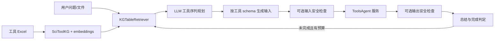

# SciToolAgent：利用工具知识图谱进行科学工具检索、规划与执行

| 字段 | 值 |
|---|---|
| GitHub | https://github.com/HICAI-ZJU/SciToolAgent |
| License | MIT |
| Stars | 423（2026-09-17 冻结快照） |
| 最后 push | 2025-08-26 |
| 分析提交 | `ac1cf19fcef84e69f149db6da424afe4e9b2f11f` |
| 快照日期 | 2026-09-17 |
| 产品类型 | 科学工具检索与多工具 Agent |
| 分析证据 | `README.md`、`LICENSE`、`app.py`、`scripts/generate_kg_index.py`、`scripts/retrieve_tool_info.py`、`app/llms/planning/tool_plan_executor.py`、`app/tools/tool_runner.py`、`app/tools/safety/toxicity_checker.py`、`ToolsAgent/tool_runner.py`、`ToolsAgent/main.py`、`SciToolEval/README.md`、`SciToolEval/eval/eval_accuracy.py` |

本文用 📘 标注文档或源码中可直接定位的事实，🔶 标注由控制流推导的边界，💬 标注评价与借鉴建议。仓库动态元数据沿用候选清单，源码判断只绑定页面中的固定提交。

## 1. 它到底是什么

SciToolAgent 把科学工具自身作为知识图谱对象：工具的功能、输入、输出、安全属性及依赖关系进入 SciToolKG，由 LLM 检索后规划工具序列，再依序执行并总结结果。README 声明覆盖 500+ 工具，包括 API、机器学习模型、Python 函数和知识数据库，并配有 SciToolEval。公开实现可以支持“工具图谱驱动编排”这一定位；工具数量是项目声明，并不意味着本次验证了这些工具全部可用。它不是文献知识图谱，也不是带通用实验室仪器权限管理的科研操作系统。

## 2. 运行时堆叠

应用侧包含 FastAPI /chat 入口、LlamaIndex KnowledgeGraphIndex、OpenAI embedding/LLM、异步规划函数和工具调用 client。工具服务单独在 ToolsAgent 中以 /run-func 暴露能力，使用 TOOLS_MAPPING 从 category 解析模块并动态导入函数，在 ThreadPoolExecutor 中执行。应用把 tool_name 和字符串参数发给本地工具服务，同时传文件列表。图索引通过 storage_context.persist 落盘；运行结果主要积累在字符串 total_output/responses_content，不是专门的研究 artifact 数据库。

## 3. 阶段机或 DAG

generate_kg_index.py 从工具 Excel 形成三元组；对 functionality 关系才生成 embedding，并将图存到指定目录。run_SciToolAgent 加载图索引，创建 KGTableRetriever，检索工具，调用 generate_tools_plan 并提取 tool_path；每个工具先查询子图的输入/输出/安全要求，再生成参数并调用服务，最后汇总并解析 Completed 状态。

这是函数之间的调用关系；LLM 自报 Completed 不是科学质量审核的同义词。

## 4. Tool / Skill / Agent 怎么切

规划、参数生成、执行和总结各有独立函数。generate_plan_input 从模型回答中的 Input:/input: 后提取字符串；run_tool 通过 aiohttp 调服务。ToolsAgent 动态选择已注册函数，使用线程池而非代码沙箱。工具加入流程要求实现函数、登记工具映射并重启服务，同时更新图谱数据，意味着“实现存在”和“检索能找到”是两个需保持一致的清单。安全检查依赖工具图中的 requires_security_check，对输入/输出识别出的分子或序列做数据库相似度过滤。

## 5. 文献怎么来、是否入库、引用约束

SciToolKG 的实体主要是工具，不是已发表论文中的主张。仓库虽然容纳知识数据库、网页 API 等工具，但所读核心链没有统一论文入库、DOI 去重、source span、引用键或 claim-evidence 关系。论文引用在 README 中用于说明项目成果，不代表每次答案都有文献支撑。评价时应把工具检索质量与文献检索质量分开。

## 6. 实验 / 代码执行

外层规划循环最多尝试三次；单工具 execute_tool 中对特定错误前缀使用 while True 重试，没有在该函数内设置次数上限。因此不能把外层三次当作总调用预算。工具服务用线程池执行注册 Python 函数，模型工具还需要对应权重、路径和环境。毒性检查是数据库相似度启发式，不能证明对所有危险请求有效。公开 FastAPI 入口未见请求级认证依赖，部署者不应直接把本地工具服务开放到不可信网络。

## 7. 写稿怎么做

generate_output 对累积工具结果作最终总结，并解析任务是否完成。它没有论文章节生产、引用管理、审稿意见或发布 gate。自然语言输出是一份任务解答；从答案到论文仍需独立整理证据、方法、结果、限制和引用。

## 8. 图怎么做

README 有项目架构图和案例 notebook，工具目录可包含多种科学文件，但核心 orchestration 未定义 figure contract。即使某个被调用工具生成图像，也需检查它的数据来源、模型参数与可视化程序，不能把工具编排成功当作发表图表验收。

## 9. 和 RH 的相似点

相似点是以工具目录和结构化能力描述为中心，把规划与执行分开；工具图可以把隐含前置条件呈现为可检索信息，比将数百工具说明一次性塞入 prompt 更可维护。它还保留工具路径与最终答案两种评测对象，避免只看流畅回答。

## 10. 和 RH 的不同点

与证据中心的科研工作流相比，SciToolAgent 的图主要服务工具发现，运行状态主要是文本累积。没有强制实验输入/输出版本、持久化失败状态或 claim 级来源。规划函数和服务执行层的合同仍以字符串为主；安全过滤和三次外层尝试不是端到端权限、预算和科学证据闸。

## 11. 优点 / 缺点

优点：工具图和运行服务分层；添加工具的登记路径明确；输入/输出和安全属性参与规划；包含 SciToolEval 数据格式及工具路径评测入口。

不足：工具数量与可用率未独立核实；工具实现清单与 KG 可能漂移；单工具重试缺显式上限；线程执行不隔离文件/网络权限；安全筛查依赖有限数据库。eval_accuracy.py 还存在可见的入口签名不一致：evaluate_responses 要求 api_key，__main__ 调用只给三个参数，原样入口需要修正才能运行；这是一项静态代码发现，不是实际评测失败日志。

## 12. RH 可学的 1–3 条

1. 可借鉴工具依赖、输入/输出和安全属性形成的知识图谱，但必须让 registry 与实现清单自动一致。2. 将工具路径评价与答案评价分开，并补上实际执行状态、预算和失败记录。3. 把 Completed 从模型文本提升为可验证的结果合同，增加有界重试、权限隔离与外部证据核验。

## 13. 名字速查表

| 名字 | 先决概念 | 含义 |
|---|---|---|
| `SciToolKG` | tool metadata graph | 保存工具功能、格式及关系的图谱 |
| `KGTableRetriever` | graph retrieval | 从图索引检索候选工具 |
| `generate_tools_plan` | LLM planning | 生成工具调用序列 |
| `execute_tool` | tool execution | 生成参数、可选检查并调用服务 |
| `ToolsAgent` | runtime service | 动态载入并执行工具函数的服务 |
| `SciToolEval` | benchmark | 分别评价工具路径与最终答案的材料 |

---

> 📌事实边界
> 本报告依据固定提交中的公开文档与实际查看的代码作静态分析。没有安装或执行被分析仓库，没有连接仪器、GPU 集群或收费模型 API。README/论文的能力和结果声明不等于本次复现；外部数据、模型权重、设备校准、部署稳定性以及科学结论的有效性均需另行验证。
