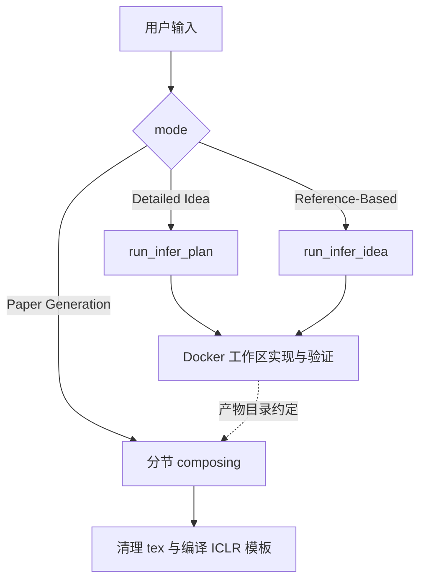

# AI-Researcher：从想法或参考文献到实现与论文的研究 Agent

| 项目 | 固定快照 |
|---|---|
| 候选编号 | 73 |
| 仓库 | [HKUDS/AI-Researcher](https://github.com/HKUDS/AI-Researcher) |
| 分类 / 层次 | 科学发现 Agent；文献、方法、实验、写作 |
| 分析提交 | `f9a6f8480860c193afff600eeffe3defcee8a978` |
| 元数据快照 | 2026-09-17；Stars 5743，非近似值；最近推送 2025-10-16 |
| 默认分支 / 状态 | main；非 fork、未归档；候选 pending，分析 draft |
| 许可 | GitHub API 为 `NOASSERTION`；固定提交根目录未见 LICENSE / LICENSE.md |
| 阅读方式 | 公开 README、入口脚本、research_agent 与 paper_agent 关键路径；静态分析 |

本文用 📘 标注文档或源码中可直接定位的事实，🔶 标注由控制流推导的边界，💬 标注评价与借鉴建议。仓库动态元数据沿用候选清单，源码判断只绑定上面的固定提交。

## 1. 它到底是什么

📘 [根 README](https://github.com/HKUDS/AI-Researcher/blob/f9a6f8480860c193afff600eeffe3defcee8a978/README.md) 将系统定位为 Autonomous Scientific Innovation：接受两种用户输入。Level 1 是详细 idea 描述；Level 2 是只给参考文献，让系统提出创新想法并实现。宣称覆盖文献综述、想法生成、算法实现、验证、结果分析与全文写作。

📘 [`main_ai_researcher.py`](https://github.com/HKUDS/AI-Researcher/blob/f9a6f8480860c193afff600eeffe3defcee8a978/main_ai_researcher.py) 用三个 mode 分发：`Detailed Idea Description` 调 `run_infer_plan.main`，`Reference-Based Ideation` 调 `run_infer_idea.main`，`Paper Generation Agent` 调 `paper_agent.writing.writing`。🔶 README 的“端到端科研自动化”是产品叙述；源码入口是三条可切换路径，而不是单一不可中断的事务。

## 2. 运行时堆叠

📘 安装路径推荐 uv + Python 3.11，并拉取 Docker 镜像 `tjbtech1/airesearcher:v1` 作为 agent-interactive 环境。研究侧在 `research_agent/`，写作侧在 `paper_agent/`。`global_state.INIT_FLAG` 防止同一进程重复初始化。

| 层 | 固定快照中的承载方式 | 边界 |
|---|---|---|
| 入口 | CLI / Web GUI（`web_ai_researcher.py`） | Web 文件很大，本次只确认入口存在 |
| 研究 Agent | `research_agent.inno.MetaChain` | 异步消息循环，最多重试 3 次 |
| 容器 | Docker `paper_eval` 等容器名来自环境变量 | 需要本机 Docker |
| 写作 | 分节 composing 后编译 ICLR 模板 | 依赖已有 target_sections |
| 基准 | `benchmark/final/{category}/{instance_id}.json` | 实例路径由 CATEGORY / INSTANCE_ID 决定 |

🔶 `COMPLETION_MODEL` 来自 `research_agent.constant`，默认 CLI 参数是 `gpt-4o-2024-08-06`。这是快照配置，不是对当前服务可用性的验证。

## 3. 阶段机或 DAG

📘 研究路径与写作路径在入口处分开。写作路径在 [`paper_agent/writing.py`](https://github.com/HKUDS/AI-Researcher/blob/f9a6f8480860c193afff600eeffe3defcee8a978/paper_agent/writing.py) 中串行：methodology → related work → experiments → introduction → conclusion → abstract，然后清理 tex、处理 bib、编译 `iclr2025_conference.tex`。

📘 `research_agent/inno/main.py` 的 `run_in_client` 用 `MetaChain.run_async`；若最后一条消息不含 `Case resolved`，最多再试 3 次，并把失败消息追加回上下文。

🔶 虚线表示写作入口读取 `research_field/target_sections/{instance_id}`，本次未把研究 Agent 的每次文件写入与写作读取做成强制闸门。`max_iter_times` 默认 0，具体迭代语义要看 `run_infer_*`，不能从入口参数直接推出“会充分迭代”。

## 4. Tool / Skill / Agent 怎么切

📘 `research_agent/inno` 提供 `Agent`、`MetaChain`、`registry`。研究 Agent 在容器中实现算法；写作 Agent 是按章节划分的 composing 函数，不是可安装 Skill。🔶 名称上的 Literature Review / Idea Generation 是 README 能力列表，入口代码并没有同名独立服务。

## 5. 文献怎么来、是否入库、引用约束

📘 `benchmark_collection/` 含爬取论文、构造 innovation graph 的脚本与提示词。写作阶段 `process_tex_file` 处理 `related_work.tex` 与 `iclr2025_conference.bib`。🔶 这是生成时的 bib 文件操作，不是跨会话的论文对象库，也没有 claim-level entailment。benchmark JSON 和 innovation graph 是评测/构造材料，不能自动当作运行时引用约束。

## 6. 实验 / 代码执行

📘 研究 Agent 依赖 Docker 交互环境；`container_name`、`workplace_name`、`cache_path`、`port` 均来自环境变量。examples 目录含 `run_comprehensive_experiments.py`、`run_benchmark.py` 等项目脚本。🔶 本次未拉取 Docker 镜像、未配置 API、未跑 benchmark。README 的 NeurIPS Spotlight 与 leaderboard 属于项目发布材料。

## 7. 写稿怎么做

📘 写作流水线按章节异步生成 tex，再编译会议模板。🔶 编译成功只说明 LaTeX 工程可构建，不证明实验数字、引用和主张已核验。没有 RH 意义上的章节证据互证或提交版本闸门。

## 8. 图怎么做

📘 examples 提供 paper.gif / paper.png 等展示资产。写作编译可能嵌入这些资源。🔶 仓库不是从实验记录自动生成可发表定量图的通用引擎。

## 9. 和 RH 的相似点

1. 都把研究实现与论文写作分成可切换阶段。
2. 都需要工作区、容器/环境和模型配置。
3. 都把实例（category / instance_id）作为一次运行的主键。

## 10. 和 RH 的不同点

RH 要求 paper/claim/evidence 跨会话追溯。AI-Researcher 的权威运行对象是 benchmark 实例、Docker 工作区和 tex 目录。研究成功与写作成功由不同入口触发。许可证在本快照无法从根文件确认。

## 11. 优点 / 缺点

**优点**

- 两种输入级别与三条 mode 在入口代码中可定位。
- 写作顺序和 ICLR 模板编译路径清楚。
- 提供 Docker 与 benchmark 构造材料，便于对照实现。

**缺点**

- 根目录无 LICENSE，公开复用边界待核验。
- Web GUI 与完整研究循环本次未动态运行。
- “Case resolved” 字符串作为停止条件，语义依赖模型输出。

## 12. RH 可学的 1–3 条

1. **把 idea 输入和 reference-only 输入分成明确 mode。** 避免同一入口混用两种假设。
2. **写作按章节函数编排，最后统一编译。** 比一次生成整篇更容易定位失败节。
3. **容器工作区与论文目录用 instance_id 对齐。** 但要对齐做显式检查，而不是只靠路径约定。

## 13. 名字速查表

| 名字 | 先决概念 | 含义 |
|---|---|---|
| Level 1 / Level 2 | 输入级别 | 详细 idea vs 仅参考文献 |
| `run_infer_plan` / `run_infer_idea` | 研究入口 | 两种 ideation 实现路径 |
| `MetaChain` | 研究运行时 | 异步 Agent 循环 |
| `writing()` | 写作入口 | 分节 composing + 编译 |
| `instance_id` | 评测实例 | 对应 benchmark JSON |

> 📌事实边界：本页依据 `f9a6f8480860c193afff600eeffe3defcee8a978` 固定公开源码快照、2026-09-17 `data/candidates-staging.jsonl` 元数据和下列实际查看文件静态撰写（`README.md`、`main_ai_researcher.py`、`web_ai_researcher.py`、`global_state.py`、`Communication.md`、`paper_agent/writing.py`、`paper_agent/section_composer.py`、`paper_agent/tex_writer.py`、`research_agent/inno/main.py`、`research_agent/inno/core.py`、`research_agent/inno/cli.py`、`research_agent/inno/registry.py`、`research_agent/run_infer_idea.py`、`benchmark_collection/readme.md`）。没有把 README 的 Spotlight、leaderboard 或 Docker 运行说明当作本次实测；未调用未配置的模型/API，未运行完整研究或编译论文，未据此声称运行效果。
