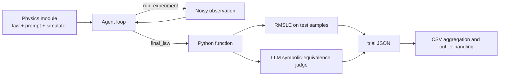

# HKUST-KnowComp/NewtonBench：交互式科学定律发现基准

| 字段 | 值 |
|---|---|
| GitHub | https://github.com/HKUST-KnowComp/NewtonBench |
| 分析提交 | `912a4ba5f4356ddd06acc16e44460ca30be4abc2` |
| 元数据快照 | 2026-09-17 |
| 代码许可 | MIT |
| 审阅状态 | draft；固定提交静态阅读，未运行 |

## 1. 它到底是什么

NewtonBench 是一个把“发现规律”具体化为交互式实验任务的科学推断 benchmark。README 将任务表述为让语言模型在模拟物理系统中主动提出实验、观察返回值、比较假设，最后提交一个名为 `discovered_law` 的函数；这与把一张静态表格丢给模型做函数拟合不同。候选元数据把它归入科学定律发现，固定提交中能看到 12 个物理域的模块化组织，以及 vanilla agent、code-assisted agent 两条执行路线。README 自报 324 个任务、12 个物理域，并沿“定律难度 × 系统复杂度”排列条件。📘这些数字是项目 README 的产品/论文说明，本页不把它们当成我独立重算的 benchmark 统计。

它的研究对象不是某个物理公式本身，而是模型能否在有限实验预算和噪声下形成可泛化假设。`modules/m0_gravity/laws.py` 显示同一难度还可以从 v0、v1、v2 中选择不同隐藏规律；例如同一接口的质量和距离变量，可能对应不同幂次或组合方式。这样“熟悉牛顿公式”不能自动等价于答对当前系统，但也意味着任务结果同时受提示、采样、随机 law version 和执行约束影响。🔶不能把某次模型发现率直接翻译成现实科学发现能力，应该把它理解成指定模拟宇宙中的行为测量。

## 2. 运行时堆叠

运行时堆叠的核心是 Python 模块、NumPy 数值模拟、LLM API 适配器和结果目录。`m0_gravity/core.py` 为 vanilla_equation 直接返回带噪声的力；simple_system 使用一维 Verlet 积分，complex_system 使用二维轨道积分，并将观测截到最多 20 个点。`utils/vanilla_agent.py` 负责消息历史、标签解析、轮数和实验结果注入；`utils/code_assisted_agent.py` 在同一个任务循环中维护 CodeExecutor。结果分析脚本从 `evaluation_results` 的 trial JSON 汇成 CSV，再按模块、难度、系统和 agent backend 分组。项目的图形或网页 UI 不是主运行时。

## 3. 阶段机或 DAG

整体是一个“任务模块 → 交互代理 → 函数评估 → 汇总统计”的基准流水线。每个物理模块提供任务提示、实验入口、真实 law 和评估入口；代理在若干轮中交替发出 `<run_experiment>` 或 `<final_law>`，代码路线还可发出 `<python>`。实验返回被追加为 `<experiment_output>`，最终函数被执行并进入统一评估。

## 4. Tool / Skill / Agent 怎么切

**Agent** 是负责提出实验和最终定律的语言模型角色；**Tool** 在这里主要表现为两类受控动作：模拟器的 `run_experiment_for_module` 和代码辅助路线的 Python 执行器，而不是一个可自由发现的外部工具目录。**Skill** 没有独立注册层，物理域知识通过 `modules/m*_*/prompts.py`、law 和 physics 文件提供。**Environment** 是隐含在模块函数和代理循环里的实验协议，要求一次只做一种动作、等待结果后继续。代码执行器有每轮一次 Python 调用的计数，避免把代码计算预算混成无限工具调用。

## 5. 文献怎么来、是否入库、引用约束

输入证据主要来自模拟器的观测，不是检索论文。README 提供项目论文的 [arXiv 链接](https://arxiv.org/abs/2510.07172) 和 BibTeX，代理则读取物理任务提示及实验返回。在已读探索主链中没有搜索引擎、文献池、DOI 去重或按 claim 绑定来源的步骤。模块中的隐藏函数是评测答案，不能当作模型已经读过的文献。

将任务用作发现能力测量时，必须区分模型可见的观测和评分器可见的 law。完整仓库公开隐藏函数是复核评测器的便利，但若额外向 agent 开放仓库文件读取，就需要防止答案泄漏；本页没有做对抗式隔离测试。固定的论文引用只用于注明 benchmark 来源，不提供各次“发现”的独立科学证据。

## 6. 实验 / 代码执行

代码辅助并不意味着模型能运行任意研究环境。`CodeExecutor` 先从 `<python>` 标签提取代码、做 AST/规则校验，再执行并把 stdout 包装回消息；执行尝试返回后增加本轮计数。它和物理实验接口是两条动作路径。评估阶段则使用随机生成的测试点；重力模块的公开实现采用 log-uniform 质量和距离样本、RMSLE，并可调用 LLM 判断公式符号等价。该判断器会重试，最终仍是布尔结果。🔶因此“代码帮助”与“发现正确”是两个不同变量，不能只看代理是否使用了 Python。

代码辅助的校验是 AST 语法检查和正则黑名单，随后在进程内 `exec`；最终定律的数值评估也直接 `exec` 生成函数。它们不能被当作安全沙箱。`calculate_rmsle` 先取绝对值再做 log1p，会弱化符号差异的区分；所谓 exact accuracy 来自模型的符号等价判定，而非形式化证明。使用者应同时检查数值残差、符号和执行失败字段。

## 7. 写稿怎么做

README 的 quick start 调用 `quick_start.py`，其脚本依次启动 vanilla 和 code-assisted 的实验命令。脚本、配置和结果目录体现的是实验执行，不是论文自动写作：trial JSON 保存模型、条件、轮数、实验数、token 和 evaluation 字段，汇总器再输出各条件准确率。项目没有看到把实验记录自动转成 LaTeX 章节、引用列表或经编译验证的稿件生成器。若接入科研流水线，应把它的 trial JSON 当作实验 artifact，再由独立写作层引用。

## 8. 图怎么做

从公开 README 和 `images/main_dark.png` 的引用可知项目有 overview 图，并把结果分析组织为 CSV 汇总。源码主链强调表格型 trial 数据和统计脚本，而不是动态可视化服务。适合画的图包括难度/系统条件的准确率热图、噪声水平与 RMSLE 的关系、vanilla 和 code-assisted 的分组比较；每张图必须标明 law version、模型、随机种子、噪声和样本定义。README 中的“噪声导致某百分比下降”等结论属于上游报告，不能在本页重新绘成已验证事实。

## 9. 和 RH 的相似点

它和 RH 都把研究任务拆成可记录的步骤，并且都把“模型输出”和“评估结果”分开。NewtonBench 的 trial 记录、模块名、难度和 agent backend 对应 RH 中实验配置与运行 artifact；统一评估函数的 `rmsle`、`exact_accuracy`、`symbolic_equivalent` 也提醒我们把数值误差、结构等价和最终标签分开。其交互协议还提供了一个清楚的最小实验合同：提出输入、获得观察、再更新假设。

## 10. 和 RH 的不同点

NewtonBench 关注模拟宇宙内的规律发现能力，RH 的边界则包括文献、证据、研究产物和发布质量。这里的“ground truth”是代码中的隐藏函数，不能替代现实数据、物理实验或文献证据；LLM symbolic judge 也不是形式化证明器。NewtonBench 的主循环以最终函数是否等价为收束点，而 RH 还要问数据来源、代码版本、报告声明和交付闸门是否互相一致。

## 11. 优点 / 缺点

**优点**：任务模块边界清楚；可切换直接观测、线性系统和轨道系统；law version、难度、噪声、agent backend 都能进入结果结构；评估同时保留连续误差和公式等价信号；汇总脚本有明确的分组和异常值处理路径。**局限**：代理输出依赖标签解析和 LLM API；某些“symbolic equivalence”依赖另一个模型判断；版本随机选择会增加复现实验的配置负担；公开 quick start 需要外部模型服务和环境；系统复杂度、噪声和提示变化可能共同改变结果。README 的任务数、模型排名和百分比没有在本次静态审阅中独立复跑。

## 12. RH 可学的 1–3 条

💬以下是架构借鉴建议，不是该项目已实现的 RH 集成。

1. **把观察合同写死**：每次实验的输入、可见输出、点数上限和噪声参数都进入 artifact，而不是只留最终答案。
2. **分层报告指标**：连续误差、代码能否执行、公式结构等价、最终任务成功应分列，避免一个分数掩盖失败原因。
3. **保留假设迭代轨迹**：将每轮 prompt、实验请求、返回值和最终函数绑定同一 trial，方便审计模型到底看到了什么。

## 13. 名字速查表

| 名字 | 含义 |
|---|---|
| `modules/m*_*/` | 各物理域的 law、physics、prompt、core 与类型定义 |
| `run_experiment_for_module` | 统一的直接测量或动力学实验入口 |
| `vanilla_agent.py` | 只依赖语言模型消息和实验标签的代理循环 |
| `code_assisted_agent.py` | 可在每轮调用受限 Python 的代理循环 |
| `CodeExecutor` | 解析、校验、执行 `<python>` 并返回反馈 |
| `evaluate_law` | 生成测试点并计算 RMSLE/公式等价结果 |
| `quick_start.py` | 启动两个示例实验的薄封装 |
| `summarize_results.py` | trial CSV 更新、异常值处理和汇总 |

---

> 📌事实边界
> 本页依据上述固定提交的公开 README 与列明源码进行静态分析，没有安装运行项目、调用外部模型/服务、下载完整外部数据或独立重算 README/论文的规模与性能数字。流程图是源码/文档结构概括，不是运行轨迹；比较 RH 的内容属于架构分析，建议属于评述。快照日期来自候选清单，不表示本次运行了该日的服务。
> 核对来源：[README.md](https://github.com/HKUST-KnowComp/NewtonBench/blob/912a4ba5f4356ddd06acc16e44460ca30be4abc2/README.md)、[quick_start.py](https://github.com/HKUST-KnowComp/NewtonBench/blob/912a4ba5f4356ddd06acc16e44460ca30be4abc2/quick_start.py)、[modules/common/evaluation.py](https://github.com/HKUST-KnowComp/NewtonBench/blob/912a4ba5f4356ddd06acc16e44460ca30be4abc2/modules/common/evaluation.py)、[modules/m0_gravity/core.py](https://github.com/HKUST-KnowComp/NewtonBench/blob/912a4ba5f4356ddd06acc16e44460ca30be4abc2/modules/m0_gravity/core.py)、[modules/m0_gravity/laws.py](https://github.com/HKUST-KnowComp/NewtonBench/blob/912a4ba5f4356ddd06acc16e44460ca30be4abc2/modules/m0_gravity/laws.py)、[utils/vanilla_agent.py](https://github.com/HKUST-KnowComp/NewtonBench/blob/912a4ba5f4356ddd06acc16e44460ca30be4abc2/utils/vanilla_agent.py)、[utils/code_assisted_agent.py](https://github.com/HKUST-KnowComp/NewtonBench/blob/912a4ba5f4356ddd06acc16e44460ca30be4abc2/utils/code_assisted_agent.py)、[utils/code_executor.py](https://github.com/HKUST-KnowComp/NewtonBench/blob/912a4ba5f4356ddd06acc16e44460ca30be4abc2/utils/code_executor.py)、[result_analysis/summarize_results.py](https://github.com/HKUST-KnowComp/NewtonBench/blob/912a4ba5f4356ddd06acc16e44460ca30be4abc2/result_analysis/summarize_results.py)、[utils/code_executor_base.py](https://github.com/HKUST-KnowComp/NewtonBench/blob/912a4ba5f4356ddd06acc16e44460ca30be4abc2/utils/code_executor_base.py)。
