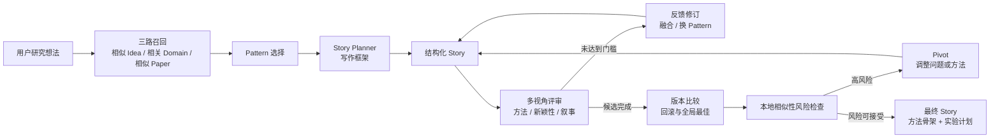

# AgentAlphaAGI/Idea2Paper：用知识图谱、叙事模式与评审回路生成研究故事

| 字段 | 值 |
|---|---|
| GitHub | https://github.com/AgentAlphaAGI/Idea2Paper |
| License | MIT |
| Stars | 1,444（2026-09-17 快照） |
| 分析 commit | `64170d4d9ca9068b26bd561648ce5c576bf1a2fb` |
| 产品类型 | 研究想法检索、结构化研究故事生成与相似性风险检查 |
| 核心产物 | 包含问题、方法骨架、创新主张和实验计划的结构化 Story |

## 1. 它到底是什么

Idea2Paper 的核心不是把一句想法直接扩写成整篇论文，而是把“研究想法如何形成一条可信、连贯、相对新颖的论文故事”做成一条显式管线。用户提供初始 idea 后，系统先从论文知识图谱和本地论文索引中寻找相似想法、相关领域以及相似论文，再选择可复用的叙事 Pattern，生成结构化 Story，交给多个评审角色打分和提出修改意见，最后执行修订、回滚、查新和必要的方向转移。

源码中的 Story 是一个中间研究设计对象。它通常包含标题、摘要、问题定义、已有工作缺口、解决方案、方法骨架、创新主张和实验计划。这个设计使系统更接近“论文故事规划器”，而不是通用聊天写手：后续评审与查新都围绕同一组结构化字段运行，修改也能针对某个问题维度，而不是每轮重新生成一篇不易比较的自由文本。

项目 README 将其描述为从 idea 连接到 paper 的端到端系统，并展示了知识图谱规模、工作流效果和产品能力。这些属于项目方对系统定位和运行结果的说明。固定提交中的核心管线代码能够直接证明的是：它实现了多路召回、Pattern 选择、Story 规划与生成、多角色评审、反馈修订、历史版本比较、相似性风险检查和 pivot；实验计划是 Story 的一个字段，并非实验执行记录。

## 2. 运行时堆叠

系统由知识层、生成层、评审层和验证层叠加而成：

- **知识层**以 Paper、Idea、Pattern、Domain 等对象组织论文衍生信息。README 将其描述为基于 ICLR 论文构建的知识图谱，用于把单篇论文映射为可搜索的研究想法和叙事模式。
- **召回层**组合三条路径：与用户输入相似的 Idea、领域相关内容以及相似 Paper。候选可以先通过词项重合等低成本信号缩小范围，再使用 embedding 相似度排序。
- **规划与生成层**由 `StoryPlanner` 和 `StoryGenerator` 承担。前者把 Pattern 中的代表性想法、常见问题、解决路径和故事结构转成写作框架；后者要求模型生成结构化 JSON Story。
- **评审与修订层**在主管线中调用方法、创新和叙事等视角的 critic。评审结果被转换成修改建议，再由 `RefinementEngine` 选择新 Pattern、融合想法或调整当前 Story。
- **查新与验证层**使用本地论文索引计算候选论文与当前 Story 的相似性，按风险触发继续、警告或 pivot。配置文件还控制严格 JSON、重试次数、评审通过规则、索引准备、召回审计和最大 pivot 次数。
- **模型接口层**采用 OpenAI-compatible chat 与 embedding 接口。配置把生成模型、向量模型、评审门槛和验证行为分开，使管线能够替换具体服务而保留上层控制流。

这套堆叠的关键不是模型数量，而是每一轮都保留“当前 Story—评审反馈—所用 Pattern—相似论文风险”的可比较状态。主管线还维护修订前版本、Pattern 失败记录以及全局最佳 Story，避免最后一轮天然覆盖此前更好的结果。

## 3. 阶段机或 DAG

这是一条带回路的阶段机，而不是一次提示词调用。`Idea2StoryPipeline.run()` 持有主控制流：先选择 Pattern 和生成初稿，再进入 critic/refinement 循环；如果新版本得分下降，可以恢复此前版本；最终候选还要经过相似性检查。配置中的通过模式要求多个评审分数共同满足条件，因而“某一个角色认可”不会自动成为停止理由。

需要注意，图中的“最终”指当前 Story 搜索过程的最终候选，不等于已经完成实验、获得统计结果或通过同行评审的论文。

## 4. Tool / Skill / Agent 怎么切

Idea2Paper 采用的是**领域管线组件 + 评审角色**，而不是面向外部宿主的 Tool/Skill 平台。

- **组件层**：Planner 生成框架，Generator 生成或修订 Story，Refinement Engine 根据主要问题决定如何调整，Novelty Checker 查询本地索引并返回相似性风险。
- **Agent 角色层**：评审从 methodology、novelty、storytelling 等维度审查同一个 Story。角色的作用是形成不同评价视角，而不是各自持有独立工作区或长期任务队列。
- **Pattern 层**：Pattern 不是可执行工具，而是从论文故事中抽出的结构先验，包含代表性想法、常见问题、解决路径和稳定性等属性。
- **内部工具层**：召回、向量计算、索引查询、JSON 解析和日志记录由 Python 模块完成，直接服务于固定管线。
- **扩展边界**：固定提交没有定义 MCP 工具合同，也没有把能力封装成可安装 Skill。新增能力通常需要修改管线、配置或数据构建逻辑，而不是简单挂载一个外部工具包。

这种切法的优势是领域对象统一：所有组件都理解 Story、Pattern 和论文候选。代价是可组合性较弱，如果要加入真实实验执行、稿件编译或人工审批，需要继续扩展主控制流。

## 5. 文献怎么来、是否入库、引用约束

文献在该系统中承担两种作用。第一种是构建知识图谱：从论文提取 Idea、Domain 和 Pattern，使检索对象不只是一段摘要。第二种是查新：将 Story 表示为查询，寻找高相似论文并估计碰撞风险。

召回不是单一向量搜索。相似 Idea 帮助定位接近的问题和解决方式；Domain 路径扩大到同领域的常见问题；相似 Paper 则提供更接近原始文献的参照。粗筛与 embedding 精排的组合，有助于控制候选数量和语义相关性。配置还允许自动准备本地索引、记录召回审计，并要求 novelty 模式依赖 embedding。

这里的“入库”主要指进入项目自己的图谱文件或本地查新索引。它不是一套围绕 DOI、版本、全文、引用键、claim 和 evidence span 建模的文献管理数据库。Story 可以受论文候选和 Pattern 启发，查新器也会返回相似论文，但已读核心代码没有为正文中的每条主张建立来源关系、引用配额或双向引用检查。

Novelty Checker 更准确的名称是“相似性风险检查器”：cosine similarity 或关键词重合可以发现近邻，却不能独立证明理论新颖性，也不能判断一篇候选是否已经公开了相同实验结论。其价值在于把明显碰撞提前暴露，并促使系统调整研究问题、方法组合或表述范围。

## 6. 实验 / 代码执行

Story 的 `experiments_plan` 可以描述数据集、基线、指标、消融和验证思路，因此 Idea2Paper 能把叙事主张延伸为可执行的研究计划。评审角色也可以从方法合理性角度指出实验设计不足，再通过 refinement 更新计划。

固定提交中精读的主管线没有实验运行器、训练任务调度器、结果表解析器或资源登记表。它不会因为 Story 中写入一个实验就自动产生观测结果，也没有把日志、随机种子、环境、模型权重和图表回填为正式证据。因此，这里的“实验”应理解为设计产物，而不是已经测得的数据。

这条边界非常重要：Story 评分衡量的是生成模型和评审模型对方案文本的判断，不能替代实际运行后的效果、稳定性、统计不确定性和失败案例。若要接入完整科研生产链，最自然的交接点是将结构化实验计划转换为外部实验协议，并在得到真实记录后重新审查 Story 中的创新主张。

## 7. 写稿怎么做

写作从 Pattern 驱动的框架开始。`StoryPlanner` 读取代表性 ideas、common problems、solution approaches 和 story 信息，生成适合当前用户想法的 writing framework，同时提供方法骨架和创新主张模板。这样做的好处是先确定问题—缺口—方案之间的逻辑关系，再填充具体文字。

`StoryGenerator.generate()` 同时支持首轮生成和增量修订。修订时可以携带前一版 Story、review feedback、新注入的技巧、融合后的 idea 以及 reflection guidance。输出被要求为 JSON，因此各字段可以单独比较、打分和回滚；解析失败时也有降级路径，不会让整个运行只剩一段不可处理的自然语言。

主管线保存修订前 Story，并用全局最佳分数选择最终版本。这比“把最后一次生成当作最好结果”更稳健。不过，产物仍是研究故事和论文骨架：它没有在已读链路中继续生成完整的引言、相关工作、方法、实验、讨论和参考文献，也没有 LaTeX 编译、目标期刊格式检查或 claim-to-citation 审计。它适合作为正式写稿前的设计输入。

## 8. 图怎么做

知识图谱本身适合用图形展示 Paper、Idea、Pattern 和 Domain 的关系，README 也使用流程和架构图解释系统。但固定提交中精读的 Story 主链没有独立的科学制图模块，也没有把 `experiments_plan` 自动变成定量结果图。

如果下游根据 Story 生成方法示意图，需要保留“概念设计”边界；如果根据实验结果生成曲线、表格或消融图，则应直接读取真实实验记录。仅凭摘要、方法骨架或模型想象生成的视觉元素，不能承担定量证据。Idea2Paper 当前更适合输出图的目的和待验证关系，而不是宣称已经完成可发表的图表套件。

## 9. 和 RH 的相似点

- 两者都把研究过程拆成可检查的中间对象，而不是只保存最终聊天答案。
- 两者都强调文献与研究设计的联系，并在定稿前执行新颖性或一致性检查。
- Idea2Paper 的 Story、Pattern、critic feedback 和 RH 的 proposal、claim、artifact、review finding 都能为下一阶段提供结构化输入。
- 两者都允许失败反馈改变后续路径，而不是固定执行一次线性生成。
- 两者都认识到研究质量需要多个视角检查，单个模型的第一版输出不应直接成为最终交付物。

Idea2Paper 最接近 RH 的部分，是把“研究故事是否成立”做成一个可反复评审和恢复的对象。它展示了一种比整段重写更紧凑的 idea-stage 搜索方法。

## 10. 和 RH 的不同点

- Idea2Paper 以 Story 搜索为中心；RH 以 topic、paper、claim、evidence、artifact、gate 和 provenance 的完整关系为中心。
- Idea2Paper 的知识范围围绕预构建论文图谱和本地索引；RH 的文献链还包括搜索、摄取、全文处理、证据链接和可追溯引用。
- Idea2Paper 产生实验计划；RH 将计划、真实记录、证据边界和论文表述分开管理。
- critic 分数决定 Story 是否继续修订；RH 的 gate 还检查必需工件、来源覆盖、实验记录和发布条件，不能只由语言模型评分替代。
- Idea2Paper 是一条应用内固定管线；RH 将领域能力暴露为工具和工作流，可由不同 Agent 宿主调用和恢复。
- Idea2Paper 的最终产物是结构化研究故事；RH 的后段还覆盖分节写作、引用一致性、图表、审稿、PDF 和版本提交。

因此，两者不是同层替代关系。Idea2Paper 更像 RH idea/propose 阶段可借鉴的专用规划器。

## 11. 优点 / 缺点

**优点**

- 把 Pattern 设为显式中间层，使系统能够复用论文的论证结构，而不只是复制主题词。
- 三路召回同时兼顾问题相似性、领域背景和论文近邻，比单一向量检索更容易发现不同类型的参照。
- Story 使用结构化字段，便于评审、局部修订、版本比较和下游转换。
- Pattern failure map、得分下降回滚和 global best 共同降低连续修订造成质量退化的概率。
- 查新和 pivot 位于 Story 定稿之前，可以在高成本实验或完整写作前暴露明显碰撞。
- MIT 许可和相对集中的主管线有利于理解与复用。

**缺点**

- Pattern 和图谱质量受来源论文范围、抽取模型和领域覆盖影响；某一会议形成的叙事先验不必然适合其他学科。
- critic、generator 和 novelty 判断可能共享相近的模型偏好，多角色名称本身不构成独立证据。
- 相似度阈值只能表示近邻风险，无法确认理论等价、实验先后关系或未被索引的新工作。
- 优化 Story 分数可能优先得到更顺畅的叙事，而不是更可实现、更有统计功效的研究设计。
- 实验、引用、图表和完整稿件生产尚未在核心管线中形成可追溯闭环。
- 本地索引和 embedding 是关键依赖；覆盖不足时，低相似度可能来自召回缺失，而不是真正的新颖。

## 12. RH 可学的 1–3 条

1. **在 proposal 阶段引入有来源的 Pattern Card。** 从高质量论文中抽取“问题条件—关键缺口—方法动作—验证方式”的结构，并把每个字段链接回来源证据，让研究者复用论证形式而不是复用结论。
2. **把失败路径、回滚点和全局最佳候选做成正式 artifact。** 每轮记录触发修改的 finding、所换 Pattern、分数变化和恢复理由，使提案搜索可以审计，也避免后续模型重复进入已知失败分支。
3. **在昂贵实验和长稿写作前增加分层碰撞预检。** 先用关键词和向量近邻做低成本筛查，再把高风险候选交给全文证据比较；将“未发现近邻”“存在相似工作”“主张可能重合”区分为不同结论。

这三项都可以接入 RH 现有 proposal 和 artifact 链，不需要另建一套并行研究引擎。

## 13. 名字速查表

| 名字 | 含义 |
|---|---|
| Idea | 用户输入或从论文抽取的研究想法 |
| Paper | 图谱或本地索引中的论文对象 |
| Domain | 用于扩展领域相关召回的主题对象 |
| Pattern | 从多篇研究故事中归纳的结构先验 |
| Story | 包含问题、缺口、方案、方法、创新和实验计划的结构化候选 |
| `StoryPlanner` | 根据 Pattern 和用户 idea 生成写作框架、方法骨架与创新模板 |
| `StoryGenerator` | 生成首版 Story 或基于反馈增量修订 |
| critic | 从方法、新颖性和叙事等视角评价 Story 的角色 |
| `RefinementEngine` | 将评审问题映射为换 Pattern、融合 idea 或局部调整 |
| pattern failure map | 记录某 Pattern 在某类问题上的失败，降低重复选择概率 |
| global best | 全部修订轮次中评分最好的 Story，而非默认最后一版 |
| `NoveltyChecker` | 查询本地论文近邻并报告相似性风险 |
| pivot | 相似性风险过高时调整问题、方法组合或主张范围 |

---

> 📌事实边界  
> 本页以固定 commit 的 README、配置和核心 Python 管线为依据。知识图谱规模、产品效果和工作流表现属于项目方公开说明；源码能够直接证明的是 Story 生成、评审修订、版本回滚、本地相似性检查和 pivot 控制流。Story 中的实验计划、创新评分与近邻风险不能视为已完成实验、独立新颖性证明或同行评审结论。
