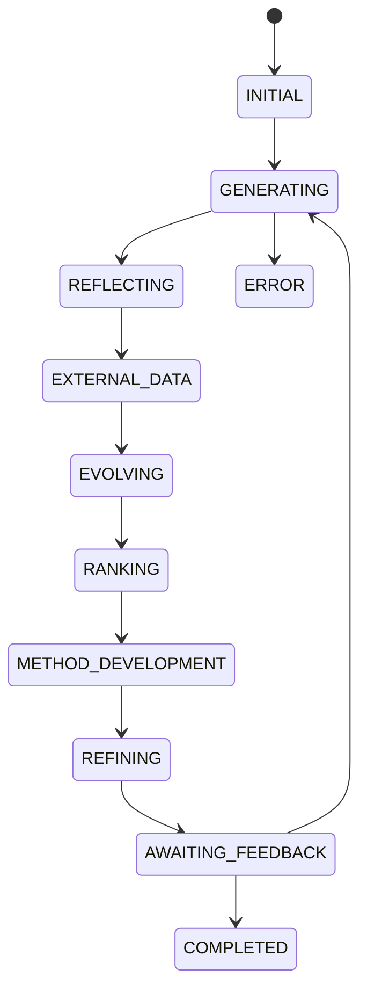

# InternScience/InternAgent：以状态机、记忆与可换实验后端做长程科学发现

| 字段 | 值 |
|---|---|
| GitHub | https://github.com/InternScience/InternAgent |
| License | Apache-2.0 |
| Stars | 约 1.4k（2026-09-16 快照） |
| GitHub 最后 push / 本地 HEAD | 2026-07-29 · `fa8c3ee` |
| 产品类型 | 端到端科学发现 / 方法发现；写稿不是最强部分 |
| 分析证据 | README、`config/default_config.yaml`、`launch_discovery.py`、`internagent/mas/interface.py`、`mas/workflow/*`、`internagent/stage.py` |

## 1. 它到底是什么

InternAgent 1.5 是长程科学发现框架：生成 idea、查文献、演化/排序候选、把选中的想法交给实验后端、积累记忆，并可走论文复现任务。它最接近 RH 的不是写稿，而是“**带状态、可续跑的 proposal→experiment 回路**”。

> 📘术语
> **实验后端**：真正改代码、执行命令、获得结果的执行者。上层编排器只决定“跑什么”，后端负责“怎样跑”。InternAgent 可选 Claude Code 或 iFlow 作为后端。

## 2. 运行时堆叠

- `InternAgentInterface` 承接生命周期；`OrchestrationAgent` 调度想法工作流。
- `MemoryManager` 保存 context/task/online/long memory；实现使用 ChromaDB 与 NetworkX `IdeaGraph`。
- 结果、轮次和工作区落到 `results/`；`loop_mode` 可为 fresh 或 incremental。
- `LiteratureSearch` 扇出 arXiv、Semantic Scholar、Crossref、CORE 等；`CitationManager` 管理元数据。
- `WorkflowState` 约束状态转移；但不存在 RH artifact schema 驱动的阶段 gate。

## 3. 阶段机或 DAG

外环把 `IdeaGenerator → ExperimentRunner → memory` 重复执行。`AWAITING_FEEDBACK` 是一等状态，明确给人或外部判断留接口。

## 4. Tool / Skill / Agent 怎么切

- **Agent**：generation、reflection、evolution、ranking、method_development、refinement、scholar、survey、experiment analysis 等角色。
- **Tool**：`LiteratureSearch`、web/code search、memory retrieval、science task tools；可初始化 MCP remote tools。
- **Skill**：没有 RH 式用户安装的 Skill 目录作为核心合同。
- **配置**：YAML 决定循环轮数、MCTS、实验后端与检索源。

## 5. 文献怎么来、是否入库、引用约束

检索是多源并发，返回 `PaperMetadata` 等对象，适合帮助 idea 生成。它没有 RH 那种由 `paper_ingest` 进入 topic 库、再由 `evidence_link` 支撑 claim 的持久证据链；引用完整性也不是终端硬闸。

## 6. 实验 / 代码执行

**真跑**。`ExperimentRunner` 把实验下发到 `claudecode` 或 `iflow` 后端；可开 `use_mcts`，并有 `GPUAllocator`。README 涉及干/湿实验任务，但本次没有启动任何任务；因此不把宣传中的 wet-lab 覆盖当成已在本机验证的能力。

## 7. 写稿怎么做

`ReportWriter.generate_markdown_report` 可以生成发现报告；论文复现是任务类型之一。但没有 venue profile、exemplar 形式检索、反抄袭 n-gram gate 或期刊级终稿系统。

## 8. 图怎么做

有 `visualize_mcts.py` 等搜索过程可视化；实验代码可绘图。没有独立的学术示意图或定量 figure suite 合同。

## 9. 和 RH 的相似点

- 长程状态机而非单轮 prompt。
- 文献、想法、实验与记忆都被显式建模。
- 将实验执行与上层编排隔开，接近 RH 将 Agent runtime 交给宿主的方向。
- 允许 `AWAITING_FEEDBACK`，与 RH checkpoint 的人决策含义相近。

## 10. 和 RH 的不同点

- InternAgent 仍是自带 Python MAS runtime；RH 的宿主是 Claude Code/Codex。
- RH 的正式路径以证据/产物 gate 为中心；InternAgent 以 discovery 状态和记忆循环为中心。
- RH 的写稿、出图和提交更完整；InternAgent 的方法发现与实验后端更突出。
- InternAgent 的 API key 配置为每个本地用户持有；RH 正在将共享学术检索 key 从租户进程移向服务网关。

## 11. 优点 / 缺点

**优点**

- `WorkflowState` 把想法生命周期写成可检查的有限状态机。
- `loop_mode: incremental` 能以最佳工作区作为下一轮基线，而不是每轮从零开始。
- 具有多源文献与独立 `CitationManager`，比只读网页的 discovery agent 强。
- Apache-2.0，2026-07 尚有实质记忆系统提交。

**缺点**

- 文档、任务包、配置与运行时分散，新用户难以判断该选 discovery、QA 还是复现任务。
- 证据到正文的可审计约束较弱。
- 不提供 RH 等级的发表图、写稿与质量门。

## 12. RH 可学的 1–3 条

1. **把 proposal 生命周期写为显式子状态**：生成、反思、外部证据、演化、排序、方法开发、等待人工反馈；作为 RH propose 的可选内部记录，不改六阶段总图。
2. **将 `incremental` 定义为 artifact 级规则**：下一轮只能从已记录的最佳 experiment workspace 继承，不能从聊天记忆猜测。
3. **为 experiment 后端定义小型选择枚举**：`local` / `claude_code` / `codex`；权限和 provenance 由 RH 统一，不复制 InternAgent runtime。

## 13. 名字速查表

| 名字 | 先决概念 | 含义 |
|---|---|---|
| `WorkflowState` | 状态机 | idea 处理阶段的枚举 |
| `OrchestrationAgent` | Agent | 调度各 idea 子角色的编排器 |
| `MemoryManager` | memory | 持久化多类上下文与检索索引的组件 |
| `IdeaGraph` | 图 | 想法间关系和演化记录 |
| `ExperimentRunner` | 实验后端 | 将实验交给 Claude Code/iFlow 的执行入口 |
| `loop_mode` | 基线 | fresh 或从最佳既有工作区续跑 |
| `exp_backend` | 实验后端 | 选择实际执行者的配置字段 |

---

> 📌事实边界
> README 对跨学科/湿实验覆盖的表述来自项目声称和任务包设计；本页没有将任何 wet-lab 任务实际运行，因此不把它视为独立验证结论。