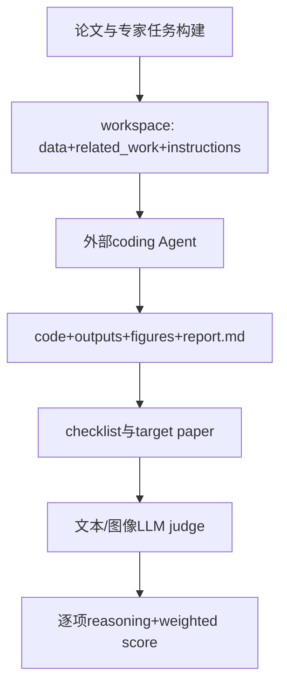

# InternScience/ResearchClawBench：ResearchClawBench 的公开源码合同

| 字段 | 值 |
|---|---|
| GitHub | https://github.com/InternScience/ResearchClawBench |
| License | MIT（根 `LICENSE` 已查阅，与 GitHub API 一致） |
| 分析 commit | `ed664513287a1fc60ae319e6bf7dbe7a62144135` |
| 产品类型 | 科研/机器学习 Agent benchmark 与执行评测 |
| 直接证据 | `README.md`, `LICENSE`, `evaluation/config.py`, `evaluation/instructions_tmpl.py`, `evaluation/run_task.py`, `evaluation/score.py` |

本文用 📘 标注文档或源码中可直接定位的事实，🔶 标注由控制流推导的边界，💬 标注评价与借鉴建议。仓库动态元数据沿用候选清单，源码判断只绑定页面中的固定提交。

## 1. 它到底是什么

ResearchClawBench 是端到端自主科学研究 benchmark，要求 coding Agent 从原始数据、相关材料和研究指令出发，完成分析、作图和 report/report.md，再与真实人类论文进行参考式评价。README 将基础集描述为 10 个领域、40 个任务，并区分 re-discovery 与 new-discovery。它还提供 Web UI、批量 CLI、多 Agent preset 和运行清理工具，核心目标是评估“能做什么研究”，而非只测代码补全。

## 2. 运行时堆叠

evaluation/run_task.py 负责加载 task_info、复制 data/related_work、创建 code/outputs/report 工作区、渲染 INSTRUCTIONS.md、启动 agent subprocess 并捕获 stdout；agents.json 提供命令模板。evaluation/score.py 读取 checklist、报告、说明和图片，按每条 rubric item 并发调用多模态 LLM judge，再按权重计算总分；server.py 提供 Flask API/SSE UI。

## 3. 阶段机或 DAG

两阶段流程是 Auto Research→Reference-Based Evaluation。

CLI 可重复运行任务、并发执行、分别设置 agent model 与 judge model，并保存 `_meta.json`、`_agent_output.jsonl`、report、score 和 trace。

## 4. Tool / Skill / Agent 怎么切

Agent 通过 agents.json 的 command 接入；TaskRunner 管理工作区和子进程；score.py 是 rubric judge；server 是 UI/API；rcb-clear 只清理重复输入而保留报告、代码、分数和 trace。README 还列 Claude Code、Codex CLI、OpenClaw、Nanobot、EvoScientist、ResearchClaw 和 ResearchHarness 等 preset。它不是把这些 Agent 实现都内置进仓库，而是通过命令模板接入。

## 5. 文献怎么来、是否入库、引用约束

每个任务的 target_study 含目标论文、checklist、图像和 related work；checklist item 有 content、keywords、weight、type。它以目标论文约束评价，但没有将论文主张转成 RH 式可定位 citation span，也没有声称 LLM judge 等同专家复核。

## 6. 实验 / 代码执行

TaskRunner 真实启动外部 Agent，捕获持续输出并写 meta status/exit code/duration；score.py 支持文本和最多若干图片，要求 judge 返回 0–100 分，50 表示大致匹配原论文；本次没有下载任务、启动 Agent 或调用 judge。

## 7. 写稿怎么做

Agent 负责生成报告但 benchmark 本身不是写作辅助器。报告是被评分的输出，评估器关注任务 rubric、数值、方法、解释和图。结果写入 `_score.json`/批量 Markdown，但没有 RH 级引文一致性和投稿格式 gate。

## 8. 图怎么做

内置 UI 展示实时 code/output/report，score 支持 image rubric 的多模态比较，leaderboard 页面呈现任务/Agent 最佳分。它没有把这些图统一导出为论文 figure suite，也没有独立视觉出版检查。

## 9. 和 RH 的相似点

与 RH 都强调工作区、长程任务、artifact、来源和质量 gate；ResearchClawBench 的 rubric checklist、运行 trace、分离 agent/judge 配置对 RH 的实验与审阅边界有直接启发。

## 10. 和 RH 的不同点

其核心分数来自 LLM judge 与目标论文 rubric，可能受 evaluator coupling、图片选择和最佳 run 聚合影响；RH 要求来源定位、确定性检查和稿件逻辑，不能仅凭高 benchmark score 宣称科学发现。

## 11. 优点 / 缺点

优点：真实论文任务、专家 checklist、文本/图像双模态评分、Agent-agnostic、Web/CLI 双入口、运行产物保留细。缺点：评分仍依赖 LLM judge，50/70 阈值是项目定义而非普适科学标准；外部 Agent 和工具凭据复杂；最佳分聚合可能掩盖方差；任务/论文数据许可与隐私需单独遵守。

## 12. RH 可学的 1–3 条

1. 用 checklist 将 RH 的研究主张拆成可检查条目，并为每条保留来源。
2. 将 agent 与 judge 的模型、凭据角色和版本分开记录。
3. 保存完整 workspace、trace、报告和逐项评分，不只保留总分。

## 13. 名字速查表

`TaskRunner`：工作区和子进程；`agents.json`：Agent preset；`checklist`：评分条目；`score_workspace`：报告评分；`_meta.json`：运行元数据；`_agent_output.jsonl`：流式轨迹；`rcb-eval`：批量 CLI；`rcb-clear`：清理重复输入。

补充核验：评分器把目标论文图片放在图像输入的第一位，并为 checklist item 区分 text/image 类型；报告中将其描述为代码可见的评分约定，而没有把 LLM judge 的分数当作独立专家复核。任务、论文和社区数据的许可证还需按原始来源单独核查。

> 📌事实边界：本页依据 `ed664513287a1fc60ae319e6bf7dbe7a62144135` 固定公开源码快照、2026-09-17 `data/candidates-staging.jsonl` 元数据和下列实际查看文件静态撰写（`README.md`、`LICENSE`、`evaluation/config.py`、`evaluation/instructions_tmpl.py`、`evaluation/run_task.py`、`evaluation/score.py`、`evaluation/server.py`、`evaluation/utils.py`、`evaluation/agents.json`、`eval_configs/researchharness_example_1_single_task.yaml`、`rcb-eval`、`rcb-clear`）。没有把 README 的榜单、论文结果或运行说明当作本次实测；未调用未配置的模型/API，未运行完整 benchmark（除非明确另有说明），未据此声称运行效果。
