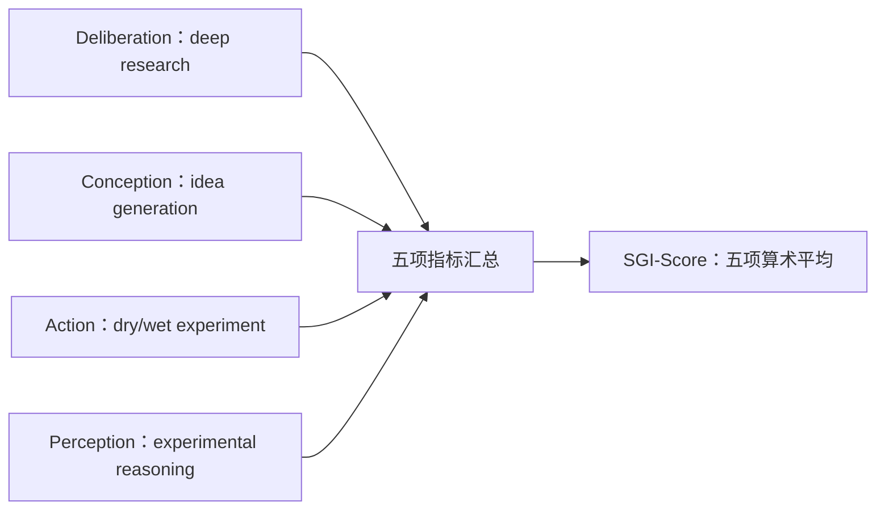

# InternScience/SGI-Bench：SGI-Bench 的公开源码合同

| 字段 | 值 |
|---|---|
| GitHub | https://github.com/InternScience/SGI-Bench |
| License | MIT（根 `LICENSE` 已查阅，与 GitHub API 一致） |
| 分析 commit | `271270efe9f7594694cddb01e630a609542a8619` |
| 产品类型 | 科研/机器学习 Agent benchmark 与执行评测 |
| 直接证据 | `README.md`, `LICENSE`, `evaluation/requirements.txt`, `evaluation/sgi_score.py`, `evaluation/utils.py`, `evaluation/task_1_deep_research/step_1_get_answer.py` |

本文用 📘 标注文档或源码中可直接定位的事实，🔶 标注由控制流推导的边界，💬 标注评价与借鉴建议。仓库动态元数据沿用候选清单，源码判断只绑定页面中的固定提交。

## 1. 它到底是什么

SGI-Bench 将 Scientific General Intelligence 操作化为 Deliberation、Conception、Action、Perception 四类科学家对齐工作流。README 说明其覆盖 10 个学科、1000 余个专家策划样本，并包含 deep research、idea generation、dry/wet experiment 和 experimental reasoning。它是能力评测与分数聚合仓库，不是一个独立科研 Agent 平台。

## 2. 运行时堆叠

evaluation 目录按任务族分开：deep research 通过 LLM 生成答案并按 EM/SLA 评分；idea generation 使用结构/文本相似和 effectiveness、novelty、detailedness、feasibility；dry experiment 生成代码、在 conda 环境运行五个 unit tests 并记录 runtime/error；wet experiment 解析实验步骤并比较动作与参数；experimental reasoning 使用 MCA/RV。sgi_score.py 读取各任务 logs，汇总五个分项。

## 3. 阶段机或 DAG

SGI 的任务族分别对应 Deliberation、Conception、Action 和 Perception 四类能力；它们在评分阶段汇入总分，并不是一条必须依次执行的科研流水线。

README 另列 Question Selection→Metric Customization→Predict & Eval→Report Generation 的 agentic evaluation framework；本次静态阅读只确认代码入口与指标路径。`evaluation/sgi_score.py` 分别读取五类任务日志，再计算五项分数的算术平均。这里展示的是评测结果汇总关系，而不是任务之间串行传递产物的执行链。

## 4. Tool / Skill / Agent 怎么切

每个 task script 是评测 harness，不是统一 Agent。utils.LLM 调用模型，multi_thread/multi_process 执行批量任务，score 脚本实现特定 rubric；TTRL/GRPO 是 README 公开的实验方向，而不是本仓库所有运行路径。没有独立 skill registry 或文献 claim 层。

## 5. 文献怎么来、是否入库、引用约束

数据集来自 HuggingFace collection，题目由专家构造；deep research 问题和 idea generation 的检索/相似度评分依赖数据或嵌入模型。README 的 Science 125 Big Questions 是构造背景，不等于运行时 citation database；评分不会自动定位论文证据。

## 6. 实验 / 代码执行

dry experiment 的 step_3_run_code 用 conda run 执行每个模型程序，每个 unit test timeout 300 秒；wet experiment 解析 `<action>` 步骤，idea 使用 SentenceTransformer/图相似，deep research 可用 judge。sgi_score.py 读取现有 logs，不自动运行全部任务。本次没有 HF token、API、conda 环境或 benchmark 运行。

## 7. 写稿怎么做

结果是每个 task 的 JSON logs 和五项聚合分，不是论文稿。sgi_score.py 打印各项 metric 与算术平均；没有章节、引文、图表数字一致性或投稿检查。

## 8. 图怎么做

README 的 pipeline、subjects、evaluation framework 和 reward curves 图用于展示 benchmark；代码不是通用 figure generator，也不绑定论文图注证据。

## 9. 和 RH 的相似点

与 RH 都将复杂科研活动拆成可记录阶段，并强调不同能力维度和可审计输出。SGI 的 dry/wet 与 reasoning 分离可启发 RH 将执行、协议和解释分别记录。

## 10. 和 RH 的不同点

SGI-Score 的五项平均是能力汇总，不代表真实科研质量的充分统计量；idea novelty 依赖 embedding/检索定义，LLM judge 可能耦合。RH 还要求文献证据、实验统计、稿件和发布 gate。

## 11. 优点 / 缺点

优点：覆盖研究、构思、干湿实验和多模态推理，指标与任务族清晰，代码入口可复现批量评分。缺点：多环境依赖、任务族指标不可直接等价，五项等权平均的解释有限，部分结果依赖模型 judge/embedding，HF gated 数据限制独立复核。

## 12. RH 可学的 1–3 条

1. 把 RH 研究周期映射为 deliberation/conception/action/perception，但各自保留证据边界。
2. 给干湿实验保存动作、参数、运行时间和错误。
3. 对聚合总分同时报告分项，避免一个平均数掩盖短板。

## 13. 名字速查表

`sgi_score.py`：五项汇总；`EM/SLA`：深研指标；`PassAll@k/SER`：干实验指标；`SS/PA`：湿实验指标；`MCA/RV`：实验推理指标；`TTRL`：测试时奖励方向。

补充核验：五类分项指标来自不同任务族，代码最后以五项结果算术平均形成 SGI_Score；因此总分应与分项一起解释。README 的 leaderboard 和 TTRL 曲线是项目发布材料，静态读取脚本不能验证其中模型、时间或训练配置。

> 📌事实边界：本页依据 `271270efe9f7594694cddb01e630a609542a8619` 固定公开源码快照、2026-09-17 `data/candidates-staging.jsonl` 元数据和下列实际查看文件静态撰写（`README.md`、`LICENSE`、`evaluation/requirements.txt`、`evaluation/sgi_score.py`、`evaluation/utils.py`、`evaluation/task_1_deep_research/step_1_get_answer.py`、`evaluation/task_1_deep_research/step_2_score.py`、`evaluation/task_2_idea_generation/step_2_score.py`、`evaluation/task_3_dry_experiment/step_3_run_code.py`、`evaluation/task_3_dry_experiment/step_4_score.py`、`evaluation/task_3_wet_experiment/step_2_score.py`、`evaluation/task_4_experimental_reasoning/step_2_score.py`）。没有把 README 的榜单、论文结果或运行说明当作本次实测；未调用未配置的模型/API，未运行完整 benchmark（除非明确另有说明），未据此声称运行效果。
