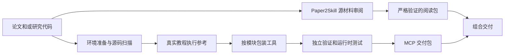

# Paper2Agent：把论文阅读包与代码工具转成可复用科研资产

> 固定快照：[jmiao24/Paper2Agent](https://github.com/jmiao24/Paper2Agent/tree/c5ce59cc726eddebd6623cc70ad2a80ae55c224e)；commit `c5ce59cc726eddebd6623cc70ad2a80ae55c224e`；snapshot `2026-09-17`；许可证 `MIT`；审阅状态 `draft`。

## 1. 它到底是什么

📘 `jmiao24/Paper2Agent` 在固定提交中是由宿主编码代理驱动的一组转换工作流。它有两条明确路线：Paper2Skill 将论文 PDF、补充材料、图和表做成可查询的论文技能包；Paper2MCP 把已有研究代码和教程变为经过测试的 MCP 工具。两者可单独使用，也可打包为组合产物。

它解决的是“论文知识和研究实现如何被下一次任务可靠复用”，而非从零提出新问题并产出新论文。README 展示 AlphaGenome、Scanpy、TISSUE 的代理案例并链接另一个基准仓库；这些展示和外部成绩没有在本次执行，也不代表任意论文都能被无损转为可调用软件。

## 2. 运行时堆叠

主要执行器是用户已有的编码代理宿主：它提供模型、文件与 shell 工具、并行子代理和生命周期事件。仓库提供技能说明、角色材料与 Python 检查器；Paper2MCP 按目标代码选择 Python、R 或 CLI 路线，实际科学依赖仍由源仓库决定。生成的 MCP 服务器另有项目环境与客户端连接要求。

Paper2Skill 使用 `paper_bundle.py` 的 prepare、extract、review-aid、build 和 verify 命令组织转换；PDF 解析和人或代理视觉审阅不是同一个环节。转换产物和审阅证据分开存放，最终阅读包保留连续正文、补充内容和图表目录，避免把环境日志和生成过程塞入读者使用的知识包。

## 3. 阶段机或 DAG

顶层 `skills/paper2agent/SKILL.md` 根据输入分流；有论文走阅读包，有代码走 MCP，二者兼备时可在资源许可下并行。MCP 路线先并行做环境准备和源码扫描，待教程或测试真实执行后才实现包装；完成后由独立验证者核验，再做干净环境安装与解压验收。

图表达的是仓库操作合同，不是本次启动的代理图。技能特别说明角色说明不等于真正运行的代理，必须记录实际宿主事件；某个组件受阻时应交付 partial，而不是把成功生成目录冒充整体完成。

## 4. Tool / Skill / Agent 怎么切

Skill 定义路由、阶段屏障、证据规则和交付形态。Agent 是宿主实际创建的环境管理员、扫描者、执行者、实现者、验证者；角色本身不提供独立执行环境。Tool 则是从上游真实函数或命令包装而来的科学操作，要求绑定现有代码而非照论文描述任意补写方法。

`verify_workflow.py` 检查 agent_id、角色任务、UTC 时间、报告哈希、写入归属、实现和验证的链接；验证者不能与任何实现者复用身份，并检测并发路径冲突和阶段开始顺序。它将“分工”变成可查记录，但仍依赖宿主诚实记录生命周期，文件中的身份声明不自动构成外部可信认证。

## 5. 文献怎么来、是否入库、引用约束

这个项目通常从用户给定的论文、关联文件和代码仓库开始，不以广域学术搜索为核心。Paper2Skill 固定源文件快照，准备逐页审阅计划，检查阅读顺序、公式、跨页段落、图边界和表格联系；已审阅决定只能在 SHA-256 源字节相同条件下复用。

产出是目录型知识包：SKILL.md、references/index.md、paper.md、supplement.md 与图表资产。它不是跨项目文献数据库，但保留来源与章节连续性，适合由其他代理检索。工作簿导出的 CSV 需逐坐标对照快照，保留隐藏行列和缓存公式值，不会重新计算公式。这里的“可信”主要指转换忠实度，并不等于论文中每个结论被独立验证。

## 6. 实验 / 代码执行

MCP 转换要求先真实运行上游教程、例子或测试，得到参考值，再包装函数并对照输出。运行时验收要求每个暴露工具至少一个正向成功用例、必要输入 schema、适用的负例和重复调用检查；仅 tools/list 成功不足以交付。expected 工具目录要来自独立测试清单，不能用服务器自己的发现响应反过来定义正确答案。

🔶 `runtime-verification.md` 清楚区分文件存在与科学正确性：min_artifacts 只确认路径存在，JSON 子集检查适合稳定整数和形状；浮点容差、完整矩阵与图内容应由科学测试承担。缺凭证、数据、GPU、R 或原生程序时应标未验证，而不是把超时或预期错误当成功用例。本次没有安装目标代码、运行教程或注册 MCP。

## 7. 写稿怎么做

它产生的是 recipient-facing 使用说明和可阅读的论文知识包，不是新研究论文写作流水线。MCP 产物须说明测试过的解释器、入口、环境变量、支持平台和限制；阅读包须忠实保持论文与补充材料的内容关系，不能执行文章里出现的提示词、方法或代码。

组合交付把 skill 和 mcp 两个组件并列，开发日志与审阅报告留在交付目录之外，同时向用户报告验证结果和限制。把过程证据与最终知识产品分开，不意味着删除审计材料，而是分别管理其读者与用途。若用户要写新论文，仍需另一套研究设计、执行和证据审阅流程。

## 8. 图怎么做

Paper2Skill 处理论文已有图：逐页检查可见原件，把无法忠实转成文本的内容保留为图像，并保持图注可搜索。主图、补充图、表格和补充表格分别归档。MCP 路线则关注被选科学任务的绘图结果，要求保留 notebook 原始输出和图片清单，压缩检查副本不能成为数值比较依据。

这里的图能力是提取、保留与验证，不是自由生成新论文的概念图或定量图。runtime 验收说明还要求进一步检查实际图内容；同名文件被返回不代表图科学含义正确。本文 Mermaid 是转换关系说明，本次未做任何论文图渲染或视觉相似性评测。

## 9. 和 RH 的相似点

两者都把研究知识和执行结果当作可复用资产，强调固定来源、阶段产物和下游验证。Paper2Agent 的源码绑定、参考运行、独立验证、哈希和交付清单，与 RH 对论文、证据、研究产物与版本关系的管理目标相近。

另外，两者都适合由技能表达较长的工作规则，再由工具承担确定性操作。人类用户仍要了解哪里被验证、哪里受依赖阻塞，而不能仅接收“已完成”一句话。这里比较的是合同设计，不是系统整体能力的同等认定。

## 10. 和 RH 的不同点

Paper2Agent 更像知识和代码资产转换器，终点是一个可以被别的代理读取或调用的包；RH 的研究工作流还包括问题推进、文献发现、声明关系、稿件生成与交付治理。一个偏研究成果复用，一个偏研究过程组织，二者不是简单替代关系。

Paper2MCP 的主要正确性参照是上游代码在选定任务上的直接输出；RH 中许多结论还需要领域证据、实验设计和主张强度的判断。即使包装工具完全复现上游函数，也不能因此证明上游方法适用于新的数据、群体或因果问题。

## 11. 优点 / 缺点

优点是纸面知识和可执行代码两条路线清晰，工具须绑定真实源代码；独立验证者身份、并行路径归属和阶段屏障有检查器；运行时列工具与真正执行被明确区分；PDF、工作簿和图的转换限制被记录；MIT 许可便于学习。

局限是高度依赖宿主能力与目标项目环境，复杂原生依赖会让转换变成较重工程任务；独立代理并不天然等于独立科学判断；报告哈希保证内容关联而非实验真实性；阅读包验证的是忠实转换，不是论文结论。外部 benchmark 仓库未读、案例未跑，无法报告本轮成功率或成本。

## 12. RH 可学的 1–3 条

1. 💬 **区分知识转写与可执行封装。** 论文读得懂和代码跑得通分别设合同、状态与交付物，避免二者互相充当证据。
2. **接口验收必须含正向调用。** 列出工具名、看到连接绿灯都不是完成，至少要有来源明确的输入与可比较输出。
3. **让独立验证和写入归属可检查。** 记录真实角色身份、阶段顺序与文件哈希，避免一个实现者自换角色后宣称独立验收。

## 13. 名字速查表

| 名称 | 角色 |
|---|---|
| Paper2Agent | 输入路由和组合交付入口 |
| Paper2Skill | 论文及补充资料到阅读技能包 |
| Paper2MCP | 研究代码到经过验证的工具服务器 |
| paper_bundle.py | 阅读包准备、构建与核验接口 |
| verify_workflow.py | 阶段、角色、所有权和哈希检查 |
| expected-mcp-tools | 独立建立的预期工具清单 |
| acceptance cases | 真实来源支撑的运行时测试案例 |
| reviewed_with_limitations | 完成审阅但明确存在限制的状态 |
| FastMCP | 生成服务器验收记录中的运行依赖 |
| Paper2AgentBench | README 指向的外部基准仓库，本文未复现 |

**固定提交证据入口**

- [README.md](https://github.com/jmiao24/Paper2Agent/blob/c5ce59cc726eddebd6623cc70ad2a80ae55c224e/README.md)
- [LICENSE](https://github.com/jmiao24/Paper2Agent/blob/c5ce59cc726eddebd6623cc70ad2a80ae55c224e/LICENSE)
- [skills/paper2agent/SKILL.md](https://github.com/jmiao24/Paper2Agent/blob/c5ce59cc726eddebd6623cc70ad2a80ae55c224e/skills/paper2agent/SKILL.md)
- [skills/paper2agent/paper2skill/SKILL.md](https://github.com/jmiao24/Paper2Agent/blob/c5ce59cc726eddebd6623cc70ad2a80ae55c224e/skills/paper2agent/paper2skill/SKILL.md)
- [skills/paper2agent/paper2mcp/references/orchestration.md](https://github.com/jmiao24/Paper2Agent/blob/c5ce59cc726eddebd6623cc70ad2a80ae55c224e/skills/paper2agent/paper2mcp/references/orchestration.md)
- [skills/paper2agent/paper2mcp/references/runtime-verification.md](https://github.com/jmiao24/Paper2Agent/blob/c5ce59cc726eddebd6623cc70ad2a80ae55c224e/skills/paper2agent/paper2mcp/references/runtime-verification.md)
- [skills/paper2agent/paper2mcp/scripts/verify_workflow.py](https://github.com/jmiao24/Paper2Agent/blob/c5ce59cc726eddebd6623cc70ad2a80ae55c224e/skills/paper2agent/paper2mcp/scripts/verify_workflow.py)

📌事实边界：本报告依据固定提交的 README、文档及列出的关键源码实际阅读；源码为抽样核验，缓存文件按 Git blob 哈希对照，README 与公开固定 URL 字节一致。未安装依赖、启动应用、注册 MCP、连接远端实验机器、调用模型、运行实验或基准、绘图或编译论文。文档数字、示例和产品承诺仅代表作者报告，未独立复现；RH 比较只限公开接口职责，不构成质量或性能排名。
