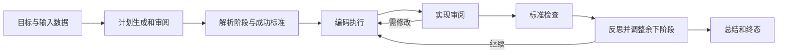

# Agentic Data Scientist：计划、代码执行与持续审阅

> 固定快照：[K-Dense-AI/agentic-data-scientist](https://github.com/K-Dense-AI/agentic-data-scientist/tree/702dee9dfb9e5165ce51b52ad7b7885948df7cd1)；commit `702dee9dfb9e5165ce51b52ad7b7885948df7cd1`；snapshot `2026-09-17`；许可证 `MIT`；审阅状态 `draft`。

## 1. 它到底是什么

📘 `K-Dense-AI/agentic-data-scientist` 是面向数据科学任务的多代理 Python 框架。用户提供分析目标及文件，它把计划生成、计划审阅、分阶段实现、实现审阅、标准检查、反思和总结串联。它既支持完整 orchestrated 模式，也提供直接进入编码代理的 simple 模式；二者成本和验收强度不同，不能把简单模式的输出当作完整多轮审阅流程的结果。

定位更接近通用数据分析与编程执行层，而非专门的学术文献库或投稿系统。README 提到另一个商业产品 K-Dense Web，但该服务的能力不属于本仓库代码证据。本文仅针对冻结源码，未调用商业服务、模型或示例分析。

## 2. 运行时堆叠

`pyproject.toml` 版本为 0.2.3，Python 约束是 `>=3.12,<3.13`，比 README 简写的“3.12+”更窄；依赖包括 Google ADK、google-genai、Claude Agent SDK、LiteLLM、MCP、Click 和异步文件工具。CLI 入口连接核心会话与事件管理，ADK 管理规划审阅，编码工作交给 SDK 包装器。

README 配置用 OpenRouter 承担规划与审阅，编码侧使用 Anthropic；Context7 用于在线库文档，科学技能从独立仓库装入工作目录。其版本与目录内容应另行固定，不能因主仓库 commit 不变就认定所有外部技能和模型均已被冻结。工作目录保留分析文件，临时目录可在完成后清理；这属于产物管理，不是系统级安全隔离。

## 3. 阶段机或 DAG

架构文档给出层次流程：Planning Loop 内有 Plan Maker、Reviewer 和 Confirmation，之后 Parser 产出结构化 stages 与 success criteria；StageOrchestrator 逐阶段执行 Coding/Review 循环，再运行 Criteria Checker 和 Stage Reflector，最后 Summary Agent 综合。

`stage_orchestrator.py` 对缺阶段、缺成功标准给 incomplete，而非空集合自动成功；最终还有 completed、completed_with_warnings、incomplete 的区别。前两者分别要求标准全部满足、且所有尝试阶段通过或存在未明确通过的阶段。这使流程结束与验收结果不再只有一个布尔值。

## 4. Tool / Skill / Agent 怎么切

ADK 角色负责规划、文件检查和审阅，编码代理负责真正修改文件与执行分析。内置工具偏只读文件访问和 URL 获取；科学技能提供数据库、分析库和领域工作方法；Context7 提供当前库接口信息。Skill 数量在 README 是作者提供的目录统计，不是本轮逐个运行通过的工具数。

编码包装器将宿主消息转换为 ADK 事件，把文字、工具调用、工具结果与用量分开。`core/events.py` 定义 message、function_call、function_response、file_created、usage、error 和 completed 等结构，便于前端或调用方消费。事件记录提供观察性，但不是对每个科学输出自动做独立验证。

## 5. 文献怎么来、是否入库、引用约束

该项目可以通过 fetch_url、宿主 WebSearch/WebFetch 和科学技能访问外部资料。Context7 是软件库文档服务，应与学术论文来源区分；科学技能中的 PubMed 等入口提供潜在文献能力，但技能内容属于另一个仓库，本文不把它们全部视为已核验实现。

已读关键路径没有展示统一论文池、DOI 去重、页码原文绑定或论文引用白名单。因此合理描述是“可在数据分析中检索和引用资料”，而不是已建立证据约束的学术综述管线。Summary Agent 即使被提示生成 publication-ready report，也仍需要人工核查每个外部主张的来源、时效与支持关系。

## 6. 实验 / 代码执行

编码代理接收当前阶段、原始请求、已有阶段实现和计划，启动实际 SDK query；可写分析脚本、读取用户数据并产生文件。成功标准没有直接塞入编码上下文，是减少照答案生成的一种设计；审阅者和标准检查者再查看任务输出。是否真正避免指标投机，仍需独立测试。

🔶 安全边界必须按代码而不是宣传理解。`agents/claude_code/agent.py` 的选项明确使用 `permission_mode="bypassPermissions"`，且复制进程环境、加载 project/user/local 设置。工作目录并不能据此推断为操作系统沙箱。禁网络选项只禁编码代理的 WebFetch/WebSearch，同时仍配置 Context7；它不是网络防火墙，也无法仅凭此阻止 shell 或包安装访问网络。敏感数据与凭证应在专用受控环境中处理。

## 7. 写稿怎么做

Summary Agent 将任务实施与标准完成情况综合为报告；工作目录保留脚本、输出和文档，让结果不只存在于对话。stage orchestrator 把终态和未满足标准通过 EventActions.state_delta 写回会话服务，目的是让摘要和 API 层看到真实状态，而不是一律输出成功。

已读文件没有提供专用期刊模板、LaTeX 证据绑定或投稿版本原子提交。因此“报告生成”和“正式学术论文可投稿”不能合并评价。对于差异表达、预测模型或业务分析，报告仍应检查数据切分、混杂、缺失值、统计检验和结果解释；生成了完整叙述不等于科学假设已被支持。

## 8. 图怎么做

图主要由编码代理在具体分析中选择库和写脚本，外部科学技能可提供可视化知识。项目 README 有任务到结果和图的演示，但本次未读取演示视频或运行绘图，不据此评价图形质量。生成图片、保存文件、事件通知可接在同一任务目录中，却不自动建立逐点数值的来源关系。

对实际使用者，合理验收顺序是先看图所依赖的数据与代码，再看坐标、单位、误差条和图注，最后查导出尺寸和裁切。此处是基于该编程式流程的使用建议，不是宣称项目已有完整图表门控模块。本文 Mermaid 只表示各角色的协作顺序。

## 9. 和 RH 的相似点

两者都让研究或分析由多个角色与中间产物组成，计划、执行和审阅不同职能互相反馈；都需要暴露未完成项，而不是仅展示最终文稿。结构化事件和结果文件使过程可查看，与 RH 的研究产物、状态和溯源接口有相似工程目标。

它还将确定性编程能力和模型判断分开，并借外部工具与技能扩展专业能力。这与 RH 以技能描述工作规则、工具提供操作边界的思路相通。不过“审阅代理”只是角色，不因名称就具备领域专家水平或独立性。

## 10. 和 RH 的不同点

本项目围绕单次通用数据科学会话及工作目录，重点是快速适应计划并完成分析；RH 的公开接口还显式区分论文检索、声明抽取、证据链接、主题状态、稿件质量报告和最终版本。前者可以成为研究执行的一部分，而非替代所有研究治理职责。

其长上下文管理以事件压缩、摘要和截断为主；架构文档把从任意阶段保存恢复列为后续改进，因此不能把当前会话状态直接称为经验证的长期崩溃恢复系统。上下文摘要有助于控制模型输入，但原始实验输出仍需独立保留，不能以压缩后的叙述作为唯一科学凭据。

## 11. 优点 / 缺点

优点是 simple 与 orchestrated 两种路径清楚，计划和实现分别审阅，终态能区分警告与未完成，事件模型支持过程观察，Python 包和 CLI 易于集成。MIT 许可降低阅读与二次开发门槛，外部技能扩展能力较灵活。

局限是双模型通道、宿主 CLI 与外部技能增加环境依赖；自动更新技能会影响复现；上下文压缩可能丢细节；成功标准主要由代理判读，不是领域正确性的充分条件；代码中的权限模式与 README 的“sandboxed”措辞不能混用；文档成本、耗时和技能数量都没有在本次实测。

## 12. RH 可学的 1–3 条

1. 💬 **终态包含未满足标准。** completed、带警告完成和 incomplete 应直接进入摘要与 API，避免末端美化进度。
2. **轻任务保留短路径。** 完整科研审阅与一次探索性脚本不同，允许明确选择执行模式，同时让用户看到验收强度差异。
3. **工作目录与权限分开描述。** 工具访问限制、进程隔离和网络隔离应各自验收，不能用同一个 sandbox 标签掩盖不同边界。

## 13. 名字速查表

| 名称 | 角色 |
|---|---|
| ADK | 多角色与会话编排框架 |
| StageOrchestratorAgent | 逐阶段执行、反思与终态计算 |
| ClaudeCodeAgent | 实際 SDK 编码执行包装器 |
| Plan Parser | 把自然语言计划变成 stages 与 criteria |
| Criteria Checker | 检查成功标准的代理 |
| Stage Reflector | 调整后续阶段的代理 |
| Summary Agent | 综合过程、结果与未完成项 |
| Context7 | 在线软件库文档工具服务 |
| scientific-agent-skills | 独立的科学技能来源仓库 |
| EventActions.state_delta | 向会话服务持久传递状态更新 |

**固定提交证据入口**

- [README.md](https://github.com/K-Dense-AI/agentic-data-scientist/blob/702dee9dfb9e5165ce51b52ad7b7885948df7cd1/README.md)
- [LICENSE](https://github.com/K-Dense-AI/agentic-data-scientist/blob/702dee9dfb9e5165ce51b52ad7b7885948df7cd1/LICENSE)
- [pyproject.toml](https://github.com/K-Dense-AI/agentic-data-scientist/blob/702dee9dfb9e5165ce51b52ad7b7885948df7cd1/pyproject.toml)
- [docs/architecture.md](https://github.com/K-Dense-AI/agentic-data-scientist/blob/702dee9dfb9e5165ce51b52ad7b7885948df7cd1/docs/architecture.md)
- [src/agentic_data_scientist/agents/adk/stage_orchestrator.py](https://github.com/K-Dense-AI/agentic-data-scientist/blob/702dee9dfb9e5165ce51b52ad7b7885948df7cd1/src/agentic_data_scientist/agents/adk/stage_orchestrator.py)
- [src/agentic_data_scientist/agents/claude_code/agent.py](https://github.com/K-Dense-AI/agentic-data-scientist/blob/702dee9dfb9e5165ce51b52ad7b7885948df7cd1/src/agentic_data_scientist/agents/claude_code/agent.py)
- [src/agentic_data_scientist/core/events.py](https://github.com/K-Dense-AI/agentic-data-scientist/blob/702dee9dfb9e5165ce51b52ad7b7885948df7cd1/src/agentic_data_scientist/core/events.py)

📌事实边界：本报告依据固定提交的 README、文档及列出的关键源码实际阅读；源码为抽样核验，缓存文件按 Git blob 哈希对照，README 与公开固定 URL 字节一致。未安装依赖、启动应用、注册 MCP、连接远端实验机器、调用模型、运行实验或基准、绘图或编译论文。文档数字、示例和产品承诺仅代表作者报告，未独立复现；RH 比较只限公开接口职责，不构成质量或性能排名。
