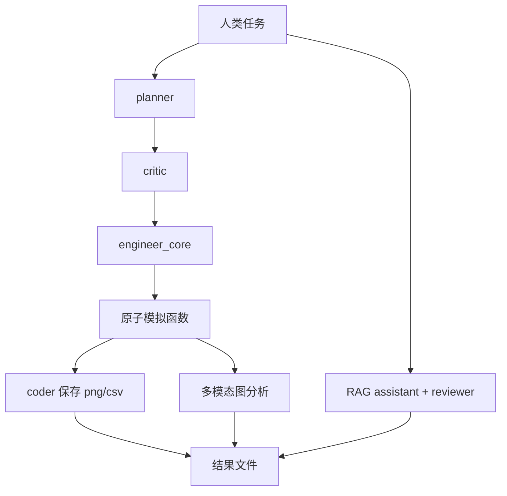

# lamm-mit/AtomAgents：面向合金设计的多模态、多 Agent 原子模拟工作流

| 字段 | 值 |
|---|---|
| GitHub | https://github.com/lamm-mit/AtomAgents |
| License | Apache-2.0 |
| Stars | 103（2026-09-17 冻结快照） |
| 最后 push | 2025-05-10 |
| 分析提交 | `b0ef01fb9ea1c2f25c146ea7934b6c4586c027cd` |
| 快照日期 | 2026-09-17 |
| 产品类型 | 原子材料模拟 Agent framework |
| 分析证据 | `README.md`、`AtomAgents.py`、`0_codes/compliance.py`、`LICENSE` |

本文用 📘 标注文档或源码中可直接定位的事实，🔶 标注由控制流推导的边界，💬 标注评价与借鉴建议。仓库动态元数据沿用候选清单，源码判断只绑定页面中的固定提交。

## 1. 它到底是什么

AtomAgents 是 MIT 研究代码中面向 alloy design 的 physics-aware multimodal multi-agent 平台。README 将能力限定到 unary/binary systems 的晶格常数、弹性常数、表面能、BCC 螺位错与 NEB Peierls barrier。主文件是一个较大的 AutoGen 风格脚本，预定义 scientist、planner、critic、engineer、coder、RAG assistant 和多模态 plot analyst 等角色，并把原子模拟函数注册为可调用工具。论文叙述的结果是仓库背景，不是本次静态审查重跑。

## 2. 运行时堆叠

脚本读取 config_list 中的模型配置，导入 AutoGen、ASE、atomman、numpy、pandas、matplotlib、Chroma embedding、IPython 与 pdfkit。全局初始化多个 AssistantAgent、UserProxyAgent 和 GroupChat；coder_user 的 code_execution_config 使用本地 code_dir 且 use_docker=False。结果主要写入工作目录的 png、csv、markdown 或 PDF，没有统一 session database 或 artifact schema。

## 3. 阶段机或 DAG

planner 只制定方案，critic 审查；engineer_core 的系统提示要求先调用 plan_task，再执行；scientist 提出可验证假设；engineer 驱动计算；coder 保存图表；RAG assistant/reviewer 处理指定 PDF；多模态 Agent 分析图。

AutoGen 注册的函数连接这些阶段；图示不代表结果已通过独立物理验证。

## 4. Tool / Skill / Agent 怎么切

工具覆盖晶体与势文件创建、晶格/表面能/弹性常数、stacking fault、screw dislocation、NEB、临界应力强度、随机合金溶质、绘图、CSV 保存和 PDF 转换。函数签名要求方向、浓度、工作目录等输入；工具描述要求缺输入时询问用户。工具通过 AutoGen register_for_llm/register_for_execution 注册，不是 MCP。RAG 使用本地 Mishin_Al_Ni.pdf 和 embedding。

## 5. 文献怎么来、是否入库、引用约束

RAG 路径由 RetrieveAssistantAgent、RetrieveUserProxyAgent、Chroma embedding 和本地 PDF 组成，reviewer 被要求复核答案。这是限定文档的检索辅助，不是通用论文池。没有看到 DOI/页码/claim relation 或自动引文导出，不能把 Agent 的材料结论写成每条都有可审计文献来源。

## 6. 实验 / 代码执行

README 要求 LAMMPS 的 Python 支持和 interatomic potential 文件；代码使用 ASE/atomman/subprocess 实现表面能、弹性、位错和 NEB 等计算。coder_user 不使用 Docker，且会写入本地目录，因此执行隔离、依赖和文件权限由使用者承担。公开代码说明支持哪些任务，但本次没有给模型、势文件或集群做运行验证。

## 7. 写稿怎么做

save_image_data/save_csv_data 通过 coder agent 保存结果，markdown_to_pdf 可转换 PDF；多模态 Agent 可以返回图像解释。没有独立论文模板、引用 gate 或 review-to-revision 系统；PDF 存在不代表物理结论或论文质量已审查。

## 8. 图怎么做

plot 由 matplotlib 保存 png，再交给多模态 Agent 分析。计算→图像→视觉解释是显著能力，但没有定量图表校验、源数据—图像绑定或发表级视觉规范。应保留原始 CSV、绘图代码、单位和模型分析文本。

## 9. 和 RH 的相似点

它和 RH 都把计划、专门角色、代码执行、结果分析和知识检索组合起来，也都要求工具描述写清输入。planner/critic 的先计划后执行约束对高风险模拟有参考意义。

## 10. 和 RH 的不同点

AtomAgents 的中心是 AutoGen 全局 group chat、本地工作目录和模型对话；RH 中心则是 artifact、证据、gate 和 provenance。没有统一跨运行参数快照、结果哈希、引用链或租户权限；关闭 Docker 的代码执行也不适合直接当生产默认。

## 11. 优点 / 缺点

优点：模拟任务具体；planner/critic/engineer 分工清楚；支持图像分析和限定文献 RAG；README 主动列出 LAMMPS、势文件和能力范围；Apache-2.0。缺点：单大脚本与全局状态难维护；依赖特定目录和外部文件；执行未默认隔离；结果解释没有独立验证闸；不应泛化为通用合金发现平台。

## 12. RH 可学的 1–3 条

1. 在工具描述中固定物理输入、方向、浓度和输出。2. 将 planner/critic 作为模拟前置 gate。3. 把多模态解释标为辅助意见，保留原始数值和绘图脚本供独立审计。

## 13. 名字速查表

| 名字 | 先决概念 | 含义 |
|---|---|---|
| `planner` | planning | 只制定计算计划 |
| `critic` | plan review | 检查计划完整性 |
| `engineer_core` | orchestration | 先计划后调用函数 |
| `NEB` | simulation | 位错 Peierls barrier 路径 |
| `RAG` | local PDF | 从材料文档检索知识 |
| `code_dir` | workspace | coder 使用的执行目录 |

---

> 📌事实边界
> 本报告依据固定提交中的公开文档与实际查看的代码作静态分析。没有安装或执行被分析仓库，没有连接仪器、GPU 集群或收费模型 API。README/论文的能力和结果声明不等于本次复现；外部数据、模型权重、设备校准、部署稳定性以及科学结论的有效性均需另行验证。
