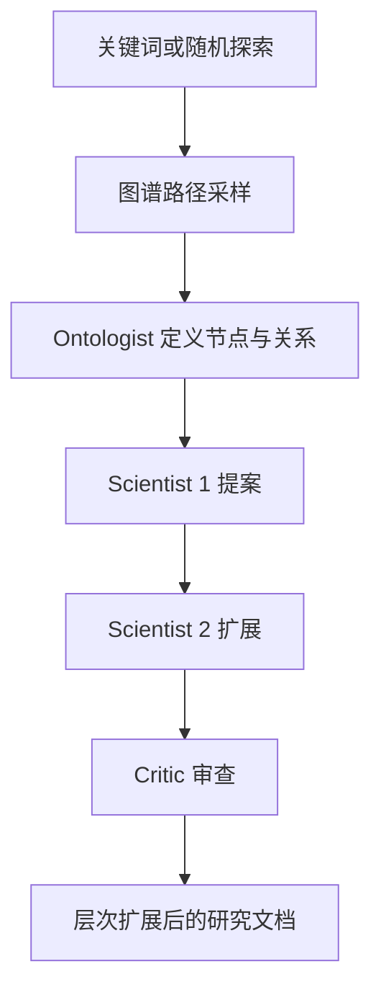

# SciAgentsDiscovery：知识图谱上的多智能体科学假设生成

| 项目 | 固定快照 |
|---|---|
| 候选编号 | 76 |
| 仓库 | [lamm-mit/SciAgentsDiscovery](https://github.com/lamm-mit/SciAgentsDiscovery) |
| 分类 / 层次 | 科学发现 Agent；文献、方法 |
| 分析提交 | `c5c30451b29cba813a11b5ce078909a214dad9f2` |
| 元数据快照 | 2026-09-17；Stars 639，非近似值；最近推送 2025-05-10 |
| 默认分支 / 状态 | main；非 fork、未归档；候选 pending，分析 draft |
| 许可 | Apache-2.0；固定提交的 `LICENSE.txt` 已查阅 |
| 阅读方式 | 公开 README、agents.py、graph.py 与两个 notebook 入口；静态分析 |

本文用 📘 标注文档或源码中可直接定位的事实，🔶 标注由控制流推导的边界，💬 标注评价与借鉴建议。仓库动态元数据沿用候选清单，源码判断只绑定上面的固定提交。

## 1. 它到底是什么

📘 [根 README](https://github.com/lamm-mit/SciAgentsDiscovery/blob/c5c30451b29cba813a11b5ce078909a214dad9f2/README.md) 介绍 SciAgents：用大规模本体知识图谱、LLM 与多智能体，在生物启发材料领域生成并批评研究假设。仓库提供非自动（预编程顺序）和自动（AG2/AutoGen）两套 notebook。

📘 图 1 描述角色：Ontologist 定义概念，Scientist 1/2 写并扩展提案，Critic 审查；自动模式另有 Planner 与 Assistant，后者可检查新颖性。🔶 这是假设与文档生成系统，不是湿实验或论文投稿平台。

## 2. 运行时堆叠

📘 [`ScienceDiscovery/agents.py`](https://github.com/lamm-mit/SciAgentsDiscovery/blob/c5c30451b29cba813a11b5ce078909a214dad9f2/ScienceDiscovery/agents.py) 用 AutoGen 声明 `user`、`planner`、`assistant`、`ontologist` 等。`user` 的 `human_input_mode` 为 `ALWAYS`。图谱与嵌入在 [`graph.py`](https://github.com/lamm-mit/SciAgentsDiscovery/blob/c5c30451b29cba813a11b5ce078909a214dad9f2/ScienceDiscovery/graph.py) 从 Hugging Face `lamm-mit/bio-graph-1K` 加载 GraphML 与 pickle 嵌入。

| 层 | 固定快照中的承载方式 | 边界 |
|---|---|---|
| 图谱 | GraphReasoning + GraphML | 需额外 pip 包与 HF 文件 |
| Agent | AutoGen AssistantAgent | 角色靠 system_message |
| 工具 | README 称 Semantic Scholar API、novelty 工具 | assistant 被禁止自己乱调用，按 plan 执行 |
| 文档 | notebook 层次扩展 JSON 字段 | 不是 LaTeX 闸门 |

## 3. 阶段机或 DAG

📘 README Figure 3：关键词或随机游走 → 路径采样子图 → JSON 结构化假设 → 逐字段扩展 → 批评与建模/实验优先级 → 终稿文档。自动模式由 Planner 出计划，Assistant 调 `rate_novelty_feasibility` 与 `generate_path`。

🔶 notebook 才是可运行编排；Python 包主要提供 agent 与图加载。预编程顺序与全自动群聊是两条实现，不能合成一条已验证的生产流水线。

## 4. Tool / Skill / Agent 怎么切

📘 Planner 明确“No Tool Call”；Assistant 负责按计划调用工具。Ontologist / Scientist / Critic 被指示只做分配给自己的任务。🔶 这些是对话角色，不是 RH Skill。工具列表以 notebook 注册为准。

## 5. 文献怎么来、是否入库、引用约束

📘 科学论文先被抽成图谱（引用 Buehler 2024 GraphReasoning）。运行时还可检索现有研究。🔶 图谱节点不是带 DOI/页码的 paper 对象；新颖性评分是模型工具返回值，不是独立查重闸。

## 6. 实验 / 代码执行

📘 Critic 可建议分子动力学或合成生物学优先级，但本仓库不执行这些实验。user agent 关闭了 `code_execution_config`。🔶 本次未下载图谱、未配置 OpenAI/S2 API、未跑 notebook。

## 7. 写稿怎么做

📘 输出是分层扩展的长文档（README 举例约 8100 词）。🔶 不是会议模板，没有 bib 核验或 PDF 编译闸门。

## 8. 图怎么做

📘 README 含框架图与 silk/energy 案例可视化。音频/播客指向独立的 PDF2Audio。🔶 案例图是论文展示，不是本仓库的定量出图栈。

## 9. 和 RH 的相似点

1. 都把发现过程拆成角色和可批评草稿。
2. 都需要外部知识源，而不是单次 prompt。
3. 都区分计划者与执行者。

## 10. 和 RH 的不同点

RH 绑定 claim 与证据 span。SciAgents 绑定图谱路径与角色对话。它停在假设文档，不进入可复现实验记录或投稿包。

## 11. 优点 / 缺点

**优点**

- 角色职责写进 system_message，边界相对清楚。
- 图谱上下文让假设有显式概念路径。
- 自动/非自动两套入口便于对照。

**缺点**

- 依赖 OpenAI、Semantic Scholar 与大型图文件。
- 新颖性与可行性由模型工具打分。
- 没有实验执行与引用级核验。

💬 图谱路径让假设可回溯到节点，这比把“多智能体”当成卖点更具体。

## 12. RH 可学的 1–3 条

1. **给假设保留来源路径。** 节点—关系—节点比只留一段散文更可复核。
2. **计划者禁止直接调工具。** 减少“规划与执行混在一次生成里”。
3. **批评者单独一轮。** 扩展稿与审查稿分开，避免自我确认。

## 13. 名字速查表

| 名字 | 先决概念 | 含义 |
|---|---|---|
| Ontologist | 角色 | 定义图谱术语与关系 |
| Scientist 1/2 | 角色 | 起草与扩展假设 |
| Critic | 角色 | 审查并建议改进 |
| GraphML 巨分量 | 知识源 | bio-graph-1K |
| AG2 / AutoGen | 运行时 | 自动多智能体框架 |

> 📌事实边界：本页依据 `c5c30451b29cba813a11b5ce078909a214dad9f2` 固定公开源码快照、2026-09-17 `data/candidates-staging.jsonl` 元数据和下列实际查看文件静态撰写（`README.md`、`LICENSE.txt`、`setup.py`、`ScienceDiscovery/agents.py`、`ScienceDiscovery/graph.py`、`ScienceDiscovery/llm_config.py`、`Notebooks/SciAgents_ScienceDiscovery_GraphReasoning_automated.ipynb`、`Notebooks/SciAgents_ScienceDiscovery_GraphReasoning_non-automated.ipynb`）。没有把 README 的材料发现案例或词数当作本次实测；未调用未配置的模型/API，未加载图谱或运行 notebook，未据此声称运行效果。
