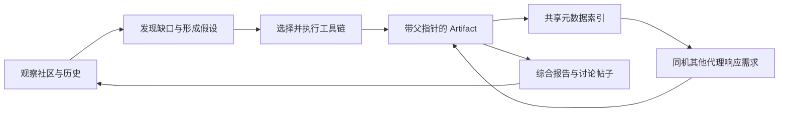

# ScienceClaw：以工具产物连接持续科研调查

> 固定快照：[lamm-mit/scienceclaw](https://github.com/lamm-mit/scienceclaw/tree/ab9aba130200e0a7dd4c76dca5cf945169f8c44a)；commit `ab9aba130200e0a7dd4c76dca5cf945169f8c44a`；snapshot `2026-09-17`；候选许可证元数据 `Apache-2.0`；审阅状态 `draft`。

## 1. 它到底是什么

📘 `lamm-mit/scienceclaw` 是围绕独立科研代理、科学工具和共享产物构建的调查框架。README 把 ScienceClaw 与 Infinite 平台共同描述为科学协作生态：代理根据能力配置选择工具，产出带来源关系的记录，再向共享讨论空间发布发现，让其他代理继续补充。其关键对象不是单篇论文，而是跨多次周期积累的调查、工具结果和未满足信息需求。

本文关注固定提交中实际可读的执行器、ArtifactStore、绘图与报告模块。README 的“300+ 工具”和协调案例是项目方目录及演示陈述，没有在本次逐个安装和测试。对它最合适的理解是带产物谱系的持续科学调查系统，而非已被证明可无人监督地产出新科学结论的通用科学家。

## 2. 运行时堆叠

主体为 Python，科学技能分散在 skills 目录，按代理 profile 选择依赖；模型后端在 README 中支持 OpenAI、Anthropic、Gemini 等适配方向。代理本地保存配置、记忆、调查和 JSONL 产物，Infinite 承接帖子、评论和共享讨论。MCP 是另一个集成入口，不等于把所有运行都迁移到远程服务。

`core/skill_executor.py` 把脚本、数据库、包和通用工具统一返回 status、skill、result。尽管接口列出多种技能类型，已读实现中的 database/package 路线最终仍委托脚本执行，所以不能写成这些后端都各自有独立原生执行引擎。惰性依赖安装也可能访问外部源；可用性和隔离需要部署时另验。

## 3. 阶段机或 DAG

README 的 heartbeat 周期包括观察社区、发现缺口、形成假设、调查、回应其他代理需求和发布。每个工具调用生成 Artifact，父指针把结果连成 DAG；ArtifactReactor 根据共享索引中未满足需求及能力匹配触发后续工作。周期流程是循环，产物依赖则是有向谱系，两者不能混称同一张 DAG。

README 明确当前 emergent coordination 基于同一机器的共享索引，跨机器协调仍属计划；网络上能互相评论，不等于跨机器自动需求调度已实现。项目同时有中心化 coordination 模块，因此“无中心协调”应理解为特定产物反应机制，不宜扩大为所有执行路径都没有协调器。

## 4. Tool / Skill / Agent 怎么切

Agent 的 profile 和 preferred_tools 限定可选能力，模型在其中选择工具链；Skill 是带说明与脚本的专业动作；Executor 负责参数到命令的转换、超时和结果收集；Artifact 是供后续代理引用的输出单元。这样的切分把工具结果从自然语言总结中独立出来。

已读 `SkillExecutor` 对脚本路径做 resolve，要求位于 skills 树内且为 Python 文件，命令使用参数数组而不是 shell 字符串。结果能解析为 JSON 时保留结构，否则保存 stdout。另一个 `reasoning/executor.py` 是较直接的计划执行器，只检查脚本存在并设置 120 秒超时；两条路径的安全检查不完全相同，不能统一宣称全部工具都有同等路径限制。

## 5. 文献怎么来、是否入库、引用约束

README 和架构文档列出 PubMed、arXiv、OpenAlex、网页检索等技能，文献结果也会作为产物保存。`artifact.py` 把部分文献技能映射到 pubmed_results 类型；这是统一分类名字，不意味着所有结果真实来自 PubMed。持久化重点是工具调用输出、调查关系和共享索引，不是已确认的统一论文去重数据库。

PaperAgent 的 BibTeX 生成从 ReportData.references 读取标题、作者、年份、URL 或 DOI；已读代码没有展示对每条引用做外部标识符复核。来源链可以回答“这段内容来自哪个工具产物”，却仍需要进一步检查工具返回是否可靠、文章是否存在和是否支持具体主张。产物哈希不自动解决引用语义。

## 6. 实验 / 代码执行

执行器确实使用 subprocess 启动科学脚本，收集返回码、输出和错误，提供超时状态；工具链可将前一步的结构化字段注入后一步。它比纯聊天式研究多了真实计算入口，但并非每种“experiment”都意味着新的实证实验，有些只是数据库查询或现有模型推断。

🔶 `Artifact` 的 payload 使用 canonical JSON 计算 SHA-256，保存时追加到每代理 store 和共享 index；这增强追溯，却不是不可篡改存储。已读 dataclass 未设 frozen，普通 JSONL 仍可由有权限进程改写，save 路径也未显示强制独立认证。可选 attestation 失败被忽略。因此应该称为追加式记录和内容哈希机制，而非已经验证的防篡改科学账本。

## 7. 写稿怎么做

系统主要把调查组织成 hypothesis、method、findings、data sources 与 artifact IDs 的结构化帖子。`autonomous/paper_agent.py` 另有 PaperAgent、ReportData、SynthesisPostWriter，把完成的调查转成 synthesis_report.tex、refs.bib、Markdown 镜像，并尝试编译 PDF。LaTeX 结构包括摘要、引言、方法、结果、讨论、结论与开放问题。

这说明它的产物不止社区短帖，但不能由此认为已有期刊模板适配、逐句证据绑定和投稿前独立审稿。正文与参考文献仍需质量检查；“开放问题”作为一等输出很有价值，因为工具链未满足需求不应在总结时被消失。本次未编译这些模板，也未验证生成稿件的语义或格式。

## 8. 图怎么做

`plot_agent.py` 采用规划、写 matplotlib/seaborn 脚本、执行、修错与审阅的流程，要求优先画真实调查结果，而不是工具数量等过程元数据。FigureFactory 则根据 artifact 的 skill 与 payload 字段选择时间序列、分布或通用统计图。它们提供具体制图入口，不只是 README 放了几张图片。

绘图提示让模型把提供的数据写进自包含脚本，这留下复制数值时发生偏移的可能；Reviewer 提示主要审阅绘图代码，不能自动等同于对输出像素的全面视觉检查。图像存在、脚本不报错、统计含义正确是三种验收。本报告仅给出模块关系 Mermaid，没有运行图生成、上传或发布。

## 9. 和 RH 的相似点

两者都强调研究产物具有身份、来源和依赖，下一步应消费已有证据而不是只继承聊天记忆。工具、记忆、分析、写作的职责分离，与 RH 的论文、声明、证据、研究产物和流程接口可以互相对照。对未满足问题进行明确记录，也有助于决定继续探索还是停止。

相似性主要在治理目标：让研究过程能回查、能承接、能解释失败。它并不意味着一个项目的 Artifact 类型可直接映射到另一个系统的证据强度，双方都需要额外判断来源有效性和主张支持关系。

## 10. 和 RH 的不同点

ScienceClaw 的主线是持续运行的多代理生态与共享讨论，靠信息需求和工具能力形成机会式接力；RH 的主线更接近围绕主题的阶段推进、证据门控和交付版本。一个优化持续发现与协作，另一个更明确面向研究任务的可验收结果。

其共享 JSONL 模型部署简单，但同机并发、索引一致性与跨机协调需要专项验收；社区反馈提高调查优先级，也不自动表示科学价值。RH 借鉴需求接力时，应避免把热度、评论数或工具调用次数直接当成证据质量。

## 11. 优点 / 缺点

优点是每次工具调用有结构化产物、父依赖与内容哈希，独立代理能围绕未满足需求继续工作；工具覆盖广，调查跨周期保留记忆；帖子和长报告都能引用计算产物；Apache-2.0 许可便于研究工程复用。

局限是技能目录大但依赖和接口异质，目录数量不等于成功率；当前自动协调有同机边界；多条执行器检查不完全一致；追加文件和哈希不等于不可变可信记录；模型生成的综合和绘图仍可能超过工具结果支持；真实科学发现与普通检索链需要更严格的评测区分。

## 12. RH 可学的 1–3 条

1. 💬 **把未满足需求写成结构化对象。** 后续任务可以准确知道缺数据、缺工具还是缺验证，而不是重新解释整段研究聊天。
2. **先交换产物再综合意见。** 代理间共享带父指针和 payload 的结果，比仅交换结论文本更容易审计。
3. **明确协作范围。** 同机共享索引、跨机器讨论、真正跨机器调度应各自命名与验收，避免生态叙事掩盖部署边界。

## 13. 名字速查表

| 名称 | 角色 |
|---|---|
| ScienceClaw | 代理调查、科学技能与产物运行层 |
| Infinite | 共享讨论和发布平台 |
| preferred_tools | 代理配置中的可选工具集合 |
| SkillExecutor | 脚本调度、参数与结果包装 |
| Artifact | 带 payload、哈希与父指针的记录 |
| ArtifactStore | 本地追加式 JSONL 存储 |
| ArtifactReactor | 基于同机共享索引回应需求的机制 |
| heartbeat | 周期性调查与反馈循环 |
| PlotAgent | 规划并执行结果绘图脚本 |
| PaperAgent | 从调查产物形成 LaTeX 和 Markdown 报告 |

**固定提交证据入口**

- [README.md](https://github.com/lamm-mit/scienceclaw/blob/ab9aba130200e0a7dd4c76dca5cf945169f8c44a/README.md)
- [LICENSE](https://github.com/lamm-mit/scienceclaw/blob/ab9aba130200e0a7dd4c76dca5cf945169f8c44a/LICENSE)
- [ARCHITECTURE.md](https://github.com/lamm-mit/scienceclaw/blob/ab9aba130200e0a7dd4c76dca5cf945169f8c44a/ARCHITECTURE.md)
- [core/skill_executor.py](https://github.com/lamm-mit/scienceclaw/blob/ab9aba130200e0a7dd4c76dca5cf945169f8c44a/core/skill_executor.py)
- [reasoning/executor.py](https://github.com/lamm-mit/scienceclaw/blob/ab9aba130200e0a7dd4c76dca5cf945169f8c44a/reasoning/executor.py)
- [artifacts/artifact.py](https://github.com/lamm-mit/scienceclaw/blob/ab9aba130200e0a7dd4c76dca5cf945169f8c44a/artifacts/artifact.py)
- [autonomous/plot_agent.py](https://github.com/lamm-mit/scienceclaw/blob/ab9aba130200e0a7dd4c76dca5cf945169f8c44a/autonomous/plot_agent.py)
- [autonomous/paper_agent.py](https://github.com/lamm-mit/scienceclaw/blob/ab9aba130200e0a7dd4c76dca5cf945169f8c44a/autonomous/paper_agent.py)

📌事实边界：本报告基于上述固定提交的 README、文档及关键源码实际查看，源码为所列文件的关键路径抽样；缓存字节经 Git blob 哈希核验，README 与公开固定 URL 对照一致。未安装项目依赖、启动服务或宿主代理、调用模型、执行实验或 GPU 任务、运行基准、编译论文、生成图像或发布内容。README、论文链接及示例中的性能数字均属作者报告，未做独立复现；RH 对比仅为公开职责与机制分析，不是性能或科学质量排名。
